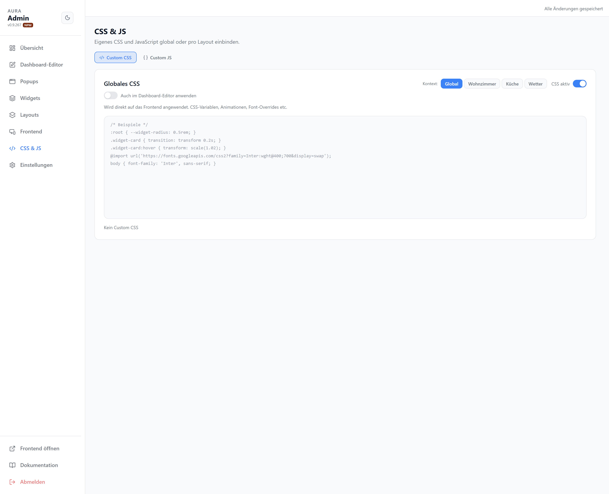
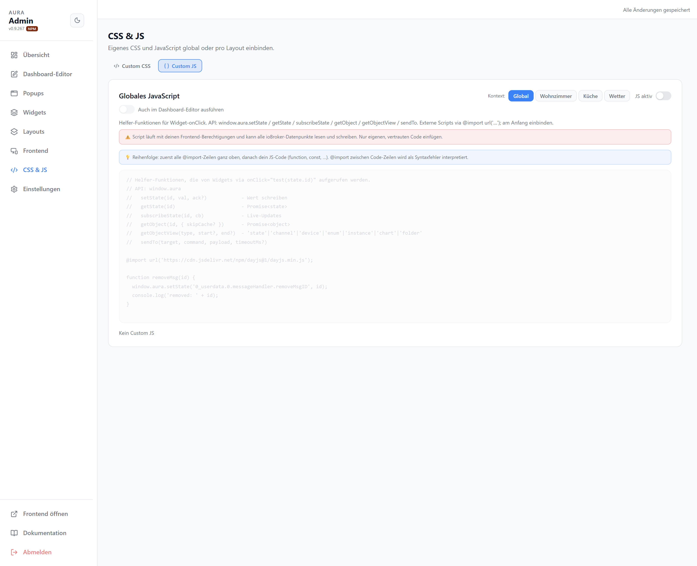

# CSS & JS

Eigenes CSS und JavaScript global oder pro Layout einbinden (Geltungsbereich oben rechts).

## Custom CSS

Überschreibt Theme-Variablen und Widget-Styles per CSS.

## Custom JS

JavaScript läuft mit den Frontend-Berechtigungen und kann ioBroker-Datenpunkte lesen und schreiben. API über `window.aura`:

| Funktion | |
| --- | --- |
| `setState(id, val, ack?)` | Wert schreiben |
| `getState(id)` | aktuellen Wert lesen |
| `subscribeState(cb, id)` | Live-Updates abonnieren |
| `getObject(id)` | Objektdefinition lesen |
| `sendTo(target, command, payload, timeoutMs?)` | Adapter-Nachricht senden |

Externe Skripte über `@import url('…');` am Anfang einbinden.
