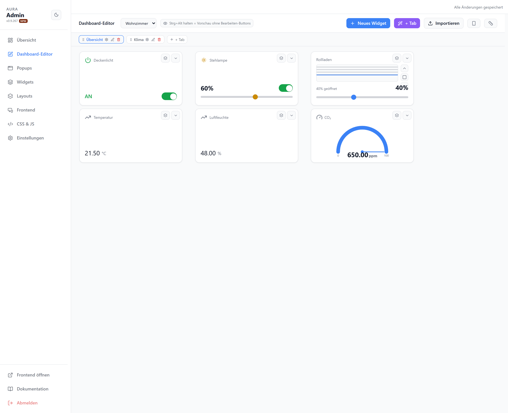
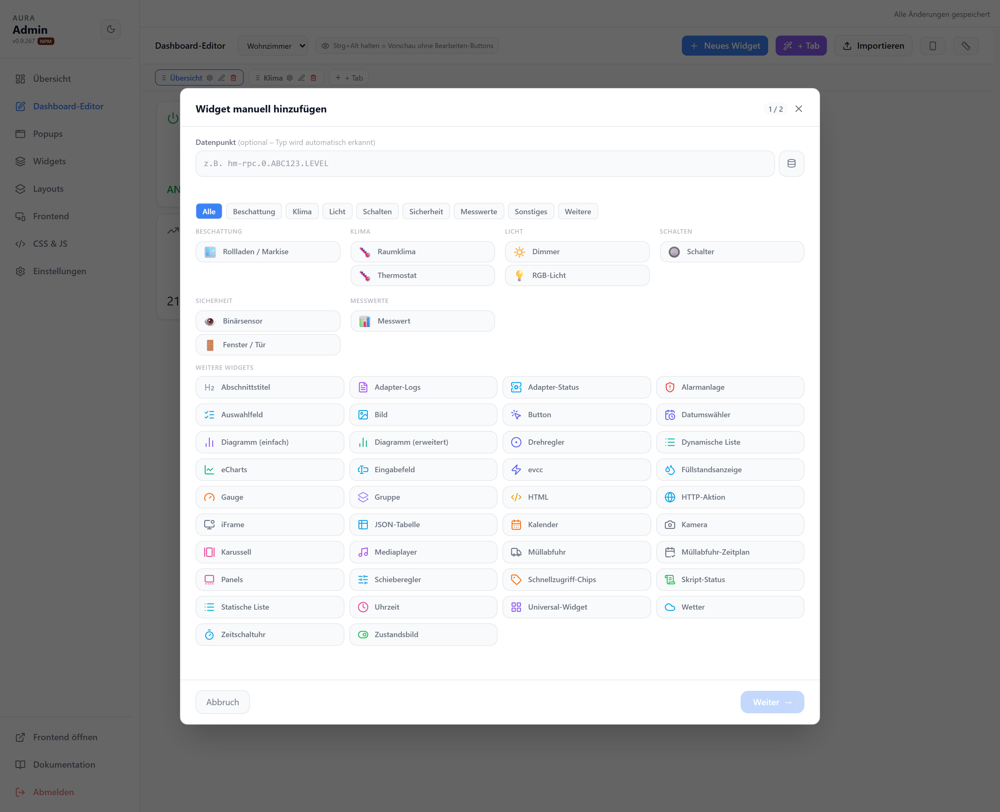

# Dashboard-Editor

WYSIWYG-Editor für die Tabs und Widgets des gewählten Layouts. Widgets werden per Drag & Drop platziert und in der Größe verändert.

## Toolbar

| Element | |
| --- | --- |
| Layout-Auswahl | Aktives Layout zum Bearbeiten wählen |
| Neues Widget | Widget-Assistent öffnen |
| + Tab | Neuen Tab anlegen (Assistent) |
| Importieren | Widget aus JSON-Export einfügen |
| Strg+Alt halten | Vorschau ohne Bearbeiten-Buttons |

## Neues Widget

Zweistufiger Assistent: Datenpunkt wählen (Widget-Typ wird automatisch erkannt) oder Typ aus dem Katalog wählen.

Jedes Widget bietet über sein Menü (Chevron) `Bearbeiten`, `Bedingungen`, `Klick-Aktion`, `Exportieren`, `Kopieren` und `Löschen`.
