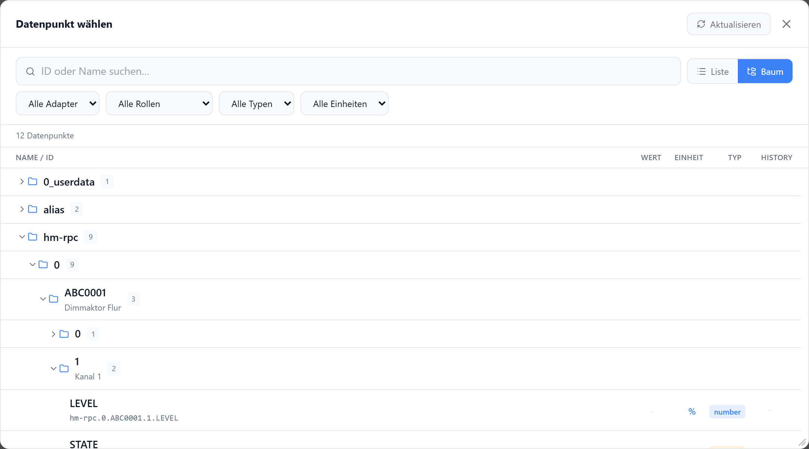

# Dashboard-Editor

WYSIWYG-Editor für die Tabs und Widgets des gewählten Layouts. Widgets werden per Drag & Drop platziert und in der Größe verändert.

## Toolbar

| Element | |
| --- | --- |
| Layout-Auswahl | Aktives Layout zum Bearbeiten wählen |
| Neues Widget | Widget-Assistent öffnen |
| + Tab | Neuen Tab anlegen (Assistent) |
| Importieren | Widget aus JSON-Export einfügen |
| Mobile-Reihenfolge | Reihenfolge der Widgets in der Einspaltenansicht |
| Tablet-Reihenfolge | Spalten wie im Tablet-Bereich: Widgets per Drag oder Pfeilen in Spalte und Reihenfolge setzen, ⤢ = volle Breite über alle Spalten; ohne Zuordnung abwechselnd in der Mobile-Reihenfolge |
| Schloss | Bedienelemente der Widgets sperren (Standard) oder freigeben |
| Hilfslinien | Rote Ziellinien ein-/ausblenden |
| Strg+Alt halten (Mac: ⌘+⌥) | Vorschau ohne Bearbeiten-Buttons |

## Bedienelemente sperren

Mit dem Schloss in der Toolbar sind die Widgets im Editor taub: ein Klick auf einen Schalter verschiebt die Kachel, statt die Lampe zu schalten. Standard ist gesperrt; die Einstellung merkt sich der Browser.

| Schloss | |
| --- | --- |
| Geschlossen (Standard) | Widgets lösen im Editor nichts aus — weder Datenpunkt-Schreibvorgänge noch Aktionen über den Adapter |
| Offen (rot) | Widgets verhalten sich wie im Frontend, Klicks schalten echte Geräte |

Gruppen und Panel-Stapel bleiben bedienbar, damit ihre Kinder auswählbar und verschiebbar sind — die Kinder selbst sind einzeln gesperrt.

## Neues Widget

Ein Schritt: Datenpunkt wählen (Widget-Typ wird automatisch erkannt) oder Typ aus dem Katalog wählen. Doppelklick auf eine Kachel fügt direkt hinzu. Titel, Einheit und Layout danach im Widget-Editor.

Jedes Widget bietet über sein Menü (Chevron) `Bearbeiten`, `Bedingungen`, `Klick-Aktion`, `Exportieren`, `Kopieren` und `Löschen`.

## Datenpunkt wählen

Der Knopf mit dem Datenbank-Symbol neben einem Datenpunkt-Feld öffnet die Auswahl. Oben rechts wird zwischen Liste und Baum umgeschaltet; die Wahl merkt sich der Browser.

| Ansicht | |
| --- | --- |
| Liste | Flache Trefferliste, max. 250 Zeilen |
| Baum | Objektbaum wie im ioBroker-Reiter *Objekte*; Ordner zeigen Geräte-/Kanalnamen und die Anzahl darunter |

Such- und Filterfelder wirken in beiden Ansichten. Eine Suche klappt die Zweige mit Treffern selbst auf. In der Mehrfachauswahl wählt die Checkbox an einem Ordner alle Datenpunkte darunter.

## Vollbild

`Bearbeiten` → **Darstellung** → `Vollbild-Knopf`. Blendet einen Knopf in die Ecke der Kachel ein, der das Widget bildschirmfüllend öffnet.

| Option | |
| --- | --- |
| Vollbild-Knopf | Aus (Standard) / An |
| Position | `rechts oben` (Standard), `links oben`, `rechts unten` — umstellen, wenn das Widget dort selbst einen Wert zeigt |

Auf Touch-Geräten ist der Knopf dauerhaft sichtbar, mit Maus erst beim Überfahren der Kachel. `Esc` oder das Kreuz schließt. Nicht bei `iFrame`, `Kamera` und `eCharts` — die haben ein eigenes Vollbild.

## Einklappen

`Bearbeiten` → **Darstellung** → `Standardmäßig eingeklappt`. Das Widget startet als einzelne Zeile mit Icon und Titel; ein Tipp darauf klappt den Inhalt aus, die Widgets darunter rücken nach.

| Option | |
| --- | --- |
| Standardmäßig eingeklappt | Aus (Standard) / An |
| Position | Ecke des Einklapp-Knopfes im ausgeklappten Zustand: `rechts oben` (Standard), `links oben`, `rechts unten` — teilt er sich die Ecke mit dem Vollbild-Knopf, rückt er eine Stelle nach innen |
| Auch im Editor eingeklappt | Aus (Standard): im Editor bleibt das Widget ausgeklappt. An: auch der Editor zeigt nur die Kopfzeile, ein Klick klappt zum Bearbeiten aus |

Eingeklappt ist die Karte so flach wie eine eingeklappte Gruppe (zwei Rasterzeilen im Standardraster), im Editor wie im Frontend. Ein Neuladen stellt den eingeklappten Zustand wieder her; die gespeicherte Höhe bleibt in beiden Ansichten unangetastet. Der Einklapp-Knopf folgt den Sichtbarkeitsregeln des Vollbild-Knopfes. Die [Gruppe](./../widgets/gruppe) behält ihre eigene Kopfzeile mit Pfeil. Nicht beim `Abschnittstitel` und nicht für Widgets innerhalb einer Gruppe.

## PIN-Schutz

Bereiche und Tabs lassen sich mit einer PIN sperren. Der Inhalt wird erst nach Eingabe des Codes gerendert — egal ob über Menü, Tab-Leiste, Widget-Klickaktion oder direkte URL.

| Option | |
| --- | --- |
| PIN | Beliebiger Code; leer = kein Schutz. Bereich im Zahnrad des Bereichs-Chips, Tab im Zahnrad des Tabs |
| Offen lassen | Aus (Standard): sperrt beim Verlassen sofort wieder. An: bleibt bis zum Neuladen der Seite offen |
| Schloss-Symbol zeigen | An (Standard): gesperrte Einträge tragen ein Schloss im Bereichs-Menü bzw. in der Tab-Leiste. Aus: kein Symbol – die PIN wird trotzdem abgefragt |
| Über MCP bearbeitbar | Aus (Standard): der [KI-Zugriff](./mcp#pin-geschützte-bereiche-und-tabs) sieht nur die Struktur und darf nicht schreiben. An: liest und ändert den Inhalt. Erscheint, sobald eine PIN im Feld steht; vor dem ersten Speichern wird die Freigabe vorgemerkt |
| PIN entfernen | Hebt den Schutz auf. Der Adapter schreibt den Inhalt zurück in die Konfiguration und löscht den Tresor-Eintrag — in einem Schritt, ohne Speichern und ohne die PIN |

Ein gesperrter Bereich blendet auch seine Tabs aus der Tab-Leiste aus. Gesperrte Einträge tragen ein Schloss-Symbol, solange **Schloss-Symbol zeigen** an ist. Eine Bereichs-PIN schützt den ganzen Bereich; eine eigene PIN an einem Tab darin entfällt.

Die Prüfung läuft **serverseitig** im Adapter: PIN und geschützte Inhalte verlassen den Server erst, wenn der Code stimmt (scrypt-Hash, Rate-Limit gegen Durchprobieren). Im Editor zeigt ein geschützter Bereich „PIN gesetzt" — eine neue PIN eintippen ändert sie, **PIN entfernen** hebt den Schutz auf. Das Feld selbst bleibt leer, weil der Editor die PIN nie zurückbekommt.

::: tip
Die Datenpunkt-**Werte** eines Bereichs laufen nach dem Entsperren über die normale Socket-Verbindung; die zugehörigen Datenpunkt-IDs erfährt ein nicht entsperrter Client aber nicht. Für echte Vertraulichkeit einzelner Datenpunkte zusätzlich ioBroker-Benutzer/ACL nutzen.
:::

## Bedingungen & Marker: Wertquelle

Auswahl im Datenpunkt-Feld einer Klausel bzw. eines Markers. Bleibt das Feld leer, gilt der Haupt-Datenpunkt des Widgets.

| Quelle | Wert |
| --- | --- |
| Datenpunkt | Angegebene State-ID (leer = Haupt-Datenpunkt) |
| Liste: ein Eintrag / alle Einträge / kein Eintrag | Klausel gegen jeden Listeneintrag geprüft |
| Liste: Anzahl / Anzahl aktiv | Einträge gesamt / aktive Einträge (> 0, true, nicht leer) |
| Liste: Summe / Durchschnitt / Minimum / Maximum | Zahl-Aggregat über die Listenwerte |

Listen-Quellen stehen bei `Liste` und `Dynamische Liste` zur Verfügung. Das Quellen-Auswahlfeld erscheint nur dort — bei allen anderen Widgets gibt es nur das Datenpunkt-Feld, dessen leerer Zustand den Haupt-Datenpunkt bedeutet. Gruppen, Tabs und Bereiche haben keinen Haupt-Datenpunkt; dort muss die Klausel einen Datenpunkt nennen.

## Bedingungen & Marker: Operatoren

| Operator | Trifft zu wenn |
| --- | --- |
| `=` / `≠` / `>` / `≥` / `<` / `≤` | Vergleich gegen Wert oder zweiten Datenpunkt |
| enthält | Wert enthält den Text |
| Ist wahr / Ist falsch | Wert ist `true`/`1` bzw. `false`/`0` |
| Ist aktiv / Ist inaktiv | Wert ist `> 0`, `true` oder nicht leer — bzw. das Gegenteil |
| Hat sich geändert | Datenpunkt liefert einen neuen Wert — egal welchen |

`Hat sich geändert` beschreibt den Moment des Wechsels, nicht einen Zustand: Die Klausel ist nur für die eine Auswertung direkt nach dem neuen Wert erfüllt. Sie steht in Widget-Bedingungen zur Verfügung und ist für `Widget neu laden` gedacht — nicht für Marker, Zellenregeln oder Tab-Bedingungen.

## Bedingungen: Klauseln verknüpfen

Die Schaltfläche links an jeder Klausel ab der zweiten schaltet deren Verknüpfung zur Zeile darüber — jede Zeile für sich, `UND` und `ODER` dürfen gemischt werden. Die erste Zeile trägt `WENN`.

| | |
| --- | --- |
| `UND` / `ODER` | Verknüpfung dieser Zeile mit der darüber |
| `(` | Klammer: fasst diese Zeile mit den benachbarten geklammerten zusammen. Zweiter Klick auf eine Zeile innerhalb der Klammer beginnt dort eine neue, dritter hebt sie auf |
| Ergibt … | Vorschau des ganzen Ausdrucks, erscheint sobald gemischt oder geklammert wird |

`UND` bindet stärker als `ODER`: `A UND B ODER C` heißt `(A UND B) ODER C`. Für eine andere Reihenfolge die Klammer nutzen. Eine Klammerebene, Klammern können nicht verschachtelt werden.

Gilt für Widget- und Tab-Bedingungen, Zellen- und Zeilenregeln sowie Marker. Bedingungen, die vor dieser Version gespeichert wurden, behalten ihre Bedeutung — sie hatten eine gemeinsame Verknüpfung für alle Zeilen.

## Bedingungen: Effekte

Alles unterhalb der Klauseln greift, wenn die Regel zutrifft.

| Effekt | Wirkung |
| --- | --- |
| Stil wenn aktiv | die ganze Karte: Akzent, Hintergrund, Rahmen, Rahmenbreite, Eckenradius, Deckkraft, Text, Text 2, Fett, Kursiv |
| Elemente | je Element: Sichtbarkeit, Text bzw. Icon, Textgröße, Farbe, Schriftschnitt |
| Effekt | `Pulsieren` · `Blinken` · `Nur Rand pulsiert` |
| Widget neu laden | Widget wird neu aufgebaut — eingebettete Inhalte laden erneut |
| Sichtbarkeit steuern | `Ausblenden wenn erfüllt` · `Nur anzeigen wenn erfüllt`, optional mit Nachrücken |

`Nur Rand pulsiert` lässt den Inhalt lesbar und pulst nur einen Ring um die Karte. Die **Rand-Farbe**
steht direkt unter der Auswahl; ohne sie nimmt der Ring die Rahmenfarbe der Regel, sonst den Akzent.
`Pulsieren` und `Blinken` blenden dagegen die ganze Karte ab — also auch das, was sie anzeigt.

Rahmenbreite, Eckenradius und Deckkraft sind Auswahllisten; ein von Hand eingetragener Wert bleibt
als zusätzlicher Eintrag stehen. **Deckkraft** blendet die ganze Karte ab, Inhalt eingeschlossen —
soll nur eine Fläche durchscheinen, gehört das als Alpha in die Farbe selbst. Beides zusammen
multipliziert sich.

## Bedingungen: Elemente

Rechts im Regel-Panel steht ein Block je Element — **Titel**, **Icon**, **Wert**. Darin liegt alles über
dieses eine Element beisammen: ob es zu sehen ist, was es zeigt, wie es aussieht. Die Farben unter
„Stil wenn aktiv" sind dagegen CSS-Variablen und treffen alles, was das Widget zeichnet.

| Feld | |
| --- | --- |
| Sichtbar | `unverändert` · `anpassen` · `ausblenden` — die einzige Stelle zum Ausblenden |
| Text | bei `Titel` und `Wert`, sobald `anpassen` gewählt ist; `[[dp]]` wird live aufgelöst. Beim Wert entfällt dann die Einheit |
| Icon · Größe | bei `Icon`, sobald `anpassen` gewählt ist |
| Textgröße · Textfarbe · Fett · Kursiv | bei `Titel` und `Wert`; Textgröße in px, leer lässt die Größe des Widgets |
| Icon-Farbe | bei `Icon` — ein Icon ist eine Grafik, Schriftschnitt tut ihm nichts |

Die Farbe hängt **nicht** an `anpassen`: ein Element einzufärben soll es nicht zugleich sichtbar
schalten. Nur bei `ausblenden` entfällt sie — dann gibt es nichts zu färben. Ein Zurückstellen auf
`unverändert` verwirft Text bzw. Icon, sonst würde hinter dem Wort doch etwas überschrieben.

Angeboten werden nur Elemente, die der Widget-Typ auch hat — die [Karte](../widgets/karte) etwa hat
weder Titel noch Icon. Eine Regel darf mehrere Elemente gleichzeitig anfassen.

Was eine Regel setzt, gilt nur für die Anzeige: gespeichert bleibt die Einstellung des Widgets, und
trifft die Regel nicht mehr zu, steht wieder das Original da. Leere Felder zeigen als Platzhalter, was
das Widget heute anzeigt — den aktuellen Titel, das aktuelle Icon (ausgegraut), die aktuelle Größe.

Im [Custom-Layout](../widgets/custom-layout) wirkt `Sichtbar: ausblenden` auch auf die Titel-Zelle,
obwohl die sonst unabhängig von `showTitle` platziert wird.

## Bedingungen: Vorrang

| Stufe | Quelle |
| --- | --- |
| 1 | Widget-Einstellungen (Icon, Farben, Farbschwellen, Werte-Zuordnung) |
| 2 | Widget-Bedingungen, in Reihenfolge |
| 3 | Listenweite Zeilen-Regeln, in Reihenfolge |
| 4 | Regeln am einzelnen Eintrag bzw. an der Zelle, in Reihenfolge |

Alle zutreffenden Regeln werden der Reihe nach angewandt, **pro Eigenschaft gewinnt die letzte**. Eine
Regel, die nur die Textfarbe setzt, lässt den Hintergrund der vorherigen stehen. Die Reihenfolge im
Editor entscheidet also.

Die Reihenfolge ist nachträglich änderbar: Griff links im Kopf einer Regel ziehen oder die Pfeile
rechts neben dem Papierkorb benutzen. Gilt in allen Bedingungs-Editoren.

Ausblenden ist davon ausgenommen: hat eine Regel ausgeblendet, blendet keine spätere wieder ein.

## Bedingungen: Element-Ebene

Widgets mit vielen gleichartigen Kindern bieten Bedingungen zusätzlich **pro Kind** — dort ist „Zeile 3
rot" auf Widget-Ebene nicht sagbar.

| Widget | Wo | Wirkt auf |
| --- | --- | --- |
| [Statische Liste](../widgets/liste#bedingungen-je-zeile) · [Dynamische Liste](../widgets/dynamische-liste) | Dialog **Datenpunkte verwalten** → Tab **Bedingungen** (alle Zeilen) bzw. Eintrag → **Bedingungen** | Ganze Zeile · Name · Wert · Icon |
| Zweite Zeile beider Listen | Detail-Editor → **Zweite Zeile** → *Bedingungen* je Datenpunkt | dieser eine Wert |
| [Universal](../widgets/universal-widget) / Custom-Layout | Zellen-Editor → **Bedingungen** | diese eine Zelle |

Im Custom-Layout bieten alle wertführenden Zellen Bedingungen, dazu `Titel` · `Einheit` · `Text` ·
`Feld` · `Icon` · `Bild` · `Button`. Diese haben keinen eigenen Wert — eine Klausel dort liest den
Haupt-Datenpunkt des Widgets oder einen frei angegebenen.

Der Regel-Dialog ist derselbe wie auf Widget-Ebene: links **Stil wenn aktiv** (Textgröße, Textfarbe,
Hintergrund — nur bei „Ganze Zeile" —, Icon-Farbe, Fett, Kursiv) und darunter **Effekt** (`Pulsieren` · `Blinken`),
rechts **Element** mit `Wirkt auf` und `Sichtbar` (`unverändert` · `anpassen` · `ausblenden`). Text und
Icon erscheinen erst bei `anpassen`, damit hinter dem Wort „unverändert" nichts steht, das doch wirkt.

Schriftschnitt und Effekt gibt es auf beiden Ebenen — nur der Umfang unterscheidet sich: Farben und
Sichtbarkeit wirken auf der Widget-Ebene auf die ganze Karte, auf der Element-Ebene auf genau ein Teil.
`Nur Rand pulsiert` bleibt der Widget-Ebene vorbehalten: ein Text oder ein Icon hat keinen Rahmen.

Eine Regel auf **Ganze Zeile** gibt Textfarbe, Fett/Kursiv und Icon an die Teile weiter; Hintergrund und
Ausblenden bleiben bei der Zeile. Eine Regel auf einen einzelnen Teil gewinnt gegen die Zeilen-Regel.

### Widget neu laden

Für Widgets mit fremdem Dokument (iFrame, Kamera, Bild). Aura kennt nur die Adresse, nicht den Inhalt dahinter — ändert ein Skript die Daten der eingebetteten Seite, bleibt die Anzeige ohne diese Regel stehen.

| Klausel | Wann neu geladen wird |
| --- | --- |
| mit `Hat sich geändert` | bei jedem neuen Wert des Datenpunkts |
| alle anderen Operatoren | sobald die Regel von *nicht erfüllt* auf *erfüllt* wechselt |

Wirkt auch auf Widgets in Popup-Views, ohne das Popup zu schließen. Das Widget wird komplett neu aufgebaut — Scrollposition und Eingaben im eingebetteten Inhalt gehen dabei verloren. Für rein zeitgesteuertes Neuladen stattdessen `refreshInterval` des jeweiligen Widgets verwenden.

## Marker: Sichtbarkeit

| Modus | Wirkung |
| --- | --- |
| Immer | Marker ist dauerhaft sichtbar |
| Wenn Bedingung erfüllt | Klauseln wie oben; Startklausel ist `Haupt-DP ist aktiv` |

Der Datenpunkt im oberen Bereich gehört nur zum Stil `Anzahl` (der angezeigte Wert). Sichtbarkeits-Datenpunkte stehen in den Klauseln.

## Marker: Text mit Datenpunkten

Der Text des Stils `Label` versteht dieselben [Bindings](../widgets/bindings) wie freies HTML — verfügbar bei Widget-, Bereichs- und Tab-Markern.

| Schreibweise | Beispiel | Ergebnis |
| --- | --- | --- |
| Datenpunkt | `{0_userdata.0.Pool.MaxRun} min` | `12 min` |
| Haupt-Datenpunkt des Widgets | `{dp} °C` | `21.46 °C` |
| Operations-Kette | `{0_userdata.0.Netz;round(0)} W` | `-1235 W` |
| Ausdruck | `{{ dp1 + dp2 }} W` | Summe zweier Datenpunkte |

Der Datenbank-Knopf neben dem Textfeld hängt einen gewählten Datenpunkt als `{id}` an den Text an.

| Fall | Anzeige |
| --- | --- |
| Datenpunkt ohne Wert | `–` |
| Kein Wort mit Punkt in den Klammern (`{unbekannt}`) | bleibt sichtbar stehen |
| `{dp}` bei Bereich/Tab | bleibt stehen — dort gibt es keinen Haupt-Datenpunkt |

Zahlen nutzen die global eingestellten Dezimalstellen als **Obergrenze**: `12` bleibt `12`, `21.456` wird `21.46`. Feste Breite bei Bedarf per `{id;formatValue(2)}`.

## Marker: Aggregat-Anzahl (Tab/Bereich)

Schalter in den Marker-Einstellungen eines Tabs bzw. Bereichs. Das Feld `Zählt` bestimmt, was die Zahl zusammenfasst.

| Modus | Zahl |
| --- | --- |
| Widgets mit Marker | Jedes Widget mit mindestens einem sichtbaren Marker zählt 1 |
| Nur Marker mit Bedingung | Wie oben, aber dauerhaft sichtbare Marker (z. B. reiner Freitext) zählen nicht mit |
| Summe der Zahlen | Summe der Werte aller sichtbaren Marker vom Stil `Anzahl (Datenpunkt)` |

| Fall | Verhalten |
| --- | --- |
| Marker-Option `In Aggregat-Anzahl zählen` aus | Marker wird in jedem Modus übersprungen |
| Ergebnis `0` | Aggregat-Marker wird nicht angezeigt |
| Nicht-numerischer Wert bei `Summe der Zahlen` | wird übersprungen; `true`/`false` zählen als `1`/`0` |
| Label-Marker bei `Summe der Zahlen` | zählt nicht mit, auch mit Zahl im Text |

Dezimalstellen wie bei Marker-Texten: global eingestellte Stellen als Obergrenze.
