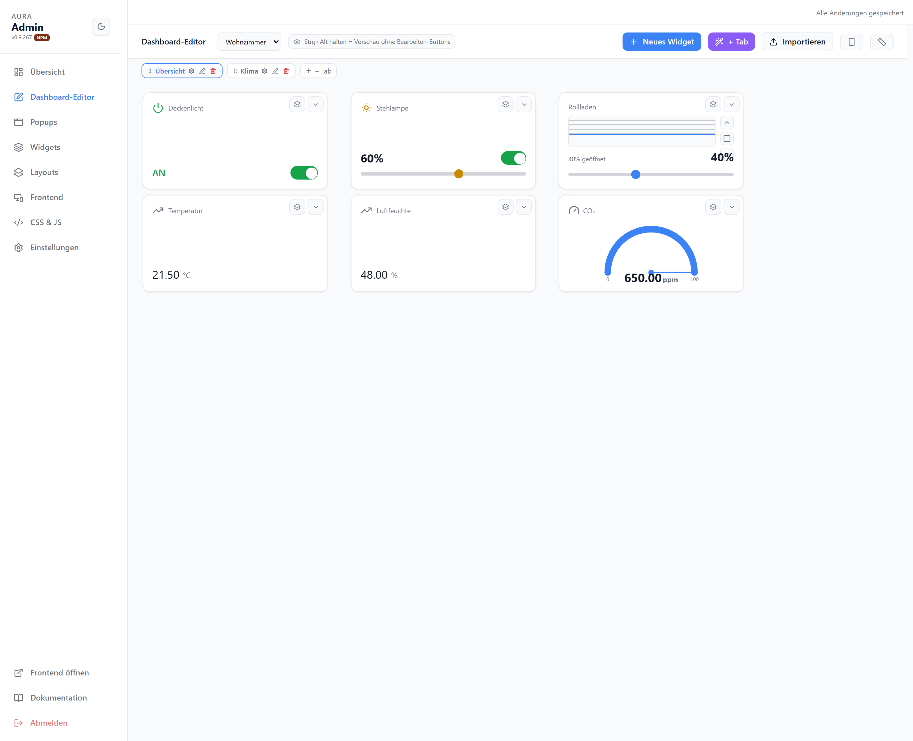
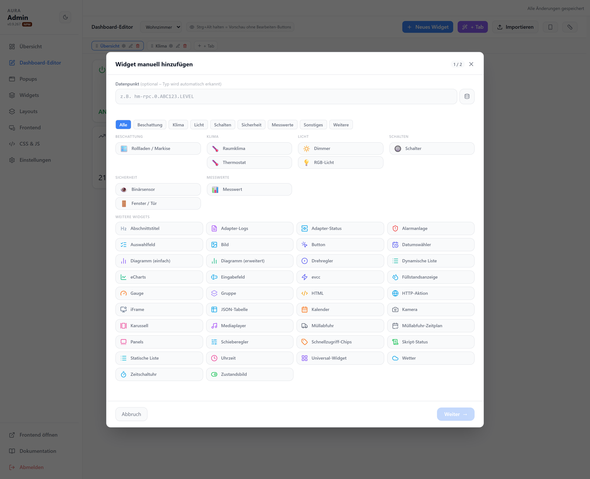

# Dashboard-Editor

WYSIWYG-Editor für die Tabs und Widgets des gewählten Layouts. Widgets werden per Drag & Drop platziert und in der Größe verändert.

## Toolbar

| Element | |
| --- | --- |
| Layout-Auswahl | Aktives Layout zum Bearbeiten wählen |
| Neues Widget | Widget-Assistent öffnen |
| + Tab | Neuen Tab anlegen (Assistent) |
| Importieren | Widget aus JSON-Export einfügen |
| Strg+Alt halten | Vorschau ohne Bearbeiten-Buttons |

## Neues Widget

Zweistufiger Assistent: Datenpunkt wählen (Widget-Typ wird automatisch erkannt) oder Typ aus dem Katalog wählen.

Jedes Widget bietet über sein Menü (Chevron) `Bearbeiten`, `Bedingungen`, `Klick-Aktion`, `Exportieren`, `Kopieren` und `Löschen`.

## Bedingungen & Marker: Wertquelle

Auswahl im Datenpunkt-Feld einer Klausel bzw. eines Markers. Bleibt das Feld leer, gilt der Haupt-Datenpunkt des Widgets.

| Quelle | Wert |
| --- | --- |
| Datenpunkt | Angegebene State-ID (leer = Haupt-Datenpunkt) |
| Liste: ein Eintrag / alle Einträge / kein Eintrag | Klausel gegen jeden Listeneintrag geprüft |
| Liste: Anzahl / Anzahl aktiv | Einträge gesamt / aktive Einträge (> 0, true, nicht leer) |
| Liste: Summe / Durchschnitt / Minimum / Maximum | Zahl-Aggregat über die Listenwerte |

Listen-Quellen stehen bei `Liste` und `Dynamische Liste` zur Verfügung. Das Quellen-Auswahlfeld erscheint nur dort — bei allen anderen Widgets gibt es nur das Datenpunkt-Feld, dessen leerer Zustand den Haupt-Datenpunkt bedeutet. Gruppen, Tabs und Bereiche haben keinen Haupt-Datenpunkt; dort muss die Klausel einen Datenpunkt nennen.

## Bedingungen & Marker: Operatoren

| Operator | Trifft zu wenn |
| --- | --- |
| `=` / `≠` / `>` / `≥` / `<` / `≤` | Vergleich gegen Wert oder zweiten Datenpunkt |
| enthält | Wert enthält den Text |
| Ist wahr / Ist falsch | Wert ist `true`/`1` bzw. `false`/`0` |
| Ist aktiv / Ist inaktiv | Wert ist `> 0`, `true` oder nicht leer — bzw. das Gegenteil |
| Hat sich geändert | Datenpunkt liefert einen neuen Wert — egal welchen |

`Hat sich geändert` beschreibt den Moment des Wechsels, nicht einen Zustand: Die Klausel ist nur für die eine Auswertung direkt nach dem neuen Wert erfüllt. Sie steht in Widget-Bedingungen zur Verfügung und ist für `Widget neu laden` gedacht — nicht für Marker, Zellenregeln oder Tab-Bedingungen.

## Bedingungen: Effekte

Alles unterhalb der Klauseln greift, wenn die Regel zutrifft.

| Effekt | Wirkung |
| --- | --- |
| Stil wenn aktiv | Akzent, Hintergrund, Rahmen, Rahmenbreite, Eckenradius, Deckkraft, Text, Text 2, Fett, Kursiv |
| Anzeige überschreiben | Titel, Icon, Icon-Größe, Titel/Icon zeigen, Wert-Text |
| Effekt | `Pulsieren` · `Blinken` |
| Widget neu laden | Widget wird neu aufgebaut — eingebettete Inhalte laden erneut |
| Sichtbarkeit steuern | `Ausblenden wenn erfüllt` · `Nur anzeigen wenn erfüllt`, optional mit Nachrücken |

## Bedingungen: Anzeige überschreiben

Ersetzt Werte, die das Widget aus seiner eigenen Konfiguration liest — nur für die Anzeige.
Gespeichert bleibt die Einstellung; trifft die Regel nicht mehr zu, steht wieder das Original da.

| Feld | Wirkt in |
| --- | --- |
| Titel | allen Widgets; `[[dp]]` im Text wird live aufgelöst |
| Titel zeigen · Icon zeigen | `unverändert` · `anzeigen` · `ausblenden` |
| Icon · Icon-Größe | allen Widgets mit eigenem Icon — nicht Karte, Statusübersicht, Menü, Spiegel |
| Wert-Text | Wert-Anzeige, Schalter, Binärsensor, Fenster-/Türkontakt, Zustandsbild; ersetzt den Werttext, die Einheit entfällt dabei |

Der Editor bietet nur die Felder an, die der jeweilige Widget-Typ auch umsetzt.

## Bedingungen: Vorrang

| Stufe | Quelle |
| --- | --- |
| 1 | Widget-Einstellungen (Icon, Farben, Farbschwellen, Werte-Zuordnung) |
| 2 | Widget-Bedingungen, in Reihenfolge |
| 3 | Listenweite Zeilen-Regeln, in Reihenfolge |
| 4 | Regeln am einzelnen Eintrag bzw. an der Zelle, in Reihenfolge |

Alle zutreffenden Regeln werden der Reihe nach angewandt, **pro Eigenschaft gewinnt die letzte**. Eine
Regel, die nur die Textfarbe setzt, lässt den Hintergrund der vorherigen stehen. Die Reihenfolge im
Editor entscheidet also.

Ausblenden ist davon ausgenommen: hat eine Regel ausgeblendet, blendet keine spätere wieder ein.

## Bedingungen: Element-Ebene

Widgets mit vielen gleichartigen Kindern bieten Bedingungen zusätzlich **pro Kind** — dort ist „Zeile 3
rot" auf Widget-Ebene nicht sagbar.

| Widget | Wo | Wirkt auf |
| --- | --- | --- |
| [Statische Liste](../widgets/liste#bedingungen-je-zeile) · [Dynamische Liste](../widgets/dynamische-liste) | Dialog **Datenpunkte verwalten** → Tab **Bedingungen** (alle Zeilen) bzw. Eintrag → **Bedingungen** | Ganze Zeile · Name · Wert · Icon |
| Zweite Zeile beider Listen | Detail-Editor → **Zweite Zeile** → *Bedingungen* je Datenpunkt | dieser eine Wert |
| [Universal](../widgets/universal-widget) / Custom-Layout | Zellen-Editor → **Bedingungen** | diese eine Zelle |

Im Custom-Layout bieten alle wertführenden Zellen Bedingungen, dazu `Titel` · `Einheit` · `Text` ·
`Feld` · `Icon` · `Bild` · `Button`. Diese haben keinen eigenen Wert — eine Klausel dort liest den
Haupt-Datenpunkt des Widgets oder einen frei angegebenen.

Effekte einer Element-Regel: Textfarbe, Hintergrund (nur „Ganze Zeile"), Icon-Farbe, Icon, Text, Fett,
Kursiv, Effekt (`Pulsieren` · `Blinken`), Ausblenden.

Beide Ebenen bieten denselben Satz an Schriftschnitt und Effekt — nur der Umfang unterscheidet sich:
Farben und Sichtbarkeit wirken auf der Widget-Ebene auf die ganze Karte, auf der Element-Ebene auf
genau ein Teil.

Eine Regel auf **Ganze Zeile** gibt Textfarbe, Fett/Kursiv und Icon an die Teile weiter; Hintergrund und
Ausblenden bleiben bei der Zeile. Eine Regel auf einen einzelnen Teil gewinnt gegen die Zeilen-Regel.

### Widget neu laden

Für Widgets mit fremdem Dokument (iFrame, Kamera, Bild). Aura kennt nur die Adresse, nicht den Inhalt dahinter — ändert ein Skript die Daten der eingebetteten Seite, bleibt die Anzeige ohne diese Regel stehen.

| Klausel | Wann neu geladen wird |
| --- | --- |
| mit `Hat sich geändert` | bei jedem neuen Wert des Datenpunkts |
| alle anderen Operatoren | sobald die Regel von *nicht erfüllt* auf *erfüllt* wechselt |

Wirkt auch auf Widgets in Popup-Views, ohne das Popup zu schließen. Das Widget wird komplett neu aufgebaut — Scrollposition und Eingaben im eingebetteten Inhalt gehen dabei verloren. Für rein zeitgesteuertes Neuladen stattdessen `refreshInterval` des jeweiligen Widgets verwenden.

## Marker: Sichtbarkeit

| Modus | Wirkung |
| --- | --- |
| Immer | Marker ist dauerhaft sichtbar |
| Wenn Bedingung erfüllt | Klauseln wie oben; Startklausel ist `Haupt-DP ist aktiv` |

Der Datenpunkt im oberen Bereich gehört nur zum Stil `Anzahl` (der angezeigte Wert). Sichtbarkeits-Datenpunkte stehen in den Klauseln.
