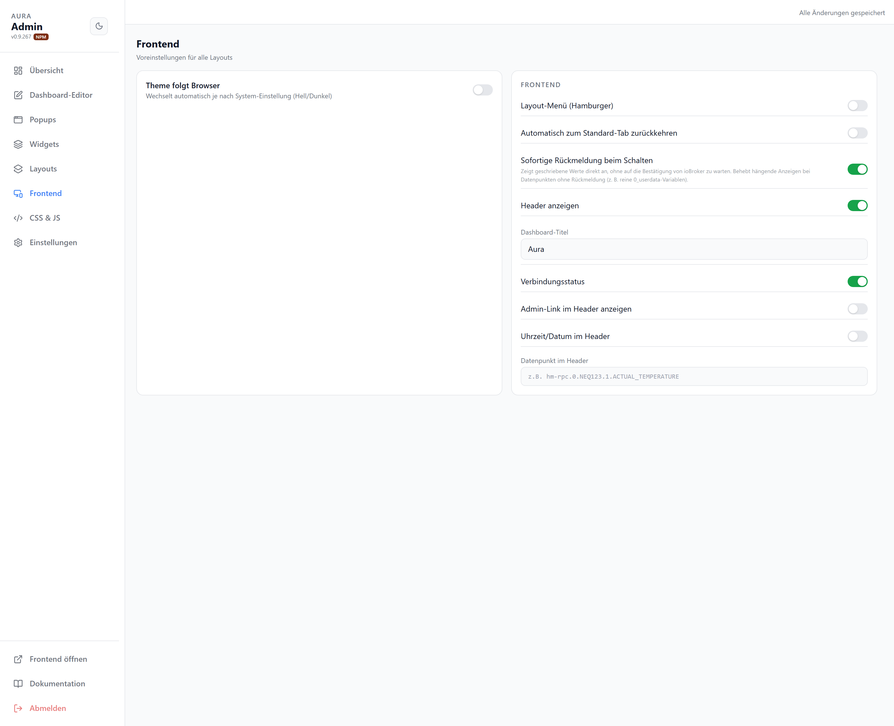

# Frontend

Anzeige-Verhalten des Frontends (gilt für alle Layouts).

| Option | |
| --- | --- |
| Theme folgt Browser | Hell/Dunkel automatisch nach System-Einstellung |
| Layout-Menü (Hamburger) | Layout-Wechsel über Menü statt Leiste (nur sichtbar ab 2 definierten Layouts) |
| Automatisch zum Standard-Tab zurückkehren | Nach Inaktivität zum Standard-Tab springen |
| Sofortige Rückmeldung beim Schalten | Geschalteten Wert sofort anzeigen, ohne ioBroker-Echo abzuwarten |
| Header anzeigen | Kopfzeile ein-/ausblenden |
| Dashboard-Titel | Text in der Kopfzeile |
| Verbindungsstatus | ioBroker-Verbindung im Header anzeigen |
| Admin-Link im Header anzeigen | Direktlink zum Adminbereich |
| Uhrzeit/Datum im Header | Zeitanzeige in der Kopfzeile |
| Datenpunkt im Header | Optionaler DP-Wert in der Kopfzeile |
