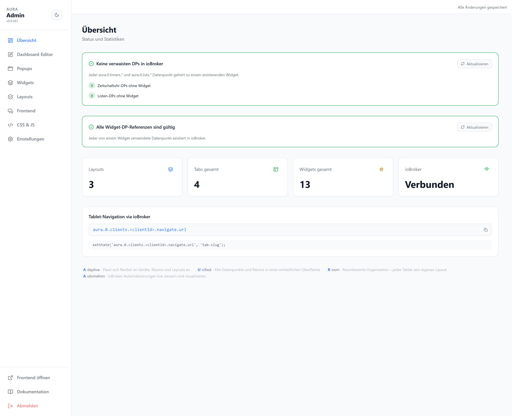

# Adminbereich

Der Adminbereich liegt unter `/#/admin` und konfiguriert das gesamte Dashboard. Login per Admin-PIN (siehe [Einstellungen](./settings#admin-pin)).

| Bereich | Zweck |
| --- | --- |
| [Übersicht](#uebersicht) | Status, Statistiken, Diagnose |
| [Dashboard-Editor](./editor) | Tabs und Widgets per Drag & Drop bearbeiten |
| [Popups](./popups) | Popup-Views und Widget-Typ-Standards |
| [Widget-Verwaltung](./widgets) | Alle Widgets eines Layouts suchen und bearbeiten |
| [Layouts & Theme](./layouts) | Layouts, Theme, Typografie, Grid, Hilfslinien, Tab-Leiste |
| [Frontend](./frontend) | Anzeige-Verhalten des Frontends |
| [CSS & JS](./css-js) | Eigenes CSS/JavaScript einbinden |
| [Einstellungen](./settings) | Sprache, PIN, Backup, Geräte, Reset |

## Übersicht

Status und Statistiken zum Dashboard sowie zwei Diagnose-Bereiche.

| Bereich | |
| --- | --- |
| Verwaiste DPs | `aura.0.timers.*` / `aura.0.lists.*` ohne zugehöriges Widget — per Knopf bereinigbar |
| Widget-DP-Referenzen | Widgets, die auf in ioBroker fehlende Datenpunkte zeigen |
| Statistik | Anzahl Layouts, Tabs, Widgets und ioBroker-Verbindungsstatus |
| Tablet-Navigation | DP-Pfad zum Fernsteuern der angezeigten Ansicht je Gerät |
