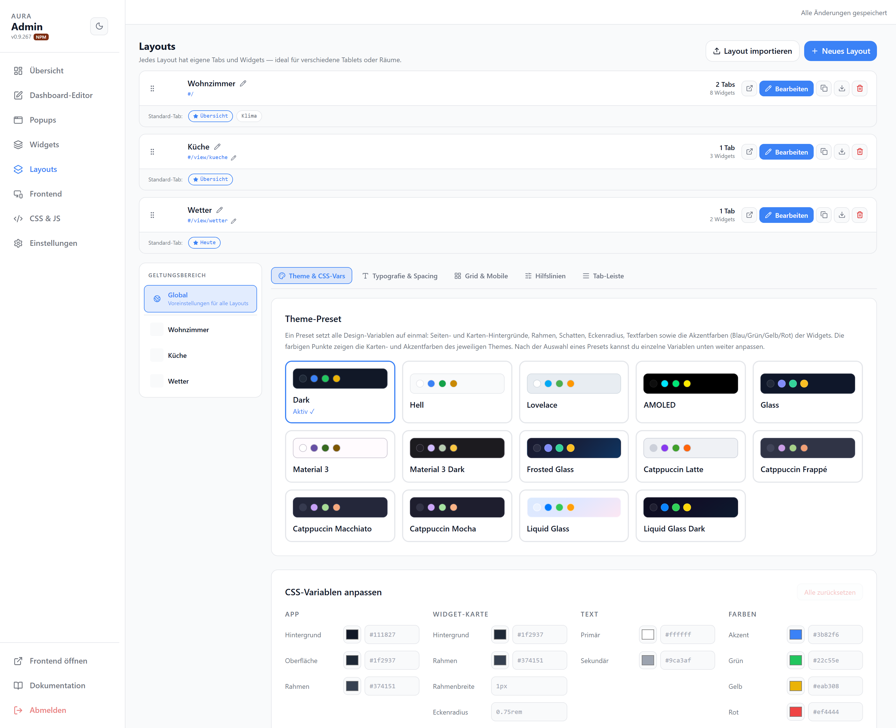
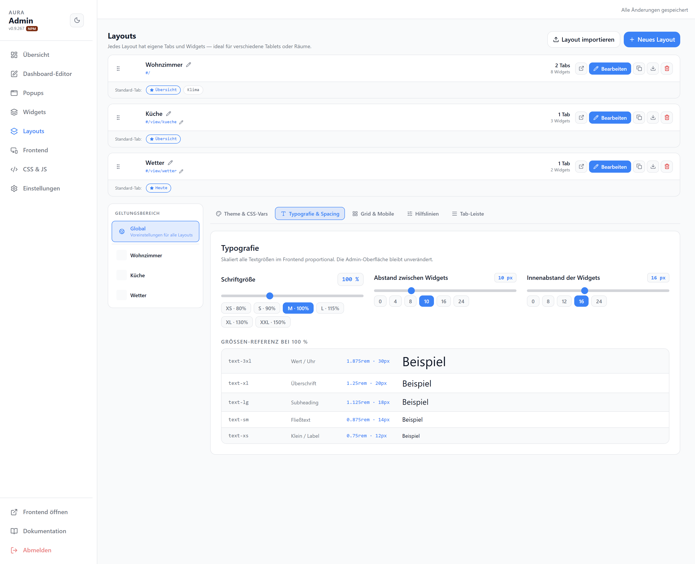
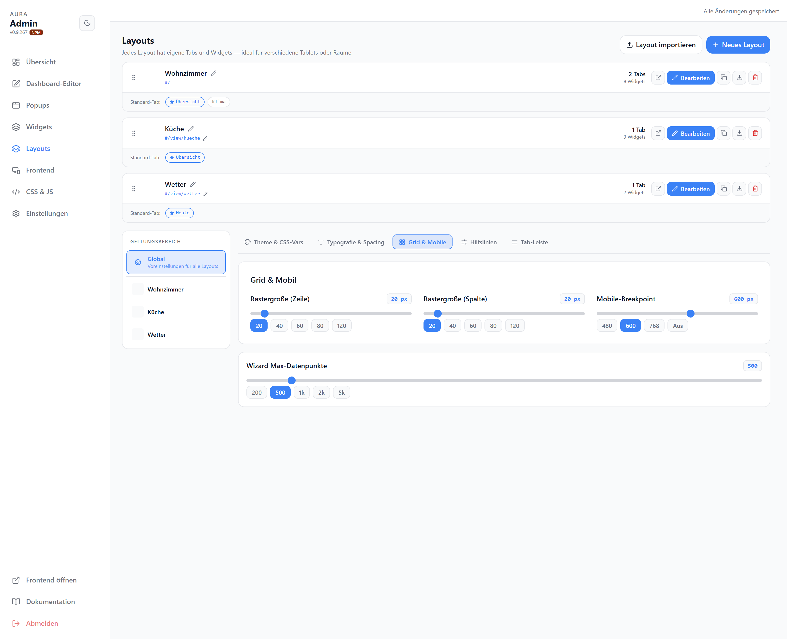
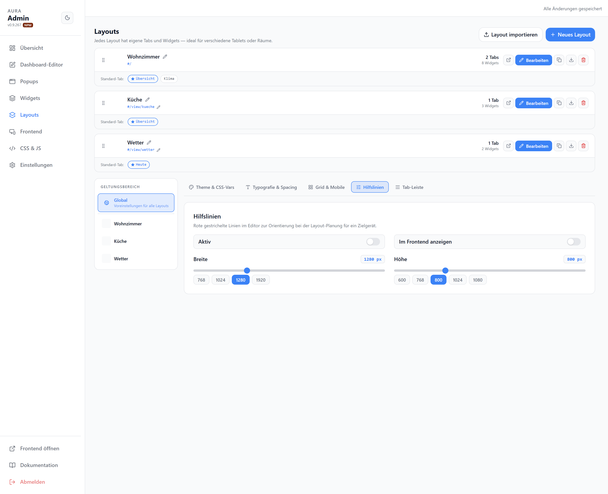
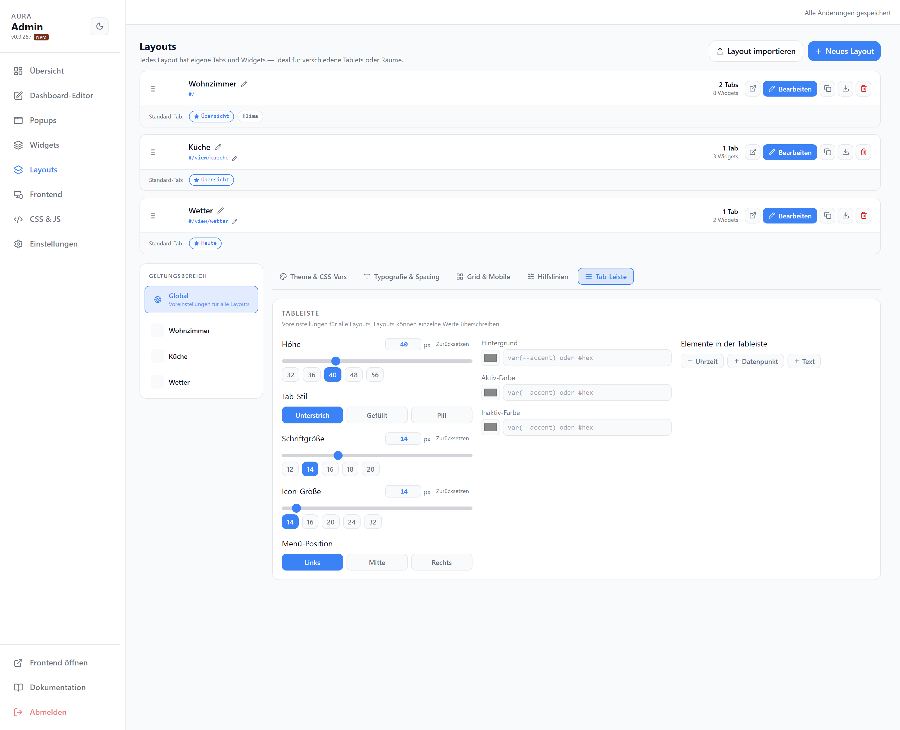

# Layouts & Theme

Jedes Layout hat eigene Tabs und Widgets — ideal für verschiedene Tablets oder Räume. Darunter Theme- und Darstellungs-Einstellungen, wahlweise global oder pro Layout (Geltungsbereich links).

## Layouts

| Element | |
| --- | --- |
| Layout-Zeile | Name, Slug, Tab-/Widget-Anzahl |
| Bearbeiten | Öffnet das Layout im [Dashboard-Editor](./editor) |
| Aktionen | Duplizieren, Exportieren, Löschen |
| Neues Layout / Layout importieren | Anlegen bzw. aus JSON einfügen |

## Theme & CSS-Vars

Preset wählen (Dark, Hell, Lovelace, AMOLED, Glass, Material 3, Catppuccin, Liquid Glass …) und einzelne CSS-Variablen feinjustieren (App, Widget-Karte, Text, Akzentfarben).

## Typografie & Spacing

Schriftart, Schriftgrößen und Abstände.

## Grid & Mobile

| Option | |
| --- | --- |
| Rastergröße (Zeile/Spalte) | Zellgröße in px |
| Mobile-Breakpoint | Breite, ab der die mobile Einspaltenansicht greift |
| Wizard Max-Datenpunkte | Obergrenze der im Assistenten gescannten Datenpunkte |

## Hilfslinien

Rote gestrichelte Linien im Editor zur Orientierung an einer Zielgröße (Breite/Höhe), optional auch im Frontend.

## Tab-Leiste

Darstellung der Tab-Leiste im Frontend.
