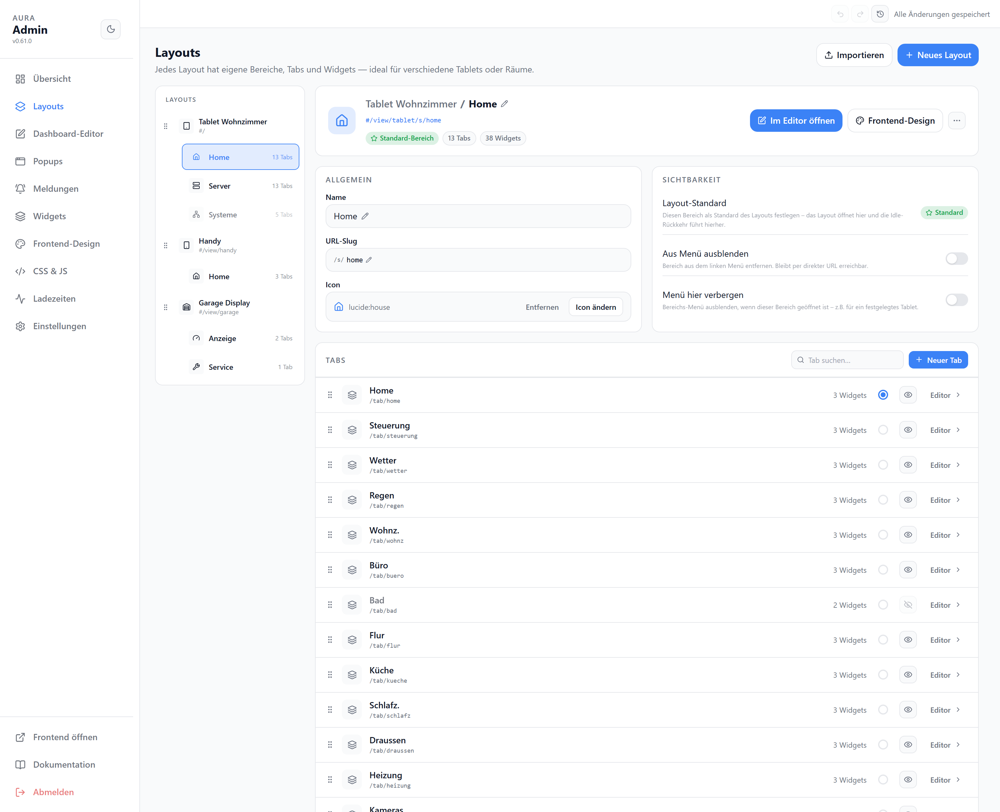

# Layouts & Theme

Jedes Layout hat eigene Tabs und Widgets — ideal für verschiedene Tablets oder Räume. Darunter die Gruppen der Seite **Frontend-Design**: global, pro Layout oder pro Bereich, so weit die Kette der Gruppe reicht (siehe [Geltungsbereich](#geltungsbereich)).

## Layouts

Links der Baum aus Layouts und ihren Bereichen, rechts das gewählte Element. Die Auswahl steht in der URL (`#/admin/layouts?ctx=<id>`).

| Element                    |                                                                                       |
| -------------------------- | ------------------------------------------------------------------------------------- |
| Baum (links)               | Layouts mit URL und ihre Bereiche mit Tab-Anzahl; Layouts per Griff sortieren          |
| Kopf                       | Icon (klicken = ändern), Name, URL, Anzahl Bereiche/Tabs/Widgets                       |
| Im Frontend öffnen         | Layout im Frontend in neuem Tab                                                        |
| Frontend-Design            | Öffnet den Geltungsbereich des Layouts im Frontend-Design (Abschnitte unten)             |
| ⋯                          | Duplizieren, Exportieren, Löschen (zweiter Klick bestätigt)                            |
| Allgemein                  | Name, URL-Slug (erstes Layout = Startseite `#/`), Icon                                 |
| Start & Menü               | Standard-Bereich; Sprung zu Bereichs-Menü, Header und Tab-Leiste im Frontend-Design    |
| Bereiche                   | Reihenfolge = Bereichs-Menü; Standard-Chip, Auge = aus dem Menü ausblenden, ⋯ je Zeile |
| Neues Layout / Importieren | Anlegen bzw. aus JSON einfügen; das neue Layout wird sofort ausgewählt                |

### Bereich

| Element            |                                                                                         |
| ------------------ | --------------------------------------------------------------------------------------- |
| Kopf               | Brotkrume Layout / Bereich, URL, Standard- und Ausgeblendet-Chip                        |
| Im Editor öffnen   | Bereich im [Dashboard-Editor](./editor)                                                 |
| ⋯                  | Duplizieren, in anderes Layout verschieben/kopieren, Exportieren, Löschen               |
| Allgemein          | Name, URL-Slug (`/s/…`), Icon                                                           |
| Sichtbarkeit       | Layout-Standard, aus Menü ausblenden, Menü in diesem Bereich verbergen                  |
| Tabs               | Reihenfolge = Tab-Leiste; Standard-Tab (Radio), Auge = aus Tab-Leiste ausblenden, Editor |
| Tab suchen         | Filtert die Liste nach Name oder Slug                                                   |
| Neuer Tab          | Legt einen leeren Tab im Bereich an                                                      |

## Geltungsbereich

Links der Baum **Global → Layout → Bereich**, rechts drei Zeilen mit den Gruppen. Der Name einer Zeile ist die Kette, entlang der ihre Gruppen abweichen dürfen; die Leiste darüber sagt, was gerade bearbeitet wird.

| Zeile                     | Gruppen                                                                    | Abweichen dürfen      |
| ------------------------- | -------------------------------------------------------------------------- | --------------------- |
| Global                    | Werte & Formatierung, Hell/Dunkel-Kopplung, Meine Themes, Verhalten        | niemand               |
| Global → Layout           | Header, Bereichs-Menü, Icons                                               | Layouts               |
| Global → Layout → Bereich | Tab-Leiste, Theme & CSS-Vars, Typografie & Spacing, Grid & Mobile, Hilfslinien & Auflösung, Navigation | Layouts und Bereiche |

| Element                  |                                                                                                         |
| ------------------------ | ------------------------------------------------------------------------------------------------------- |
| Baum (links)             | Wählt den Geltungsbereich; orange Zahl = eigene Werte auf dieser Ebene                                 |
| Leiste „Du bearbeitest …“ | Wo die Änderung landet und für wen sie gilt                                                            |
| Gesperrte Zeile          | Kette endet über dem gewählten Bereich; Klick auf den Tab erklärt es, „unter … bearbeiten“ springt hoch |
| Orange Zahl am Tab       | Eigene Werte der Gruppe auf dieser Ebene                                                                |
| Orange Einstellung       | Eigener Wert hier · ✕ entfernt ihn, der Wert erbt wieder                                                |
| „geerbt von …“           | Woher der gezeigte Wert kommt                                                                           |
| „abweichend in …“        | Layouts/Bereiche unterhalb, die diese Einstellung selbst setzen                                         |
| Ebenen                   | Eine Einstellung über alle Layouts und Bereiche; fremde Überschreibungen dort entfernen                 |
| Auf Standard / Auf Global zurücksetzen | Global: Auslieferungswerte der Gruppe; Layout/Bereich: eigene Werte der Gruppe entfernen |

## Theme & CSS-Vars

Preset wählen (Dark, Hell, Lovelace, AMOLED, Glass, Material 3, Catppuccin, Liquid Glass …) und einzelne CSS-Variablen feinjustieren (App, Widget-Karte, Text, Akzentfarben).

Welches Design das Frontend zeigt, entscheidet diese Reihenfolge:

| Vorrang | Quelle                             |                                                                                                                                                                                                  |
| ------- | ---------------------------------- | ------------------------------------------------------------------------------------------------------------------------------------------------------------------------------------------------ |
| 1       | `aura.0.config.themeMode.frontend` | Hell/Dunkel-Modus (auch der Button im Header). Ersetzt nur Designs der anderen Helligkeit — durch das unter „Theme folgt Browser" eingestellte Hell- bzw. Dunkel-Theme. Leerer Wert = kein Modus |
| 2       | Theme folgt Browser                | Überschreibt alle Presets, global wie pro Layout und Bereich                                                                                                                                     |
| 3       | Bereich → Layout → Global          | Geltungsbereich links; der engste gesetzte Wert gewinnt                                                                                                                                          |

Der Knopf im Header schreibt diesen Datenpunkt, er gilt also für alle Geräte. Gemeint ist „jetzt bitte das
andere“, kein Dauerzustand: wechselt das System selbst die Helligkeit, oder drückt man den Knopf zurück auf
das, was ohnehin angezeigt würde, wird der Datenpunkt geleert und die Automatik übernimmt wieder.

### Hell und Dunkel getrennt einstellen

Eigene Gruppe **Hell/Dunkel-Kopplung** in der Zeile „Global“.

Sobald „Theme folgt Browser" aktiv ist (oder `themeMode.frontend` einen Modus setzt), zeigt dieselbe Installation zwei Designs. Preset-Raster und Variablen-Editor bekommen dann oben rechts einen Umschalter.

| Reiter    |                                                                          |
| --------- | ------------------------------------------------------------------------ |
| Gemeinsam | Gilt für beide Helligkeiten (die bisherigen Anpassungen liegen hier)      |
| Hell      | Gilt nur, solange ein helles Theme angezeigt wird                         |
| Dunkel    | Gilt nur, solange ein dunkles Theme angezeigt wird                        |

Im Preset-Raster bestimmt der Reiter, welche Hälfte des Paares das angeklickte Design wird. Im Variablen-Editor überschreiben die Werte auf „Hell"/„Dunkel" den gemeinsamen Wert; das Feld zeigt den geerbten Wert als Platzhalter. Ein Punkt am Reiter markiert Hälften, die etwas enthalten.

### Meine Themes

Eigene Gruppe **Meine Themes** in der Zeile „Global“.

Eigene Themes sind ein eingebautes Preset plus die angepassten Variablen. Gespeicherte Themes stehen überall zur Auswahl: im Preset-Raster, als Hell- oder Dunkel-Hälfte von „Theme folgt Browser" und in jeder Layout- oder Bereichs-Überschreibung.

| Aktion                   |                                                                                     |
| ------------------------ | ----------------------------------------------------------------------------------- |
| Aktuellen Stand speichern | Legt aus dem gerade angezeigten Design + Variablen ein eigenes Theme an              |
| Hell/Dunkel              | Legt fest, für welche Hälfte des Browser-Syncs das Theme angeboten wird              |
| Verwenden                | Setzt das Theme global bzw. als passende Hälfte                                      |
| Duplizieren              | Kopie zum Weiterbauen                                                                |
| Exportieren / Importieren | JSON-Datei, auch zwischen zwei Installationen                                        |
| Löschen                  | Verwendungen fallen auf ein mitgeliefertes Design zurück                             |

## Typografie & Spacing

Schriftart, Schriftgrößen und Abstände.

## Grid & Mobile

| Option                     |                                                      |
| -------------------------- | ---------------------------------------------------- |
| Rastergröße (Zeile/Spalte) | Zellgröße in px                                      |
| Mobile-Breakpoint          | Breite, ab der die mobile Einspaltenansicht greift   |
| Mobile-Spalten             | Spaltenzahl unter dem Mobile-Breakpoint (1–4, Vorgabe 1); breite Widgets belegen anteilig mehrere Spalten |
| Tablet-Breakpoint          | Fensterbreite, unter der Widgets in Tablet-Spalten fließen (Aus = Desktop-Raster, ggf. mit Scrollbalken); das Bereichs-Menü hat dort seine eigene „Platzierung auf Tablets“ |
| Tablet-Spalten             | Spaltenzahl im Tablet-Bereich (1–4); breite Widgets belegen anteilig mehrere Spalten |
| Fensterbreite füllen       | Aus = feste Spaltenbreite (breites Fenster lässt rechts Platz, schmales scrollt). An = Spaltenzahl bleibt, die Widgets strecken sich auf die volle Fensterbreite; Höhen bleiben. Der Editor zeigt die Entwurfsansicht |
| Entwurfsbreite             | Breite, auf die das Layout gestreckt wird. Auto = belegte Breite des Bereichs (Inhalt füllt immer die volle Breite) |
| Höchstens stauchen auf     | Schmaler als dieser Anteil der Entwurfsbreite wird nicht gestaucht, darunter wird gescrollt |
| Höchstens strecken auf     | Obergrenze für sehr breite Bildschirme (Aus = unbegrenzt) |

| Fensterbreite                        | Darstellung                                  |
| ------------------------------------ | -------------------------------------------- |
| unter Mobile-Breakpoint              | Mobile-Spalten                               |
| zwischen Mobile- und Tablet-Breakpoint | Tablet-Spalten                             |
| darüber                              | Raster — fest oder auf Fensterbreite gestreckt |

## Verhalten

Nur in der Zeile **Global**.

| Option                              |                                                                   |
| ----------------------------------- | ----------------------------------------------------------------- |
| Sofortige Rückmeldung beim Schalten | Geschalteten Wert sofort anzeigen, ohne ioBroker-Echo abzuwarten  |
| Wizard Max-Datenpunkte              | Obergrenze der im Assistenten gescannten Datenpunkte              |

## Hilfslinien

Rote gestrichelte Linien im Editor zur Orientierung an einer Zielgröße (Breite/Höhe), optional auch im Frontend.

## Tab-Leiste

Darstellung der Tab-Leiste im Frontend.

| Option           |                                                                                                            |
| ---------------- | ---------------------------------------------------------------------------------------------------------- |
| Strich-Position  | Nur beim Tab-Stil `Unterstrich`: `Automatisch` legt den Strich bei der Leiste unten über den Tab, bei der Leiste oben darunter; `Oben`/`Unten` nageln ihn fest |
| Menü-Position    | Wo die Tabs in der Leiste sitzen: `Links`, `Mitte`, `Rechts` oder `Gleichmäßig`. Bei `Gleichmäßig` sind alle Tabs gleich breit und füllen die Leiste; die Markierung wird damit breiter als die Beschriftung, Menü-Elemente behalten ihre Breite am Rand. Auf schmalen Geräten kürzen lange Namen mit …, statt zu scrollen. Die Bereichsleiste (Bereichs-Menü oben/unten) kennt dieselbe Einstellung |

Die Leiste erscheint erst ab zwei sichtbaren Tabs. Ausgeblendete und deaktivierte Tabs zählen nicht mit — ein Bereich mit zwei Tabs, von denen einer ausgeblendet ist, zeigt keine Leiste. Ausnahmen: **Leiste schon ab einem Tab anzeigen** oder ein Menü-Element in der Leiste.

## Menü-Elemente

Header, Tab-Leiste und Bereichs-Menü tragen dieselbe Elementliste. Der Header wird unter [Frontend](./frontend) gepflegt, die beiden anderen in ihrem eigenen Abschnitt.

| Typ         |                                                                    |
| ----------- | ------------------------------------------------------------------ |
| Uhrzeit     | Zeit, Datum oder beides; eigenes Format möglich                    |
| Datenpunkt  | DP-Wert, optional durch ein HTML-Template (`{dp}`) formatiert      |
| Text        | Fester Text                                                        |
| Widget      | Beliebiges Widget — als Verweis auf ein vorhandenes Dashboard-Widget oder als eigene Instanz im Element |
| Rückkehr-Pause | Setzt die automatische Rückkehr für eine einstellbare Zeit aus; zeigt die Restzeit, zweites Tippen beendet die Pause |

| Option beim Typ *Widget* |                                                                  |
| ------------------------ | ---------------------------------------------------------------- |
| Quelle                   | `Vorhandenes Widget` (Verweis, ändert sich mit dem Original) oder `Eigenes Widget` (Instanz im Element) |
| Widget-Typ               | Vorausgewählt sind die Typen, die in eine Leiste passen; `Alle Typen anzeigen` hebt das auf |
| Größe                    | Startet auf der Größe, die der Widget-Typ auf einem Dashboard hat; in der Vorschau an der Ecke unten rechts pixelgenau ziehen, `Standardgröße` setzt zurück |
| Mit Karte                | Hintergrund und Rahmen zeichnen; ohne das sitzt das Widget blank in der Leiste |
| Vorschau                 | Das Element in genau der Box, die es im Menü bekommt. Bei `Eigenes Widget` öffnet der Pfeil daran dessen eigene Einstellungen |

Bedingungen, Badges, Klick-Aktionen und Popups eines Widgets gelten im Menü genauso wie auf dem Dashboard. Gruppen und Panels lassen sich nur als Verweis einbinden, nicht als eigene Instanz.

| Option beim Typ *Rückkehr-Pause* |                                                             |
| -------------------------------- | ----------------------------------------------------------- |
| Pausendauer                      | Minuten, die ein Tipp die Rückkehr aussetzt (1–1440)        |
| Darstellung                      | `Symbol und Text`, `Nur Symbol` oder `Nur Text`; bei `Nur Symbol` steht die Restzeit im Tooltip |
| Mit Hintergrund                  | Rahmen und Tönung zeichnen; ohne das bleibt nur Symbol bzw. Text |

Position: Header `Links`/`Rechts`, Tab-Leiste `L`/`M`/`R`, Bereichs-Menü `Oben`/`Unten`.

Ein neu hinzugefügtes Element ist offen; ein Klick auf die Zeile klappt sie zu und wieder auf. Die Darstellung (Layout) eines Widgets wird am Widget selbst eingestellt, nicht am Element.

## Navigation

Automatische Rückkehr zum Standard-Tab nach Inaktivität. Global, pro Layout oder pro Bereich einstellbar (Geltungsbereich links).

| Option | |
| --- | --- |
| Automatisch zum Standard-Tab zurückkehren | Schaltet die Rückkehr ein |
| Verzögerung | Inaktivität in Sekunden (5–3600) |

Ziel ist der Standard-Bereich des Layouts und dessen Standard-Tab. Als Aktivität zählen
Mausbewegung, Tastendruck, Klick, Tippen, Scrollen und Mausrad. Nicht zurückgekehrt wird,
solange ein Widget im Vollbild läuft.

| Ausnahme | |
| --- | --- |
| Einzelner Tab | Editor → Tab-Einstellungen → **Nie automatisch verlassen** |
| Ganzer Bereich | Geltungsbereich auf den Bereich stellen, Rückkehr dort ausschalten |
| Vorübergehend am Gerät | Element **Rückkehr-Pause** in Header, Tab-Leiste oder Bereichs-Menü |
| Per Datenpunkt | Siehe [Einstellungen → Rückkehr steuern](./settings#rückkehr-steuern) |

## Icons

Woher die Geräte eines Layouts ihre Icons beziehen. Global oder pro Layout einstellbar (Geltungsbereich links); ein Bereich überschreibt das nicht.

| Option | |
| --- | --- |
| Icons für Offline-Geräte vorladen | Das Gerät lädt nach dem Start alle Icons des Layouts (auch anderer Tabs, Zustände, Popups) und behält sie lokal; es fragt nur noch Aura, nie die öffentlichen Iconify-Server |

| Icon-Vorrat | |
| --- | --- |
| Icons in diesem Layout | Was die Konfiguration des Geltungsbereichs an Icons enthält, davon: im Adapter vorhanden / noch nicht vorhanden |
| Jetzt vorladen | Lässt den Adapter die fehlenden Icons einmal aus dem Internet holen; was danach weiter fehlt, gibt es im Iconify-Katalog nicht |
| Fehlende Icons | Liste der IDs, die der Adapter noch nicht hat |

| Verhalten | |
| --- | --- |
| Ohne Schalter | Icons werden beim ersten Anzeigen geholt — klein und schnell, richtig für Handys im Mobilfunk |
| Erster Start eines Geräts | Läuft noch mit dem öffentlichen Fallback; ab dem zweiten Start fragt das Gerät nur Aura |
| Adapter | `aura.0.info.iconCache` zeigt, welche Icons der Adapter selbst vorhält (Anzahl und Namen je Sammlung); jedes neue Icon steht im Log |

## Werte & Formatierung

Nur in der Zeile **Global** — gilt für alle Layouts und Widgets.

| Option                  |                                                                                                                                |
| ----------------------- | ------------------------------------------------------------------------------------------------------------------------------ |
| Dezimalstellen (global) | Standard-Nachkommastellen; pro Widget überschreibbar                                                                           |
| 1000er-Trennzeichen     | `Aus` · `1.234,5` · `1,234.5` · `1 234,5` · `1'234.5`; das Dezimaltrennzeichen wechselt passend mit; pro Widget überschreibbar |
| DP-Namen bereinigen     | Suffixe entfernen (z. B. `.STATE`, `.LEVEL`); optional Punkte durch Leerzeichen ersetzen                                       |

Beide Zahlen-Optionen lassen sich pro Widget, Zelle und Listen-Eintrag überschreiben. In den Widget-Optionen stehen sie zusammen mit der Einheit in einer Reihe: **Einheit · Dezimalstellen · 1000er**. Der Knopf `Global` neben den Dezimalstellen bzw. der Eintrag `Global` in der Auswahl bedeutet: globale Vorgabe verwenden.
