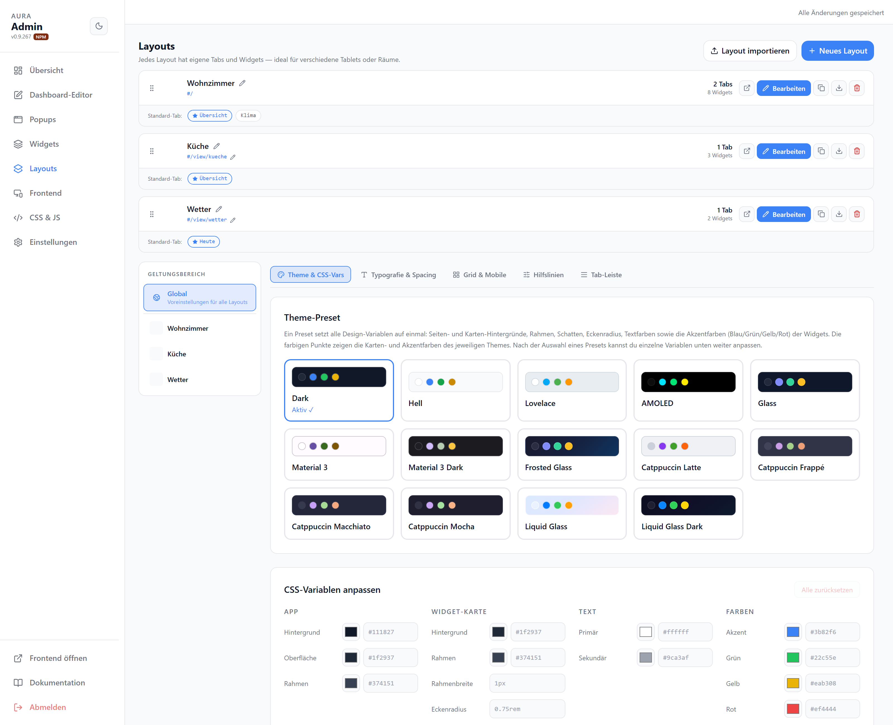
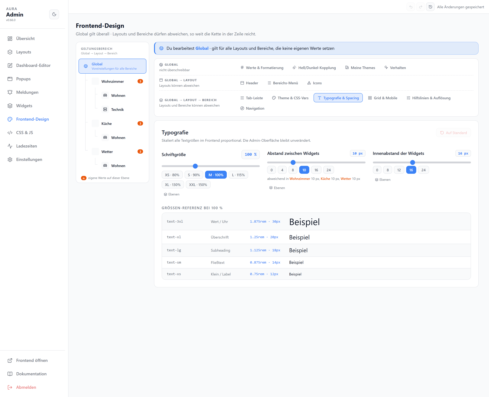
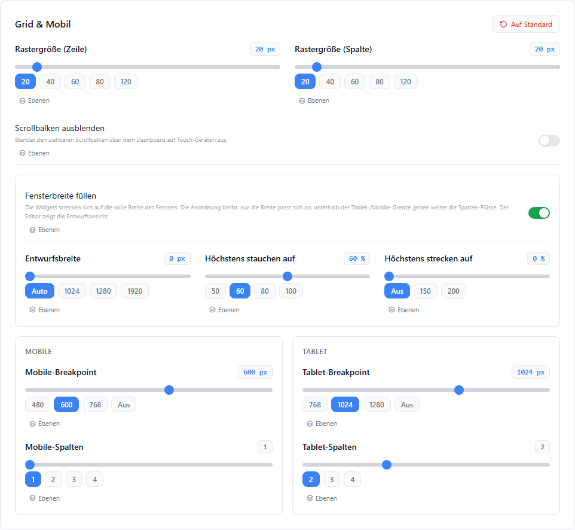
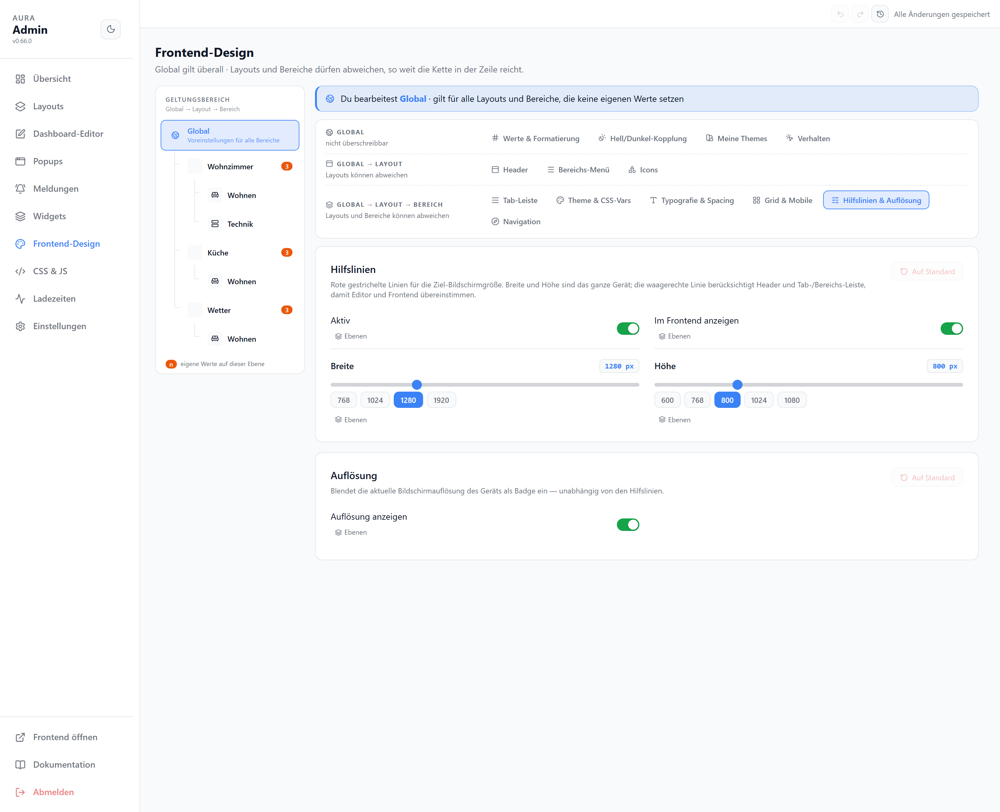
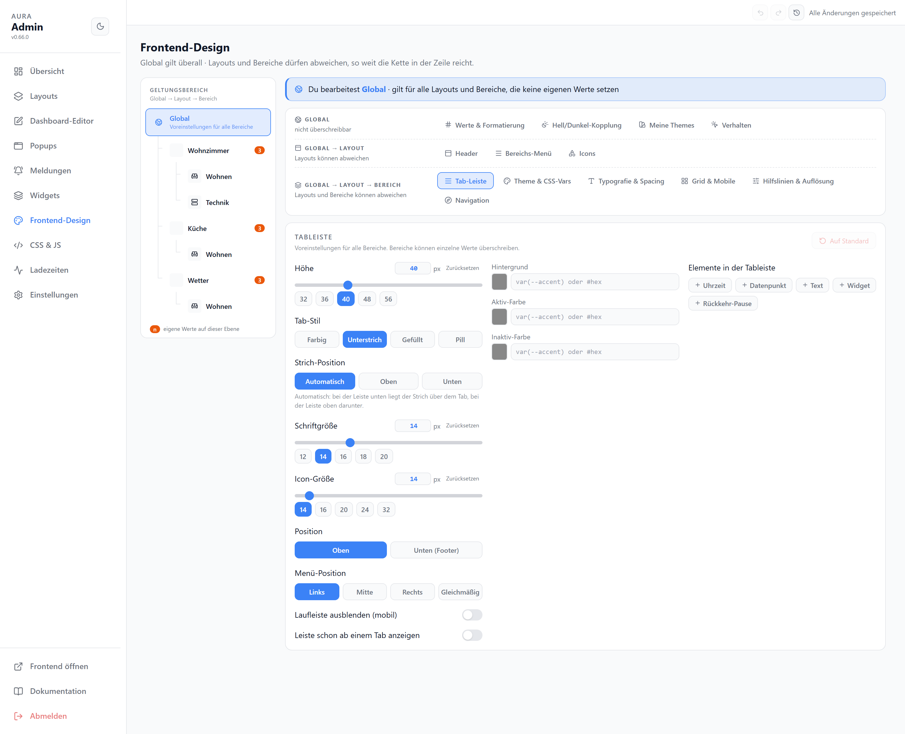

# Layouts & Theme

Jedes Layout hat eigene Tabs und Widgets — ideal für verschiedene Tablets oder Räume. Darunter Theme- und Darstellungs-Einstellungen, wahlweise global oder pro Layout (Geltungsbereich links).

## Layouts

| Element                           |                                                   |
| --------------------------------- | ------------------------------------------------- |
| Layout-Zeile                      | Name, Slug, Tab-/Widget-Anzahl                    |
| Bearbeiten                        | Öffnet das Layout im [Dashboard-Editor](./editor) |
| Aktionen                          | Duplizieren, Exportieren, Löschen                 |
| Neues Layout / Layout importieren | Anlegen bzw. aus JSON einfügen                    |

## Theme & CSS-Vars

Preset wählen (Dark, Hell, Lovelace, AMOLED, Glass, Material 3, Catppuccin, Liquid Glass …) und einzelne CSS-Variablen feinjustieren (App, Widget-Karte, Text, Akzentfarben).

Welches Design das Frontend zeigt, entscheidet diese Reihenfolge:

| Vorrang | Quelle                             |                                                                                                                                                                                                  |
| ------- | ---------------------------------- | ------------------------------------------------------------------------------------------------------------------------------------------------------------------------------------------------ |
| 1       | `aura.0.config.themeMode.frontend` | Hell/Dunkel-Modus (auch der Button im Header). Ersetzt nur Designs der anderen Helligkeit — durch das unter „Theme folgt Browser" eingestellte Hell- bzw. Dunkel-Theme. Leerer Wert = kein Modus |
| 2       | Theme folgt Browser                | Überschreibt alle Presets, global wie pro Layout und Bereich                                                                                                                                     |
| 3       | Bereich → Layout → Global          | Geltungsbereich links; der engste gesetzte Wert gewinnt                                                                                                                                          |

## Typografie & Spacing

Schriftart, Schriftgrößen und Abstände.

## Grid & Mobile

| Option                     |                                                      |
| -------------------------- | ---------------------------------------------------- |
| Rastergröße (Zeile/Spalte) | Zellgröße in px                                      |
| Mobile-Breakpoint          | Breite, ab der die mobile Einspaltenansicht greift   |
| Wizard Max-Datenpunkte     | Obergrenze der im Assistenten gescannten Datenpunkte |

## Hilfslinien

Rote gestrichelte Linien im Editor zur Orientierung an einer Zielgröße (Breite/Höhe), optional auch im Frontend.

## Tab-Leiste

Darstellung der Tab-Leiste im Frontend.

## Werte & Formatierung

Nur im Geltungsbereich **Global** — gilt für alle Layouts und Widgets.

| Option                  |                                                                                                                                |
| ----------------------- | ------------------------------------------------------------------------------------------------------------------------------ |
| Dezimalstellen (global) | Standard-Nachkommastellen; pro Widget überschreibbar                                                                           |
| 1000er-Trennzeichen     | `Aus` · `1.234,5` · `1,234.5` · `1 234,5` · `1'234.5`; das Dezimaltrennzeichen wechselt passend mit; pro Widget überschreibbar |
| DP-Namen bereinigen     | Suffixe entfernen (z. B. `.STATE`, `.LEVEL`); optional Punkte durch Leerzeichen ersetzen                                       |

Beide Zahlen-Optionen lassen sich pro Widget, Zelle und Listen-Eintrag überschreiben. In den Widget-Optionen stehen sie zusammen mit der Einheit in einer Reihe: **Einheit · Dezimalstellen · 1000er**. Der Knopf `Global` neben den Dezimalstellen bzw. der Eintrag `Global` in der Auswahl bedeutet: globale Vorgabe verwenden.
