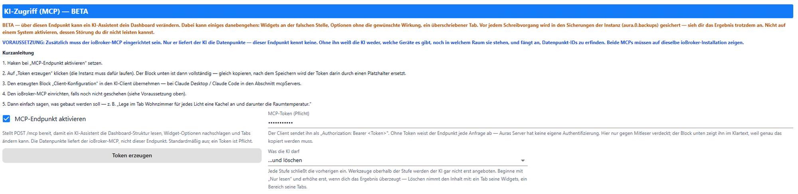
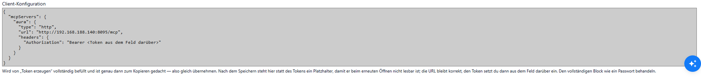

# KI-Zugriff (MCP)

Aura stellt unter `POST /mcp` einen MCP-Server bereit. Ein KI-Assistent (Claude Desktop, Claude Code, …) liest damit die Dashboard-Struktur, schlägt Widget-Optionen nach und baut Tabs — ohne dass jemand JSON von Hand schreibt.

::: warning BETA
Der Assistent verändert dein Dashboard. Widgets können an der falschen Stelle landen, Optionen ohne Wirkung bleiben, ein Tab überschrieben werden. Vor jedem Schreibvorgang sichert Aura nach `aura.0.backups` — das Ergebnis trotzdem ansehen. Nicht auf einem System aktivieren, dessen Störung du dir nicht leisten kannst.
:::

## Voraussetzungen

| | |
| --- | --- |
| Aura-Instanz | läuft, Port bekannt (Standard `8095` — **nicht** der Port des Web-Adapters) |
| [ioBroker-MCP](#iobroker-mcp) | **Pflicht.** Nur er kennt die Datenpunkte |
| KI-Client | mit MCP über HTTP (Claude Desktop, Claude Code, …) |

Beide MCP-Server müssen auf **dieselbe** ioBroker-Installation zeigen.

## Arbeitsteilung

| Frage | ioBroker-MCP | Aura-MCP |
| --- | --- | --- |
| Welche Datenpunkte, Räume, Gewerke gibt es? | ✅ | — |
| Welche Widget-Typen, welche Optionen? | — | ✅ |
| Wie sieht das Dashboard heute aus? | — | ✅ |
| Ist dieses Widget-JSON gültig? | — | ✅ |
| Dashboard ändern | — | ✅ |

Ohne den ioBroker-MCP weiß das Modell nicht, welche Geräte es gibt, und fängt an, Datenpunkt-IDs zu erfinden. Eine erfundene ID ergibt ein Widget, das stumm nichts anzeigt.

## Schritt 1 — Endpunkt aktivieren

ioBroker-Admin → **Instanzen** → `aura.0` → Konfiguration (Schraubenschlüssel) → Abschnitt **„KI-Zugriff (MCP) — BETA“**.



| Feld | Vorgabe | |
| --- | --- | --- |
| MCP-Endpunkt aktivieren | aus | Ohne Haken antwortet `/mcp` mit `404` |
| MCP-Token | leer | Pflicht — ohne Token weist der Endpunkt jede Anfrage ab |
| Was die KI darf | Nur lesen | Berechtigungsstufe, siehe [unten](#berechtigungsstufen) |
| Token erzeugen | — | Knopf; füllt Token und Client-Konfiguration |
| Client-Konfiguration | leer | Fertiger Block zum Kopieren |

Haken bei **MCP-Endpunkt aktivieren** setzen, danach erscheinen die übrigen Felder.

## Schritt 2 — Token erzeugen

**Token erzeugen** klicken (die Instanz muss laufen). Das Feld **Client-Konfiguration** enthält jetzt den vollständigen Block:



```json
{
  "mcpServers": {
    "aura": {
      "type": "http",
      "url": "http://192.168.1.20:8095/mcp",
      "headers": { "Authorization": "Bearer 8f3c…" }
    }
  }
}
```

| | |
| --- | --- |
| Sofort kopieren | Nach dem Speichern steht im Block statt des Tokens ein Platzhalter. Die URL bleibt korrekt, den Token setzt du dann aus dem Feld darüber ein |
| Falsche URL? | Läuft Aura hinter einem Reverse-Proxy oder unter einem Hostnamen, das Feld **Basis-URL** weiter oben setzen — es gewinnt gegenüber der erkannten Adresse |
| `<ioBroker-IP>` im Block | Adresse wurde nicht erkannt, von Hand eintragen |

Den vollständigen Block wie ein Passwort behandeln — er gibt Lese- und Schreibzugriff auf das Dashboard.

## Schritt 3 — Block in den KI-Client übernehmen

| Weg | |
| --- | --- |
| Einfach sagen | Den kopierten Block in den Prompt eines laufenden KI-Assistenten geben: „Füg diesen MCP-Server hinzu: …“ — Claude Code trägt ihn selbst ein |
| Claude Desktop | Einstellungen → Entwickler → `claude_desktop_config.json`, Block in `mcpServers` einfügen, Client neu starten |
| Claude Code | `claude mcp add --transport http aura http://<ip>:8095/mcp --header "Authorization: Bearer <Token>"` |
| Andere | Server-Typ „HTTP“ / „Streamable HTTP“, URL `…/mcp`, Header `Authorization: Bearer <Token>` |

Verbindung prüfen: „Welche Tabs hat mein Aura-Dashboard?“ — die Antwort kommt aus `aura_dashboard`.

## Schritt 4 — ioBroker-MCP einrichten {#iobroker-mcp}

Ohne ihn bleibt der Aura-MCP nutzlos. Adapter [`ioBroker.mcp`](https://github.com/ioBroker/ioBroker.mcp) installieren und eine Instanz anlegen.

| | |
| --- | --- |
| Betriebsart | Eigenständig (eigener Port, Standard `8093`) oder als Erweiterung einer Web-Adapter-Instanz |
| Endpunkt | `http(s)://<host>:<port>/mcp` |
| Anmeldung | ioBroker-Benutzer (ACLs gelten) oder OAuth-Login im Browser |

```json
{
  "mcpServers": {
    "iobroker": {
      "type": "http",
      "url": "http://192.168.1.20:8093/mcp"
    }
  }
}
```

Beide Einträge (`aura` und `iobroker`) gehören in dieselbe `mcpServers`-Sektion.

## Berechtigungsstufen

Jede Stufe schließt die vorherigen ein. Werkzeuge oberhalb der Stufe werden dem Modell gar nicht erst angeboten.

| Stufe | |
| --- | --- |
| Nur lesen | Struktur, Widget-Schema, Messung, Validierung, Prüfbericht. Änderungen bietet das Modell als JSON zum manuellen Import an |
| Lesen und schreiben | Widgets, Tabs, Bereiche, Layouts, Popups, Gruppen und Vorlagen anlegen und ändern; Sicherungen zurückspielen |
| …und umbenennen | zusätzlich Layout, Bereich, Tab, Popup, Vorlage umbenennen (Slug bleibt) |
| …und löschen | zusätzlich löschen — ein Tab nimmt seine Widgets mit, ein Bereich seine Tabs |

Mit **Nur lesen** anfangen und erst erhöhen, wenn das Ergebnis überzeugt.

## Schritt 5 — Loslegen

Einfach sagen, was gebaut werden soll:

- „Lege im Tab Wohnzimmer für jedes Licht eine Kachel an und darunter die Raumtemperatur.“
- „Bau mir aus den Fensterkontakten eine Statusübersicht.“
- „Sieh dir den Tab Energie an und sag, was besser ginge.“

Vor jedem Schreibvorgang prüft Aura das Widget gegen Schema, Datenpunkte und Zeilendarstellung — bei einem Fehler wird gar nicht geschrieben.

## Fehlersuche

| Symptom | Ursache |
| --- | --- |
| `404` | Haken „MCP-Endpunkt aktivieren“ fehlt oder Instanz läuft nicht |
| `503` | Endpunkt aktiv, aber kein Token gesetzt (steht auch als Warnung im Adapter-Log) |
| `401` | Token im Client stimmt nicht mit dem in der Instanz überein |
| `405` | Client spricht nicht MCP über HTTP (`/mcp` nimmt nur POST) |
| Keine Verbindung | Falscher Port — Aura läuft auf `8095`, nicht auf dem Port des Web-Adapters |
| Modell erfindet Datenpunkte | ioBroker-MCP fehlt oder zeigt auf eine andere Installation |
| Widget bleibt leer | Datenpunkt-ID existiert nicht — `aura_validate` bzw. `aura_review` darüber laufen lassen |
| Änderung ging daneben | ioBroker-Admin → Objekte → `aura.0.backups`, oder das Modell eine Sicherung zurückspielen lassen |
