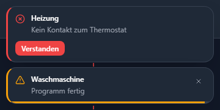
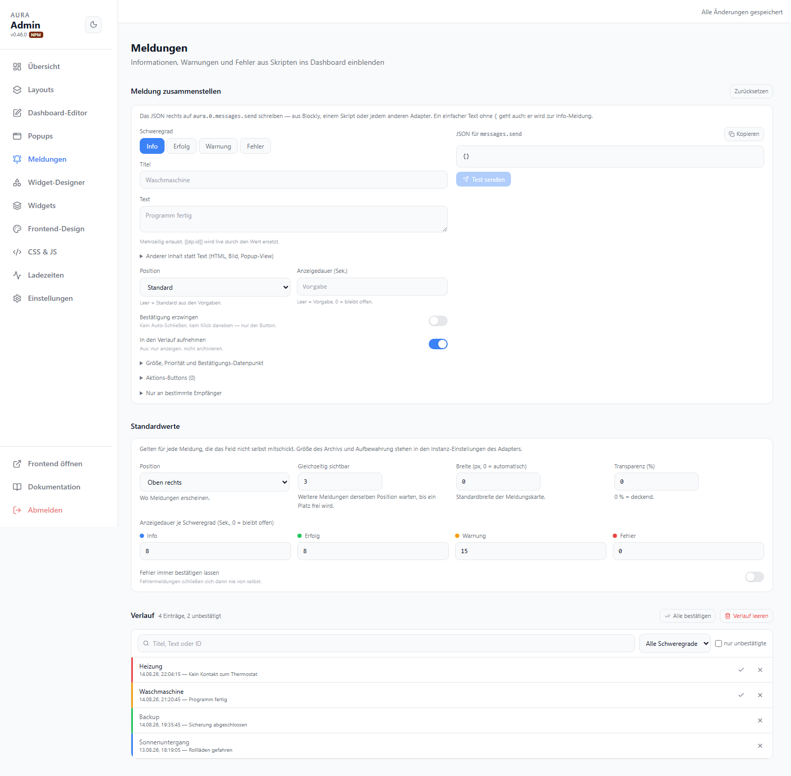

# Meldungen

Informationen, Warnungen und Fehler aus Skripten ins Dashboard einblenden. Eine Meldung erscheint als Einblendung (Toast), landet im Verlauf und kann eine Bestätigung verlangen.

Der Verlauf lässt sich mit dem [Meldungen-Widget](../widgets/meldungen) auf jedem Tab anzeigen.



## Meldung senden

| Datenpunkt | |
| --- | --- |
| `aura.0.messages.send` | Alle Geräte |
| `aura.0.clients.<clientId>.messages.send` | Nur dieses Gerät |
| `aura.0.layouts.<layout-slug>.messages.send` | Nur dieses Layout |

Der Datenpunkt wird nach der Verarbeitung automatisch geleert. Ein Text ohne führende `{` wird zur Info-Meldung:

```js
setState('aura.0.messages.send', 'Waschmaschine fertig');
```

Alles Weitere als JSON:

```js
setState('aura.0.messages.send', JSON.stringify({
    severity: 'warning',
    title: 'Waschmaschine',
    text: 'Programm fertig',
    durationSec: 20,
}));
```

::: tip Baukasten im Admin
**Admin → Meldungen** hat ein Formular, das dieses JSON live erzeugt — inklusive „Kopieren" und „Test senden".
:::

## JSON-Format

Alle Felder sind optional. Was fehlt, kommt aus den [Standardwerten](#standardwerte).

### Inhalt

| Feld | Typ | |
| --- | --- | --- |
| `severity` | `info` · `success` · `warning` · `error` | Standard `info`; bestimmt Farbe, Icon und Anzeigedauer |
| `title` | string | Überschrift |
| `text` | string | Textkörper, mehrzeilig; `[[dp.id]]` wird live durch den Wert ersetzt |
| `html` | string | statt `text`, wird bereinigt gerendert |
| `image` | string | Bild-URL; Adapter-Dateien über `/webfs/…` |
| `icon` | string | [Lucide](https://lucide.dev)- oder Iconify-ID, überschreibt das Severity-Icon |
| `view` | string | Name oder ID einer [Popup-View](./popups#popup-views) als Inhalt — damit sind Widgets in der Meldung möglich |
| `dp` | datapoint | `{{dp}}`-Kontext für diese View |

Mindestens eines von `title`, `text`, `html`, `image` oder `view` muss gesetzt sein — sonst wird die Meldung verworfen.

### Anzeige

| Feld | Typ | |
| --- | --- | --- |
| `position` | siehe [Positionen](#positionen) | wo die Meldung erscheint |
| `durationSec` | number | Sekunden bis zum automatischen Schließen; `0` = bleibt offen |
| `requireAck` | boolean | kein Auto-Schließen, kein Klick daneben — nur der Bestätigen-Button schließt |
| `priority` | `0`–`100` | höher drängt sich an wartenden Meldungen derselben Position vorbei |
| `width` / `height` | number (px) | Größe der Karte |
| `transparency` | `0`–`95` | Prozent; `0` = deckend |

### Verhalten

| Feld | Typ | |
| --- | --- | --- |
| `id` | string | wiederverwendbare ID: dieselbe ID ersetzt die vorherige Meldung, statt eine zweite zu stapeln |
| `persist` | boolean | `false` = nur anzeigen, nicht in den Verlauf aufnehmen |
| `ackDp` | datapoint | wird bei Bestätigung geschrieben |
| `ackValue` | string | Wert dafür; leer = `true` |
| `actions` | Array | Buttons, siehe unten |
| `target` | Objekt | Empfänger, siehe unten |

### Aktions-Buttons

```json
"actions": [
  { "label": "Trockner an", "dp": "javascript.0.trockner", "value": "true" },
  { "label": "Später", "dp": "javascript.0.snooze", "value": "600", "close": false }
]
```

| Feld | |
| --- | --- |
| `label` | Beschriftung; Pflicht |
| `dp` | Datenpunkt, der beschrieben wird; Pflicht |
| `value` | geschriebener Wert, als bool/number/string interpretiert; leer = `true` |
| `close` | `false` = Meldung bleibt nach dem Klick stehen; Standard `true` |

Maximal sechs Buttons. Ein Klick gilt als Antwort und bestätigt die Meldung.

### Empfänger

```json
"target": { "clients": ["a1b2c3"], "layout": "haus", "tab": "kueche" }
```

| Feld | |
| --- | --- |
| `clients` | Liste von Client-IDs; leer = alle Geräte |
| `layout` | Slug, ID oder Name eines Layouts |
| `tab` | Slug, ID oder Name eines Tabs |

Wird auf einen Client- oder Layout-Datenpunkt geschrieben, ist der Empfänger schon dadurch festgelegt — ein `target` im JSON hat dann Vorrang.

## Positionen

| | links | mitte | rechts |
| --- | --- | --- | --- |
| **oben** | `top-left` | `top-center` | `top-right` |
| **mitte** | `center-left` | `center` | `center-right` |
| **unten** | `bottom-left` | `bottom-center` | `bottom-right` |

Jede Position ist ein eigener Stapel. Sind mehr Meldungen offen als „Gleichzeitig sichtbar" erlaubt, warten die übrigen: Meldungen mit Bestätigungspflicht behalten ihren Platz, danach entscheidet `priority`, dann das Alter. Eine wartende Meldung erscheint mit voller Anzeigedauer, sobald ein Platz frei wird.

## Standardwerte

**Admin → Meldungen → Standardwerte**. Gelten für jede Meldung, die das Feld nicht selbst mitschickt.



| Option | Standard | |
| --- | --- | --- |
| Position | `top-right` | |
| Gleichzeitig sichtbar | `3` | pro Position |
| Breite | `0` | `0` = automatisch (340 px) |
| Transparenz | `0 %` | |
| Anzeigedauer Info / Erfolg | `8` s | |
| Anzeigedauer Warnung | `15` s | |
| Anzeigedauer Fehler | `0` | bleibt offen |
| Fehler immer bestätigen lassen | aus | erzwingt `requireAck` für alle Fehler |

Größe und Aufbewahrung des Archivs stehen in den **Instanz-Einstellungen des Adapters**:

| Option | Standard | |
| --- | --- | --- |
| Gespeicherte Meldungen | `100` | ältere fallen aus dem Verlauf |
| Aufbewahrung | `30` Tage | `0` = unbegrenzt |

## Verlauf und Bestätigung

| Datenpunkt | |
| --- | --- |
| `aura.0.messages.history` | JSON-Array, neueste zuerst |
| `aura.0.messages.lastMessage` | zuletzt erzeugte Meldung |
| `aura.0.messages.unreadCount` | Anzahl unbestätigter Meldungen |
| `aura.0.messages.ack` | ID schreiben = bestätigen; `*` = alle |
| `aura.0.messages.dismiss` | ID schreiben = auf allen Geräten schließen; `*` = alle |
| `aura.0.messages.clear` | Button; leert den Verlauf |

Gelesen/ungelesen gilt geräteübergreifend: eine auf dem Tablet bestätigte Meldung ist überall bestätigt. `dismiss` schließt die Einblendung nur, der Eintrag bleibt unbestätigt im Verlauf.

`unreadCount` eignet sich direkt als Datenpunkt für ein [Badge](./editor#badges) vom Typ „Anzahl".

## Glocke im Header

**Admin → Frontend-Design → Header → Meldungs-Glocke im Header**. Zeigt die Anzahl unbestätigter Meldungen; ein Klick öffnet die letzten Einträge. Pro Layout überschreibbar wie die übrigen Header-Optionen.

## Meldung aus einer Bedingung

Jede [Bedingung](./editor#bedingungen) eines Widgets kann eine Meldung auslösen — ohne Skript. Im Bedingungs-Editor **Meldung senden** einschalten, der Baukasten öffnet sich im Dialog.

Ausgelöst wird die Flanke: eine Zustands-Regel sendet einmal, sobald sie zutrifft. Nur eine Bedingung mit dem Operator **hat sich geändert** sendet bei jeder Wertänderung.

## Beispiele

Warnung, die sich nach 20 Sekunden schließt:

```js
setState('aura.0.messages.send', JSON.stringify({
    severity: 'warning',
    title: 'Waschmaschine',
    text: 'Programm fertig',
    durationSec: 20,
    position: 'bottom-right',
}));
```

Fehler, der bestätigt werden muss und die Bestätigung meldet:

```js
setState('aura.0.messages.send', JSON.stringify({
    severity: 'error',
    title: 'Heizung',
    text: 'Kein Kontakt zum Thermostat',
    requireAck: true,
    ackDp: 'javascript.0.heizung.gemeldet',
}));
```

Wiederverwendbare ID — der zweite Aufruf ersetzt die erste Meldung, statt zu stapeln:

```js
setState('aura.0.messages.send', JSON.stringify({ id: 'wm', title: 'Waschmaschine', text: 'läuft' }));
setState('aura.0.messages.send', JSON.stringify({ id: 'wm', title: 'Waschmaschine', text: 'fertig' }));
```

Rückfrage mit Buttons, nur auf dem Küchen-Tablet:

```js
setState('aura.0.clients.a1b2c3.messages.send', JSON.stringify({
    severity: 'info',
    title: 'Waschmaschine fertig',
    text: 'Trockner starten?',
    requireAck: true,
    actions: [
        { label: 'Ja', dp: 'javascript.0.trockner', value: 'true' },
        { label: 'Nein', dp: 'javascript.0.trockner', value: 'false' },
    ],
}));
```

Popup-View als Inhalt — die Meldung zeigt echte Widgets:

```js
setState('aura.0.messages.send', JSON.stringify({
    title: 'Sonnenuntergang',
    view: 'Wetter-Details',
    durationSec: 300,
    width: 420,
}));
```
