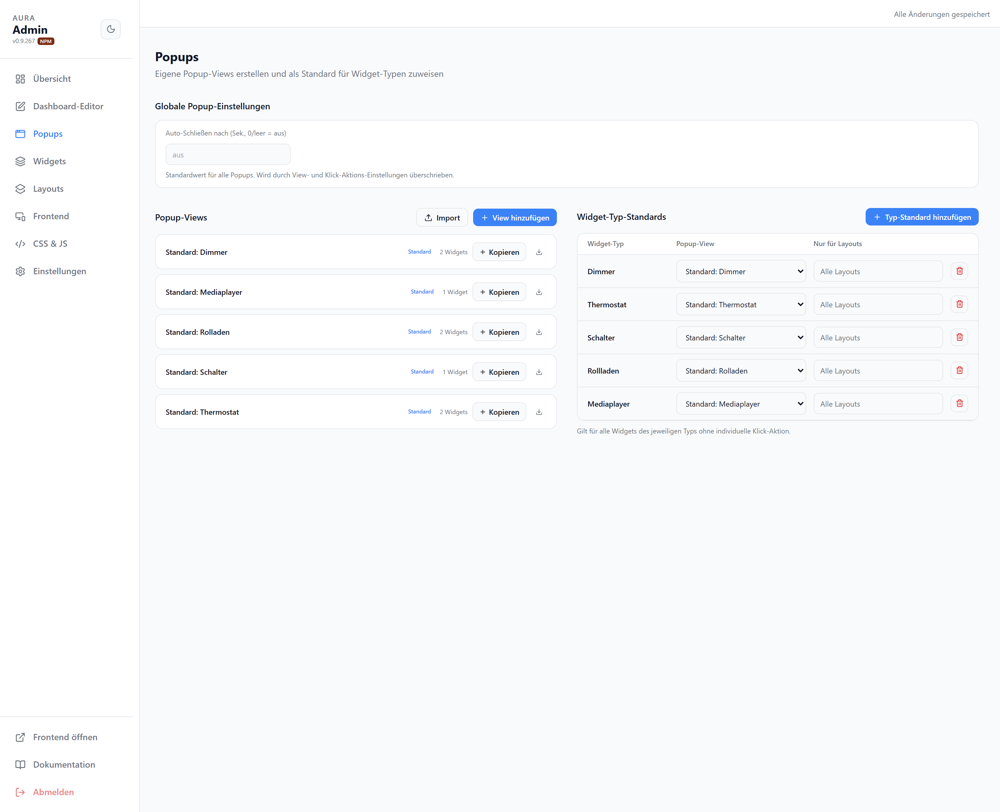

# Popups

Eigene Popup-Views erstellen und als Standard für Widget-Typen zuweisen. Ein Popup öffnet sich beim Klick auf ein Widget.

## Globale Popup-Einstellungen

| Option | |
| --- | --- |
| Auto-Schließen nach (Sek.) | Automatisches Schließen; `0` / leer = aus |

## Popup-Views

Liste aus mitgelieferten (`Standard: …`) und eigenen Views. Pro View: `Bearbeiten`, `Kopieren`, `Exportieren`; eigene zusätzlich umbenennen/löschen. Über `View hinzufügen` bzw. `Import` neue Views anlegen.

## Widget-Typ-Standards

Ordnet einem Widget-Typ eine Popup-View zu — gilt für alle Widgets dieses Typs ohne individuelle Klick-Aktion.

| Spalte | |
| --- | --- |
| Widget-Typ | Typ, für den der Standard gilt |
| Popup-View | Zugeordnete View |
| Nur für Layouts | Optionaler Layout-Filter |
