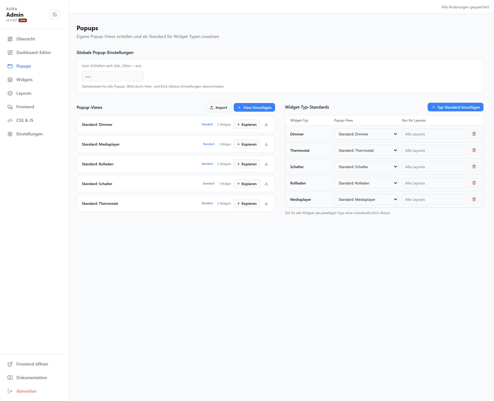

# Popups

Eigene Popup-Views erstellen und als Standard für Widget-Typen zuweisen. Ein Popup öffnet sich beim Klick auf ein Widget oder über einen Datenpunkt.



## Globale Popup-Einstellungen

| Option | |
| --- | --- |
| Auto-Schließen nach (Sek.) | Automatisches Schließen; `0` / leer = aus |

## Popup per Datenpunkt

Öffnet ein Popup, sobald ein beliebiger Datenpunkt seine Bedingung erfüllt — ohne Klick auf ein Widget.

| Option | |
| --- | --- |
| Bedingung | Datenpunkt + Operator + Wert; ausgelöst wird nur die Flanke (nicht erfüllt → erfüllt) |
| Ziel | Vollständige Klick-Aktion: Popup-View, alle Datenpunkte des Geräts, Bild, Webseite, JSON, HTML, Widget-Inhalt |
| Datenpunkt zurücksetzen | Schreibt nach dem Öffnen einen Wert zurück (Tastermodus); leer = `false` |
| Popup schließen, wenn … | Schließt das Popup, sobald die Bedingung nicht mehr erfüllt ist |
| Gültig auf Geräten | Optionaler Client-Filter; leer = alle Geräte |
| Nur in Layout / Nur auf Tab | Optionaler Scope |

Der Trigger-Datenpunkt steht im Popup als `{{dp}}` bereit — eine Popup-View lässt sich so für mehrere Trigger wiederverwenden.

::: tip Flanke statt Zustand
Steht der Datenpunkt beim Laden der Seite schon auf dem Trigger-Wert, öffnet sich kein Popup. Bei mehreren Geräten schreibt das schnellste den Reset-Wert; die Flanke erreicht vorher alle Geräte.
:::

### Per Skript öffnen

| Datenpunkt | |
| --- | --- |
| `aura.0.popup.open` | Alle Geräte |
| `aura.0.clients.<clientId>.popup.open` | Nur dieses Gerät |

Wert: Name oder ID einer Popup-View, oder JSON `{"view":"…","dp":"…","title":"…"}`. Der Datenpunkt wird nach dem Öffnen automatisch geleert.

```js
setState('aura.0.popup.open', 'Wetter-Details');
setState('aura.0.popup.open', '{"view":"Gerät","dp":"hm-rpc.0.ABC.1.STATE"}');
```

## Popup-Views

Mitgeliefert werden `Standard: Dimmer`, `Standard: Thermostat`, `Standard: Schalter`, `Standard: Rolladen`, `Standard: Mediaplayer` und `Standard: Datenpunkt`.

`Standard: Datenpunkt` (Wert, Steuerung, ID, letzte Änderung) ist bewusst **kein** Widget-Typ-Standard — sie dient nur als Rückfallebene für den [Klick auf eine Listenzeile](../widgets/dynamische-liste#klick-auf-zeile) und ändert das Verhalten bestehender Widgets nicht.

### Platzhalter

Haupt-Datenpunkt im Beispiel: `alias.0.Heizung.Bad.TSOLL`

| Platzhalter | ergibt | gilt in |
| --- | --- | --- |
| `{{dp}}` | `alias.0.Heizung.Bad.TSOLL` | jedem Feld der Popup-Widgets · Popup-Titel |
| `{{parent}}` | `alias.0.Heizung.Bad` | jedem Feld der Popup-Widgets · Popup-Titel |
| `{{name}}` | `TSOLL` | jedem Feld der Popup-Widgets · Popup-Titel |
| `[[<dp>]]` | Wert des Datenpunkts | Popup-Titel · Widget-Name (jedes Widget) |

`{{…}}` ersetzt beim Öffnen einmalig Text, `[[…]]` liest laufend den Wert. Die Text-Ersetzung läuft zuerst, beides ist also kombinierbar:

| eingeben | in Feld | ergibt |
| --- | --- | --- |
| `{{parent}}.TIST` | Datenpunkt eines Widgets | `alias.0.Heizung.Bad.TIST` |
| `[[{{parent}}.TIST]] °C` | Widget-Name | `21.5 °C`, live |
| `{{name}} · [[{{parent}}.TIST]] °C` | Popup-Titel | `TSOLL · 21.5 °C`, live |

Beim Klick auf eine Listenzeile ist der Haupt-Datenpunkt die geklickte Zeile — ein Popup-Titel mit Platzhaltern gilt damit für alle Zeilen.

Ein Platzhalter im Namensfeld einer Listenzeile bleibt Text — nur das Feld `Datenpunkt-ID` der Zeile wird als Datenpunkt gelesen.

## Klick-Aktion „Alle Datenpunkte des Geräts"

Listet alle Datenpunkte, die unter demselben Elternobjekt, Kanal oder Gerät liegen wie der geklickte — als bedienbare Liste.

| Option | Standard | |
| --- | --- | --- |
| Umfang | Gleicher Strang | `parent` (Elternobjekt) · `channel` · `device` |
| Nur relevante Datenpunkte | aus | filtert auf bedienbare/anzeigbare Rollen |
| Datenpunkt | Widget-/Zeilen-Datenpunkt | überschreibt die Quelle |

`Gleicher Strang` funktioniert immer, auch ohne Kanal-/Geräteobjekte (z. B. bei Aliassen).

## Views verwalten

Liste aus mitgelieferten (`Standard: …`) und eigenen Views. Pro View: `Bearbeiten`, `Kopieren`, `Exportieren`; eigene zusätzlich umbenennen/löschen. Über `View hinzufügen` bzw. `Import` neue Views anlegen.

## Widget-Typ-Standards

Ordnet einem Widget-Typ eine Popup-View zu — gilt für alle Widgets dieses Typs ohne individuelle Klick-Aktion.

| Spalte | |
| --- | --- |
| Widget-Typ | Typ, für den der Standard gilt |
| Popup-View | Zugeordnete View |
| Nur für Layouts | Optionaler Layout-Filter |
