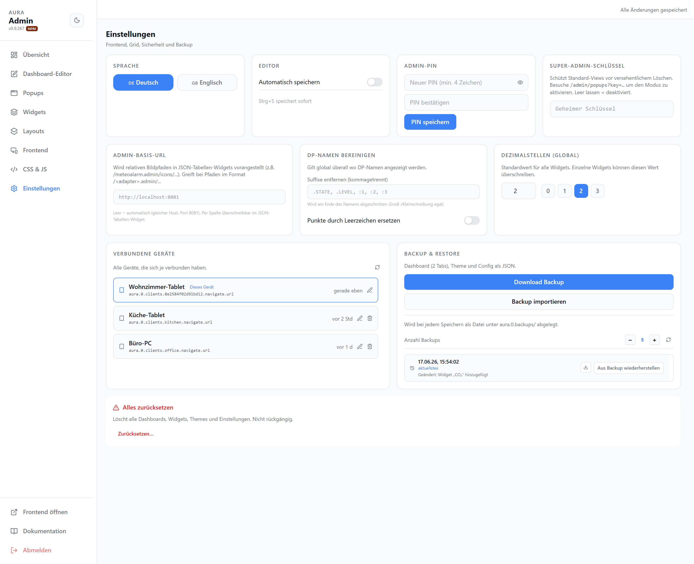

# Einstellungen

Allgemeine Einstellungen: Frontend, Grid, Sicherheit und Backup.

| Karte | |
| --- | --- |
| Sprache | Deutsch / Englisch |
| Editor | Automatisch speichern + Intervall (`Strg+S` speichert sofort) |
| Admin-PIN | PIN für den Adminbereich setzen (min. 4 Zeichen) |
| Super-Admin-Schlüssel | Schützt Standard-Views vor Löschen; aktiviert über `/admin/popups?key=…` |
| Admin-Basis-URL | Relative Bildpfade in JSON-Tabellen-Widgets auflösen |
| DP-Namen bereinigen | Suffixe entfernen (z. B. `.STATE`, `.LEVEL`); optional Punkte durch Leerzeichen ersetzen |
| Dezimalstellen (global) | Standard-Nachkommastellen; pro Widget überschreibbar |
| Verbundene Geräte | Liste der Clients; umbenennen, entfernen |
| Backup & Restore | Manuelles Backup laden/importieren; Auto-Backups (Anzahl, Wiederherstellen) |
| Alles zurücksetzen | Löscht Dashboards, Widgets, Themes und Einstellungen — nicht rückgängig |
