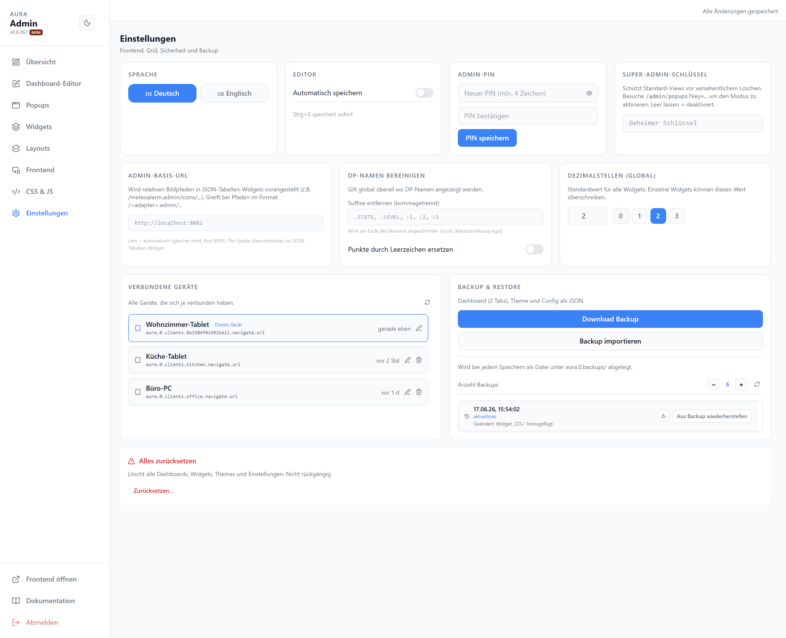

# Einstellungen

Allgemeine Einstellungen: Frontend, Grid, Sicherheit und Backup.



| Karte | |
| --- | --- |
| Sprache | Deutsch / Englisch |
| Editor | Automatisch speichern + Intervall (`Strg+S` speichert sofort) |
| Admin-PIN | Passwort für den Adminbereich (min. 4 Zeichen). Wird serverseitig im Adapter geprüft (scrypt); nach dem Update auf diese Version einmalig neu setzen. Die Anmeldung gilt 8 Stunden — danach führt der Editor zurück zur Anmeldung. PIN vergessen: im Instanz-Datenverzeichnis in `security.json` den Eintrag `admin` löschen und die Instanz neu starten (geschützte Bereiche bleiben erhalten) |
| Super-Admin-Schlüssel | Schützt Standard-Views vor Löschen; aktiviert über `/admin/popups?key=…` |
| Admin-Basis-URL | Relative Bildpfade in JSON-Tabellen-Widgets auflösen |
| Verbundene Geräte | Liste der Clients; umbenennen, feste ID vergeben, entfernen |
| Backup & Restore | Manuelles Backup laden/importieren; Auto-Backups (Anzahl, Wiederherstellen) |
| Alles zurücksetzen | Löscht Dashboards, Widgets, Themes und Einstellungen — nicht rückgängig |

## Client-ID

Jedes Gerät bekommt eine ID; darüber wird es einzeln angesprochen:
`aura.0.clients.<ID>.navigate.url`, `.navigate.target`, `.popup.open`, `.messages.send`,
`.idleReturn.snoozeMinutes`, `.idleReturn.delay`.

Die ID wird beim ersten Kontakt vergeben und dann im Browser gespeichert. Sie bleibt
danach unverändert — Browser-Updates, Auflösungs- oder Skalierungswechsel ändern sie nicht.

| Feste ID vergeben | |
| --- | --- |
| Einstellungen → Verbundene Geräte | Beim eigenen Gerät auf ✎, Feld **Feste ID für dieses Gerät** |
| Beim Aufruf | `http://<host>:8095/?client=wohnzimmer-tablet` |
| Erlaubt | `a–z`, `0–9`, `-`, `_`, max. 40 Zeichen; `register`, `resolution`, `deleteRequest` sind belegt |

Beides legt `aura.0.clients.<ID>` neu an und entfernt den bisherigen Eintrag des Geräts.
Skripte, die noch die alte ID verwenden, laufen danach ins Leere.

::: tip
Wird der Browser eines Geräts gewechselt (Chrome → Edge), meldet sich das Gerät als
neuer Client. Mit einer festen ID über `?client=` bekommen beide dieselbe ID.
:::

## Gerät entfernen

| Weg | |
| --- | --- |
| Einstellungen → Verbundene Geräte | Beim Gerät auf 🗑, bestätigen |
| Datenpunkt | Client-ID in `aura.0.clients.deleteRequest` schreiben |
| Blockly / Skript | `setState('aura.0.clients.deleteRequest', '129841a3ce70e541')` |

Der Adapter löscht `aura.0.clients.<ID>` samt allen Unterpunkten und leert den
Datenpunkt wieder. Geschrieben wird nur die ID — nicht der ganze Pfad. Das
Bestätigt-Flag (`ack`) spielt keine Rolle. Ergebnis steht im Instanz-Log
(`[clients] deleted: …`).

Ist das Gerät noch offen, meldet es sich beim nächsten Kontakt sofort neu an —
erst Browser/Kiosk schließen, dann löschen.

| Relais-Datenpunkte unter `aura.0.clients.` | |
| --- | --- |
| `register` | JSON `{clientId, name}` — legt einen Client an |
| `resolution` | JSON `{clientId, width, height}` — Auflösung melden |
| `deleteRequest` | Client-ID — löscht diesen Client |

Alle drei leeren sich nach der Ausführung selbst.

## Rückkehr steuern

Die [automatische Rückkehr zum Standard-Tab](./layouts#navigation) lässt sich zur Laufzeit
aussetzen oder umstellen — für ein Gerät oder für alle.

| Datenpunkt | |
| --- | --- |
| `aura.0.clients.<ID>.idleReturn.snoozeMinutes` | Minuten pausieren; zählt selbst auf 0 herunter |
| `aura.0.clients.<ID>.idleReturn.delay` | Verzögerung für dieses Gerät: `-1` = Einstellung des Dashboards, `0` = aus, sonst Sekunden |
| `aura.0.idleReturn.snoozeMinutes` | Dasselbe für alle Geräte |
| `aura.0.idleReturn.delay` | Dasselbe für alle Geräte |

```js
// 30 Minuten am Wandtablet stehenbleiben
setState('aura.0.clients.wohnzimmer-tablet.idleReturn.snoozeMinutes', 30);
// sofort wieder aktivieren
setState('aura.0.clients.wohnzimmer-tablet.idleReturn.snoozeMinutes', 0);
```

Die Pause läuft immer ab — der Adapter zählt sie minütlich herunter, auch über einen
Neustart hinweg. `delay` gilt dagegen dauerhaft und überstimmt die Dashboard-Einstellung
in beide Richtungen: ein Wert über 0 schaltet die Rückkehr auch dort ein, wo sie im
Dashboard aus ist.

Dasselbe ohne Skript: das Element **Rückkehr-Pause** in Header, Tab-Leiste oder
Bereichs-Menü, oder ein Schalter-Widget auf einen der Datenpunkte.
