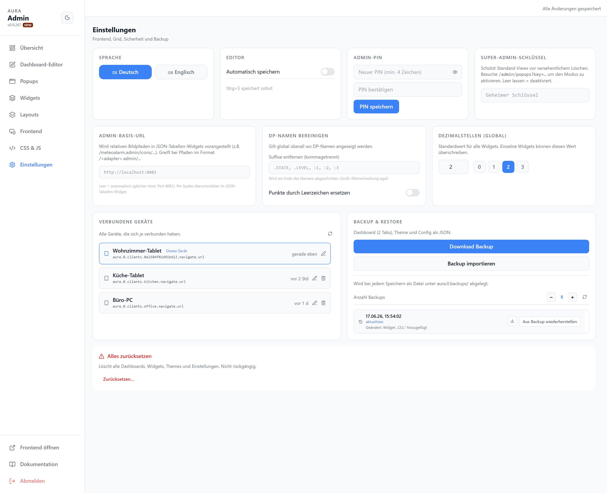

# Einstellungen

Allgemeine Einstellungen: Frontend, Grid, Sicherheit und Backup.



| Karte | |
| --- | --- |
| Sprache | Deutsch / Englisch |
| Editor | Automatisch speichern + Intervall (`Strg+S`, auf Apple-Geräten `⌘+S`, speichert sofort) |
| Rückgängig / Wiederholen | `Strg+Z` / `Strg+Y` (Apple: `⌘+Z` / `⌘+Y`) oder die Pfeile in der Speicherleiste; jeder Schritt einzeln, auch nach dem Speichern und nach einem Neuladen der Seite (solange niemand anderes die Konfiguration inzwischen geändert hat; Wiederholen geht beim Neuladen verloren). **Verwerfen** setzt alles Ungespeicherte zurück und ist selbst rückgängig. In Textfeldern gilt das Rückgängig des Browsers |
| Ungespeichert nach Neuladen | Ungespeicherte Änderungen bleiben nach `F5` erhalten **und ungespeichert**; die Speicherleiste zeigt „Ungespeicherte Änderungen · aus der letzten Sitzung übernommen“. Speichern, Verwerfen oder Rückgängig ist Handarbeit (bis 0.60.8 wurden sie beim Laden des Admins automatisch gespeichert) |
| Frontend im selben Browser | Das Frontend zeigt immer den gespeicherten Stand. Läuft es im selben Browser wie ein Admin, übernimmt es dessen ungespeicherte Änderungen nicht mehr live (bis 0.60.8 wanderte jedes Verschieben sofort ins Frontend-Tab) und lässt Kopie und Markierung des Admins unangetastet; nach **Speichern** kommt der neue Stand wie auf jedem anderen Gerät über die Verbindung zum Adapter |
| Verlauf (Uhr-Symbol in der Speicherleiste) | Alle Schritte dieser Sitzung mit Beschreibung („Widget „Küche“ verschoben“), Klick springt zu einem Stand. Darunter die gespeicherten Stände (Auto-Backups): Wiederherstellen legt vorher eine Sicherung des aktuellen Stands ab und ist ein einzelner Rückgängig-Schritt |
| Admin-PIN | Passwort für den Adminbereich (min. 4 Zeichen). Wird serverseitig im Adapter geprüft (scrypt); nach dem Update auf diese Version einmalig neu setzen. Die Anmeldung gilt 8 Stunden — danach führt der Editor zurück zur Anmeldung. PIN vergessen: siehe [Admin-PIN zurücksetzen](#admin-pin-zurucksetzen) |
| Super-Admin-Schlüssel | Schützt Standard-Views vor Löschen; aktiviert über `/admin/popups?key=…` |
| Admin-Basis-URL | Relative Bildpfade in JSON-Tabellen-Widgets auflösen |
| Verbundene Geräte | Liste der Clients; umbenennen, feste ID vergeben, entfernen |
| Backup & Restore | Manuelles Backup laden/importieren; Auto-Backups (Anzahl, Wiederherstellen). Jeder Eintrag nennt neben Datum und Uhrzeit die Aura-Version, die ihn geschrieben hat, und trägt sie auch im Dateinamen (`backup-2026-09-21T14-34-07-891Z-v0.66.0.json.gz`). Schreibt ein Skript oder ein anderes Werkzeug einen `aura.0.config.*`-Datenpunkt ohne `ack`, sichert der Adapter den vorherigen Stand automatisch in dieselbe Liste („Fremder Schreibzugriff von …“, höchstens alle 30 s je Datenpunkt) |
| Alles zurücksetzen | Löscht Dashboards, Widgets, Themes und Einstellungen — nicht rückgängig |

## Admin-PIN zurücksetzen

Der PIN liegt nur als Hash im Adapter und lässt sich nicht anzeigen.

| Schritt | ioBroker-Admin → Instanzen → Aura (Schraubenschlüssel) |
| --- | --- |
| 1. Haken setzen | Abschnitt **Sicherheit** → **Admin-PIN beim nächsten Start zurücksetzen** |
| 2. Speichern | **Speichern und schließen** — die Instanz startet neu |
| 3. Adminbereich öffnen | Aura fragt wie bei der Ersteinrichtung nach einem neuen PIN |

| Hinweis | |
| --- | --- |
| Bleibt erhalten | PINs geschützter Bereiche und Tabs, alle Dashboards und Einstellungen |
| Abgemeldet | Alle offenen Admin- und Bereichs-Sitzungen, auf allen Geräten |
| Haken | Entfernt sich nach dem Zurücksetzen selbst; die Instanz startet dafür ein zweites Mal |
| Log | `aura: admin PIN reset from the instance settings …` (Warnung) |
| Kein Datenpunkt | Absicht: Datenpunkte kann jeder Socket-Client schreiben, auch das Frontend |

### Manuell (SSH)

Ohne Zugriff auf den ioBroker-Admin geht es direkt auf dem ioBroker-Host:

| Schritt | Befehl |
| --- | --- |
| 1. Instanz stoppen | `iobroker stop aura.0` |
| 2. In das Datenverzeichnis wechseln | `cd /opt/iobroker/iobroker-data/aura.0` |
| 3. Sicherung anlegen | `cp security.json security.json.bak` |
| 4. Admin-PIN löschen | siehe unten |
| 5. Instanz starten | `iobroker start aura.0` |
| 6. Adminbereich öffnen | Aura fragt wie bei der Ersteinrichtung nach einem neuen PIN |

Schritt 4:

```bash
node -e 'const f="security.json",fs=require("fs");const d=JSON.parse(fs.readFileSync(f,"utf8"));d.admin=null;d.serverSecret=null;fs.writeFileSync(f,JSON.stringify(d),{mode:0o600})'
```

| Hinweis | |
| --- | --- |
| Andere Instanz | `aura.0` in Schritt 1, 2 und 5 durch die eigene Instanz ersetzen (z. B. `aura.1`) |
| Docker / andere Installation | Datenverzeichnis ist `<ioBroker-Verzeichnis>/iobroker-data/aura.<n>/`; die Befehle im Container ausführen |
| Ohne `node` | `security.json` im Editor öffnen, `"admin":{…}` durch `"admin":null` und `"serverSecret":"…"` durch `"serverSecret":null` ersetzen (meldet alle ab) |
| Rückgängig | `security.json.bak` zurück nach `security.json` kopieren, Instanz neu starten |

## Web-Adapter-Erweiterung (Visu App)

Aura zusätzlich unter dem Port einer Web-Instanz erreichbar machen, z. B. für die ioBroker Visu App oder den Cloud-Adapter. Standard: aus.

| Schritt | ioBroker-Admin → Instanzen → Aura (Schraubenschlüssel) |
| --- | --- |
| 1. Web-Instanz wählen | Abschnitt **Zusätzlich erreichbar über den Web-Adapter (/aura/)** → **Zusätzlich erreichbar über Web-Instanz (/aura/)** |
| 2. Speichern | Aura und die gewählte Web-Instanz starten neu |
| 3. Aufrufen | `http://<iobroker-ip>:<web-port>/aura/` – Adminbereich unter `…/aura/#/admin` |

| Hinweis | |
| --- | --- |
| Datenverbindung | Das Feld **Datenverbindung (Socket-Backend)** weiter oben ist etwas anderes: von dort holt Aura Live-Werte und Adapter-Dateien – wird immer gebraucht, auch ohne Erweiterung |
| Port 8095 | Läuft unverändert weiter; Dashboards, PINs und Einstellungen sind auf beiden Wegen dieselben |
| Neustarts | Die gewählte Web-Instanz startet bei jedem Start, Stopp und Speichern der Aura-Instanz neu – andere Web-Instanzen nicht |
| Empfehlung | Eigene Web-Instanz nur für Aura (z. B. `web.1` auf eigenem Port), dann laufen die anderen Visualisierungen auf `:8082` ungestört |
| Socket | Die Web-Instanz braucht ihren integrierten Socket (Standard) – darüber laufen die Live-Werte |
| Anmeldung | Ist in der Web-Instanz die Anmeldung aktiv, gilt sie zusätzlich zu den Aura-PINs |
| Aura gestoppt | `/aura/` zeigt „Aura läuft nicht“ und lädt von selbst neu, sobald Aura wieder läuft; die Web-Instanz läuft weiter |
| Instanz-Links | Zusätzlicher Link „Aura (web adapter)“ in der Instanzliste |

## Client-ID

Jedes Gerät bekommt eine ID; darüber wird es einzeln angesprochen:
`aura.0.clients.<ID>.navigate.url`, `.navigate.target`, `.popup.open`, `.messages.send`,
`.idleReturn.snoozeMinutes`, `.idleReturn.delay`.

Die ID wird beim ersten Kontakt vergeben und dann im Browser gespeichert. Sie bleibt
danach unverändert — Browser-Updates, Auflösungs- oder Skalierungswechsel ändern sie nicht.

| Feste ID vergeben | |
| --- | --- |
| Einstellungen → Verbundene Geräte | Beim eigenen Gerät auf ✎, Feld **Feste ID für dieses Gerät** |
| Beim Aufruf | `http://<host>:8095/?client=wohnzimmer-tablet` |
| Erlaubt | `a–z`, `0–9`, `-`, `_`, max. 40 Zeichen; `register`, `resolution`, `deleteRequest` sind belegt |

Beides legt `aura.0.clients.<ID>` neu an und entfernt den bisherigen Eintrag des Geräts.
Skripte, die noch die alte ID verwenden, laufen danach ins Leere.

::: tip
Wird der Browser eines Geräts gewechselt (Chrome → Edge), meldet sich das Gerät als
neuer Client. Mit einer festen ID über `?client=` bekommen beide dieselbe ID.
:::

## Gerät entfernen

| Weg | |
| --- | --- |
| Einstellungen → Verbundene Geräte | Beim Gerät auf 🗑, bestätigen |
| Datenpunkt | Client-ID in `aura.0.clients.deleteRequest` schreiben |
| Blockly / Skript | `setState('aura.0.clients.deleteRequest', '129841a3ce70e541')` |

Der Adapter löscht `aura.0.clients.<ID>` samt allen Unterpunkten und leert den
Datenpunkt wieder. Geschrieben wird nur die ID — nicht der ganze Pfad. Das
Bestätigt-Flag (`ack`) spielt keine Rolle. Ergebnis steht im Instanz-Log
(`[clients] deleted: …`).

Ist das Gerät noch offen, meldet es sich beim nächsten Kontakt sofort neu an —
erst Browser/Kiosk schließen, dann löschen.

| Relais-Datenpunkte unter `aura.0.clients.` | |
| --- | --- |
| `register` | JSON `{clientId, name}` — legt einen Client an |
| `resolution` | JSON `{clientId, width, height}` — Auflösung melden |
| `deleteRequest` | Client-ID — löscht diesen Client |

Alle drei leeren sich nach der Ausführung selbst.

## Rückkehr steuern

Die [automatische Rückkehr zum Standard-Tab](./layouts#navigation) lässt sich zur Laufzeit
aussetzen oder umstellen — für ein Gerät oder für alle.

| Datenpunkt | |
| --- | --- |
| `aura.0.clients.<ID>.idleReturn.snoozeMinutes` | Minuten pausieren; zählt selbst auf 0 herunter |
| `aura.0.clients.<ID>.idleReturn.delay` | Verzögerung für dieses Gerät: `-1` = Einstellung des Dashboards, `0` = aus, sonst Sekunden |
| `aura.0.idleReturn.snoozeMinutes` | Dasselbe für alle Geräte |
| `aura.0.idleReturn.delay` | Dasselbe für alle Geräte |

```js
// 30 Minuten am Wandtablet stehenbleiben
setState('aura.0.clients.wohnzimmer-tablet.idleReturn.snoozeMinutes', 30);
// sofort wieder aktivieren
setState('aura.0.clients.wohnzimmer-tablet.idleReturn.snoozeMinutes', 0);
```

Die Pause läuft immer ab — der Adapter zählt sie minütlich herunter, auch über einen
Neustart hinweg. `delay` gilt dagegen dauerhaft und überstimmt die Dashboard-Einstellung
in beide Richtungen: ein Wert über 0 schaltet die Rückkehr auch dort ein, wo sie im
Dashboard aus ist.

Dasselbe ohne Skript: das Element **Rückkehr-Pause** in Header, Tab-Leiste oder
Bereichs-Menü, oder ein Schalter-Widget auf einen der Datenpunkte.
