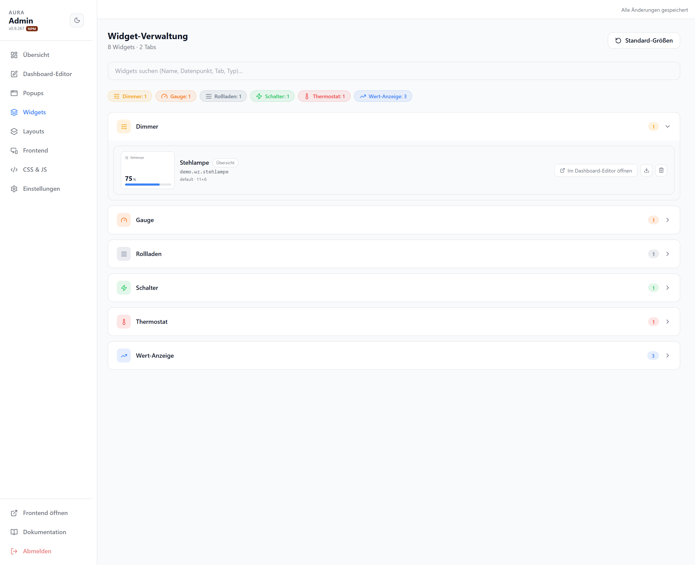

# Widget-Verwaltung

Alle Widgets des aktiven Layouts, nach Typ gruppiert. Such- und Filterleiste oben, Inline-Bearbeitung pro Widget.

| Element | |
| --- | --- |
| Suchfeld | Nach Name, Datenpunkt, Tab oder Typ filtern |
| Typ-Chips | Schnellfilter je Widget-Typ mit Anzahl |
| Typ-Gruppe | Aufklappbar; listet die Widgets des Typs |
| Widget-Zeile | Vorschau, `Im Dashboard-Editor öffnen`, Exportieren, Löschen |
| Standard-Größen | Setzt alle Widgets auf ihre Standardmaße zurück |

Die Liste bezieht sich auf das aktuell gewählte Layout. Für die einzelnen Widget-Typen siehe [Widgets](/widgets/).
