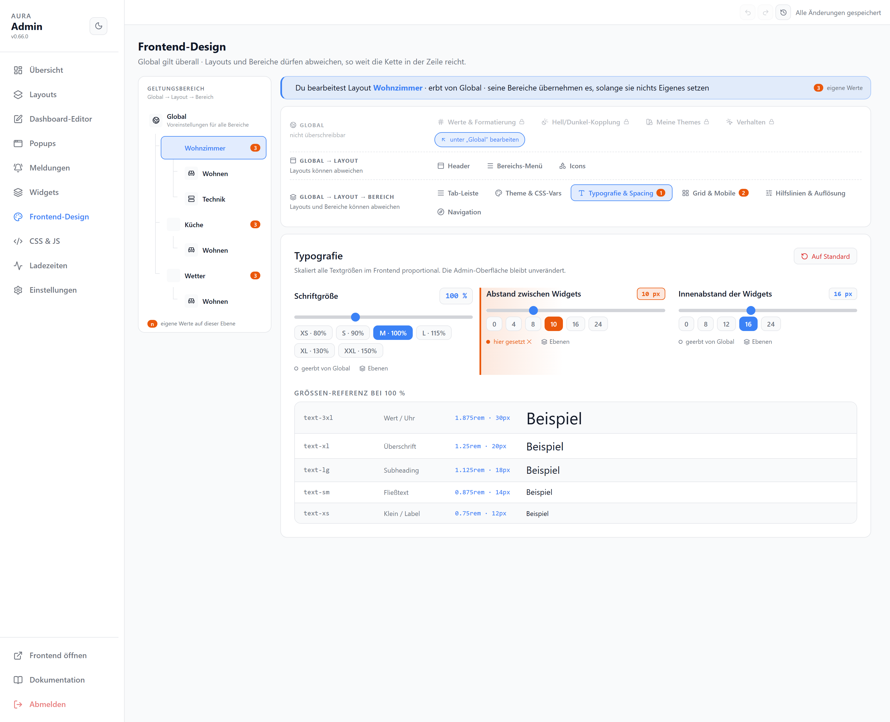
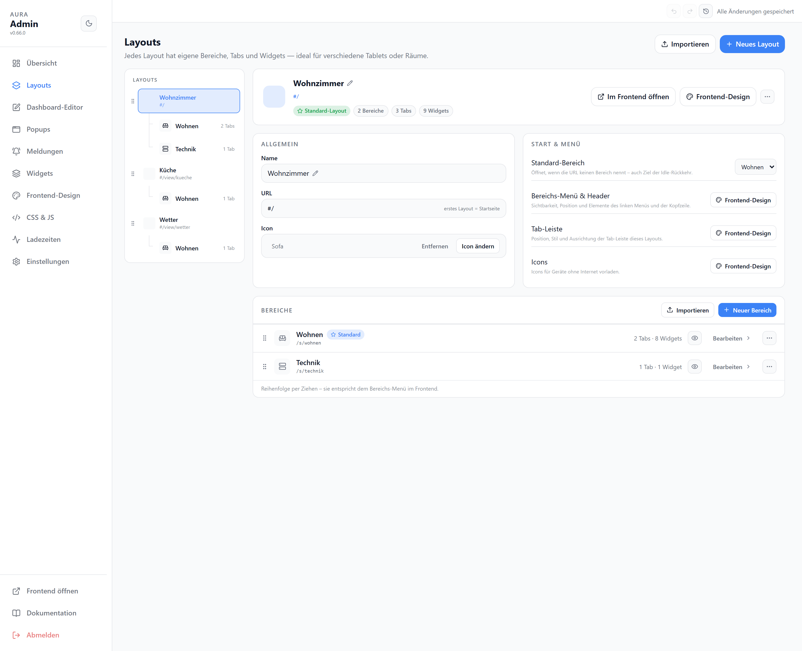

# Erste Schritte

Aura in der richtigen Reihenfolge einrichten – vom Zielgerät bis zum ersten Widget. Jeder Schritt nennt die Admin-Seite, die Empfehlung und die Seite mit allen Details.

| Schritt | Wo | Ergebnis |
| --- | --- | --- |
| [Aufrufen und Admin-PIN](#aufrufen-und-admin-pin) | `/#/admin` | Adminbereich erreichbar |
| [Bildschirm vermessen](#bildschirm-vermessen) | Frontend auf dem Gerät | Auflösung des Zielgeräts notiert |
| [Grundeinstellungen](#grundeinstellungen) | Einstellungen, Frontend-Design | Sprache, Theme, Schrift, Zahlenformat |
| [Hilfslinien](#hilfslinien) | Frontend-Design → Hilfslinien & Auflösung | Editor zeigt den sichtbaren Bereich des Geräts |
| [Grid und Breakpoints](#grid-und-breakpoints) | Frontend-Design → Grid & Mobile | Verhalten auf Handy und Tablet festgelegt |
| [Layouts und Bereiche](#layouts-und-bereiche) | Layouts | Ein Layout je Gerät, Bereiche je Raum |
| [Erste Widgets](#erste-widgets) | Dashboard-Editor | Erster Tab gefüllt |
| [Auf Handy und Tablet testen](#auf-handy-und-tablet-testen) | Editor → Mobile-/Tablet-Reihenfolge | Reihenfolge auf schmalen Geräten stimmt |
| [Tablets und Handys zuordnen](#tablets-und-handys-zuordnen) | Einstellungen → Verbundene Geräte | Jedes Gerät öffnet sein Layout |
| [Sichern](#sichern) | Einstellungen → Backup & Restore | Backup liegt vor |

## Aufrufen und Admin-PIN

Installation der Instanz: siehe [README](https://github.com/hdering/ioBroker.aura#installation). Aura hat einen eigenen Webserver, Vorgabe-Port `8095`.

| | |
| --- | --- |
| Dashboard | `http://<iobroker-ip>:8095/` |
| Adminbereich | `http://<iobroker-ip>:8095/#/admin` |
| Erster Aufruf | Legt den Admin-PIN fest (min. 4 Zeichen); die Anmeldung gilt 8 Stunden |
| Ausgangszustand | Ein Layout „Standard“ mit einem Bereich und einem leeren Tab |

::: tip Leeres Dashboard, Widgets mit Ladefehler?
Zuerst in der Instanz-Konfiguration **Backend prüfen** drücken – der Bericht sagt, was fehlt.
:::

## Bildschirm vermessen

Das Frontend auf dem Gerät öffnen, für das das Dashboard gebaut wird. Unten rechts steht die Auflösung (Vorgabe: eingeblendet). Im selben Browser messen, der später läuft – Kiosk- oder Vollbild-Modus hat mehr Platz als ein Browser mit Adressleiste.

| | |
| --- | --- |
| Ablesen | Rotes Feld unten rechts: Breite × Höhe; den Hinweis mit **Verstanden** schließen |
| Mehrere Geräte | Je Gerät notieren – Wandtablet und Handy bekommen eigene Hilfslinien oder ein eigenes Layout |
| Später ausblenden | Frontend-Design → Hilfslinien & Auflösung → Karte **Auflösung** |

## Grundeinstellungen

Alles, was für alle Layouts gilt, zuerst in der Zeile **Global** setzen. Abweichungen kommen später je Layout oder Bereich – siehe [Geltungsbereich](../einstellungen/layouts#geltungsbereich).

| Einstellung | Wo | Empfehlung |
| --- | --- | --- |
| Sprache | Einstellungen → Sprache | Deutsch oder Englisch, gilt für Admin und Frontend |
| Theme | Frontend-Design → Theme & CSS-Vars | Ein Preset wählen (Dark, Hell, Glass, Material 3 …); Feinschliff über CSS-Variablen später |
| Hell/Dunkel | Frontend-Design → Hell/Dunkel-Kopplung | **Theme folgt Browser**, wenn Geräte automatisch umschalten sollen |
| Typografie & Spacing | Frontend-Design → Typografie & Spacing | Schriftgröße und Abstände auf dem Zielgerät beurteilen, nicht am PC |
| Werte & Formatierung | Frontend-Design → Werte & Formatierung | Dezimalstellen und 1000er-Trennzeichen einmal global; pro Widget nur die Ausnahme |
| Automatisch speichern | Einstellungen → Editor | Für den Anfang an; sonst `Strg+S` nicht vergessen |

Details: [Layouts & Theme](../einstellungen/layouts#theme-css-vars), [Einstellungen](../einstellungen/settings).

## Hilfslinien

Rote gestrichelte Linien im Editor zeigen, was auf dem Zielgerät ohne Scrollen sichtbar ist. So entsteht am PC, was auf dem Tablet passt. Frontend-Design → **Hilfslinien & Auflösung**.

| Option | Empfehlung |
| --- | --- |
| Breite / Höhe | Die notierte Auflösung des Zielgeräts; Vorgaben 768 / 1024 / 1280 / 1920 und 600 / 768 / 800 / 1024 / 1080 |
| Aktiv | An, solange gebaut wird |
| Im Frontend anzeigen | Aus, sobald das Gerät fertig ist |
| Ebene | Ein Gerät je Layout → Hilfslinien im Baum links **beim Layout** setzen, nicht global |

Header und Tab-Leiste sind in der waagerechten Linie schon abgezogen. Im Editor blendet der Toolbar-Knopf **Hilfslinien** die Linien ein und aus.

## Grid und Breakpoints

Frontend-Design → **Grid & Mobile** legt fest, wie ein Layout auf schmalen Bildschirmen umbricht.

| Option | Empfehlung |
| --- | --- |
| Rastergröße | Vorgabe 20 px lassen; kleiner = feiner platzieren, aber mehr Handarbeit |
| Mobile-Breakpoint | Vorgabe 600 px; darunter Einspaltenansicht in der Mobile-Reihenfolge |
| Tablet-Breakpoint | **Aus**, wenn das Wandtablet ein eigenes Layout hat (pixelgenau nach Hilfslinien). **An** (z. B. 1280), wenn Handy und Tablet dasselbe Layout nutzen |
| Tablet-Spalten | 2 für Tablets im Hochformat, 3 im Querformat |

| Situation | Empfehlung |
| --- | --- |
| Ein Wandtablet | Eigenes Layout, Hilfslinien = Auflösung, Tablet-Breakpoint aus |
| Wandtablet und Handy | Zwei Layouts – oder ein Layout mit Mobile-Breakpoint und gepflegter Mobile-Reihenfolge |
| Verschiedene Tablet-Größen, ein Layout | Tablet-Breakpoint an, 2–3 Spalten |

Details: [Grid & Mobile](../einstellungen/layouts#grid-mobile).

## Layouts und Bereiche

Seite **Layouts**. Drei Ebenen:

| Ebene | Ist | Beispiel |
| --- | --- | --- |
| Layout | Ein Dashboard mit eigener URL – je Gerät oder Ort | Wohnzimmer, Flur, Handy |
| Bereich | Gruppe von Tabs im Bereichs-Menü – je Thema oder Raum | Licht, Klima, Medien |
| Tab | Eine Seite mit Widgets | Licht |

| Schritt | |
| --- | --- |
| Erstes Layout umbenennen | „Standard“ → z. B. `Wohnzimmer`; das erste Layout ist die Startseite `/#/` |
| Weitere Layouts | **Neues Layout** → Name und URL-Slug (`/#/flur`) – oder das fertige Layout **Duplizieren** und anpassen |
| Bereiche | Im Layout **Neuer Bereich**; Reihenfolge = Bereichs-Menü; einen als **Standard-Bereich** markieren |
| Tabs | Im Bereich **Neuer Tab**; Standard-Tab per Radio-Knopf; Auge = aus der Tab-Leiste ausblenden |

Wenige Tabs je Bereich (2–4); die Tab-Leiste erscheint erst ab zwei sichtbaren Tabs. Erst ein Layout fertig bauen, dann für das nächste Gerät duplizieren.

Details: [Layouts](../einstellungen/layouts#layouts).

## Erste Widgets

**Dashboard-Editor** → Layout wählen → Tab wählen → **Neues Widget**.

| Schritt | |
| --- | --- |
| Datenpunkt wählen | Datenbank-Symbol → Liste oder Baum; der Widget-Typ wird automatisch erkannt |
| Platzieren | Kachel ziehen, Größe an der Ecke; die Hilfslinien zeigen den Rand des Geräts |
| Bearbeiten | Chevron am Widget → **Bearbeiten**: Titel, Einheit, Darstellung |
| Gruppieren | Widget **Gruppe** für Zusammengehöriges (Raum, Gerät) – wird als Ganzes verschoben |
| Speichern | `Strg+S` oder automatisch speichern; Rückgängig `Strg+Z` |
| Schloss | Zu (Vorgabe): Klicks im Editor schalten nichts; zum Testen kurz öffnen |

Erst wenige Widgets setzen, am Gerät ansehen, dann füllen.

Details: [Dashboard-Editor](../einstellungen/editor), [Widgets](../widgets/).

## Auf Handy und Tablet testen

| | |
| --- | --- |
| Mobile-Reihenfolge | Editor → Toolbar: Reihenfolge der Einspaltenansicht unter dem Mobile-Breakpoint |
| Tablet-Reihenfolge | Nur bei aktivem Tablet-Breakpoint; ohne eigene Reihenfolge gilt die mobile |
| Testen | Frontend am Gerät öffnen – oder das Browserfenster am PC schmal ziehen |
| Breite | In der Einspaltenansicht füllt jedes Widget die Breite, die Höhe bleibt |

## Tablets und Handys zuordnen

Jedes Gerät öffnet die URL seines Layouts. Einstellungen → **Verbundene Geräte** listet alle Clients.

| | |
| --- | --- |
| Layout-URL | `http://<ip>:8095/#/wohnzimmer` (Slug aus Layouts → Allgemein); das erste Layout auch unter `/` |
| Feste Client-ID | `http://<ip>:8095/?client=wohnzimmer-tablet` oder Verbundene Geräte → ✎ – damit Skripte das Gerät gezielt steuern (`aura.0.clients.<ID>.navigate.url`) |
| Kiosk | Vollbild-Browser auf die Layout-URL; Frontend-Design → Header → **Admin-Link im Header anzeigen** aus |
| Rückkehr zum Standard-Tab | Frontend-Design → Navigation: nach Inaktivität zurückspringen (Wandtablet) |
| Icons offline | Frontend-Design → Icons → **Icons für Offline-Geräte vorladen** für Geräte ohne Internet |

Details: [Client-ID](../einstellungen/settings#client-id), [Navigation](../einstellungen/layouts#navigation), [Icons](../einstellungen/layouts#icons).

## Sichern

Einstellungen → **Backup & Restore**.

| | |
| --- | --- |
| Download Backup | Nach der Ersteinrichtung und vor großen Umbauten |
| Auto-Backups | Gespeicherte Stände; Anzahl einstellbar, Wiederherstellen aus der Liste |
| Layout exportieren | Layouts → ⋯ → Exportieren: JSON, auch zum Übertragen in eine zweite Installation |

## Weiter

| Thema | |
| --- | --- |
| [Popups](../einstellungen/popups) | Detailansichten per Klick auf ein Widget |
| [Meldungen](../einstellungen/meldungen) | Informationen und Warnungen ins Dashboard einblenden |
| [Bedingungen](../einstellungen/editor#bedingungen-marker-wertquelle) | Widgets je nach Wert ein-/ausblenden oder einfärben |
| [Bindings](../widgets/bindings) | Datenpunkt-Werte in Texten und Templates |
| [CSS & JS](../einstellungen/css-js) | Eigenes Styling und Skripte |
| [KI-Zugriff (MCP)](../einstellungen/mcp) | Das Dashboard von einem KI-Assistenten bauen lassen |
