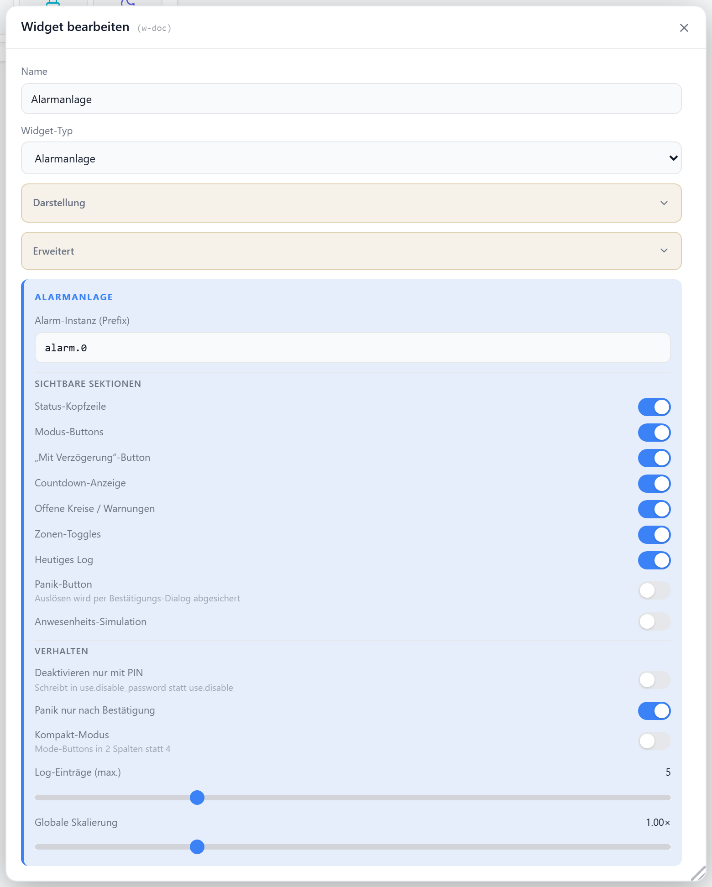

# Alarmanlage

Steuert den [ioBroker.alarm](https://github.com/StrathCole/ioBroker.alarm)-Adapter: Scharf, Innen-Scharf und Nachtruhe schalten, Zonen ein-/ausschalten, bei Alarm per PIN entschärfen sowie das heutige Ereignis-Log anzeigen. Bei Einbruch/Stiller Alarm pulsiert die Statuskarte rot.

## Datenpunkt

Kein klassischer Haupt-Datenpunkt. Stattdessen wird ein **Instanz-Präfix** gesetzt (`alarmPrefix`, Standard `alarm.0`); darunter liest und schreibt das Widget automatisch:

| Datenpunkt | Richtung | |
| --- | --- | --- |
| `status.state_list` · `status.state` | lesen | Code + Text des aktuellen Zustands |
| `status.activated` · `status.sleep` · `status.sharp_inside_activated` | lesen | aktive Modi |
| `status.burglar_alarm` · `status.silent_alarm` · `status.siren` | lesen | Auslöse-Zustände |
| `status.activation_countdown` · `status.silent_countdown` | lesen | Countdown in Sekunden |
| `info.alarm_circuit_list` · `info.notification_circuit_list` | lesen | offene/meldende Kreise |
| `info.log` · `info.log_today` · `info.wrong_password` | lesen | Log + PIN-Fehler |
| `zone.<one\|two\|three>` · `zone.<…>_on_off` | lesen/schreiben | Zonen-Status + Ein/Aus |
| `presence.on_off` | lesen/schreiben | Anwesenheit |
| `use.list` · `use.disable` · `use.enable_with_delay` | schreiben | scharf / aus / mit Verzögerung |
| `use.activate_sharp_inside` · `use.activate_nightrest` | schreiben | Innen / Nachtruhe |
| `use.panic` · `use.quit_changes` · `use.disable_password` | schreiben | Panik / Quittieren / PIN |

## Einstellungen

Alle Optionen werden im Editor unter **Widget bearbeiten** gesetzt.

### Allgemein

| Option | Standard | |
| --- | --- | --- |
| `alarmPrefix` | `alarm.0` | Instanz-Präfix des alarm-Adapters |
| `showTitle` | `true` | Titel anzeigen |
| `showIcon` | `true` | Icon anzeigen |
| `icon` | `ShieldAlert` | [Lucide-Icon](https://lucide.dev) |
| `iconSize` | `20` | px |
| `titleAlign` | `left` | `left` · `center` · `right` |

### Abschnitte

Blendet die einzelnen Blöcke der Karte ein oder aus.

| Option | Standard | |
| --- | --- | --- |
| `showHeader` | `true` | Status-Zeile (Zustands-Pille) |
| `showModes` | `true` | Modus-Buttons (Aus/Scharf/Innen/Nacht) |
| `showDelay` | `true` | Button „mit Verzögerung scharf" |
| `showCountdown` | `true` | Aktivierungs-/Stiller-Countdown |
| `showCircuits` | `true` | offene/meldende Kreise |
| `showZones` | `true` | Zonen-Kacheln (3) |
| `showLog` | `true` | heutiges Ereignis-Log |
| `showPanic` | `false` | Panik-Button |
| `showPresence` | `false` | Anwesenheits-Umschalter |

### Verhalten

| Option | Standard | |
| --- | --- | --- |
| `requirePinForDisarm` | `false` | Entschärfen erst nach PIN-Eingabe |
| `panicConfirm` | `true` | Panik vorher bestätigen |
| `compactMode` | `false` | Modus-Buttons 2-spaltig statt 4-spaltig |
| `logLines` | `5` | Anzahl Log-Zeilen (`0`–`20`) |
| `sizeScale` | `1` | Skalierung der Karte (`0.5`–`2.5`) |
