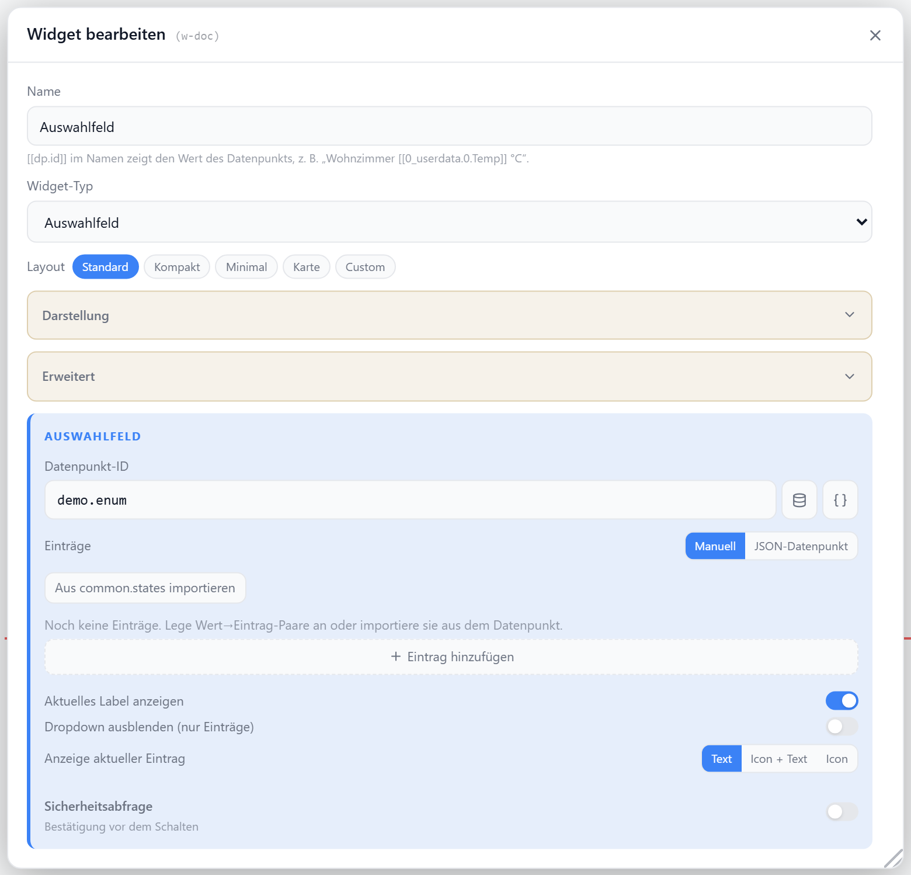

# Auswahlfeld

Bildet DP-Werte (z. B. `0`, `1`, `2`) auf lesbare Text-Labels ab und zeigt sie als Dropdown. Die Auswahl schreibt den hinterlegten Wert zurück auf den Datenpunkt. Labels lassen sich von Hand pflegen oder per Klick aus `common.states` importieren.

Dieselbe Auswahlliste gibt es als Zeilen-Darstellung in der [statischen](./liste#darstellung-auswahlfeld) und der [dynamischen Liste](./dynamische-liste).

## Datenpunkt

| Feld | Pflicht | Typ | |
| --- | --- | --- | --- |
| `datapoint` | ja | `string` · `number` · `boolean` | aktueller Wert wird auf ein Label gemappt; die Auswahl schreibt den Wert zurück |

Beim Schreiben wird der Wert typ-erkannt: `true`/`false` → Boolean, reine Zahlen → `number`, sonst Text.

## Layouts

### Default
Titel/Icon oben, aktuelles Label mit Dropdown darunter — für mittlere Zellen.

### Card
Farbiger Akzentbalken links, Titel oben, Label groß mit Dropdown — für prominente Auswahlfelder.

### Compact
Eine Zeile mit Icon, Titel, Label und Dropdown — für Listen mit vielen Auswahlfeldern.

### Minimal
Label groß zentriert, Dropdown darunter — für sehr kleine Zellen.

### Custom
Icon, Label und Dropdown frei in einer Zellenmatrix platzieren — siehe [Custom-Layout](./custom-layout).

## Einstellungen

Alle Optionen werden im Editor unter **Widget bearbeiten** gesetzt.



### Anzeige

| Option | Standard | |
| --- | --- | --- |
| `showTitle` | `true` | Titel anzeigen |
| `showIcon` | `true` | Icon anzeigen |
| `showValue` | `true` | aktuelles Label anzeigen |
| `showSelect` | `true` | Dropdown anzeigen |
| `icon` | `ListChecks` | [Lucide-Icon](https://lucide.dev) |
| `iconSize` | `20` | px |
| `titleAlign` | `left` | `left` · `center` · `right` |

### Einträge

Umschalter **Manuell** / **JSON-Datenpunkt**.

| Option | Standard | |
| --- | --- | --- |
| `entriesSource` | `manual` | `manual` = Liste unten · `json` = aus Datenpunkt |

#### Manuell

Liste der Wert→Label-Paare. Per Knopf **Aus common.states importieren** automatisch aus dem Datenpunkt befüllbar.

| Option | Standard | |
| --- | --- | --- |
| `entries` | `[]` | Liste aus `{ value, label, color? }` |
| `entries[].value` | — | DP-Wert als Text (numerisch wird beim Schreiben geparst) |
| `entries[].label` | — | angezeigter Text |
| `entries[].color` | — | optionale Farbe für Label und Icon |
| `entries[].icon` | — | [Lucide-Icon](https://lucide.dev) |

#### JSON-Datenpunkt

Die Liste kommt live aus einem Datenpunkt, der JSON hält — ändert sich der DP, ändert sich das Dropdown. Das Panel zeigt unter dem Feld, wie viele Einträge erkannt wurden.

| Option | Standard | |
| --- | --- | --- |
| `entriesDp` | — | DP mit dem JSON, optional mit JSON-Pfad (`…liste?data.modes`) |
| `entriesValueKey` | auto | Feldname für den Wert — auto: `value` · `val` · `id` · `key` · `code` · `state` |
| `entriesLabelKey` | auto | Feldname für den Text — auto: `label` · `name` · `text` · `title` · `caption` · `description` |
| `entriesColorKey` | auto | Feldname für die Farbe — auto: `color` · `colour` |
| `entriesIconKey` | auto | Feldname für das Icon — auto: `icon` |
| `entriesImageKey` | auto | Feldname für die Bild-URL — auto: `image` · `img` |

Feldnamen dürfen Pfade sein (`attributes.name`). Doppelte Werte werden verworfen, der erste Eintrag gewinnt. Geschrieben wird weiter auf `datapoint` — der JSON-DP ist nur die Quelle der Liste.

##### So muss das JSON aussehen

Objekt-Liste — der Normalfall:

```json
[
  { "value": 0, "label": "Aus", "color": "#ef4444" },
  { "value": 1, "label": "Heizen", "color": "#f59e0b", "icon": "Flame" },
  { "value": 2, "label": "Kühlen", "color": "#3b82f6", "icon": "Snowflake" }
]
```

Weitere akzeptierte Formen:

| JSON | Ergebnis |
| --- | --- |
| `{ "0": "Aus", "1": "An" }` | Schlüssel = Wert, Text = Label (wie `common.states`) |
| `{ "0": { "label": "Aus", "color": "#ef4444" } }` | Schlüssel = Wert, Objekt liefert Label/Farbe/Icon |
| `["Aus", "An"]` | Wert = Label |
| `[{ "id": 1, "name": "Küche" }]` | Feldnamen werden erkannt |
| `[[0, "Aus"], [1, "An"]]` | Paare aus Wert und Label |
| `{ "result": [ … ] }` | Wrapper mit genau einer Liste wird ausgepackt |

Andere Feldnamen werden über **Feldnamen** gesetzt, ein tiefer liegendes Array über den JSON-Pfad am Datenpunkt.
