# Beispiele: Diagramm (erweitert)

<!-- Generiert von tools/screenshots/chart-gallery.mjs aus chart-gallery/examples.mjs — nicht von Hand bearbeiten. -->

Fertige Konfigurationen für [Diagramm (erweitert)](./diagramm-erweitert), entstanden aus Fragen und Wünschen im Issue-Tracker. Jedes Beispiel zeigt das Ergebnis, die entscheidenden Optionen und den kompletten Widget-Export.

**Übernehmen:**

1. JSON aufklappen und kopieren (oder die Datei herunterladen).
2. Editor → **Importieren** → JSON einfügen → Tab wählen → **Hinzufügen**.
3. Die `demo.0.*`-Datenpunkte durch die eigenen ersetzen — der Import-Dialog fragt nur den Haupt-Datenpunkt ab, die weiteren stehen im Widget unter „Bearbeiten“.

## Zähler und Verbrauch

- [Zählerstand als Verbrauch pro Tag](#zaehler-tagesverbrauch)
- [Tageszähler als Monatssummen](#tageszaehler-monatswerte)
- [Jahreswerte über die ganze Historie](#gesamt-jahreswerte)
- [Eigene Zeiträume in Monaten](#eigene-zeitraeume)
- [Monatsverbrauch neben dem Vorjahr](#vorjahresvergleich)
- [Bezug nach oben, Einspeisung nach unten](#einspeisung-negativ)

### Zählerstand als Verbrauch pro Tag {#zaehler-tagesverbrauch}

Aus [#521](https://github.com/hdering/ioBroker.aura/issues/521) · [#545](https://github.com/hdering/ioBroker.aura/issues/545). Ein fortlaufender Zähler (Strom, Gas, Wasser, PV-Gesamtertrag) wird als Balken je Tag gezeichnet statt als steigende Linie.

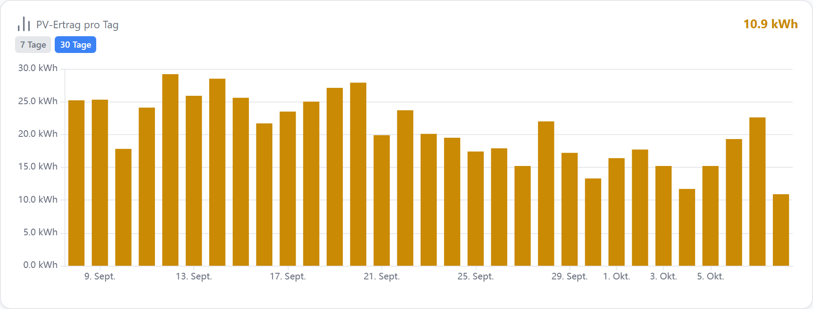

| Option | Wert | |
| --- | --- | --- |
| `echartSeries[].aggregate` | `delta` | Differenz je Zeiteinheit statt Zählerstand |
| `echartSeries[].deltaBucket` | `day` | ein Balken pro Tag |
| `echartRange` | `30d` |  |

::: details Widget-Export (JSON)
```json
{
  "id": "w-chart",
  "type": "echart",
  "title": "PV-Ertrag pro Tag",
  "datapoint": "demo.0.PV.Ertrag_Gesamt",
  "layout": "default",
  "gridPos": {
    "x": 0,
    "y": 0,
    "w": 30,
    "h": 12
  },
  "options": {
    "echartMode": "timeseries",
    "autoHistoryInstance": true,
    "echartShowLegend": false,
    "echartShowCurrent": true,
    "echartRange": "30d",
    "echartVisibleRanges": [
      "7d",
      "30d"
    ],
    "echartLeftUnit": "kWh",
    "decimals": 1,
    "echartSeries": [
      {
        "id": "s1",
        "name": "PV-Ertrag",
        "datapointId": "demo.0.PV.Ertrag_Gesamt",
        "chartType": "bar",
        "color": "var(--accent-yellow)",
        "yAxisIndex": 0,
        "aggregate": "delta",
        "deltaBucket": "day",
        "decimals": 1
      }
    ]
  }
}
```
:::

[JSON herunterladen](./assets/beispiele/zaehler-tagesverbrauch.json)

### Tageszähler als Monatssummen {#tageszaehler-monatswerte}

Aus [#545](https://github.com/hdering/ioBroker.aura/issues/545) · [#562](https://github.com/hdering/ioBroker.aura/issues/562) · [#536](https://github.com/hdering/ioBroker.aura/issues/536). Ein Zähler, der jede Nacht auf 0 springt (z. B. `lastDayData` eines Wechselrichters), ergibt trotzdem richtige Monatssummen. `auto` wählt die Zeiteinheit passend zum Zeitraum — 30 Tage zeigen Tagesbalken, 1 Jahr Monatsbalken.

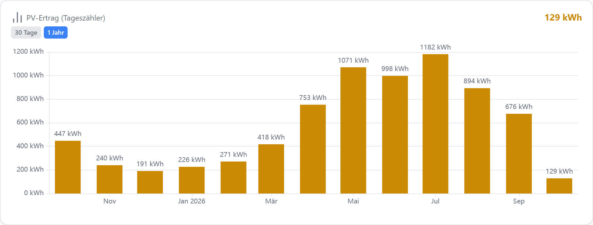

| Option | Wert | |
| --- | --- | --- |
| `echartSeries[].aggregate` | `delta` | der Sprung auf 0 um Mitternacht zählt als Reset, nicht als Minus |
| `echartSeries[].deltaBucket` | `auto` | bis 45 Tage pro Tag, bis 180 Tage pro Woche, bis 1 Jahr pro Monat, darüber pro Jahr |
| `echartVisibleRanges` | `["30d","1y"]` | Umschalter im Frontend |

::: details Widget-Export (JSON)
```json
{
  "id": "w-chart",
  "type": "echart",
  "title": "PV-Ertrag (Tageszähler)",
  "datapoint": "demo.0.PV.Ertrag_Heute",
  "layout": "default",
  "gridPos": {
    "x": 0,
    "y": 0,
    "w": 30,
    "h": 12
  },
  "options": {
    "echartMode": "timeseries",
    "autoHistoryInstance": true,
    "echartShowLegend": false,
    "echartShowCurrent": true,
    "echartRange": "1y",
    "echartVisibleRanges": [
      "30d",
      "1y"
    ],
    "echartLeftUnit": "kWh",
    "echartShowValues": true,
    "decimals": 0,
    "echartSeries": [
      {
        "id": "s2",
        "name": "PV-Ertrag",
        "datapointId": "demo.0.PV.Ertrag_Heute",
        "chartType": "bar",
        "color": "var(--accent-yellow)",
        "yAxisIndex": 0,
        "aggregate": "delta",
        "deltaBucket": "auto",
        "decimals": 0
      }
    ]
  }
}
```
:::

[JSON herunterladen](./assets/beispiele/tageszaehler-monatswerte.json)

### Jahreswerte über die ganze Historie {#gesamt-jahreswerte}

Aus [#570](https://github.com/hdering/ioBroker.aura/issues/570) · [#280](https://github.com/hdering/ioBroker.aura/issues/280). Zeitraum „Gesamt“ liest alles, was der History-Adapter hat; mit `auto` wird daraus ein Balken pro Kalenderjahr.

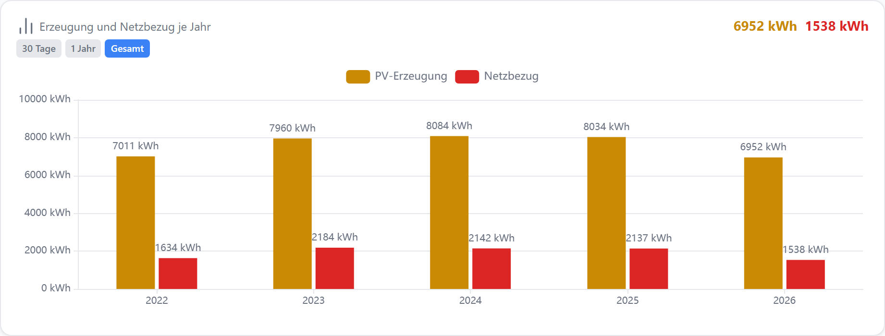

| Option | Wert | |
| --- | --- | --- |
| `echartRange` | `total` | Fensterstart wird beim Adapter ermittelt |
| `echartSeries[].deltaBucket` | `auto` | ab 400 Tagen Historie pro Jahr |
| `echartShowValues` | `true` | Wert über jedem Balken |

::: details Widget-Export (JSON)
```json
{
  "id": "w-chart",
  "type": "echart",
  "title": "Erzeugung und Netzbezug je Jahr",
  "datapoint": "demo.0.PV.Ertrag_Gesamt",
  "layout": "default",
  "gridPos": {
    "x": 0,
    "y": 0,
    "w": 30,
    "h": 12
  },
  "options": {
    "echartMode": "timeseries",
    "autoHistoryInstance": true,
    "echartShowLegend": true,
    "echartShowCurrent": true,
    "echartRange": "total",
    "echartVisibleRanges": [
      "30d",
      "1y",
      "total"
    ],
    "echartLeftUnit": "kWh",
    "echartShowValues": true,
    "decimals": 0,
    "echartSeries": [
      {
        "id": "s3",
        "name": "PV-Erzeugung",
        "datapointId": "demo.0.PV.Ertrag_Gesamt",
        "chartType": "bar",
        "color": "var(--accent-yellow)",
        "yAxisIndex": 0,
        "aggregate": "delta",
        "deltaBucket": "auto"
      },
      {
        "id": "s4",
        "name": "Netzbezug",
        "datapointId": "demo.0.Netz.Bezug_Gesamt",
        "chartType": "bar",
        "color": "var(--accent-red)",
        "yAxisIndex": 0,
        "aggregate": "delta",
        "deltaBucket": "auto"
      }
    ]
  }
}
```
:::

[JSON herunterladen](./assets/beispiele/gesamt-jahreswerte.json)

### Eigene Zeiträume in Monaten {#eigene-zeitraeume}

Aus [#709](https://github.com/hdering/ioBroker.aura/issues/709) · [#280](https://github.com/hdering/ioBroker.aura/issues/280). Statt der eingebauten Knöpfe eigene Zeiträume nach Kalender — hier Monate und Jahre für den Gaszähler, mit eigener Beschriftung „Quartal“.

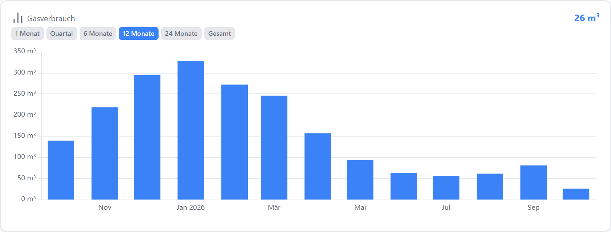

| Option | Wert | |
| --- | --- | --- |
| `rangeChips` | `["1M","3M=Quartal","6M","12M","24M","total"]` | Zahl + Einheit (h, d, w, M, y) oder total; Text nach `=` ist die Beschriftung |
| `echartRange` | `custom` + `echartRangeCustomValue: 12`, `echartRangeCustomUnit: M` | Startzeitraum |
| `echartSeries[].deltaBucket` | `auto` | wechselt mit dem gewählten Chip |

::: details Widget-Export (JSON)
```json
{
  "id": "w-chart",
  "type": "echart",
  "title": "Gasverbrauch",
  "datapoint": "demo.0.Gas.Zaehlerstand",
  "layout": "default",
  "gridPos": {
    "x": 0,
    "y": 0,
    "w": 30,
    "h": 12
  },
  "options": {
    "echartMode": "timeseries",
    "autoHistoryInstance": true,
    "echartShowLegend": false,
    "echartShowCurrent": true,
    "echartRange": "custom",
    "echartRangeCustomValue": 12,
    "echartRangeCustomUnit": "M",
    "rangeChips": [
      "1M",
      "3M=Quartal",
      "6M",
      "12M",
      "24M",
      "total"
    ],
    "echartLeftUnit": "m³",
    "decimals": 0,
    "echartSeries": [
      {
        "id": "s5",
        "name": "Gas",
        "datapointId": "demo.0.Gas.Zaehlerstand",
        "chartType": "bar",
        "color": "var(--accent)",
        "yAxisIndex": 0,
        "aggregate": "delta",
        "deltaBucket": "auto",
        "decimals": 0
      }
    ]
  }
}
```
:::

[JSON herunterladen](./assets/beispiele/eigene-zeitraeume.json)

### Monatsverbrauch neben dem Vorjahr {#vorjahresvergleich}

Aus [#730](https://github.com/hdering/ioBroker.aura/issues/730). Zweite Serie auf denselben Datenpunkt, ein Jahr zurückversetzt — die Balken stehen je Monat nebeneinander.

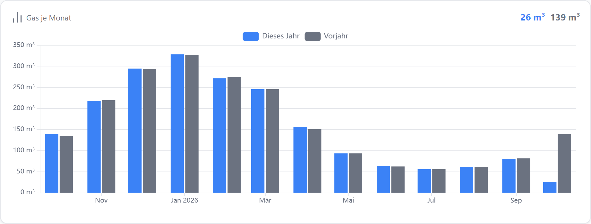

| Option | Wert | |
| --- | --- | --- |
| `echartSeries[1].timeShift` | `1` | im Editor: „+ Vorjahres-Serie anlegen“ |
| `echartSeries[1].timeShiftUnit` | `year` | `day` = gestern, `week` = Vorwoche, `month` = Vormonat |
| `echartSeries[].deltaBucket` | `month` | bei beiden Serien gleich, sonst stehen die Balken nicht nebeneinander |

::: details Widget-Export (JSON)
```json
{
  "id": "w-chart",
  "type": "echart",
  "title": "Gas je Monat",
  "datapoint": "demo.0.Gas.Zaehlerstand",
  "layout": "default",
  "gridPos": {
    "x": 0,
    "y": 0,
    "w": 30,
    "h": 12
  },
  "options": {
    "echartMode": "timeseries",
    "autoHistoryInstance": true,
    "echartShowLegend": true,
    "echartShowCurrent": true,
    "echartRange": "1y",
    "lockRange": true,
    "echartLeftUnit": "m³",
    "decimals": 0,
    "echartSeries": [
      {
        "id": "s6",
        "name": "Dieses Jahr",
        "datapointId": "demo.0.Gas.Zaehlerstand",
        "chartType": "bar",
        "color": "var(--accent)",
        "yAxisIndex": 0,
        "aggregate": "delta",
        "deltaBucket": "month"
      },
      {
        "id": "s7",
        "name": "Vorjahr",
        "datapointId": "demo.0.Gas.Zaehlerstand",
        "chartType": "bar",
        "color": "var(--text-secondary)",
        "yAxisIndex": 0,
        "aggregate": "delta",
        "deltaBucket": "month",
        "timeShift": 1,
        "timeShiftUnit": "year"
      }
    ]
  }
}
```
:::

[JSON herunterladen](./assets/beispiele/vorjahresvergleich.json)

### Bezug nach oben, Einspeisung nach unten {#einspeisung-negativ}

Aus [#594](https://github.com/hdering/ioBroker.aura/issues/594). Werte, die als positive Zahl geliefert werden (Einspeisung, Batterie laden), unter der Nulllinie zeichnen — gestapelt mit Bezug und Entladung.

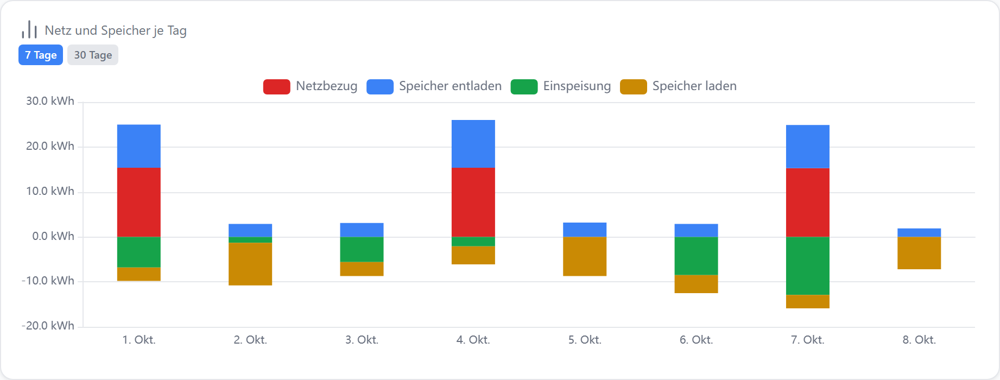

| Option | Wert | |
| --- | --- | --- |
| `echartSeries[].valueFactor` | `-1` | ƒx neben dem Datenpunkt → „Negativ darstellen (× −1)“ |
| `echartSeries[].stack` | `true` | positive Serien stapeln nach oben, negative nach unten |
| `echartSeries[].aggregate` | `delta` | das Vorzeichen kommt nach der Differenz auf die Balken |

::: details Widget-Export (JSON)
```json
{
  "id": "w-chart",
  "type": "echart",
  "title": "Netz und Speicher je Tag",
  "datapoint": "demo.0.Netz.Bezug_Gesamt",
  "layout": "default",
  "gridPos": {
    "x": 0,
    "y": 0,
    "w": 30,
    "h": 12
  },
  "options": {
    "echartMode": "timeseries",
    "autoHistoryInstance": true,
    "echartShowLegend": true,
    "echartShowCurrent": false,
    "echartRange": "7d",
    "echartVisibleRanges": [
      "7d",
      "30d"
    ],
    "echartLeftUnit": "kWh",
    "decimals": 1,
    "echartSeries": [
      {
        "id": "s8",
        "name": "Netzbezug",
        "datapointId": "demo.0.Netz.Bezug_Gesamt",
        "chartType": "bar",
        "color": "var(--accent-red)",
        "yAxisIndex": 0,
        "aggregate": "delta",
        "deltaBucket": "day",
        "stack": true
      },
      {
        "id": "s9",
        "name": "Speicher entladen",
        "datapointId": "demo.0.Speicher.Entladen_Gesamt",
        "chartType": "bar",
        "color": "var(--accent)",
        "yAxisIndex": 0,
        "aggregate": "delta",
        "deltaBucket": "day",
        "stack": true
      },
      {
        "id": "s10",
        "name": "Einspeisung",
        "datapointId": "demo.0.Netz.Einspeisung_Gesamt",
        "chartType": "bar",
        "color": "var(--accent-green)",
        "yAxisIndex": 0,
        "aggregate": "delta",
        "deltaBucket": "day",
        "stack": true,
        "valueFactor": -1
      },
      {
        "id": "s11",
        "name": "Speicher laden",
        "datapointId": "demo.0.Speicher.Laden_Gesamt",
        "chartType": "bar",
        "color": "var(--accent-yellow)",
        "yAxisIndex": 0,
        "aggregate": "delta",
        "deltaBucket": "day",
        "stack": true,
        "valueFactor": -1
      }
    ]
  }
}
```
:::

[JSON herunterladen](./assets/beispiele/einspeisung-negativ.json)

## Darstellung

- [Watt in Kilowatt anzeigen](#einheit-umrechnen)
- [Flächen stapeln: woher der Strom kommt](#flaechen-stapeln)
- [Anteile im Stapel in Prozent](#stapel-prozent)
- [Tagesverbrauch mit Temperaturkurve](#balken-und-temperatur)
- [Y-Achse auf den Datenbereich zoomen](#achse-datenbereich)
- [Brenner An/Aus neben Vorlauf und Rücklauf](#schaltzustand-mit-temperatur)
- [Kompakt: Treppenlinie ohne Achsen](#kompakt-ohne-achsen)
- [Aktuelle Werte nebeneinander](#vergleich-aktuelle-werte)

### Watt in Kilowatt anzeigen {#einheit-umrechnen}

Aus [#540](https://github.com/hdering/ioBroker.aura/issues/540). Reine Anzeige-Umrechnung je Serie — der Datenpunkt und seine History bleiben in W. Gilt für Kurve, Tooltip und aktuellen Wert.

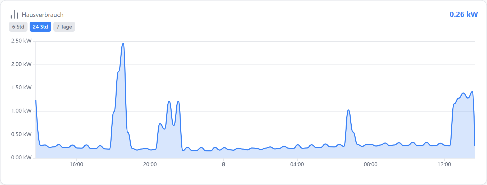

| Option | Wert | |
| --- | --- | --- |
| `echartSeries[].valueTransform` | `w-kw` | Preset im ƒx-Dialog; setzt die Achsen-Einheit gleich mit |
| `echartSeries[].valueFactor` | `0.001` | Wert × Faktor + Offset |
| `echartLeftUnit` | `kW` |  |

::: details Widget-Export (JSON)
```json
{
  "id": "w-chart",
  "type": "echart",
  "title": "Hausverbrauch",
  "datapoint": "demo.0.Haus.Leistung",
  "layout": "default",
  "gridPos": {
    "x": 0,
    "y": 0,
    "w": 30,
    "h": 12
  },
  "options": {
    "echartMode": "timeseries",
    "autoHistoryInstance": true,
    "echartShowLegend": false,
    "echartShowCurrent": true,
    "echartRange": "24h",
    "echartVisibleRanges": [
      "6h",
      "24h",
      "7d"
    ],
    "echartLeftUnit": "kW",
    "decimals": 2,
    "echartSeries": [
      {
        "id": "s12",
        "name": "Leistung",
        "datapointId": "demo.0.Haus.Leistung",
        "chartType": "area",
        "color": "var(--accent)",
        "yAxisIndex": 0,
        "valueTransform": "w-kw",
        "valueFactor": 0.001,
        "decimals": 2
      }
    ]
  }
}
```
:::

[JSON herunterladen](./assets/beispiele/einheit-umrechnen.json)

### Flächen stapeln: woher der Strom kommt {#flaechen-stapeln}

Aus [#541](https://github.com/hdering/ioBroker.aura/issues/541) · [#557](https://github.com/hdering/ioBroker.aura/issues/557). Zwei Leistungen als Bänder übereinander — zusammen ergeben sie den Hausverbrauch. Der Tooltip zeigt zusätzlich die Summe.

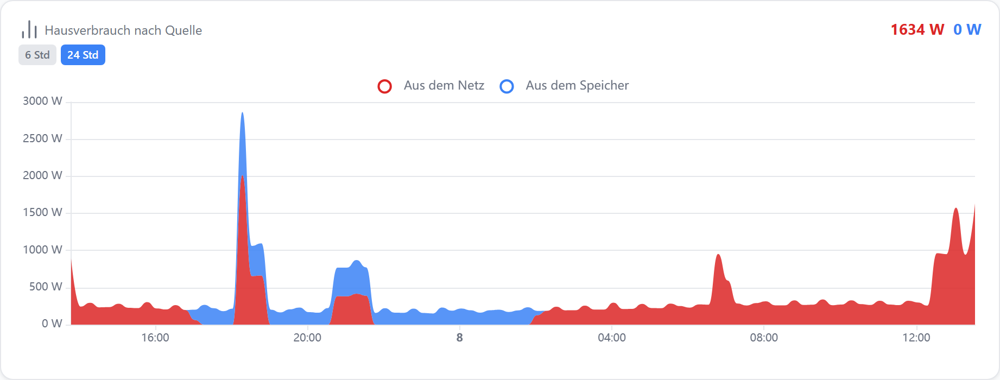

| Option | Wert | |
| --- | --- | --- |
| `echartSeries[].stack` | `true` | stapelt auf die anderen gestapelten Serien derselben Y-Achse |
| `echartSeries[].chartType` | `area` | gestapelte Flächen sind deckend gefüllt |
| `echartSeries[].areaOpacity` | `85` | optional weicher; `stackOutline` zeichnet die Bandkontur |

::: details Widget-Export (JSON)
```json
{
  "id": "w-chart",
  "type": "echart",
  "title": "Hausverbrauch nach Quelle",
  "datapoint": "demo.0.Haus.Leistung_aus_Netz",
  "layout": "default",
  "gridPos": {
    "x": 0,
    "y": 0,
    "w": 30,
    "h": 12
  },
  "options": {
    "echartMode": "timeseries",
    "autoHistoryInstance": true,
    "echartShowLegend": true,
    "echartShowCurrent": true,
    "echartRange": "24h",
    "echartVisibleRanges": [
      "6h",
      "24h"
    ],
    "echartLeftUnit": "W",
    "decimals": 0,
    "echartSeries": [
      {
        "id": "s13",
        "name": "Aus dem Netz",
        "datapointId": "demo.0.Haus.Leistung_aus_Netz",
        "chartType": "area",
        "color": "var(--accent-red)",
        "yAxisIndex": 0,
        "stack": true,
        "areaOpacity": 85
      },
      {
        "id": "s14",
        "name": "Aus dem Speicher",
        "datapointId": "demo.0.Haus.Leistung_aus_Speicher",
        "chartType": "area",
        "color": "var(--accent)",
        "yAxisIndex": 0,
        "stack": true,
        "areaOpacity": 85
      }
    ]
  }
}
```
:::

[JSON herunterladen](./assets/beispiele/flaechen-stapeln.json)

### Anteile im Stapel in Prozent {#stapel-prozent}

Aus [#569](https://github.com/hdering/ioBroker.aura/issues/569). Woher der Tagesverbrauch kam — Wert und Anteil an der Tagessumme an jedem Balkenstück.

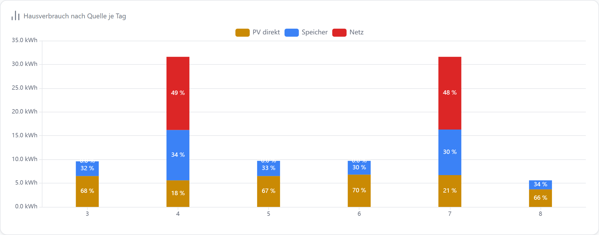

| Option | Wert | |
| --- | --- | --- |
| `echartShowStackPercent` | `true` | erscheint im Editor, sobald eine Serie stapelt |
| `echartShowValues` | aus | an: Wert und Anteil in Klammern — braucht breite Balken |
| `echartSeries[].stack` | `true` |  |

::: details Widget-Export (JSON)
```json
{
  "id": "w-chart",
  "type": "echart",
  "title": "Hausverbrauch nach Quelle je Tag",
  "datapoint": "demo.0.Haus.PV_Direkt_Gesamt",
  "layout": "default",
  "gridPos": {
    "x": 0,
    "y": 0,
    "w": 34,
    "h": 14
  },
  "options": {
    "echartMode": "timeseries",
    "autoHistoryInstance": true,
    "echartShowLegend": true,
    "echartShowCurrent": false,
    "echartRange": "custom",
    "echartRangeCustomValue": 5,
    "echartRangeCustomUnit": "d",
    "lockRange": true,
    "echartShowStackPercent": true,
    "echartLeftUnit": "kWh",
    "decimals": 1,
    "echartSeries": [
      {
        "id": "s15",
        "name": "PV direkt",
        "datapointId": "demo.0.Haus.PV_Direkt_Gesamt",
        "chartType": "bar",
        "color": "var(--accent-yellow)",
        "yAxisIndex": 0,
        "aggregate": "delta",
        "deltaBucket": "day",
        "stack": true
      },
      {
        "id": "s16",
        "name": "Speicher",
        "datapointId": "demo.0.Speicher.Entladen_Gesamt",
        "chartType": "bar",
        "color": "var(--accent)",
        "yAxisIndex": 0,
        "aggregate": "delta",
        "deltaBucket": "day",
        "stack": true
      },
      {
        "id": "s17",
        "name": "Netz",
        "datapointId": "demo.0.Netz.Bezug_Gesamt",
        "chartType": "bar",
        "color": "var(--accent-red)",
        "yAxisIndex": 0,
        "aggregate": "delta",
        "deltaBucket": "day",
        "stack": true
      }
    ]
  }
}
```
:::

[JSON herunterladen](./assets/beispiele/stapel-prozent.json)

### Tagesverbrauch mit Temperaturkurve {#balken-und-temperatur}

Aus [#598](https://github.com/hdering/ioBroker.aura/issues/598) · [#584](https://github.com/hdering/ioBroker.aura/issues/584) · [#600](https://github.com/hdering/ioBroker.aura/issues/600). Balken links, Kurve rechts mit eigener Achse. Werte stehen nur an den Balken, jede Serie hat ihre eigenen Nachkommastellen.

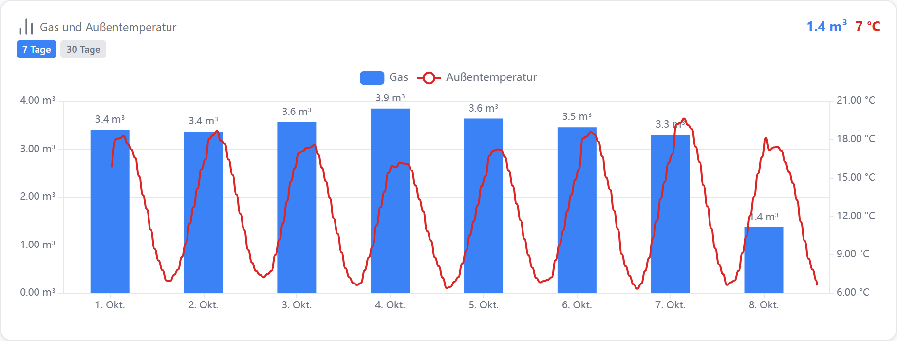

| Option | Wert | |
| --- | --- | --- |
| `echartSeries[1].yAxisIndex` | `1` | rechte Y-Achse mit eigener Einheit |
| `echartSeries[].showValues` | `true` / `false` | Werte je Serie statt fürs ganze Diagramm |
| `echartSeries[].decimals` | `1` / `0` | Nachkommastellen je Serie |

::: details Widget-Export (JSON)
```json
{
  "id": "w-chart",
  "type": "echart",
  "title": "Gas und Außentemperatur",
  "datapoint": "demo.0.Gas.Zaehlerstand",
  "layout": "default",
  "gridPos": {
    "x": 0,
    "y": 0,
    "w": 30,
    "h": 12
  },
  "options": {
    "echartMode": "timeseries",
    "autoHistoryInstance": true,
    "echartShowLegend": true,
    "echartShowCurrent": true,
    "echartRange": "7d",
    "echartVisibleRanges": [
      "7d",
      "30d"
    ],
    "echartLeftUnit": "m³",
    "echartRightUnit": "°C",
    "echartSeries": [
      {
        "id": "s18",
        "name": "Gas",
        "datapointId": "demo.0.Gas.Zaehlerstand",
        "chartType": "bar",
        "color": "var(--accent)",
        "yAxisIndex": 0,
        "aggregate": "delta",
        "deltaBucket": "day",
        "showValues": true,
        "decimals": 1
      },
      {
        "id": "s19",
        "name": "Außentemperatur",
        "datapointId": "demo.0.Wetter.Aussentemperatur",
        "chartType": "line",
        "color": "var(--accent-red)",
        "yAxisIndex": 1,
        "showValues": false,
        "decimals": 0,
        "smooth": true
      }
    ]
  }
}
```
:::

[JSON herunterladen](./assets/beispiele/balken-und-temperatur.json)

### Y-Achse auf den Datenbereich zoomen {#achse-datenbereich}

Aus [#83](https://github.com/hdering/ioBroker.aura/issues/83). Die Achse beginnt und endet bei den tatsächlich vorkommenden Werten statt bei runden Grenzen — kleine Schwankungen werden sichtbar.

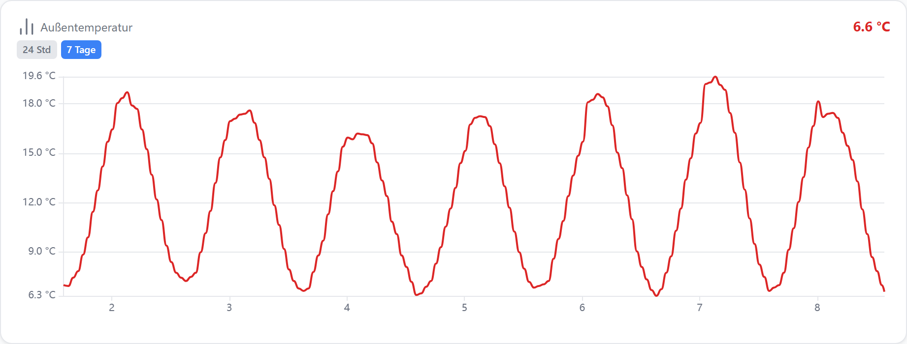

| Option | Wert | |
| --- | --- | --- |
| `echartLeftMin` | `dataMin` | Zahl, `dataMin` oder leer (automatisch) |
| `echartLeftMax` | `dataMax` |  |
| `echartLeftMinDp / echartLeftMaxDp` | Datenpunkt | Grenze aus einem Datenpunkt, gewinnt über die feste Eingabe |

::: details Widget-Export (JSON)
```json
{
  "id": "w-chart",
  "type": "echart",
  "title": "Außentemperatur",
  "datapoint": "demo.0.Wetter.Aussentemperatur",
  "layout": "default",
  "gridPos": {
    "x": 0,
    "y": 0,
    "w": 30,
    "h": 12
  },
  "options": {
    "echartMode": "timeseries",
    "autoHistoryInstance": true,
    "echartShowLegend": false,
    "echartShowCurrent": true,
    "echartRange": "7d",
    "echartVisibleRanges": [
      "24h",
      "7d"
    ],
    "echartLeftUnit": "°C",
    "echartLeftMin": "dataMin",
    "echartLeftMax": "dataMax",
    "decimals": 1,
    "echartSeries": [
      {
        "id": "s20",
        "name": "Außen",
        "datapointId": "demo.0.Wetter.Aussentemperatur",
        "chartType": "line",
        "color": "var(--accent-red)",
        "yAxisIndex": 0,
        "smooth": true,
        "decimals": 1
      }
    ]
  }
}
```
:::

[JSON herunterladen](./assets/beispiele/achse-datenbereich.json)

### Brenner An/Aus neben Vorlauf und Rücklauf {#schaltzustand-mit-temperatur}

Aus [#718](https://github.com/hdering/ioBroker.aura/issues/718). Ein boolescher Datenpunkt als Treppe auf der rechten Achse, beschriftet mit „An“/„Aus“ statt 1/0.

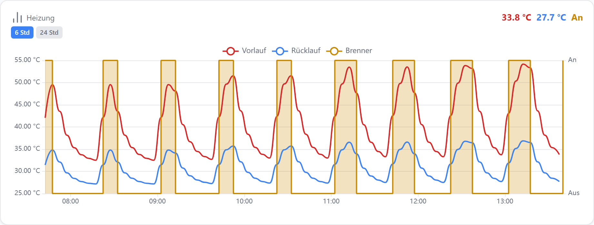

| Option | Wert | |
| --- | --- | --- |
| `echartSeries[].step` | `true` | Wert hält bis zum nächsten; bei booleschen Datenpunkten automatisch |
| `echartSeries[].valueLabels` | `0=Aus; 1=An` | Text statt Zahl in Achse, Tooltip und aktuellem Wert |
| `echartSeries[].aggregate` | leer | boolesche Werte werden mit `max` gebündelt |

::: details Widget-Export (JSON)
```json
{
  "id": "w-chart",
  "type": "echart",
  "title": "Heizung",
  "datapoint": "demo.0.Heizung.Vorlauf",
  "layout": "default",
  "gridPos": {
    "x": 0,
    "y": 0,
    "w": 30,
    "h": 12
  },
  "options": {
    "echartMode": "timeseries",
    "autoHistoryInstance": true,
    "echartShowLegend": true,
    "echartShowCurrent": true,
    "echartRange": "6h",
    "echartVisibleRanges": [
      "6h",
      "24h"
    ],
    "echartLeftUnit": "°C",
    "echartSeries": [
      {
        "id": "s21",
        "name": "Vorlauf",
        "datapointId": "demo.0.Heizung.Vorlauf",
        "chartType": "line",
        "color": "var(--accent-red)",
        "yAxisIndex": 0,
        "decimals": 1
      },
      {
        "id": "s22",
        "name": "Rücklauf",
        "datapointId": "demo.0.Heizung.Ruecklauf",
        "chartType": "line",
        "color": "var(--accent)",
        "yAxisIndex": 0,
        "decimals": 1
      },
      {
        "id": "s23",
        "name": "Brenner",
        "datapointId": "demo.0.Heizung.Brenner",
        "chartType": "area",
        "color": "var(--accent-yellow)",
        "yAxisIndex": 1,
        "step": true,
        "valueLabels": "0=Aus; 1=An",
        "areaOpacity": 25
      }
    ]
  }
}
```
:::

[JSON herunterladen](./assets/beispiele/schaltzustand-mit-temperatur.json)

### Kompakt: Treppenlinie ohne Achsen {#kompakt-ohne-achsen}

Aus [#282](https://github.com/hdering/ioBroker.aura/issues/282) · [#240](https://github.com/hdering/ioBroker.aura/issues/240). Ein schmaler Verlauf als Hintergrund für den aktuellen Wert — ohne Achsen, Legende und Gitter.

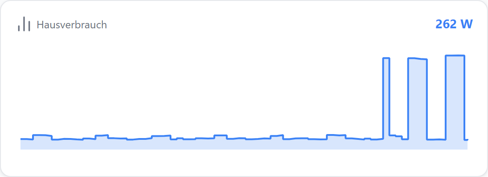

| Option | Wert | |
| --- | --- | --- |
| `echartShowXAxis / echartShowYAxis` | `false` |  |
| `echartShowGridLines` | `false` |  |
| `echartSeries[].step` | `true` | Treppe statt Linie |

::: details Widget-Export (JSON)
```json
{
  "id": "w-chart",
  "type": "echart",
  "title": "Hausverbrauch",
  "datapoint": "demo.0.Haus.Leistung",
  "layout": "default",
  "gridPos": {
    "x": 0,
    "y": 0,
    "w": 18,
    "h": 7
  },
  "options": {
    "echartMode": "timeseries",
    "autoHistoryInstance": true,
    "echartShowLegend": false,
    "echartShowCurrent": true,
    "echartRange": "6h",
    "lockRange": true,
    "echartShowXAxis": false,
    "echartShowYAxis": false,
    "echartShowGridLines": false,
    "echartLeftUnit": "W",
    "decimals": 0,
    "echartSeries": [
      {
        "id": "s24",
        "name": "Leistung",
        "datapointId": "demo.0.Haus.Leistung",
        "chartType": "area",
        "color": "var(--accent)",
        "yAxisIndex": 0,
        "step": true,
        "decimals": 0
      }
    ]
  }
}
```
:::

[JSON herunterladen](./assets/beispiele/kompakt-ohne-achsen.json)

### Aktuelle Werte nebeneinander {#vergleich-aktuelle-werte}

Aus [#200](https://github.com/hdering/ioBroker.aura/issues/200) · [#253](https://github.com/hdering/ioBroker.aura/issues/253) · [#742](https://github.com/hdering/ioBroker.aura/issues/742). Modus Vergleich: ein Balken je Datenpunkt mit seinem aktuellen Wert — ohne History.

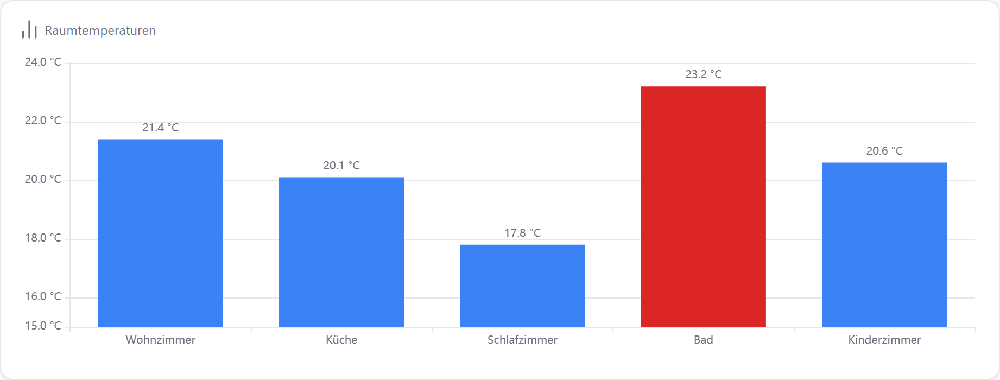

| Option | Wert | |
| --- | --- | --- |
| `echartMode` | `comparison` | im Editor „Vergleich“ |
| `echartShowValues` | `true` | Wert über jedem Balken |
| `echartSeries[].name` | Raumname | steht an der X-Achse |

::: details Widget-Export (JSON)
```json
{
  "id": "w-chart",
  "type": "echart",
  "title": "Raumtemperaturen",
  "datapoint": "demo.0.Raum.Wohnzimmer.Temperatur",
  "layout": "default",
  "gridPos": {
    "x": 0,
    "y": 0,
    "w": 30,
    "h": 12
  },
  "options": {
    "echartMode": "comparison",
    "autoHistoryInstance": false,
    "echartShowLegend": false,
    "echartShowCurrent": false,
    "echartShowValues": true,
    "echartLeftUnit": "°C",
    "echartLeftMin": 15,
    "decimals": 1,
    "echartSeries": [
      {
        "id": "s25",
        "name": "Wohnzimmer",
        "datapointId": "demo.0.Raum.Wohnzimmer.Temperatur",
        "chartType": "bar",
        "color": "var(--accent)",
        "yAxisIndex": 0
      },
      {
        "id": "s26",
        "name": "Küche",
        "datapointId": "demo.0.Raum.Kueche.Temperatur",
        "chartType": "bar",
        "color": "var(--accent)",
        "yAxisIndex": 0
      },
      {
        "id": "s27",
        "name": "Schlafzimmer",
        "datapointId": "demo.0.Raum.Schlafzimmer.Temperatur",
        "chartType": "bar",
        "color": "var(--accent)",
        "yAxisIndex": 0
      },
      {
        "id": "s28",
        "name": "Bad",
        "datapointId": "demo.0.Raum.Bad.Temperatur",
        "chartType": "bar",
        "color": "var(--accent-red)",
        "yAxisIndex": 0
      },
      {
        "id": "s29",
        "name": "Kinderzimmer",
        "datapointId": "demo.0.Raum.Kinderzimmer.Temperatur",
        "chartType": "bar",
        "color": "var(--accent)",
        "yAxisIndex": 0
      }
    ]
  }
}
```
:::

[JSON herunterladen](./assets/beispiele/vergleich-aktuelle-werte.json)

## JSON-Datenpunkte

- [Monatswerte aus JSON-Datenpunkten](#json-kategorien)
- [Rollierende Liste: neuester Wert vorne](#json-erster-wert)
- [Messwerte plus Solarprognose](#json-prognose)
- [Heizkurve aus JSON mit eigenen Feldnamen](#json-heizkurve)
- [Achsengrenzen aus dem JSON](#json-achsgrenzen)

### Monatswerte aus JSON-Datenpunkten {#json-kategorien}

Aus [#543](https://github.com/hdering/ioBroker.aura/issues/543) · [#509](https://github.com/hdering/ioBroker.aura/issues/509) · [#713](https://github.com/hdering/ioBroker.aura/issues/713). Ein Skript schreibt `[{"label":"Jan","value":312.5}, …]` in einen Datenpunkt — die Beschriftungen werden zur X-Achse, mehrere Serien richten sich nach gleichen Beschriftungen aus.

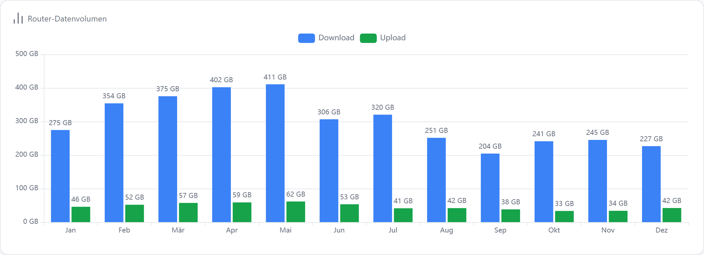

| Option | Wert | |
| --- | --- | --- |
| `echartMode` | `json` | im Editor „Kategorien (JSON)“ |
| `echartSeries[].source` | `json` |  |
| `echartSeries[].jsonLabelKey / jsonValueKey` | leer | der Editor erkennt die Felder selbst |

::: details Inhalt des JSON-Datenpunkts (Auszug)
```json
[
  {
    "label": "Jan",
    "value": 274.53
  },
  {
    "label": "Feb",
    "value": 354.01
  },
  {
    "label": "Mär",
    "value": 375.13
  }
]
```
:::

::: details Widget-Export (JSON)
```json
{
  "id": "w-chart",
  "type": "echart",
  "title": "Router-Datenvolumen",
  "datapoint": "demo.0.Router.Download_Monate_JSON",
  "layout": "default",
  "gridPos": {
    "x": 0,
    "y": 0,
    "w": 34,
    "h": 13
  },
  "options": {
    "echartMode": "json",
    "autoHistoryInstance": false,
    "echartShowLegend": true,
    "echartShowCurrent": false,
    "echartShowValues": true,
    "echartLeftUnit": "GB",
    "decimals": 0,
    "echartSeries": [
      {
        "id": "s30",
        "name": "Download",
        "datapointId": "demo.0.Router.Download_Monate_JSON",
        "chartType": "bar",
        "color": "var(--accent)",
        "yAxisIndex": 0,
        "source": "json"
      },
      {
        "id": "s31",
        "name": "Upload",
        "datapointId": "demo.0.Router.Upload_Monate_JSON",
        "chartType": "bar",
        "color": "var(--accent-green)",
        "yAxisIndex": 0,
        "source": "json"
      }
    ]
  }
}
```
:::

[JSON herunterladen](./assets/beispiele/json-kategorien.json)

### Rollierende Liste: neuester Wert vorne {#json-erster-wert}

Aus [#549](https://github.com/hdering/ioBroker.aura/issues/549). Steht der neueste Eintrag zuerst im JSON, nimmt der aktuelle Wert oben den ersten statt den letzten Punkt.

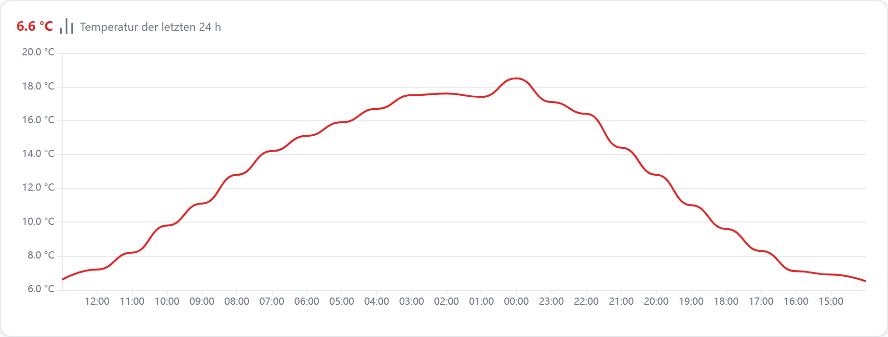

| Option | Wert | |
| --- | --- | --- |
| `echartCurrentFrom` | `first` | Standard `last` |
| `echartCurrentAlign` | `left` | Block links, über dem neuesten Punkt |
| `echartMode` | `json` |  |

::: details Inhalt des JSON-Datenpunkts (Auszug)
```json
[
  {
    "label": "13:00",
    "value": 6.6
  },
  {
    "label": "12:00",
    "value": 7.2
  },
  {
    "label": "11:00",
    "value": 8.2
  }
]
```
:::

::: details Widget-Export (JSON)
```json
{
  "id": "w-chart",
  "type": "echart",
  "title": "Temperatur der letzten 24 h",
  "datapoint": "demo.0.Wetter.Verlauf_JSON",
  "layout": "default",
  "gridPos": {
    "x": 0,
    "y": 0,
    "w": 30,
    "h": 12
  },
  "options": {
    "echartMode": "json",
    "autoHistoryInstance": false,
    "echartShowLegend": false,
    "echartShowCurrent": true,
    "echartCurrentFrom": "first",
    "echartCurrentAlign": "left",
    "echartLeftUnit": "°C",
    "decimals": 1,
    "echartSeries": [
      {
        "id": "s32",
        "name": "Außen",
        "datapointId": "demo.0.Wetter.Verlauf_JSON",
        "chartType": "line",
        "color": "var(--accent-red)",
        "yAxisIndex": 0,
        "source": "json",
        "smooth": true,
        "decimals": 1
      }
    ]
  }
}
```
:::

[JSON herunterladen](./assets/beispiele/json-erster-wert.json)

### Messwerte plus Solarprognose {#json-prognose}

Aus [#595](https://github.com/hdering/ioBroker.aura/issues/595) · [#509](https://github.com/hdering/ioBroker.aura/issues/509). Verlauf aus dem History-Adapter und eine Prognose aus einem JSON-Datenpunkt in einem Diagramm — die Zeitachse reicht über „jetzt“ hinaus bis zum Ende der Prognose.

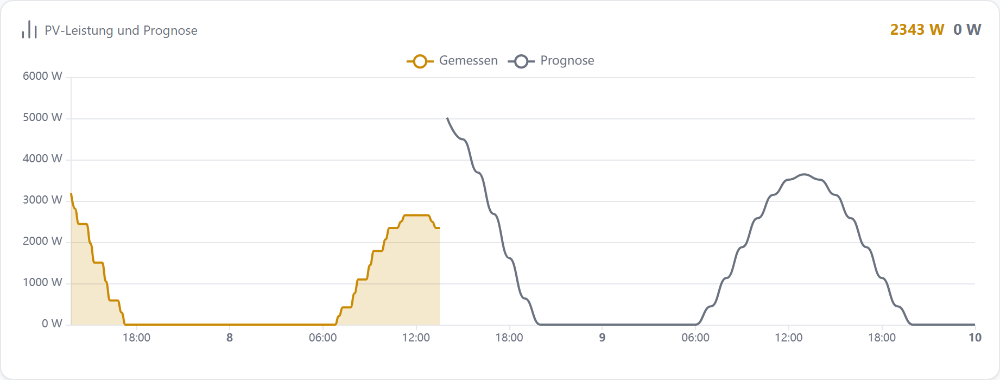

| Option | Wert | |
| --- | --- | --- |
| `echartSeries[0].source` | `history` | Messwerte; Zeitraum-Umschalter wirkt nur hierauf |
| `echartSeries[1].source` | `json` | Beschriftungen müssen Zeitstempel sein (ms, s oder ISO) |
| `echartMode` | `timeseries` |  |

::: details Inhalt des JSON-Datenpunkts (Auszug)
```json
[
  {
    "ts": "1791460800000",
    "val": 5018
  },
  {
    "ts": "1791464400000",
    "val": 4494
  },
  {
    "ts": "1791468000000",
    "val": 3684
  }
]
```
:::

::: details Widget-Export (JSON)
```json
{
  "id": "w-chart",
  "type": "echart",
  "title": "PV-Leistung und Prognose",
  "datapoint": "demo.0.PV.Leistung",
  "layout": "default",
  "gridPos": {
    "x": 0,
    "y": 0,
    "w": 30,
    "h": 12
  },
  "options": {
    "echartMode": "timeseries",
    "autoHistoryInstance": true,
    "echartShowLegend": true,
    "echartShowCurrent": true,
    "echartRange": "24h",
    "lockRange": true,
    "echartLeftUnit": "W",
    "decimals": 0,
    "echartSeries": [
      {
        "id": "s33",
        "name": "Gemessen",
        "datapointId": "demo.0.PV.Leistung",
        "chartType": "area",
        "color": "var(--accent-yellow)",
        "yAxisIndex": 0,
        "decimals": 0
      },
      {
        "id": "s34",
        "name": "Prognose",
        "datapointId": "demo.0.PV.Prognose_JSON",
        "chartType": "line",
        "color": "var(--text-secondary)",
        "yAxisIndex": 0,
        "source": "json",
        "decimals": 0
      }
    ]
  }
}
```
:::

[JSON herunterladen](./assets/beispiele/json-prognose.json)

### Heizkurve aus JSON mit eigenen Feldnamen {#json-heizkurve}

Aus [#703](https://github.com/hdering/ioBroker.aura/issues/703). Die X-Achse muss keine Zeit sein: Vorlauftemperatur über der Außentemperatur, Feldnamen frei gewählt.

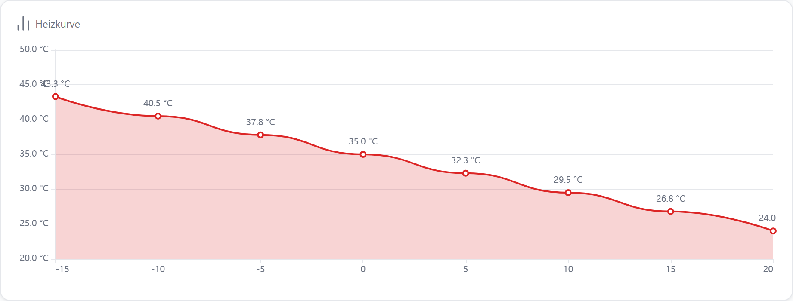

| Option | Wert | |
| --- | --- | --- |
| `echartSeries[].jsonLabelKey` | `aussentemperatur` | X-Beschriftung |
| `echartSeries[].jsonValueKey` | `vorlauftemperatur` | Y-Wert |
| `echartLeftMin / echartLeftMax` | `20` / `50` | feste Skala |

::: details Inhalt des JSON-Datenpunkts (Auszug)
```json
[
  {
    "aussentemperatur": -15,
    "vorlauftemperatur": 43.3
  },
  {
    "aussentemperatur": -10,
    "vorlauftemperatur": 40.5
  },
  {
    "aussentemperatur": -5,
    "vorlauftemperatur": 37.8
  }
]
```
:::

::: details Widget-Export (JSON)
```json
{
  "id": "w-chart",
  "type": "echart",
  "title": "Heizkurve",
  "datapoint": "demo.0.Heizung.Heizkurve_JSON",
  "layout": "default",
  "gridPos": {
    "x": 0,
    "y": 0,
    "w": 30,
    "h": 12
  },
  "options": {
    "echartMode": "json",
    "autoHistoryInstance": false,
    "echartShowLegend": false,
    "echartShowCurrent": false,
    "echartLeftUnit": "°C",
    "echartLeftMin": 20,
    "echartLeftMax": 50,
    "decimals": 1,
    "echartSeries": [
      {
        "id": "s35",
        "name": "Vorlauf",
        "datapointId": "demo.0.Heizung.Heizkurve_JSON",
        "chartType": "area",
        "color": "var(--accent-red)",
        "yAxisIndex": 0,
        "source": "json",
        "jsonLabelKey": "aussentemperatur",
        "jsonValueKey": "vorlauftemperatur",
        "showValues": true,
        "decimals": 1
      }
    ]
  }
}
```
:::

[JSON herunterladen](./assets/beispiele/json-heizkurve.json)

### Achsengrenzen aus dem JSON {#json-achsgrenzen}

Aus [#550](https://github.com/hdering/ioBroker.aura/issues/550). Das Skript liefert neben den Daten die Grenzen der Y-Achse mit — die Achse skaliert nach dem Skript, hier fest 0–100 %.

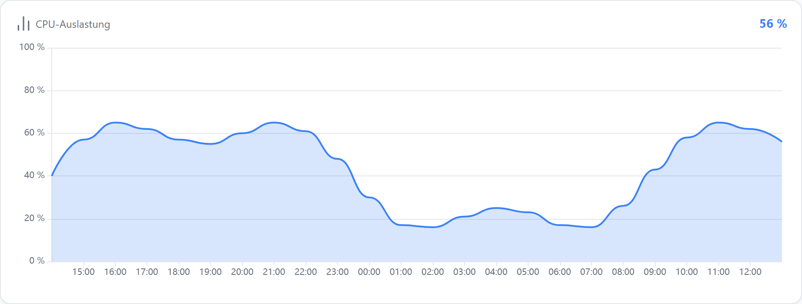

| Option | Wert | |
| --- | --- | --- |
| `echartJsonAxisBounds` | `true` | min/max-Block im Datenpunkt übernehmen |
| `echartSeries[].jsonPath` | `data` | Pfad zum Array |
| `echartSeries[].jsonAxisPath` | leer | Block wird gesucht (`axis`, `yAxis`, `range` …) |

::: details Inhalt des JSON-Datenpunkts (Auszug)
```json
{
  "axis": {
    "min": 0,
    "max": 100
  },
  "data": [
    {
      "label": "14:00",
      "value": 40
    },
    {
      "label": "15:00",
      "value": 57
    },
    {
      "label": "16:00",
      "value": 65
    }
  ]
}
```
:::

::: details Widget-Export (JSON)
```json
{
  "id": "w-chart",
  "type": "echart",
  "title": "CPU-Auslastung",
  "datapoint": "demo.0.Skript.Auslastung_JSON",
  "layout": "default",
  "gridPos": {
    "x": 0,
    "y": 0,
    "w": 30,
    "h": 12
  },
  "options": {
    "echartMode": "json",
    "autoHistoryInstance": false,
    "echartShowLegend": false,
    "echartShowCurrent": true,
    "echartJsonAxisBounds": true,
    "echartLeftUnit": "%",
    "decimals": 0,
    "echartSeries": [
      {
        "id": "s36",
        "name": "Auslastung",
        "datapointId": "demo.0.Skript.Auslastung_JSON",
        "chartType": "area",
        "color": "var(--accent)",
        "yAxisIndex": 0,
        "source": "json",
        "jsonPath": "data",
        "decimals": 0
      }
    ]
  }
}
```
:::

[JSON herunterladen](./assets/beispiele/json-achsgrenzen.json)
