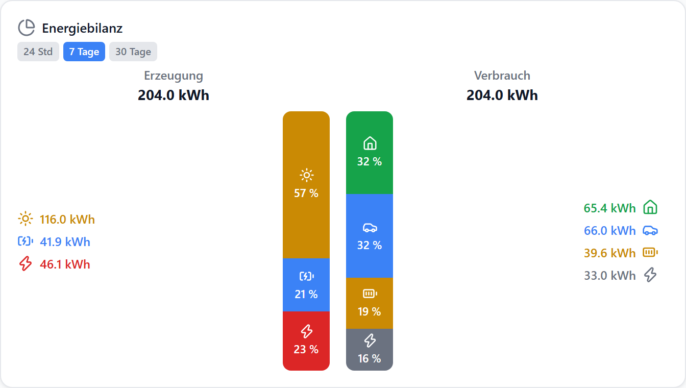
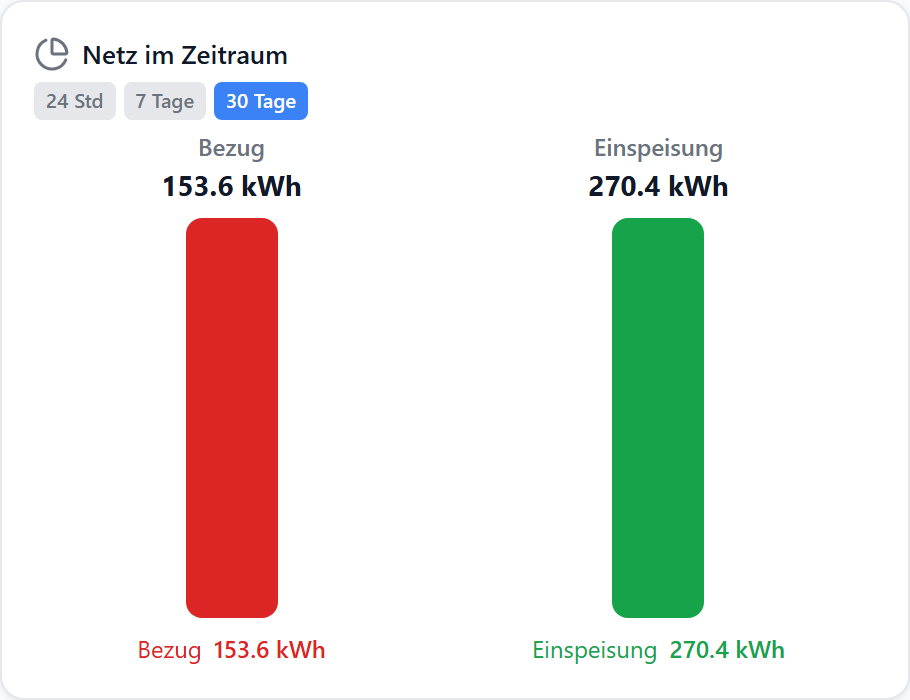
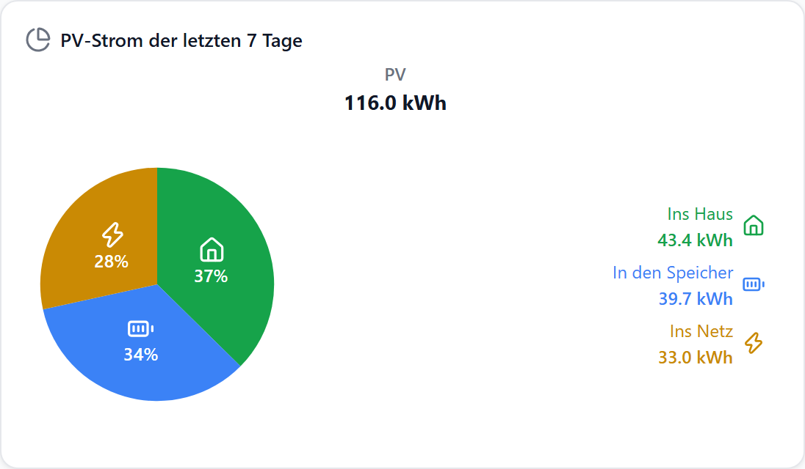
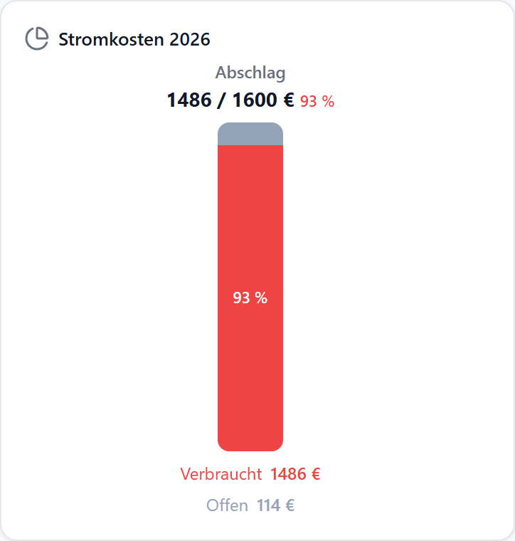

# Beispiele: Diagramm (Verteilung)

<!-- Generiert von tools/screenshots/chart-gallery.mjs aus chart-gallery/examples.mjs — nicht von Hand bearbeiten. -->

Fertige Konfigurationen für [Diagramm (Verteilung)](./verteilung), entstanden aus Fragen und Wünschen im Issue-Tracker. Jedes Beispiel zeigt das Ergebnis, die entscheidenden Optionen und den kompletten Widget-Export.

**Übernehmen:**

1. JSON aufklappen und kopieren (oder die Datei herunterladen).
2. Editor → **Importieren** → JSON einfügen → Tab wählen → **Hinzufügen**.
3. Die `demo.0.*`-Datenpunkte durch die eigenen ersetzen — der Import-Dialog fragt nur den Haupt-Datenpunkt ab, die weiteren stehen im Widget unter „Bearbeiten“.

## Energiebilanz: Erzeugung gegen Verbrauch {#vt-energiebilanz}

Aus [#404](https://github.com/hdering/ioBroker.aura/issues/404). Zwei Gruppen — woher die Energie kam und wohin sie ging. Jeder Eintrag rechnet den Zuwachs seines Zählers im Zeitraum aus, beide Seiten ergeben dieselbe Summe.



| Option | Wert | |
| --- | --- | --- |
| `bars[]` | 2 Gruppen | je Gruppe ein Balken |
| `bars[].entries[].aggregate` | `consumption` | Zuwachs des Zählers im Zeitraum |
| `legendSide` | `left` / `right` | je Gruppe |

::: details Widget-Export (JSON)
```json
{
  "id": "w-verteilung",
  "type": "energiebilanz",
  "title": "Energiebilanz",
  "datapoint": "",
  "layout": "default",
  "gridPos": {
    "x": 0,
    "y": 0,
    "w": 22,
    "h": 13
  },
  "options": {
    "unit": "kWh",
    "decimals": 1,
    "range": "7d",
    "visibleRanges": [
      "24h",
      "7d",
      "30d"
    ],
    "showSegmentIcon": true,
    "legendFormat": "icon-value",
    "bars": [
      {
        "id": "g-erz",
        "title": "Erzeugung",
        "legendSide": "left",
        "entries": [
          {
            "id": "e-pv",
            "label": "PV",
            "datapointId": "demo.0.PV.Ertrag_Gesamt",
            "color": "var(--accent-yellow)",
            "icon": "Sun",
            "aggregate": "consumption"
          },
          {
            "id": "e-sp",
            "label": "Speicher",
            "datapointId": "demo.0.Speicher.Entladen_Gesamt",
            "color": "var(--accent)",
            "icon": "BatteryCharging",
            "aggregate": "consumption"
          },
          {
            "id": "e-nb",
            "label": "Netz",
            "datapointId": "demo.0.Netz.Bezug_Gesamt",
            "color": "var(--accent-red)",
            "icon": "Zap",
            "aggregate": "consumption"
          }
        ]
      },
      {
        "id": "g-ver",
        "title": "Verbrauch",
        "legendSide": "right",
        "entries": [
          {
            "id": "e-haus",
            "label": "Haus",
            "datapointId": "demo.0.Haus.Verbrauch_Gesamt",
            "color": "var(--accent-green)",
            "icon": "House",
            "aggregate": "consumption"
          },
          {
            "id": "e-ev",
            "label": "Wallbox",
            "datapointId": "demo.0.Wallbox.Geladen_Gesamt",
            "color": "var(--accent)",
            "icon": "Car",
            "aggregate": "consumption"
          },
          {
            "id": "e-lad",
            "label": "Speicher",
            "datapointId": "demo.0.Speicher.Laden_Gesamt",
            "color": "var(--accent-yellow)",
            "icon": "BatteryFull",
            "aggregate": "consumption"
          },
          {
            "id": "e-ein",
            "label": "Einspeisung",
            "datapointId": "demo.0.Netz.Einspeisung_Gesamt",
            "color": "var(--text-secondary)",
            "icon": "Zap",
            "aggregate": "consumption"
          }
        ]
      }
    ]
  }
}
```
:::

[JSON herunterladen](./assets/beispiele/vt-energiebilanz.json)

## Verbrauch/Ertrag im gewählten Zeitraum {#vt-zeitraum-summe}

Aus [#749](https://github.com/hdering/ioBroker.aura/issues/749) · [#479](https://github.com/hdering/ioBroker.aura/issues/479). Die Differenz zwischen Anfang und Ende des Zeitraums als Zahl — je Zähler eine eigene Gruppe, damit jede ihre eigene Summe zeigt.



| Option | Wert | |
| --- | --- | --- |
| `bars[].entries[].aggregate` | `consumption` | Ende minus Anfang; bleibt richtig, wenn der Zähler zurückspringt |
| `showTotals / showPercent` | `true` / `false` | Summe über dem Balken, keine 100 % |
| `visibleRanges` | `["24h","7d","30d"]` | Umschalter im Frontend |

::: details Widget-Export (JSON)
```json
{
  "id": "w-verteilung",
  "type": "energiebilanz",
  "title": "Netz im Zeitraum",
  "datapoint": "",
  "layout": "default",
  "gridPos": {
    "x": 0,
    "y": 0,
    "w": 15,
    "h": 12
  },
  "options": {
    "unit": "kWh",
    "decimals": 1,
    "range": "30d",
    "visibleRanges": [
      "24h",
      "7d",
      "30d"
    ],
    "showTotals": true,
    "showPercent": false,
    "legendFormat": "label-value",
    "bars": [
      {
        "id": "g-bezug",
        "title": "Bezug",
        "entries": [
          {
            "id": "e-bezug",
            "label": "Bezug",
            "datapointId": "demo.0.Netz.Bezug_Gesamt",
            "color": "var(--accent-red)",
            "icon": "Zap",
            "aggregate": "consumption"
          }
        ]
      },
      {
        "id": "g-einsp",
        "title": "Einspeisung",
        "entries": [
          {
            "id": "e-einsp",
            "label": "Einspeisung",
            "datapointId": "demo.0.Netz.Einspeisung_Gesamt",
            "color": "var(--accent-green)",
            "icon": "Zap",
            "aggregate": "consumption"
          }
        ]
      }
    ]
  }
}
```
:::

[JSON herunterladen](./assets/beispiele/vt-zeitraum-summe.json)

## Anteile aus Tageszählern {#vt-tageszaehler}

Aus [#561](https://github.com/hdering/ioBroker.aura/issues/561). Wohin der PV-Strom der letzten 7 Tage ging — aus Zählern, die jede Nacht auf 0 springen. `consumption` summiert die Anstiege, der Reset zählt nicht.



| Option | Wert | |
| --- | --- | --- |
| `bars[].entries[].aggregate` | `consumption` | `delta` würde hier negativ |
| `chartStyle` | `pie` | `bars`, `pie` oder `donut` |
| `legendFormat` | `icon-label-value` |  |

::: details Widget-Export (JSON)
```json
{
  "id": "w-verteilung",
  "type": "energiebilanz",
  "title": "PV-Strom der letzten 7 Tage",
  "datapoint": "",
  "layout": "default",
  "gridPos": {
    "x": 0,
    "y": 0,
    "w": 18,
    "h": 11
  },
  "options": {
    "unit": "kWh",
    "decimals": 1,
    "range": "7d",
    "lockRange": true,
    "chartStyle": "pie",
    "pieSize": 180,
    "legendFormat": "icon-label-value",
    "showSegmentIcon": true,
    "bars": [
      {
        "id": "g-pv",
        "title": "PV",
        "legendSide": "right",
        "entries": [
          {
            "id": "e-direkt",
            "label": "Ins Haus",
            "datapointId": "demo.0.Haus.PV_Direkt_Heute",
            "color": "var(--accent-green)",
            "icon": "House",
            "aggregate": "consumption"
          },
          {
            "id": "e-batt",
            "label": "In den Speicher",
            "datapointId": "demo.0.Speicher.Laden_Heute",
            "color": "var(--accent)",
            "icon": "BatteryFull",
            "aggregate": "consumption"
          },
          {
            "id": "e-netz",
            "label": "Ins Netz",
            "datapointId": "demo.0.Netz.Einspeisung_Heute",
            "color": "var(--accent-yellow)",
            "icon": "Zap",
            "aggregate": "consumption"
          }
        ]
      }
    ]
  }
}
```
:::

[JSON herunterladen](./assets/beispiele/vt-tageszaehler.json)

## Abschlag: wie viel ist verbraucht? {#vt-budget}

Aus [#596](https://github.com/hdering/ioBroker.aura/issues/596). Eine Gruppe mit Vorgabe aus einem Datenpunkt (der Jahresabschlag) — der Balken füllt sich von unten, der Rest heißt „Offen“, ab 90 % wechselt die Farbe.



| Option | Wert | |
| --- | --- | --- |
| `bars[].totalDatapoint` | Datenpunkt | 100 %-Bezug; alternativ fest `totalValue` |
| `bars[].overActive / overThreshold` | `true` / `90` | Warnfarbe ab 90 % der Vorgabe |
| `barDirection` | `up` | füllt von unten wie ein Tank |

::: details Widget-Export (JSON)
```json
{
  "id": "w-verteilung",
  "type": "energiebilanz",
  "title": "Stromkosten 2026",
  "datapoint": "",
  "layout": "default",
  "gridPos": {
    "x": 0,
    "y": 0,
    "w": 12,
    "h": 13
  },
  "options": {
    "unit": "€",
    "decimals": 0,
    "range": "24h",
    "lockRange": true,
    "barDirection": "up",
    "legendFormat": "label-value",
    "bars": [
      {
        "id": "g-kosten",
        "title": "Abschlag",
        "totalDatapoint": "demo.0.Strom.Abschlag_Jahr",
        "restLabel": "Offen",
        "overActive": true,
        "overThreshold": 90,
        "entries": [
          {
            "id": "e-kosten",
            "label": "Verbraucht",
            "datapointId": "demo.0.Strom.Kosten_Jahr",
            "color": "var(--accent)",
            "icon": "Euro",
            "aggregate": "last"
          }
        ]
      }
    ]
  }
}
```
:::

[JSON herunterladen](./assets/beispiele/vt-budget.json)
