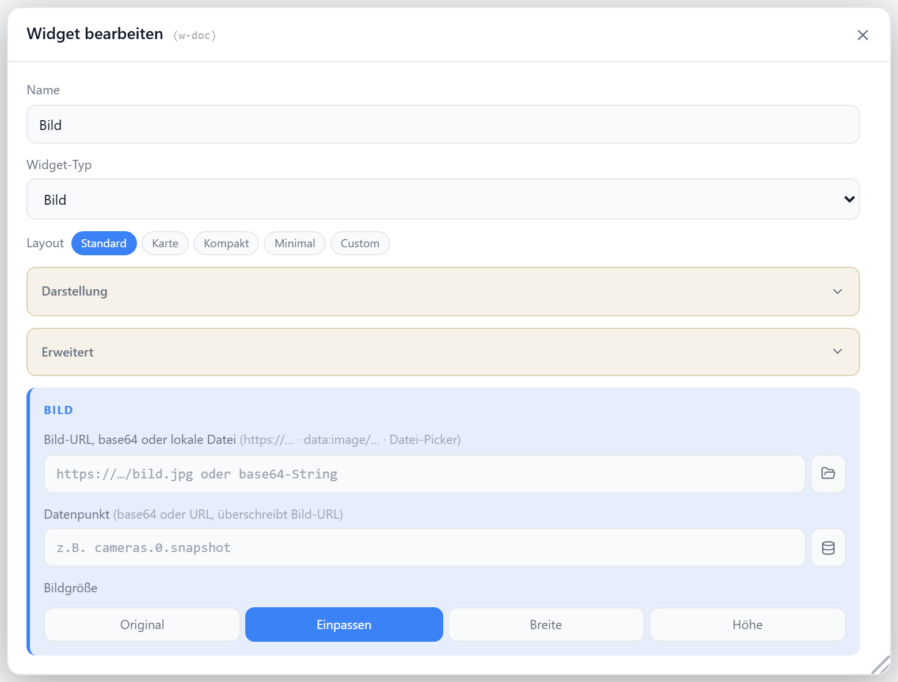

# Bild

Zeigt ein statisches Bild aus einer URL, einer lokalen Datei oder einem Datenpunkt (URL, Base64 oder SVG-Markup). Optional wird das Bild in einem Intervall neu geladen.

Mögliche Bildquellen (URL, Adapter-Pfad, Datei, Base64): siehe [Bildpfade](./bildpfade).

## Datenpunkt

Kein Pflicht-Datenpunkt; die Quelle kann eine feste URL oder ein Datenpunkt sein.

| Feld             | Pflicht | Typ |                                                         |
| ---------------- | ------- | --- | ------------------------------------------------------- |
| `imageUrl`       | ja\*    | —   | Bild-URL, lokale Datei, Base64/Data-URI oder SVG-Markup |
| `imageDatapoint` | ja\*    | —   | Datenpunkt mit URL, Data-URI, Base64 oder SVG-Markup    |

\*einer von beiden. Liegt am Datenpunkt ein Wert an, hat er Vorrang vor `imageUrl`.

## Layouts

### Default

Optionaler Titel/Icon oben, darunter das Bild mit der gewählten Anpassung.

### Custom

Felder `url` und `dp` frei in einer Zellenmatrix platzieren — siehe [Custom-Layout](./custom-layout).

## Einstellungen

Alle Optionen werden im Editor unter **Widget bearbeiten** gesetzt.

### Quelle

| Option            | Standard  |                                                       |
| ----------------- | --------- | ----------------------------------------------------- |
| `imageUrl`        | —         | Bild-URL, lokale Datei, Base64 oder SVG               |
| `imageDatapoint`  | —         | Datenpunkt mit URL/Base64/SVG                         |
| `fit`             | `contain` | `none` · `contain` · `width` · `height`               |
| `imageBackground` | —         | Hintergrundfarbe hinter dem Bild (leer = transparent) |
| `refreshInterval` | `0`       | Sekunden zwischen Reloads (`0` = aus)                 |

### Anzeige

| Option       | Standard    |                                   |
| ------------ | ----------- | --------------------------------- |
| `showTitle`  | `true`      | Titel anzeigen                    |
| `showIcon`   | `true`      | Icon anzeigen                     |
| `icon`       | `ImageIcon` | [Lucide-Icon](https://lucide.dev) |
| `iconSize`   | `20`        | px                                |
| `titleAlign` | `left`      | `left` · `center` · `right`       |

## SVG aus einem Datenpunkt

Enthält ein Datenpunkt reines SVG-Markup (`<svg …>…</svg>`), wird es direkt angezeigt — z.B. der WLAN-QR-Code von `fb-checkpresence.0.guest.wlanQR`.

| Punkt          |                                                                                                                                    |
| -------------- | ---------------------------------------------------------------------------------------------------------------------------------- |
| Erkennung      | automatisch, keine Option nötig                                                                                                    |
| Größe          | `fit` = `contain` skaliert das SVG auf das Widget                                                                                  |
| Hintergrund    | SVG ist meist transparent — für QR-Codes `imageBackground` auf `#ffffff` setzen, sonst ist der Code im dunklen Theme nicht scanbar |
| Skripte im SVG | werden nicht ausgeführt (Anzeige über ``)                                                                                     |
