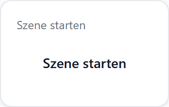
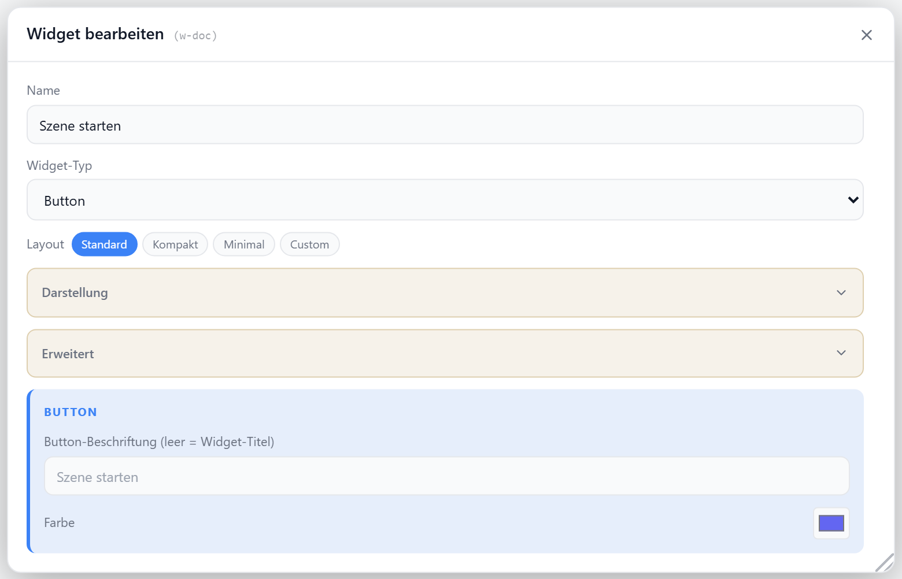

# Button

Schaltflächen-Widget zum Auslösen einer Klick-Aktion — Popup öffnen, zu einem Tab oder Widget springen, eine externe URL aufrufen. Die Aktion wird im Abschnitt **Klick-Aktion** des Editors festgelegt; das Widget selbst rendert Beschriftung und Icon.

## Layouts

### Default
Titel oben, Icon und Beschriftung zentriert darunter — Standard-Schaltfläche.

### Compact
Icon und Beschriftung in einer Zeile mit Pfeil rechts — für Listen.

### Minimal
Nur Icon (oder Beschriftung, falls kein Icon) zentriert — für sehr kleine Zellen.

### Custom
Icon und Beschriftung frei in einer Zellenmatrix platzieren — siehe [Custom-Layout](./custom-layout).

## Einstellungen

Alle Optionen werden im Editor unter **Widget bearbeiten** gesetzt.

### Beschriftung & Darstellung

| Option | Standard | |
| --- | --- | --- |
| `buttonLabel` | Widget-Titel | Beschriftung der Schaltfläche |
| `buttonColor` | `--accent` | Farbe von Icon (und Custom-Layout) |
| `showTitle` | `true` | Titel anzeigen (Default-Layout) |
| `showIcon` | `true` | Icon anzeigen |
| `icon` | — | [Lucide-Icon](https://lucide.dev); ohne Icon nur Beschriftung |
| `iconSize` | `28` | px |
| `titleAlign` | `left` | `left` · `center` · `right` |
| `contentPosition` | `cc` | Position von Icon/Label im Default-Layout |

### Klick-Aktion

Die eigentliche Aktion wird im Abschnitt **Klick-Aktion** konfiguriert: Popup (View, Bild, Webseite, JSON, HTML, Widget-Inhalt) oder Sprung (Tab, externe URL, Widget).
