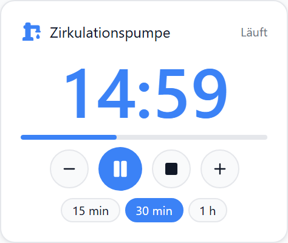
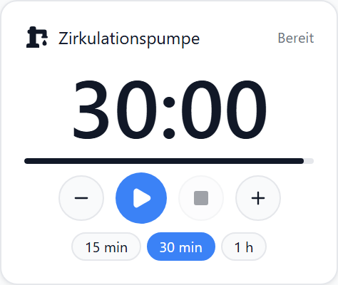
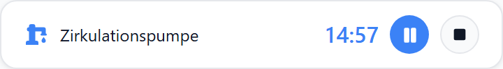
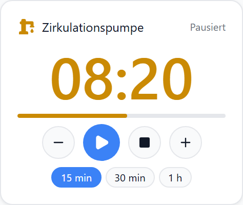
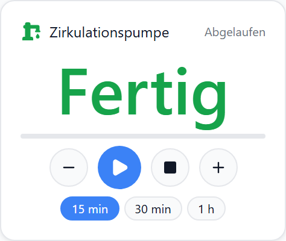
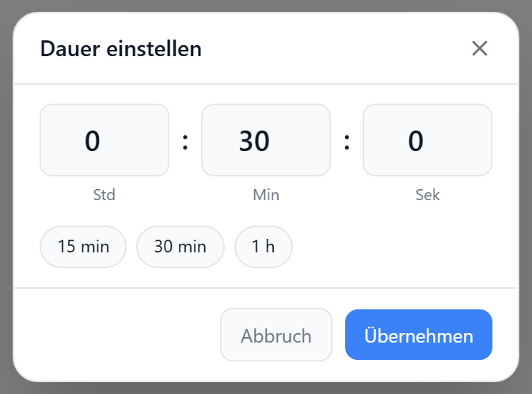
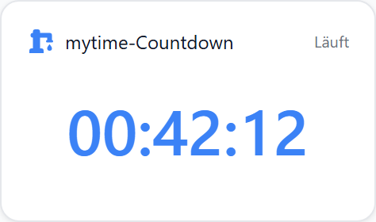
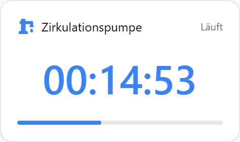

# Countdown

Zählt eine eingestellte Dauer als `hh:mm:ss` herunter. Start, Pause, Stopp, ±-Tasten und Vorgaben-Chips am Widget; ein Tipp auf die Ziffern öffnet den Dauer-Dialog. Der Countdown läuft **im Adapter** – Tab zu oder Tablet aus ändert nichts – und schreibt am Ende (und optional beim Start) einen Datenpunkt. Wahlweise zeigt das Widget nur die Restzeit eines fremden Datenpunkts, z. B. aus dem mytime-Adapter.

## Datenpunkt

| Feld | Pflicht | Typ | |
| --- | --- | --- | --- |
| `datapoint` | nur bei Quelle „Fremder Datenpunkt“ | `number` | Restzeit in ms / s oder Endzeitpunkt (Epoch), siehe `dpKind` |

Bei der Quelle „Eigener Countdown“ bleibt das Feld leer. Der Adapter legt pro Widget einen Kanal `aura.0.countdowns.<key>` an:

| State | Typ | Richtung | Inhalt |
| --- | --- | --- | --- |
| `config` | JSON | Widget → Adapter | Dauer, Ziel-DP, Werte |
| `cmd` | string | Widget / Skript → Adapter | `start` · `pause` · `resume` · `toggle` · `stop` · `end` · `+60` · `-60` · `=300` (Sekunden oder `h:m:s`) |
| `state` | string | Adapter → alle | `idle` · `running` · `paused` · `ended` |
| `endTs` | number | Adapter → Widget | Endzeitpunkt in Epoch-ms, `0` wenn nicht laufend |
| `remainingMs` | number | Adapter → alle | Restzeit bei Pause; laufend nur mit „sekündlich veröffentlichen“ |
| `durationMs` | number | Adapter → alle | aktuell eingestellte Dauer (ändert sich mit ±, Chips, `=N`) |

Der Pfad steht im Widget-Edit-Panel unter **Adapter-States**. Skripte schreiben `cmd` mit `ack=false`; der Adapter quittiert.

## Layouts

### Default
Titel und Zustand, große Ziffern, Fortschrittsbalken, Tastenzeile, Vorgaben-Chips.

### Compact
Eine Zeile: Icon, Titel, Ziffern, Start/Pause und Stopp – für Listen.

### Custom
Komponenten `icon`, `digits`, `progress`, `controls`, `step`, `presets` und Felder `remaining`, `state`, `duration`, `target` frei in einer Zellenmatrix – siehe [Custom-Layout](./custom-layout).

## Zustände

| Zustand | Ziffern | Balken | Tasten |
| --- | --- | --- | --- |
| Bereit | eingestellte Dauer | voll | Start, ± |
| Läuft | Restzeit, sekündlich | Restanteil | Pause, Stopp, ± |
| Pausiert | eingefrorene Restzeit, gelb | Restanteil | Weiter, Stopp, ± |
| Abgelaufen | `00:00` oder „Text nach Ablauf“, grün | leer | Start |
| Wartet auf den Adapter | eingestellte Dauer, gedämpft | – | gesperrt |

## Dauer-Dialog

Tipp auf die Ziffern. Stunden, Minuten, Sekunden oder eine Vorgabe; **Übernehmen** setzt die Dauer (`=N`) – laufend, pausiert oder bereit.

## Einstellungen

Alle Optionen werden im Editor unter **Widget bearbeiten** gesetzt.

### Quelle

| Option | Werte | Standard | |
| --- | --- | --- | --- |
| `source` | `aura` · `datapoint` | `aura` | eigener Countdown im Adapter oder Anzeige eines fremden Datenpunkts |
| `dpKind` | `remaining-ms` · `remaining-s` · `end-ts` | `remaining-ms` | nur `datapoint`: was der Datenpunkt enthält; `end-ts` = Epoch ms oder s (mytime `…Countdowns.<n>.end`) |

Bei `datapoint` sind Tasten, Chips und Balken ausgeblendet; die Restzeit tickt zwischen zwei Werten lokal weiter.

### Dauer

| Option | Typ | Standard | |
| --- | --- | --- | --- |
| `durationSec` | `number` | – | Startwert in Sekunden; ±, Chips und `=N` ändern die laufende Einstellung, nicht die Option |
| `stepSec` | `number` | `60` | Schritt der ±-Tasten |
| `presets` | `number[]` | – | Vorgaben in Sekunden, als Chips; im Panel als `5m, 15m, 1h` oder `90, 1:30` eingeben |

### Ziel-Aktion

| Option | Typ | Standard | |
| --- | --- | --- | --- |
| `targetDp` | `string` | – | Datenpunkt, den der Adapter schreibt |
| `valueOnEnd` | `string` | – | Wert am Ende; wird als `boolean` · `number` · `string` geparst; leer = nichts schreiben |
| `valueOnStart` | `string` | – | Wert beim Start – `true` hier und `false` am Ende ergibt „für N Minuten einschalten“ |
| `stopWritesEnd` | `boolean` | an, sobald `valueOnStart` gesetzt | Stopp schreibt ebenfalls `valueOnEnd` (Abbruch schaltet zurück) |
| `publishRemaining` | `boolean` | `false` | `remainingMs` jede Sekunde schreiben – für Skripte; füllt History-Adapter |

Nach einem Adapter-Neustart läuft ein Countdown aus dem gespeicherten `endTs` weiter; war er in der Zwischenzeit abgelaufen, wird `valueOnEnd` nachgeholt.

### Anzeige

| Option | Werte / Typ | Standard | |
| --- | --- | --- | --- |
| `format` | `auto` · `hms` · `ms` · `hm` | `auto` | `auto` = `mm:ss` unter einer Stunde, sonst `hh:mm:ss`; `ms` = Minuten gesamt; `hm` rundet Sekunden auf |
| `showDays` | `boolean` | `false` | ab 24 h `2d 03:04:05` statt `51:04:05` |
| `digitSize` | `number` (px) | `0` = auto | Ziffern passen sich sonst der Kachelbreite an |
| `showProgress` | `boolean` | `true` | Fortschrittsbalken |
| `showControls` | `boolean` | `true` | Start/Pause und Stopp |
| `showStep` | `boolean` | `true` | ±-Tasten |
| `showPresets` | `boolean` | `true` | Vorgaben-Chips |
| `endedText` | `string` | – | Text statt `00:00` nach Ablauf, z. B. „Fertig“ |
| `showTitle` · `showIcon` · `icon` · `iconSize` · `titleAlign` | | | wie bei allen Widgets |

Die Ziffern runden **auf**: 59,4 s stehen als `01:00`, `00:00` erscheint genau zum Ende.

## CSS-Klassen

| Selektor | trifft |
| --- | --- |
| `.aura-countdown` | Wurzel; `data-state` = `idle` · `running` · `paused` · `ended` · `unknown` |
| `.aura-countdown-digits` | Ziffern |
| `.aura-countdown-progress` | Fortschrittsbalken |
| `.aura-countdown-state` | Zustandstext in der Kopfzeile |
| `.aura-countdown-controls` · `.aura-countdown-primary` · `.aura-countdown-stop` · `.aura-countdown-step` | Tastenzeile, Start/Pause, Stopp, ± |
| `.aura-countdown-presets` | Vorgaben-Chips |
| `.aura-countdown-modal` | Dauer-Dialog |
