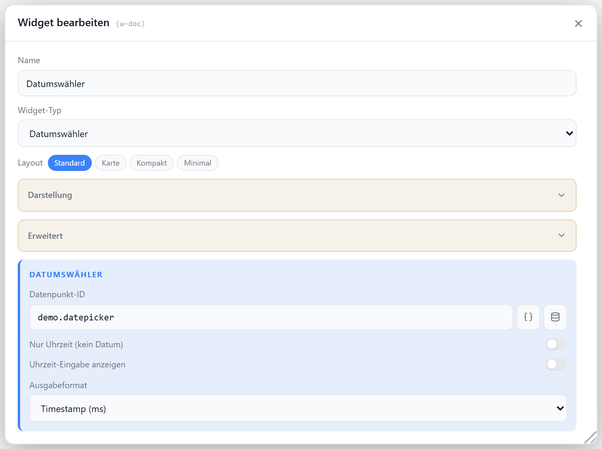

# Datumswähler

Wählt Datum und/oder Uhrzeit über native Eingabefelder aus und schreibt den Wert im gewünschten Format in einen Datenpunkt. Externe Änderungen am DP werden automatisch übernommen.

## Datenpunkt

| Feld | Pflicht | Typ | |
| --- | --- | --- | --- |
| `datapoint` | ja | `number` / `string` | Format laut `outputFormat`; gelesen werden Timestamp, ISO, DE- und Lokalformate |

Optionale Status-Datenpunkte (Batterie, Erreichbarkeit) werden als Badges eingeblendet (Abschnitt **Status-Datenpunkte** im Dialog).

Dieselben Felder gibt es als Darstellung `datepicker` pro Zeile in der [statischen](./liste#darstellung-datumswaehler) und [dynamischen Liste](./dynamische-liste).

## Layouts

### Default
Titel/Icon oben, darunter die Eingabefelder und der gesetzte Wert — für mittlere Zellen.

### Card
Icon, Titel, Eingabefelder und gesetzter Wert zentriert untereinander — für prominente Platzierung.

### Compact
Eine Zeile mit Icon, Titel und Eingabefeldern — für Listen.

### Minimal
Nur die Eingabefelder mit dem aktuellen Wert darunter, zentriert — für kleine Zellen.

## Einstellungen

Alle Optionen werden im Editor unter **Widget bearbeiten** gesetzt.

### Modus

| Option | Standard | |
| --- | --- | --- |
| `timeOnly` | `false` | nur Uhrzeit, ohne Datum |
| `showTime` | `false` | zusätzliches Uhrzeit-Feld zum Datum |
| `inputFormat` | `picker` | `picker` (Datum/Zeit wie oben) · `custom` (Feld laut `inputPattern`) |
| `inputPattern` | wie `outputPattern` | Muster bei `inputFormat: custom`, z.B. `MM.yyyy` |
| `outputFormat` | `timestamp_ms` | `timestamp_ms` · `timestamp_s` · `iso` · `date` · `datetime_local` · `de_date` · `de_datetime` · `time_hhmm` · `time_hhmmss` · `custom` |
| `outputPattern` | `dd.MM.yyyy` | Muster bei `outputFormat: custom` |

Muster-Tokens: `dd` `MM` `yyyy` `yy` `HH` `hh` `mm` `ss`; alles andere bleibt Literal (`KW MM/yyyy`).

Das **Eingabe-Muster** bestimmt, welches Auswahlfeld gerendert wird:

| Muster enthält | Feld |
| --- | --- |
| Tag + Monat + Jahr + Zeit | Datum/Zeit-Auswahl |
| Tag + Monat + Jahr | Kalender |
| Monat + Jahr (`MM.yyyy`) | Monatswähler |
| nur Zeit (`HH:mm`) | Uhrzeit |
| alles andere (`yyyy`, `dd.MM`) | Textfeld, geparst nach Muster (Enter/Verlassen schreibt, ungültig = roter Rahmen) — plus eigene Auswahlliste mit einer Spalte je Muster-Bestandteil |

Nicht genannte Bestandteile behalten ihren gespeicherten Wert — `MM.yyyy` verschiebt nur den Monat, Tag und Uhrzeit bleiben (Tag wird bei kürzeren Monaten gekappt).

### Anzeige

| Option | Standard | |
| --- | --- | --- |
| `showTitle` | `true` | Titel anzeigen |
| `showIcon` | `true` | Icon anzeigen |
| `showCurrentValue` | `true` | gesetzten Wert anzeigen |
| `icon` | modusabhängig | [Lucide-Icon](https://lucide.dev) (`CalendarDays` / `CalendarClock` / `Clock`) |
| `iconSize` | `20` | px |
| `titleAlign` | `left` | `left` · `center` · `right` |
