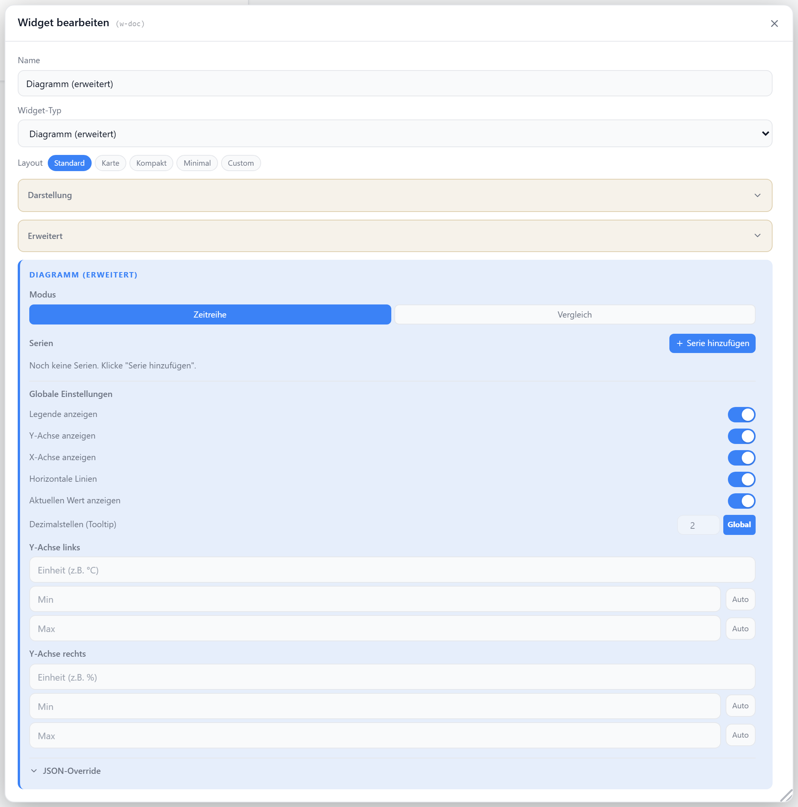

# Diagramm (erweitert)

Mehrere Datenpunkte in einem Diagramm — pro Serie eigener Typ (Linie, Fläche, Balken, Punkte), Farbe und Y-Achse. Auf ECharts basierend, mit zwei Y-Achsen, Legende, Vergleichs- und Gauge-Modus sowie einem JSON-Override für ECharts-Feineinstellungen.

## Datenpunkt

Das Widget hat keinen eigenen Haupt-Datenpunkt — jede Serie trägt ihren Datenpunkt selbst.

| Feld | Pflicht | Typ | |
| --- | --- | --- | --- |
| `echartSeries[].datapointId` | ja | `number` | Datenpunkt der Serie |
| `echartSeries[].historyInstance` | nein | — | History-Adapter; leer = Live-Daten |

## Layouts

Das Diagramm-Verhalten steuert die Option `echartMode`; das Widget-Layout `gauge` schaltet auf eine Tacho-Anzeige.

### Timeseries
Zeitachsen-Diagramm mit allen Serien über die Zeit — Standard.

### Comparison
Kategorisches Balkendiagramm — je Serie ein Balken mit ihrem aktuellen Wert.

### Gauge
Tacho-Anzeige des aktuellen Werts der ersten Serie (Widget-Layout `gauge`).

### Custom
Frei in einer Zellenmatrix platzieren — siehe [Custom-Layout](./custom-layout).

## Einstellungen

Alle Optionen werden im Editor unter **Widget bearbeiten** gesetzt.

### Anzeige

| Option | Standard | |
| --- | --- | --- |
| `showTitle` | `true` | Titel anzeigen |
| `showIcon` | `true` | Icon anzeigen |
| `icon` | `BarChart2` | [Lucide-Icon](https://lucide.dev) |
| `iconSize` | `20` | px |
| `titleAlign` | `left` | `left` · `center` · `right` |
| `echartShowCurrent` | `true` | aktuelle Werte oben rechts anzeigen |
| `echartShowLegend` | `true` | Legende anzeigen |
| `decimals` | globale Einstellung | Nachkommastellen im Tooltip |

### Serien

| Option | Standard | |
| --- | --- | --- |
| `echartMode` | `timeseries` | `timeseries` · `comparison` |
| `echartSeries` | `[]` | Liste der Serien (siehe unten) |
| `echartSeries[].name` | `Serie N` | Name in Legende/Tooltip |
| `echartSeries[].chartType` | `line` | `line` · `area` · `bar` · `scatter` |
| `echartSeries[].color` | Palette | Linien-/Balkenfarbe |
| `echartSeries[].yAxisIndex` | `0` | `0` = links, `1` = rechte Y-Achse |
| `echartSeries[].smooth` | `true` | geglättete Linie (nur Linie/Fläche) |
| `echartSeries[].lineWidth` | `2` | Linienstärke 1–4 (nur Linie/Fläche) |

### Achsen

| Option | Standard | |
| --- | --- | --- |
| `echartShowYAxis` | `true` | Y-Achse anzeigen |
| `echartShowXAxis` | `true` | X-Achse anzeigen |
| `echartShowGridLines` | `true` | horizontale Hilfslinien |
| `echartLeftUnit` | — | Einheit der linken Y-Achse |
| `echartRightUnit` | — | Einheit der rechten Y-Achse |
| `echartLeftMin` / `echartLeftMax` | `auto` | Skala links; Zahl oder `dataMin`/`dataMax` |
| `echartRightMin` / `echartRightMax` | `auto` | Skala rechts; Zahl oder `dataMin`/`dataMax` |

### Verlauf

Ein gemeinsamer Zeitraum für alle Serien.

| Option | Standard | |
| --- | --- | --- |
| `echartRange` | `24h` | `1h` · `6h` · `24h` · `7d` · `30d` · `custom` |
| `echartRangeCustomValue` | `24` | nur bei `custom` |
| `echartRangeCustomUnit` | `h` | `h` · `d`, nur bei `custom` |
| `lockRange` | `false` | Zeitraum-Umschalter im Frontend ausblenden |
| `autoHistoryInstance` | `false` | History-Instanz je Serie automatisch erkennen |

### JSON-Override

| Option | Standard | |
| --- | --- | --- |
| `echartJsonExtra` | — | JSON, das tief in die ECharts-Optionen gemischt wird |
