# Diagramm (erweitert)

Mehrere Datenpunkte in einem Diagramm — pro Serie eigener Typ (Linie, Fläche, Balken, Punkte), Farbe und Y-Achse. Auf ECharts basierend, mit zwei Y-Achsen, Legende, Vergleichs- und Gauge-Modus sowie einem JSON-Override für ECharts-Feineinstellungen.

## Datenpunkt

Das Widget hat keinen eigenen Haupt-Datenpunkt — jede Serie trägt ihren Datenpunkt selbst.

| Feld                             | Pflicht | Typ                 |                                               |
| -------------------------------- | ------- | ------------------- | --------------------------------------------- |
| `echartSeries[].datapointId`     | ja      | `number` · `string` | Datenpunkt der Serie (`string` im JSON-Modus) |
| `echartSeries[].historyInstance` | nein    | —                   | History-Adapter; leer = Live-Daten            |
| `echartSeries[].source`          | nein    | —                   | `history` (Standard) · `json` — je Serie      |

## Serien konfigurieren

Modus und Serien liegen im Dialog **Datenpunkte verwalten** (Button im Optionen-Panel). Links die Serienliste, rechts die komplette Konfiguration der ausgewählten Serie; der Modus steht als Kopfzeile darüber. Die globalen Einstellungen (Achsen, Legende, Zeitraum, Einheiten) bleiben im Optionen-Panel.

Der Modus ändert die Serien nicht: er entscheidet nur, wie gelesen wird. Im Modus `json` liest jede Serie ihren Datenpunktwert, unabhängig von ihrer eingestellten Datenquelle — ein Wechsel in einen anderen Modus und zurück lässt die Serien also unverändert.

| Im Dialog                                 | Im Optionen-Panel           |
| ----------------------------------------- | --------------------------- |
| Modus                                     | Darstellung, Achsen, Gitter |
| Serien anlegen, sortieren, löschen        | Legende, aktueller Wert     |
| Datenpunkt je Serie                       | Zeitraum, Tages-Navigation  |
| Datenquelle, Typ, Farbe, Y-Achse, Stapeln | Einheiten, Achsengrenzen    |
| JSON-Quelle, Verlauf/Aggregation          | Zahlenformat, JSON-Override |
| Werte-Vorgabe, Anteil am Stapel           |                             |

Der Tab **Werte** im Dialog trägt die beiden Einstellungen, die nur neben den Serien Sinn ergeben: `echartShowValues` ist die Vorgabe, die jede Serie als „Auto (…)" anzeigt, und `echartShowStackPercent` erscheint erst, wenn eine Serie stapelt — was im selben Dialog eingestellt wird.

## Layouts

Das Diagramm-Verhalten steuert die Option `echartMode`; das Widget-Layout `gauge` schaltet auf eine Tacho-Anzeige.

### Timeseries

Zeitachsen-Diagramm mit allen Serien über die Zeit — Standard.

Je Serie ist die Datenquelle wählbar (`echartSeries[].source`), Verlauf und JSON-Datenpunkt lassen sich also mischen — z. B. Messwerte aus der InfluxDB plus Solarprognose aus einem JSON:

| Serie              | `source`  |                                                                     |
| ------------------ | --------- | ------------------------------------------------------------------- |
| Messwerte          | `history` | Zeitraum-Umschalter und Tages-Navigation wirken nur auf diese       |
| Prognose, Fahrplan | `json`    | ganzes Array aus dem Datenpunkt; die Beschriftung ist der Zeitpunkt |

Voraussetzung für die JSON-Serie: die Beschriftungen sind Zeitstempel (Epoch in ms oder s, ISO-Datum). Einträge ohne gültigen Zeitstempel entfallen — der Editor sagt es, sobald er den Datenpunkt gelesen hat. Für Kategorie-Beschriftungen (`Mo`, `Di`) den Modus [JSON](#json) wählen.

```json
[
    { "ts": "1785362400000", "val": 0 },
    { "ts": "1785366000000", "val": 2.5 }
]
```

Reicht die JSON-Serie in die Zukunft, dehnt sich die Zeitachse mit — die Verlaufsdaten enden bei „jetzt", die Prognose läuft weiter. Felder, Pfade und Achsengrenzen wie unter [JSON-Quelle](#json-quelle).

### Comparison

Kategorisches Balkendiagramm — je Serie ein Balken mit ihrem aktuellen Wert.

### JSON

Kategorisches Diagramm aus einem JSON-Datenpunkt statt aus einem History-Adapter — die Labels bilden die X-Achse, in der Reihenfolge des Arrays. Kein Zeitraum-Umschalter, keine Tages-Navigation.

Erwartetes Format im Datenpunkt (String oder Objekt):

```json
[
    { "label": "12:00", "value": "0.5" },
    { "label": "13:00", "value": "1.2" }
]
```

Werte dürfen Strings sein und werden in Zahlen gewandelt; Einträge ohne gültige Zahl entfallen. Mehrere Serien werden über gleiche Labels ausgerichtet, fehlende Labels lassen die Linie brechen.

**Feldnamen müssen nicht konfiguriert werden.** Der Editor liest den Datenpunkt aus, erkennt Beschriftungs- und Wertfeld selbst und bietet die tatsächlich vorhandenen Schlüssel in zwei Auswahlfeldern an — inklusive Vorschau des ersten Eintrags. Bekannte Namen (`label`/`value`, `ts`/`val`, `x`/`y`, `time`/`amount`, `name`/`count`) werden bevorzugt, sonst gilt: erstes Feld = Beschriftung, erstes numerisches Feld = Wert. `jsonLabelKey`/`jsonValueKey` sind nur nötig, wenn die Erkennung danebenliegt.

Sind die Beschriftungen Zeitstempel, schaltet `echartJsonTimeAxis` auf eine echte Zeitachse mit korrekten Abständen:

```json
[
    { "ts": "1785362400000", "val": 0 },
    { "ts": "1785366000000", "val": 2.5 }
]
```

`ts` und `val` erkennt der Editor selbst; erkennt er zusätzlich, dass alle Beschriftungen Zeitstempel sind, schaltet er die Zeitachse einmalig von allein ein. Akzeptiert werden Epoch in Millisekunden, Epoch in Sekunden und ISO-Datumsstrings; Einträge ohne gültigen Zeitstempel entfallen. Reine Jahreszahlen wie `2024` gelten nicht als Zeitstempel — dafür die Option ausgeschaltet lassen.

Neben den Daten darf der Datenpunkt die Grenzen der Y-Achse tragen — dann skaliert die Achse nach dem Skript statt nach den Daten. Dazu `echartJsonAxisBounds` einschalten:

```json
{
    "axis": { "min": 0, "max": 100 },
    "data": [
        { "label": "12:00", "value": 42 },
        { "label": "13:00", "value": 87 }
    ]
}
```

Den Block sucht das Widget selbst: `min`/`max` direkt neben den Daten, in einem Block wie `axis`, `yAxis`, `scale`, `range`, `limits` oder in einem beliebigen anderen Unterobjekt. `yMin`/`yMax`, `minValue`/`maxValue` und `axisMin`/`axisMax` gelten ebenso, Zahlen als String auch. Eine der beiden Grenzen genügt — die andere bleibt automatisch. `jsonAxisPath` legt den Block fest, wenn mehrere in Frage kommen.

Ist das ganze JSON in ein Array gepackt — z. B. weil ein Skript seine bestehende Liste nur umhüllt hat —, findet das Widget Daten und Block trotzdem, mit oder ohne Pfad:

```json
[
    {
        "yAxis": { "yMin": 0, "yMax": 20 },
        "data": [{ "ts": 1786990830338, "value": 10 }]
    }
]
```

Stehen die beiden Grenzen verdreht im JSON (`yMin` größer als `yMax`), werden sie getauscht.

Dieselben Beispiele stehen im Optionen-Panel: „Welche JSON-Formen funktionieren?" unter dem Pfad-Feld, „Wo dürfen die Grenzen stehen?" unter dem min/max-Pfad. Findet der eingetragene Pfad kein Array, nennt der Editor die Pfade, die eines enthalten.

Die Grenzen gelten für die Achse der jeweiligen Serie (`yAxisIndex`) und werden wie deren Werte umgerechnet (`valueFactor`/`valueOffset`). Ohne Block bleibt die Skalierung, wie sie konfiguriert ist.

### Gauge

Tacho-Anzeige des aktuellen Werts der ersten Serie (Widget-Layout `gauge`). Skala: `echartLeftMin`/`echartLeftMax`.

### Custom

Frei in einer Zellenmatrix platzieren — siehe [Custom-Layout](./custom-layout).

## Einstellungen

Alle Optionen werden im Editor unter **Widget bearbeiten** gesetzt.

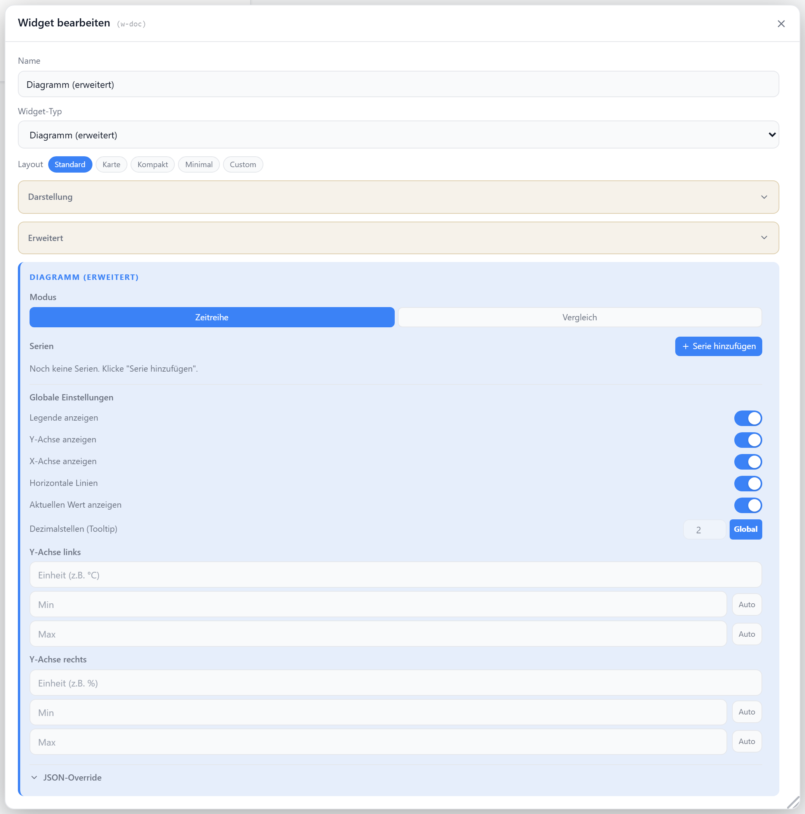

### Anzeige

| Option                   | Standard                                  |                                                                                                                                                            |
| ------------------------ | ----------------------------------------- | ---------------------------------------------------------------------------------------------------------------------------------------------------------- |
| `showTitle`              | `true`                                    | Titel anzeigen                                                                                                                                             |
| `showIcon`               | `true`                                    | Icon anzeigen                                                                                                                                              |
| `icon`                   | `BarChart2`                               | [Lucide-Icon](https://lucide.dev)                                                                                                                          |
| `iconSize`               | `20`                                      | px                                                                                                                                                         |
| `titleAlign`             | `left`                                    | `left` · `center` · `right`                                                                                                                                |
| `echartShowCurrent`      | `true`                                    | aktuelle Werte in der Kopfzeile anzeigen                                                                                                                   |
| `echartCurrentFrom`      | `last`                                    | welcher Punkt der „aktuelle“ ist: `last` (rechts) · `first` (links, für Reihen mit neuestem Wert vorn)                                                     |
| `echartCurrentAlign`     | `right`                                   | Position der Anzeige in der Kopfzeile: `right` · `left`                                                                                                    |
| `echartShowValues`       | im Vergleichs-Modus `true`, sonst `false` | Werte am Datenpunkt anzeigen (Format und Einheit wie im Tooltip; überlappende Beschriftungen entfallen) — Vorgabe für alle Serien, je Serie überschreibbar |
| `echartShowStackPercent` | `false`                                   | prozentualen Anteil an der Stapelsumme anzeigen (nur gestapelte Serien, siehe [Stapeln](#stapeln))                                                         |
| `echartShowLegend`       | `true`                                    | Legende anzeigen                                                                                                                                           |
| `echartAnimation`        | `true`                                    | Aufbau- und Übergangsanimation; aus, wenn Werte, Achsen oder Zeitraum ständig wechseln                                                                     |
| `decimals`               | globale Einstellung                       | Nachkommastellen in Tooltip, Wert-Labels, aktuellem Wert und Achsenbeschriftung                                                                            |

### Serien

| Option                         | Standard     |                                                                                                                                                                                                                    |
| ------------------------------ | ------------ | ------------------------------------------------------------------------------------------------------------------------------------------------------------------------------------------------------------------ |
| `echartMode`                   | `timeseries` | `timeseries` · `comparison` · `json`                                                                                                                                                                               |
| `echartSeries`                 | `[]`         | Liste der Serien (siehe unten)                                                                                                                                                                                     |
| `echartSeries[].name`          | `Serie N`    | Name in Legende/Tooltip                                                                                                                                                                                            |
| `echartSeries[].chartType`     | `line`       | `line` · `area` · `bar` · `scatter`                                                                                                                                                                                |
| `echartSeries[].color`         | Palette      | Linien-/Balkenfarbe                                                                                                                                                                                                |
| `echartSeries[].yAxisIndex`    | `0`          | `0` = links, `1` = rechte Y-Achse                                                                                                                                                                                  |
| `echartSeries[].smooth`        | `true`       | geglättete Linie (nur Linie/Fläche)                                                                                                                                                                                |
| `echartSeries[].stack`         | `false`      | Serie auf die anderen gestapelten Serien derselben Y-Achse addieren (siehe unten)                                                                                                                                  |
| `echartSeries[].aggregate`     | `average`    | `average` · `minmax` · `max` · `min` · `total` · `delta` · `none` — `minmax` erhält echte Extremwerte mit echten Zeitstempeln (empfohlen für änderungsbasiert geloggte Zähler wie Tagesregen), `delta` siehe unten |
| `echartSeries[].deltaBucket`   | `hour`       | `auto` · `hour` · `day` · `week` · `month` · `year` — Zeiteinheit für `aggregate: delta`                                                                                                                           |
| `echartSeries[].lineWidth`     | `2`          | Linienstärke 0–4, `0` = keine Linie (nur Linie/Fläche)                                                                                                                                                             |
| `echartSeries[].stackOutline`  | `false`      | Kontur eines gestapelten Bandes zeichnen (nur gestapelte Fläche)                                                                                                                                                   |
| `echartSeries[].areaOpacity`   | Auto         | Deckkraft der Fläche in Prozent 10–100 (nur Fläche); Auto = gestapelt 100 %, einzeln 20 %                                                                                                                          |
| `echartSeries[].showValues`    | Auto         | Werte am Datenpunkt dieser Serie: `Auto` folgt der Widget-Einstellung, `An` und `Aus` überschreiben sie                                                                                                            |
| `echartSeries[].labelInterval` | `1`          | nur jeden n-ten Wert beschriften (1–10), vom neuesten Punkt aus gezählt — nicht im Vergleichs-Modus                                                                                                                |

### Stapeln

`Stapeln` je Serie: die Serie wird auf die anderen gestapelten Serien **derselben Y-Achse** addiert —
z. B. Speicher-Entladung 150 W + Netzbezug 50 W als Bänder, die zusammen den Hausverbrauch von 200 W
ergeben. Für Linie, Fläche und Balken.

- Linke und rechte Y-Achse stapeln getrennt — Werte zweier verschieden skalierter Achsen zu addieren
  ergäbe keine sinnvolle Zahl.
- Eine gestapelte Achse beginnt bei 0, damit die Bandhöhen den Werten entsprechen. Ein gesetztes
  `Min` hat weiterhin Vorrang.
- Der Tooltip zeigt weiter den Einzelwert jeder Serie und zusätzlich eine Zeile `Σ Summe`.
- `Prozentualen Anteil am Stapel anzeigen` (Abschnitt „Anzeige“, erscheint sobald eine Serie stapelt)
  schreibt den Anteil an der Stapelsumme desselben Datenpunkts an den Balken bzw. Punkt und in den
  Tooltip. Zusammen mit `Werte am Datenpunkt anzeigen` steht er in Klammern hinter dem Wert, ohne
  diese Option allein. Anteil = `|Wert| / Σ|Werte des Stapels|` — mit Betrag, damit die Anteile auch
  bei einem negativen Mitglied 100 % ergeben. Kein Anteil bei Stapeln mit nur einer Serie je Achse,
  an Stellen ohne Wert und bei einer Stapelsumme von 0. Anzeige in ganzen Prozent, unter 10 % mit
  einer Nachkommastelle.
- Gestapelte Flächen sind deckend gefüllt: das Band zeigt genau die gewählte Farbe, wie Legende und
  Farbwähler. Bänder liegen übereinander statt voreinander, Transparenz würde die Farbe nur mit dem
  Hintergrund mischen. Weicher per `Flächen-Deckkraft` je Serie, unter der Linienstärke.
- Gestapelte Flächen werden ohne Kontur gezeichnet: die Kontur läge auf der Oberkante des Bandes
  darunter, eine Serie mit Wert 0 sähe also aus wie eine Linie ohne Fläche. Bei Bedarf per
  `Bandkontur` je Serie wieder einschalten — der Wert 0 bleibt in Tooltip und `Σ Summe` erhalten.
- Serien mit eigenen Zeitstempeln werden vorher auf eine gemeinsame Zeitachse gebracht (jede Serie
  behält ihren letzten gemeldeten Wert bis zur nächsten Messung). Vor dem ersten Datensatz einer
  Serie bleibt das Band offen, statt eine 0 zu erfinden.

### Werte-Transformation

ƒx-Button neben dem Datenpunkt-Feld der Serie. Reine Anzeige-Umrechnung `Wert × Faktor + Offset`,
je Serie einzeln — der Datenpunkt und seine History bleiben unverändert. Gilt für Kurve, Tooltip,
Legende und den aktuellen Wert; ein Preset (z. B. `W → kW`) setzt gleich die Einheit der Y-Achse,
an der die Serie hängt.

| Option                          | Standard |                         |
| ------------------------------- | -------- | ----------------------- |
| `echartSeries[].valueTransform` | —        | Preset-Id oder `custom` |
| `echartSeries[].valueFactor`    | `1`      | Multiplikator           |
| `echartSeries[].valueOffset`    | `0`      | Summand                 |

Bei `aggregate: delta` wird vor der Differenzbildung umgerechnet: der Faktor wirkt auf den Verbrauch,
der Offset fällt heraus (die Differenz zweier verschobener Zählerstände ist dieselbe).

### Skala der Y-Achse

| Serien auf der Achse              | Skala                                                                              |
| --------------------------------- | ---------------------------------------------------------------------------------- |
| Balken, gestapelt oder `delta`    | enthält immer die 0 — die Balkenlänge ist der Wert, die Nulllinie bleibt sichtbar  |
| nur Linie / Fläche / Punkte       | passt sich dem Wertebereich an (eine Kurve bei 200–250 klebt sonst am oberen Rand) |
| `echartLeftMin` / `echartLeftMax` | gesetzte Grenzen gewinnen in beiden Fällen                                         |

Beide Y-Achsen entscheiden das für sich: Balken links und eine Temperaturkurve rechts behalten
jede ihre passende Skala.

Die horizontalen Hilfslinien zeichnet immer nur **eine** Achse — zwei verschieden skalierte Raster
würden sich überkreuzen. Normalerweise die linke; hängen alle Serien an der rechten, übernimmt sie.

#### Negativ darstellen

Häkchen **Negativ darstellen (× −1)** im ƒx-Dialog. Zeichnet die Serie unter der Nulllinie —
für Einspeisung und Batterie-Ladung, die als positive Werte geliefert werden.

|                           |                                                                                     |
| ------------------------- | ----------------------------------------------------------------------------------- |
| Gespeichert als           | negatives `valueFactor` (× −1)                                                      |
| Mit Umrechnung kombiniert | ja — `Wh → kWh` negativ ist `−0.001`                                                |
| Bei `aggregate: delta`    | der Zählerstand wird unverändert differenziert, das Vorzeichen kommt auf die Balken |
| Gestapelt                 | positive Serien nach oben, negative nach unten                                      |
| Wertelabels               | wandern unter den Balken                                                            |

### Verbrauch aus Zählerständen

`aggregate: delta` für Zähler. Statt des Zählerstands wird der Zuwachs je Zeiteinheit gezeichnet — also der Verbrauch bzw. Ertrag pro Stunde, Tag, Woche, Monat oder Jahr.

| Bauart                       | Beispiel                                          |
| ---------------------------- | ------------------------------------------------- |
| fortlaufend steigend         | Strom-, Wasser-, Gaszähler, PV-Gesamtertrag       |
| täglicher Rücksprung auf `0` | PV-Tagesertrag, z. B. `solaredge.0.*.lastDayData` |

|                                |                                                                                                                                                                                                                                 |
| ------------------------------ | ------------------------------------------------------------------------------------------------------------------------------------------------------------------------------------------------------------------------------- |
| Datenquelle                    | Verlaufs-Adapter (history, influxdb, sql)                                                                                                                                                                                       |
| Zeiteinheit                    | `deltaBucket` — Kalendergrenzen in lokaler Zeit                                                                                                                                                                                 |
| Chart-Typ                      | beim Umschalten automatisch `bar`                                                                                                                                                                                               |
| Y-Achse                        | beginnt automatisch bei 0 (Balken werden von der Nulllinie gelesen)                                                                                                                                                             |
| Rücksprung um Mitternacht      | Reset eines Tageszählers; der Anstieg danach zählt voll                                                                                                                                                                         |
| Rücksprung innerhalb des Tages | bei einem täglich zurückspringenden Zähler der Reset des Tages (der Anstieg danach zählt voll); jeder weitere Rücksprung am selben Tag gilt als Ausreißer — weder er noch der Sprung zurück auf den alten Stand werden gewertet |
| Buckets ohne Datensatz         | übersprungen; ihr Verbrauch fällt in den nächsten Bucket mit Daten                                                                                                                                                              |
| Aktueller Wert oben rechts     | Verbrauch des laufenden Buckets, nicht der Zählerstand                                                                                                                                                                          |

Bilder dazu: [Beispiele](#beispiele).

`deltaBucket: auto` leitet die Zeiteinheit aus dem aktiven Zeitraum ab und wechselt mit, wenn im Frontend umgeschaltet wird:

| Zeitraum     | Zeiteinheit |
| ------------ | ----------- |
| bis 1 Tag    | pro Stunde  |
| bis 45 Tage  | pro Tag     |
| bis 180 Tage | pro Woche   |
| bis 1 Jahr   | pro Monat   |
| darüber      | pro Jahr    |

### JSON-Quelle

Für Serien mit `source: json` — im Modus `json` alle, im Modus `timeseries` die einzeln umgestellten.

`echartJsonTimeAxis` gilt nur im Modus `json`; in der Zeitreihe ist die Zeitachse gesetzt.

| Option                        | Standard    |                                                                   |
| ----------------------------- | ----------- | ----------------------------------------------------------------- |
| `echartSeries[].jsonPath`     | —           | Punkt-Pfad bis zum Array, z. B. `data.hours`; leer = Wurzel       |
| `echartSeries[].jsonLabelKey` | automatisch | Objekt-Feld für die X-Beschriftung; leer = erkennen               |
| `echartSeries[].jsonValueKey` | automatisch | Objekt-Feld für den Y-Wert; leer = erkennen                       |
| `echartJsonTimeAxis`          | `false`     | Beschriftungen als Zeitstempel lesen → Zeitachse statt Kategorien |
| `echartJsonAxisBounds`        | `false`     | min/max-Block aus dem Datenpunkt für die Y-Achse übernehmen       |
| `echartSeries[].jsonAxisPath` | automatisch | Punkt-Pfad zum min/max-Block, z. B. `axis`; leer = suchen         |

### Achsen

| Option                                  | Standard |                                                                                         |
| --------------------------------------- | -------- | --------------------------------------------------------------------------------------- |
| `echartShowYAxis`                       | `true`   | Y-Achsen anzeigen                                                                       |
| `echartShowYAxisRight`                  | `true`   | rechte Y-Achse beschriften; aus = nur die linke Skala, die rechte Achse skaliert weiter |
| `echartShowXAxis`                       | `true`   | X-Achse anzeigen                                                                        |
| `echartShowGridLines`                   | `true`   | horizontale Hilfslinien (von der Achse, an der die Serien hängen)                       |
| `echartLeftUnit`                        | —        | Einheit der linken Y-Achse                                                              |
| `echartRightUnit`                       | —        | Einheit der rechten Y-Achse                                                             |
| `echartLeftMin` / `echartLeftMax`       | `auto`   | Skala links; Zahl oder `dataMin`/`dataMax`                                              |
| `echartRightMin` / `echartRightMax`     | `auto`   | Skala rechts; Zahl oder `dataMin`/`dataMax`                                             |
| `echartLeftMinDp` / `echartLeftMaxDp`   | —        | Datenpunkt liefert die Grenze links — ändert sich die Zahl, skaliert die Achse mit      |
| `echartRightMinDp` / `echartRightMaxDp` | —        | Datenpunkt liefert die Grenze rechts                                                    |

Reihenfolge, wenn mehrere Quellen gesetzt sind: **Datenpunkt** → **min/max-Block im JSON** → feste Eingabe. Ein leerer oder nicht-numerischer Datenpunkt zählt nicht mit, dann gilt die nächste Quelle. Die Datenpunkt-Grenzen wirken in jedem Modus, auch im Gauge.

### Verlauf

Ein gemeinsamer Zeitraum für alle Serien.

| Option                   | Standard |                                                                                   |
| ------------------------ | -------- | --------------------------------------------------------------------------------- |
| `echartRange`            | `24h`    | `1h` · `6h` · `24h` · `7d` · `30d` · `1y` · `total` · `custom`                    |
| `echartRangeCustomValue` | `24`     | nur bei `custom`                                                                  |
| `echartRangeCustomUnit`  | `h`      | `h` · `d`, nur bei `custom`                                                       |
| `lockRange`              | `false`  | Zeitraum-Umschalter im Frontend ausblenden                                        |
| `echartVisibleRanges`    | alle     | Welche Presets der Frontend-Umschalter anbietet, z. B. `["6h","24h","7d","30d"]`  |
| `echartDayNav`           | `false`  | Tages-Navigation im Frontend (◀ Heute ▶ 📅) — einzelne Kalendertage durchblättern |
| `autoHistoryInstance`    | `false`  | History-Instanz je Serie automatisch erkennen                                     |

Die Tages-Navigation zeigt neben ◀ Heute ▶ das aktive Datum. Ein Klick darauf öffnet die
Datumsauswahl des Browsers und springt direkt auf den gewählten Tag — Tage in der Zukunft sind
gesperrt, ◀ und ▶ laufen danach von dort weiter.

`total` (Umschalter: **Gesamt**) zeichnet alles, was der Verlaufs-Adapter hergibt.

|                      |                                                                                         |
| -------------------- | --------------------------------------------------------------------------------------- |
| Fensterstart         | wird je Serie beim Adapter ermittelt, nicht konfiguriert                                |
| Auflösung            | ergibt sich aus der gefundenen Länge — je länger die Historie, desto grober der Schritt |
| Obergrenze der Suche | 20 Jahre; älter ist ioBroker selbst nicht                                               |
| `deltaBucket: auto`  | ab 400 Tagen Historie `year`, darunter entsprechend feiner                              |
| Adapter ohne Daten   | leeres Diagramm, wie jeder andere Zeitraum ohne Datensätze                              |

Der Fensterstart kostet eine zusätzliche, grobe Abfrage je Serie. Bei sehr langen Historien auf dem dateibasierten `history`-Adapter ist der erste Aufbau daher merklich langsamer als bei `influxdb` oder `sql`.

### JSON-Override

| Option            | Standard |                                                      |
| ----------------- | -------- | ---------------------------------------------------- |
| `echartJsonExtra` | —        | JSON, das tief in die ECharts-Optionen gemischt wird |

## Beispiele

Vier Datenpunkte, alle per `history.0` geloggt: PV-Ertragszähler `demo.0.PV.Ertrag_Gesamt` (kWh, fortlaufend steigend), Hausleistung `demo.0.Haus.Leistung` (W), Außentemperatur `demo.0.Wetter.Aussentemperatur` (°C) und Regenmenge `demo.0.Regen.Menge` (mm je Messintervall).

### Zählerstand → Tagesertrag

`aggregate: average` · `chartType: line` · `echartRange: 30d` — der Zähler steigt, der Tagesertrag ist daraus nicht ablesbar:

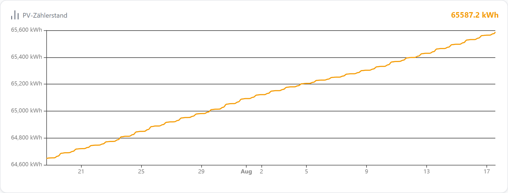

Derselbe Datenpunkt mit `aggregate: delta` · `deltaBucket: day` · `chartType: bar` · `echartLeftMin: 0`:

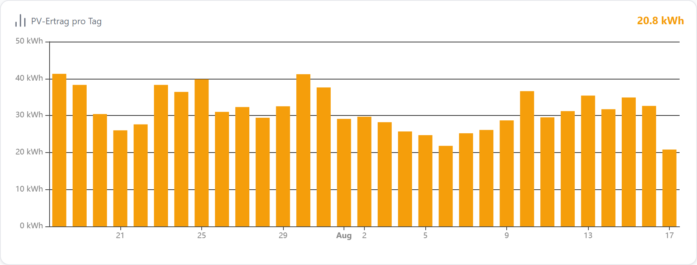

Die Einstellungen dazu im Editor:

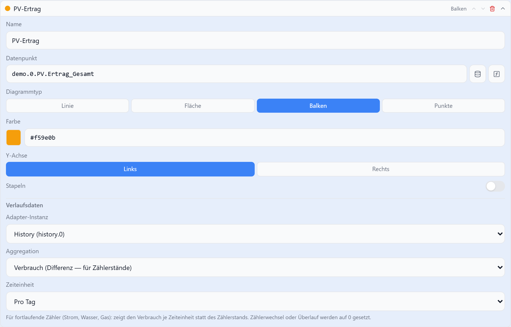

### Zeiteinheit

`deltaBucket: hour` · `echartRange: 24h` — Tagesverlauf, ein Balken je Stunde:

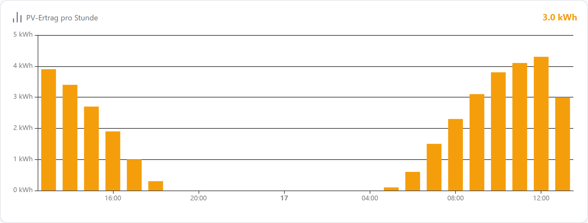

`deltaBucket: month` · `echartRange: 1y` — Monatserträge über ein Jahr:

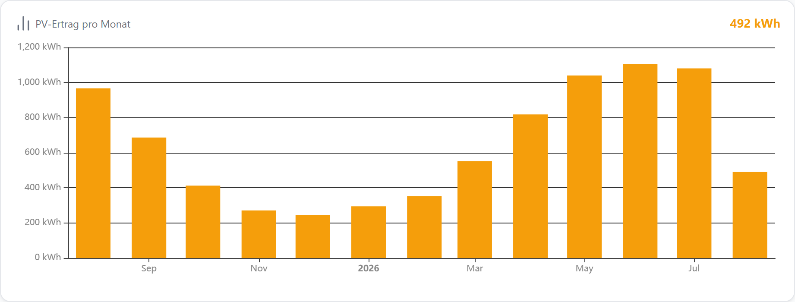

`deltaBucket: year` · `echartRange: custom` / `1825 d` — Jahreserträge, der letzte Balken ist das laufende Jahr:

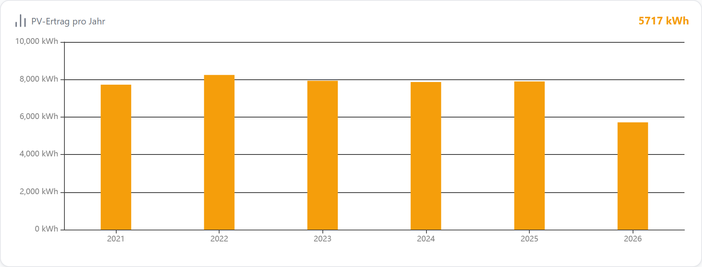

### Zeiteinheit automatisch

`deltaBucket: auto` · `echartVisibleRanges: ["24h","30d","1y"]` — die Zeiteinheit wechselt mit dem Umschalter im Frontend. **30 Tage** ergibt Tagesbalken:

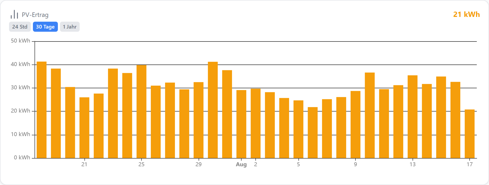

**1 Jahr** ergibt Monatsbalken — ohne Änderung an der Konfiguration:

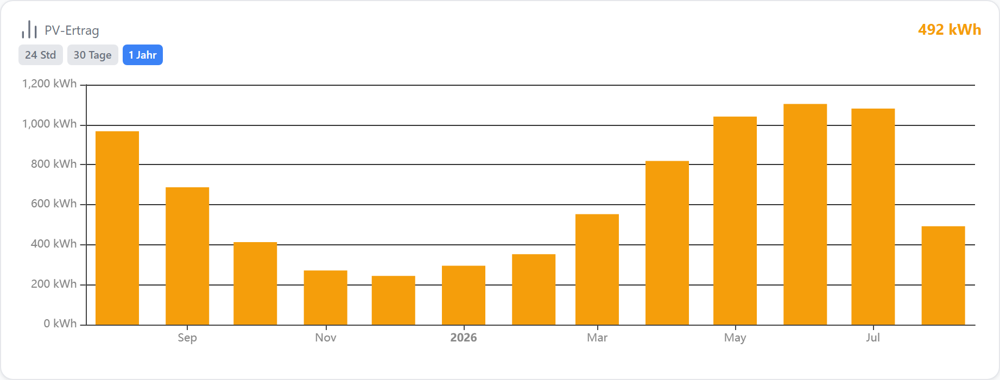

### Spitzen: Mittelwert oder Min/Max

Hausleistung über 24 h. `aggregate: average` glättet jedes 15-Minuten-Fenster — der Backofen wird zu einem Plateau, der Wasserkocher verschwindet fast:

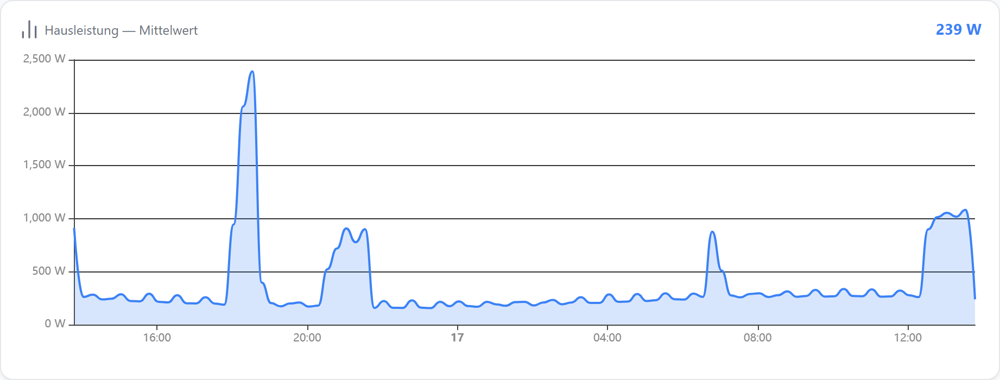

`aggregate: minmax` behält die echten Extremwerte samt Zeitstempel — die Spitzen und das Takten der Geräte bleiben sichtbar:

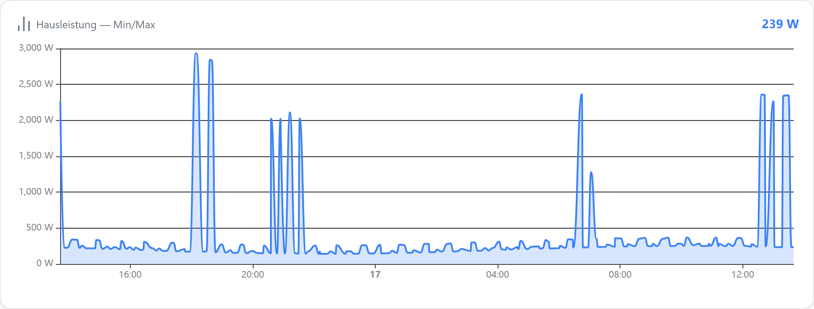

### Maximum, Mittelwert, Minimum

Derselbe Datenpunkt dreimal als eigene Serie, `echartRange: 1y` (Tages-Fenster): `max` zeichnet die Nachmittage, `min` die Nächte, `average` den Tagesmittelwert. Die Aggregation gilt je Serie, nicht je Widget.

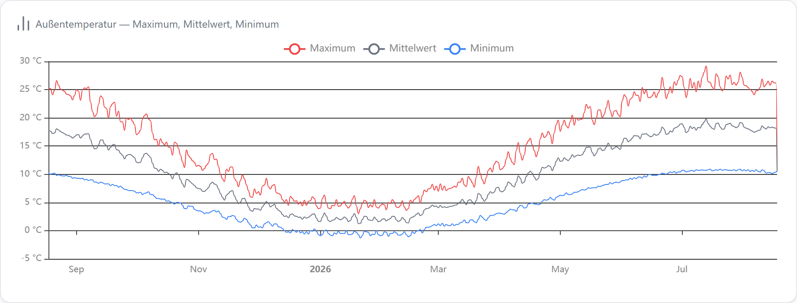

### Summe

`aggregate: total` addiert die Werte im Zeitfenster — für Datenpunkte, die bereits Zuwächse loggen (Regenmenge je Messintervall, Wh je Impuls), nicht für Zählerstände (dafür `delta`). Hier Regenmenge je 10 Minuten, summiert auf Stundenwerte:

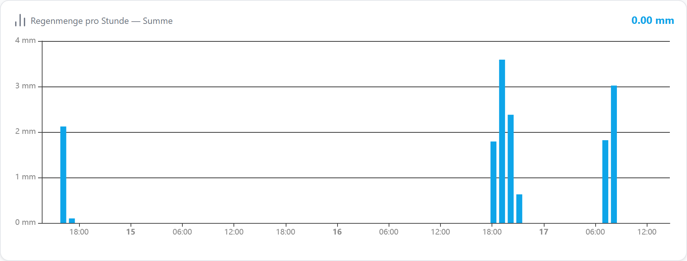

Derselbe Datenpunkt mit `average`: gleiche Form, aber der Durchschnitt der Einzelzuwächse — 0,6 mm statt 3,6 mm:

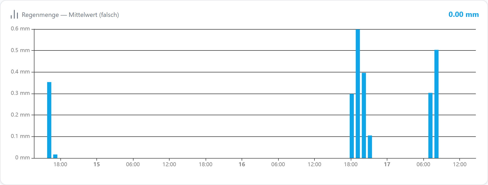

### Rohdaten

`aggregate: none` liefert jeden geloggten Datensatz, ohne Zeitfenster. Das Takten der Waschmaschine (2 300 W an/aus) ist damit sichtbar:

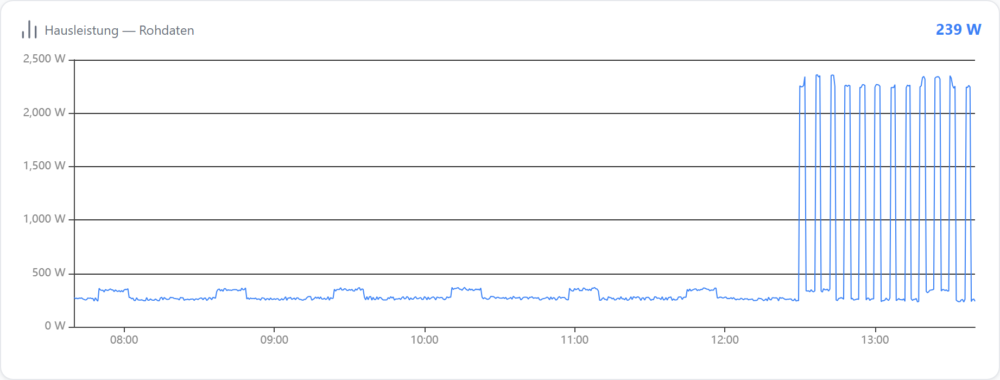

`average` fasst dasselbe in 5-Minuten-Fenster zusammen — aus dem Takten wird ein Plateau bei ~1 100 W:

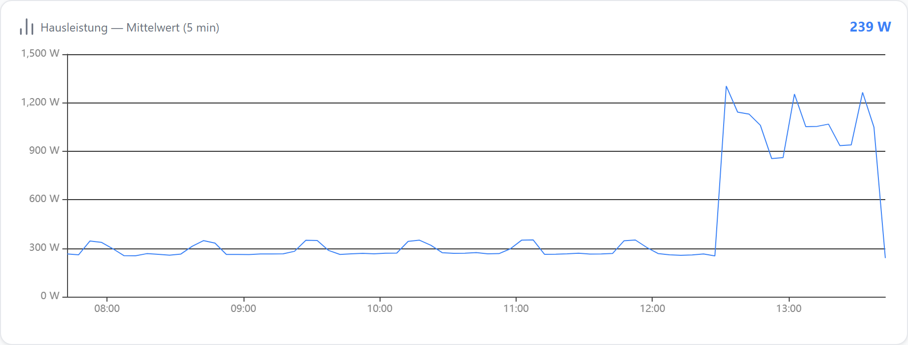

Viele Datensätze kosten Ladezeit; `none` ist für kurze Zeiträume gedacht, nicht für 30 Tage.

### Stapeln

Zwei Serien mit `stack: true` und `chartType: area` auf derselben Y-Achse: Netzbezug und Speicher-Entladung ergeben zusammen den Hausverbrauch. Der Tooltip zeigt die Einzelwerte plus `Σ Summe`.

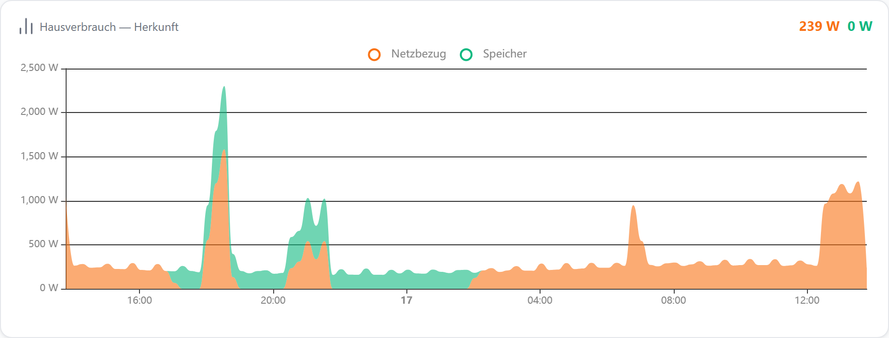

::: tip Bilder neu erzeugen
`node tools/screenshots/echart-examples.mjs` gegen einen laufenden `npm run dev`. Die Daten sind im Skript erzeugt (fester Zeitpunkt, fester Zufallsgenerator), es wird keine Instanz gelesen oder geschrieben.
:::
