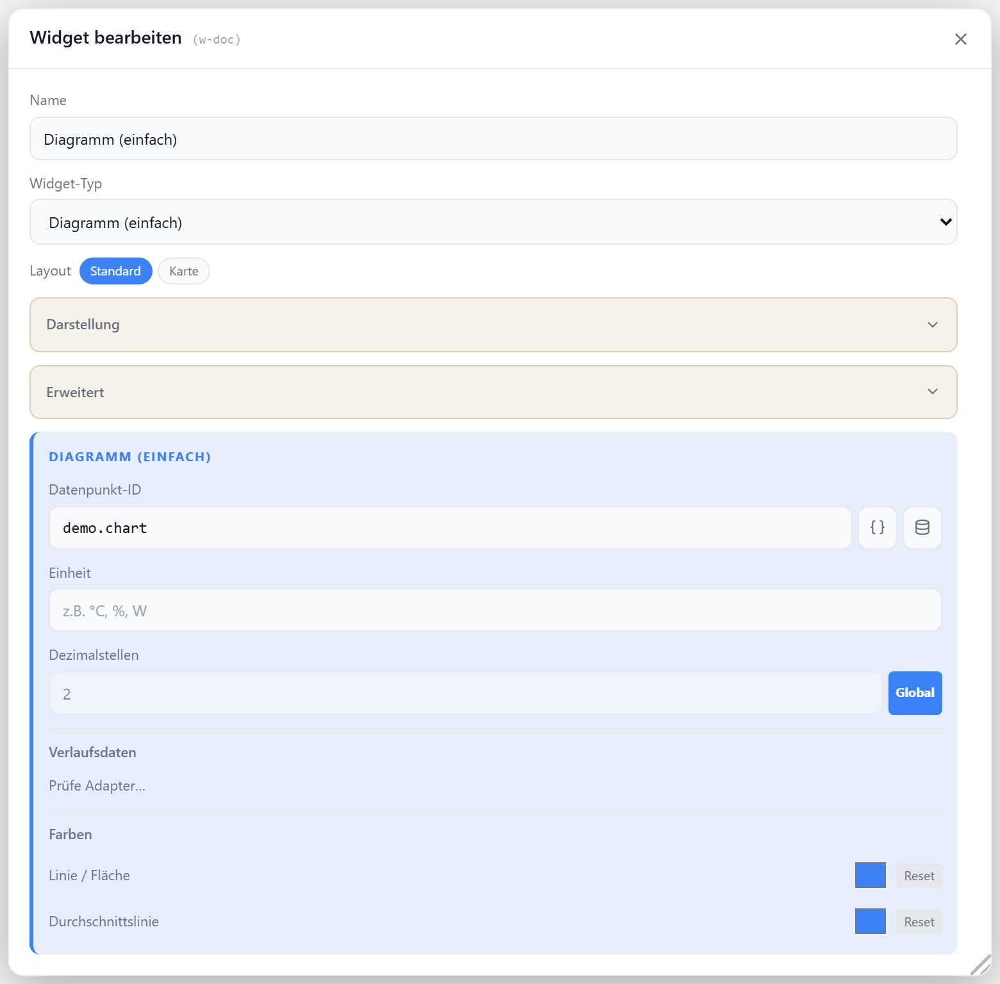

# Diagramm (einfach)

Zeigt den Verlauf eines einzelnen Datenpunkts als Linien- oder Flächendiagramm. Liest den Verlauf aus einer History-Instanz (History/SQL/InfluxDB); ohne konfigurierte Instanz wartet das Widget auf Live-Daten. Zeitraum, Achsen und Durchschnitt sind einstellbar.

## Datenpunkt

| Feld        | Pflicht | Typ      |                                         |
| ----------- | ------- | -------- | --------------------------------------- |
| `datapoint` | ja      | `number` | Datenpunkt, dessen Verlauf gezeigt wird |

Die Verlaufsdaten kommen aus der unter `historyInstance` gewählten Adapter-Instanz.

## Layouts

### Default

Titel/Icon und aktueller Wert oben, Liniendiagramm darunter — für mittlere Zellen.

### Card

Großer aktueller Wert mit Einheit oben, optionaler Durchschnitt, Flächendiagramm darunter — für prominente Kacheln.

## Einstellungen

Alle Optionen werden im Editor unter **Widget bearbeiten** gesetzt.

### Anzeige

| Option       | Standard            |                                   |
| ------------ | ------------------- | --------------------------------- |
| `showTitle`  | `true`              | Titel anzeigen                    |
| `showIcon`   | `true`              | Icon anzeigen                     |
| `icon`       | `TrendingUp`        | [Lucide-Icon](https://lucide.dev) |
| `iconSize`   | `20`                | px                                |
| `titleAlign` | `left`              | `left` · `center` · `right`       |
| `unit`       | —                   | Einheit hinter dem Wert           |
| `decimals`   | globale Einstellung | Nachkommastellen                  |

### Werte-Transformation

ƒx-Button neben dem Datenpunkt-Feld. Reine Anzeige-Umrechnung `Wert × Faktor + Offset` für Kurve,
aktuellen Wert, Durchschnitt, Y-Achse und Tooltip; der Datenpunkt und seine History bleiben unverändert.
Presets (z. B. `W → kW`, `Wh → kWh`) füllen die Einheit gleich mit.

Das Häkchen **Negativ darstellen (× −1)** kehrt das Vorzeichen um (gespeichert als negatives
`valueFactor`) und lässt sich mit jeder Umrechnung kombinieren.

| Option           | Standard |                         |
| ---------------- | -------- | ----------------------- |
| `valueTransform` | —        | Preset-Id oder `custom` |
| `valueFactor`    | `1`      | Multiplikator           |
| `valueOffset`    | `0`      | Summand                 |

### Verlauf

| Option                    | Standard |                                               |
| ------------------------- | -------- | --------------------------------------------- |
| `historyInstance`         | —        | History-Adapter-Instanz (z. B. `history.0`)   |
| `historyRange`            | `24h`    | `1h` · `6h` · `24h` · `7d` · `30d` · `custom` |
| `historyRangeCustomValue` | `24`     | nur bei `custom`                              |
| `historyRangeCustomUnit`  | `h`      | `h` · `d`, nur bei `custom`                   |
| `lockRange`               | `false`  | Zeitraum-Umschalter im Frontend ausblenden    |

### Achsen

| Option          | Standard |                                         |
| --------------- | -------- | --------------------------------------- |
| `showYAxis`     | `false`  | Y-Achse anzeigen                        |
| `yAxisCompact`  | `true`   | kompakte Y-Achsen-Beschriftung          |
| `showXAxis`     | `true`   | X-Achse (Zeit) anzeigen                 |
| `showGridLines` | `false`  | horizontale Hilfslinien an den Y-Werten |

### Linie & Durchschnitt

| Option               | Standard         |                                            |
| -------------------- | ---------------- | ------------------------------------------ |
| `lineColor`          | `--accent`       | Linienfarbe                                |
| `unitColor`          | `--text-primary` | Farbe der Einheit                          |
| `showAverage`        | `false`          | Durchschnitts-Referenzlinie im Diagramm    |
| `showAverageAsValue` | `false`          | Durchschnitt als Textwert (Ø) anzeigen     |
| `avgColor`           | `lineColor`      | Farbe von Linie und Wert des Durchschnitts |
