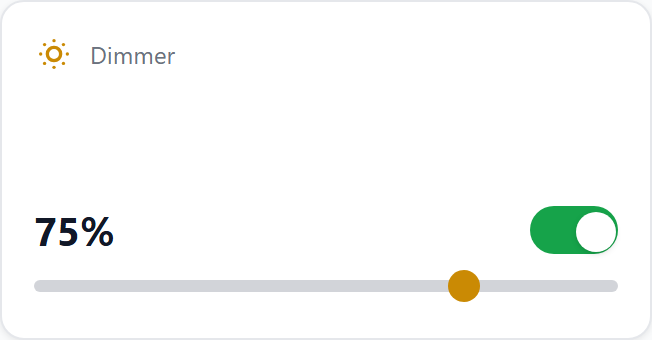
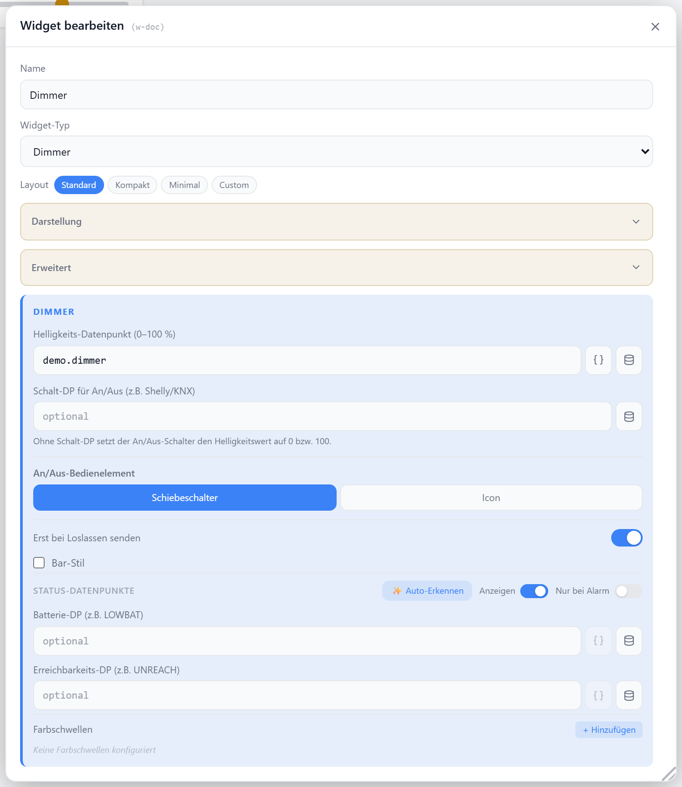

# Dimmer

Stellt einen Helligkeitswert (0–100 %) per Schieberegler ein und schaltet das Licht an/aus. Wahlweise mit separatem Schalt-Datenpunkt, Balken- oder Reglerstil und farbigen Schwellwerten.

## Datenpunkt

| Feld | Pflicht | Typ | |
| --- | --- | --- | --- |
| `datapoint` | ja | `number` | Helligkeit 0–100 % |
| `switchDp` | nein | `boolean` | separater An/Aus-DP; ohne ihn schaltet die Taste den Helligkeits-DP auf `0` / `100` |
| `onValue` / `offValue` | nein | — | Schreibwerte für `switchDp` (Standard `true` / `false`) |

## Layouts

### Default
Titel/Icon oben, Prozentwert mit Schalter, Schieberegler darunter — für mittlere Zellen.

### Compact
Eine Zeile mit Icon, Titel, Wert und Schalter, Regler darunter — für Listen mit vielen Dimmern.

### Minimal
Nur Prozentwert, Regler und Schalter zentriert — für sehr kleine Zellen.

### Custom
Icon, Wert, Regler und Schalter frei in einer Zellenmatrix platzieren — siehe [Custom-Layout](./custom-layout).

## Einstellungen

Alle Optionen werden im Editor unter **Widget bearbeiten** gesetzt.

### Anzeige

| Option | Standard | |
| --- | --- | --- |
| `showTitle` | `true` | Titel anzeigen |
| `showIcon` | `true` | Icon anzeigen |
| `showValue` | `true` | Prozentwert anzeigen |
| `icon` | `SunDim` | [Lucide-Icon](https://lucide.dev) |
| `iconSize` | `20` | px |
| `titleAlign` | `left` | `left` · `center` · `right` |

### Schieberegler

| Option | Standard | |
| --- | --- | --- |
| `showSlider` | `true` | Regler anzeigen |
| `sendOnRelease` | `true` | Wert erst beim Loslassen schreiben (sonst live) |
| `barStyle` | `false` | gefüllter Balken statt nativem Regler |
| `barSize` | `100` | Höhe des Balkens in % (nur bei `barStyle`) |

### Schalter

Schiebeschalter oder Icon-Taster — bei `controlMode: icon` werden `onIcon`/`offIcon` und `onColor`/`offColor` ausgewertet.

| Option | Standard | |
| --- | --- | --- |
| `showToggle` | `true` | Schalter anzeigen |
| `controlMode` | `toggle` | `toggle` · `icon` |
| `onIcon` / `offIcon` | `Power` | nur bei `icon` |
| `onColor` | `--accent-green` | CSS-Farbe oder Variable |
| `offColor` | `--text-secondary` | CSS-Farbe oder Variable |
| `controlIconSize` | `28` | px, nur bei `icon` |

### Schwellwerte

Färbt den Prozentwert abhängig von der Höhe.

| Option | Standard | |
| --- | --- | --- |
| `colorThresholds` | — | Liste aus `[Schwelle, Farbe]`, z. B. `[[30,"#f00"],[100,"#0f0"]]` |

### Status-Datenpunkte

Optionale Batterie- und Erreichbarkeits-DPs werden als kleine Badges eingeblendet (Abschnitt **Status-Datenpunkte** im Dialog).
