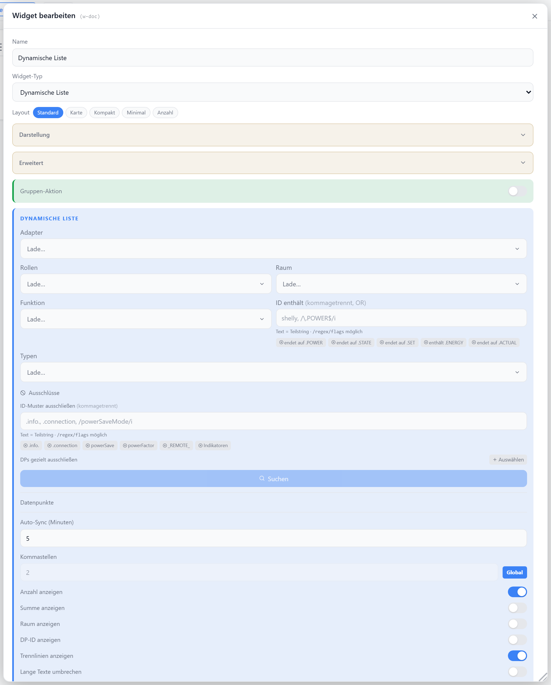

# Dynamische Liste

Listet Datenpunkte automatisch anhand von Filtern (Rolle, ID-Muster, Raum, Funktion, Typ, Adapter) auf und synchronisiert sie periodisch. Jeder gefundene Eintrag wird je nach Wert als Schalter, Regler, Wert oder Sensor-Badge dargestellt.

## Datenpunkt

Kein Haupt-Datenpunkt — die Einträge (`entries[]`) werden über die Filter ermittelt und beim Sync ergänzt. Booleans werden als Schalter, Zahlen mit Level-/Dimmer-Rolle als Regler, `value.*`/`level`-Rollen immer als Wert dargestellt.

## Layouts

### Default
Volle Zeilen mit Label, optionalem Raum/ID und Wert rechts — für Standardlisten.

### Card
Kacheln im Raster (Breite via `cardMinWidth`) mit großem zentriertem Wert.

### Compact
Zweispaltiges, dichtes Gitter — für viele Einträge auf wenig Platz.

### Minimal
Inline-Pills mit Label und Wert — für kompakte Status-Anzeigen.

### Count
Nur die Anzahl der (gefilterten) Einträge groß zentriert mit Icon und Titel.

### Custom
Einträge frei in einer Zellenmatrix platzieren — siehe [Custom-Layout](./custom-layout).

## Einstellungen

Alle Optionen werden im Editor unter **Widget bearbeiten** gesetzt.

### Datenpunkt-Suche

Mehrere Werte je Feld kommagetrennt; ID-Muster akzeptiert Text (Teilstring) oder `/regex/`.

| Option | Standard | |
| --- | --- | --- |
| `filterRoles` | — | Rollen (exakt, ODER-Verknüpfung) |
| `filterIdPattern` | — | ID-Muster (Text oder `/regex/`) |
| `filterRooms` | — | Räume |
| `filterFuncs` | — | Funktionen |
| `filterTypes` | — | Typen (`boolean`, `number`, …) |
| `filterAdapters` | — | Adapter-Instanzen (`hm-rpc.0`, …) |
| `excludeIdPatterns` | — | auszuschließende ID-Muster |
| `excludeIds` | — | einzeln ausgeschlossene IDs |
| `filterRelevant` | `true` | nur Widget-relevante Rollen/Typen übernehmen |
| `syncIntervalMin` | `5` | Sync-Intervall in Minuten |

### Anzeige

| Option | Standard | |
| --- | --- | --- |
| `showTitle` | `true` | Titel anzeigen |
| `showIcon` | `true` | Icon anzeigen |
| `icon` | `List` | [Lucide-Icon](https://lucide.dev) |
| `iconSize` | `20` | px |
| `titleAlign` | `left` | `left` · `center` · `right` |
| `showCount` | `true` | Anzahl hinter dem Titel |
| `showId` | `false` | Datenpunkt-ID unter dem Label |
| `showRoom` | `false` | Räume unter dem Label |
| `showEntryLastChange` | `false` | Zeitstempel der letzten Änderung je Eintrag |
| `decimals` | global | Nachkommastellen numerischer Werte |
| `cardMinWidth` | `90` | min. Kachelbreite in px (nur `card`) |
| `showDividers` | `true` | Trennlinien zwischen Einträgen |
| `wrapText` | `false` | lange Labels/Werte umbrechen statt abschneiden |
| `labelMinPercent` | `50` | min. Breite des Labels in % (nur bei `wrapText`) |

### Werte & Farben

| Option | Standard | |
| --- | --- | --- |
| `trueText` / `falseText` | — | globale AN/AUS-Texte (Eintrag überschreibt) |
| `activeColor` | `--accent-green` | Textfarbe bei AN |
| `inactiveColor` | `--text-secondary` | Textfarbe bei AUS |
| `activeBg` / `inactiveBg` | — | Hintergrund des Eintrags je Zustand |

### Filter

Frontend-Filter als Chip im Header; `backendValueFilter` steuert nur die Editor-Vorschau.

| Option | Standard | |
| --- | --- | --- |
| `valueFilter` | `all` | `all` · `active` · `inactive` |
| `filterActiveLabel` | `Nur aktive` | Chip-Text |
| `filterInactiveLabel` | `Nur inaktive` | Chip-Text |
| `backendValueFilter` | `all` | Vorschau-Filter im Editor |

### Sortierung

| Option | Standard | |
| --- | --- | --- |
| `sortBy` | `none` | `none` · `label` · `value` |
| `sortOrder` | `asc` | `asc` · `desc` |
| `sortBy2` | `none` | zweites Sortierkriterium |
| `sortOrder2` | `asc` | Richtung des zweiten Kriteriums |

### Summe

| Option | Standard | |
| --- | --- | --- |
| `showSum` | `false` | Summe der sichtbaren numerischen Werte |
| `sumLabel` | `Σ` | Prefix der Summenzeile |
| `sumAlign` | `left` | `left` · `center` · `right` |
| `sumFontSize` | `10` | px |

### Sammelschalter

| Option | Standard | |
| --- | --- | --- |
| `groupSwitch` | `false` | Sammelschalter im Header |
| `groupActionType` | `switch` | `switch` · `dimmer` · `shutter` · `momentary` |
| `groupDimmerOnValue` | `100` | Schreibwert bei „alle an" (Dimmer) |
| `groupExcludeIds` | — | ausgenommene Einträge |

### Zähler veröffentlichen

| Option | Standard | |
| --- | --- | --- |
| `publishCount` | `false` | gefilterte Anzahl nach `aura.0.lists.<id>.count` schreiben |
