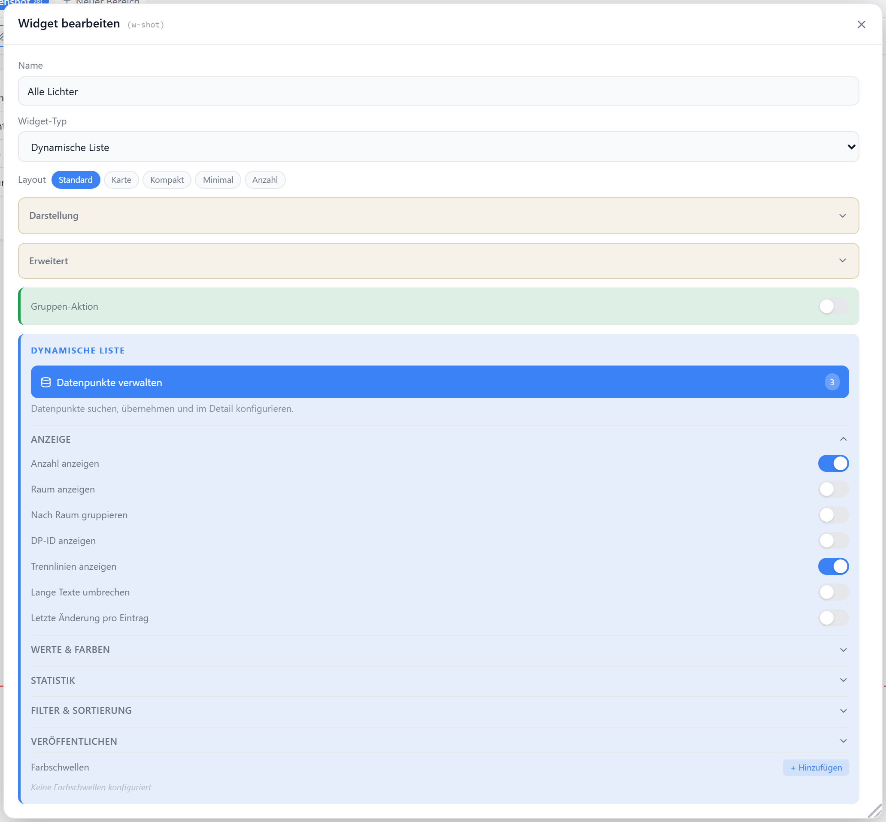
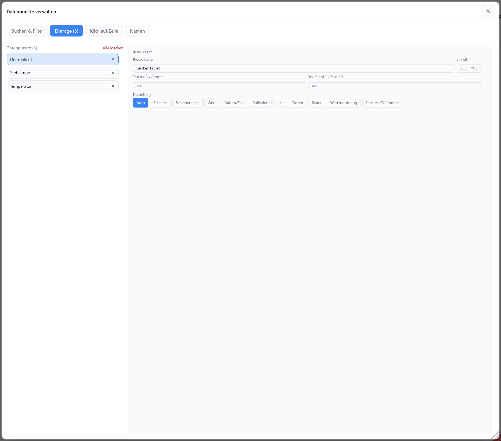

# Dynamische Liste

Listet Datenpunkte automatisch anhand von Filtern (Rolle, ID-Muster, Raum, Funktion, Typ, Adapter) auf und synchronisiert sie periodisch. Jeder gefundene Eintrag wird je nach Wert als Schalter, Regler, Wert oder Sensor-Badge dargestellt.

## Datenpunkt

Kein Haupt-Datenpunkt — die Einträge (`entries[]`) werden über die Filter ermittelt und beim Sync ergänzt. Booleans werden als Schalter, Zahlen mit Level-/Dimmer-Rolle als Regler, `value.*`/`level`-Rollen immer als Wert dargestellt.

Pro Eintrag lässt sich die Darstellung erzwingen (`displayType`) — inklusive `time` für Zeit-Datenpunkte (Uhrzeit / Datum / beides / eigenes Muster, siehe [Statische Liste](./liste#darstellung-datum-zeit)) und `input` für ein [Eingabefeld](./liste#darstellung-eingabefeld) in der Zeile.

Pro Eintrag (Dialog **Datenpunkte verwalten** → Abschnitt **Datenpunkt**) lässt sich der Wert außerdem nur für die Anzeige umrechnen und/oder als Uhrzeit/Datum formatieren, siehe [Wert-Umrechnung / Zeit](./liste#wert-umrechnung-zeit). Ohne eigene Einstellung gilt die globale Umrechnung der Liste.

## Layouts

### Default
Volle Zeilen mit Label, optionalem Raum/ID und Wert rechts — für Standardlisten.

### Card
Kacheln im Raster (Breite via `cardMinWidth`) mit großem zentriertem Wert.

### Compact
Zweispaltiges, dichtes Gitter — für viele Einträge auf wenig Platz.

### Minimal
Inline-Pills mit Label und Wert — für kompakte Status-Anzeigen.

### Count
Nur die Anzahl der (gefilterten) Einträge groß zentriert mit Icon und Titel.

## Einstellungen

Im Editor unter **Widget bearbeiten**. Die Datenpunkte selbst liegen dahinter im eigenen Dialog **Datenpunkte verwalten**; im Panel bleiben nur die Optionen der Liste als Ganzes, in aufklappbaren Abschnitten.

### Datenpunkte verwalten

Links alle Einträge, rechts die vollständige Konfiguration des ausgewählten. Der Dialog ist verschiebbar, größenveränderbar und merkt sich seine Größe.

| Tab | |
| --- | --- |
| Suchen & Filter | Datenpunkt-Suche, Ausschlüsse, Trefferliste, Übernehmen — dazu Sync-Intervall und „Nur relevante DPs" |
| Einträge | Gefundene Datenpunkte; rechts der Detail-Editor (Bezeichnung, Einheit, Darstellung, Farben) |
| Klick auf Zeile | Detail-Popup beim Klick auf eine Zeile (siehe unten) |
| Namen | Namensmuster und Namens-Filter |

Der Detail-Editor rechts ist in Abschnitte gegliedert: **Datenpunkt** · **Beschriftung** · **Darstellung** (mit dem gewählten Typ als Kennzeichen, darin alle typabhängigen Felder) · **Verhalten** (letzte Änderung, Klick auf Zeile).

### Datenpunkt-Suche

Dialog **Datenpunkte verwalten** → Tab **Suchen & Filter**. Mehrere Werte je Feld kommagetrennt; ID-Muster akzeptiert Text (Teilstring) oder `/regex/`.

| Option | Standard | |
| --- | --- | --- |
| `filterRoles` | — | Rollen (exakt, ODER-Verknüpfung) |
| `filterIdPattern` | — | ID-Muster (Text oder `/regex/`) |
| `filterRooms` | — | Räume |
| `filterFuncs` | — | Funktionen |
| `filterTypes` | — | Typen (`boolean`, `number`, …) |
| `filterAdapters` | — | Adapter-Instanzen (`hm-rpc.0`, …) |
| `excludeIdPatterns` | — | auszuschließende ID-Muster |
| `excludeIds` | — | einzeln ausgeschlossene IDs |
| `filterRelevant` | `true` | nur Widget-relevante Rollen/Typen übernehmen |
| `syncIntervalMin` | `5` | Sync-Intervall in Minuten |

### Klick auf Zeile

Dialog **Datenpunkte verwalten** → Tab **Klick auf Zeile**. Ein Klick auf eine Listenzeile öffnet ein Detail-Popup zu genau diesem Datenpunkt. Klicks auf Schalter, Regler oder Buttons in der Zeile schalten weiterhin direkt.

| Option | Standard | |
| --- | --- | --- |
| `rowClickAction` | Aus | `auto` · `{ "kind": "none" }` (aus) · vollständige Klick-Aktion |
| `rowPopupTitle` | Zeilenname | Titel des Popups |
| `rowPopupWidth` / `rowPopupHeight` | auto | px |
| `rowPopupAutoCloseSec` | View/Global | Sekunden, `0` = aus |

Standard ohne eigene Einstellung: **Aus** — Zeilen reagieren nicht auf Klicks. **Eigene Aktion** startet mit *Popup: Alle Datenpunkte des Geräts*, Umfang **Gleicher Strang (Elternobjekt)**, **Nur relevante Datenpunkte** an — entspricht `{ "kind": "popup-dps", "scope": "parent", "relevantOnly": true }`. **Automatisch** (Popup nach Rolle) muss aktiv gewählt werden.

Automatik nach Rolle des Datenpunkts:

| Rolle | Popup |
| --- | --- |
| `level.dimmer` · `level.*` · `*dimmer*` · `*brightness*` | Dimmer |
| `switch` · `switch.*` · `sensor.*` · `indicator.*` · `button` | Schalter |
| `level.blind` · `*shutter*` · `*cover*` · `*awning*` | Rollladen |
| `level.temperature` · `heating*` | Thermostat |
| `media.*` (außer `media.volume`) | Schalter |
| sonst | `Standard: Datenpunkt` (Wert, Steuerung, ID, letzte Änderung) |

Zugewiesene [Widget-Typ-Standards](../einstellungen/popups#widget-typ-standards) gelten auch hier — wer dem Typ `switch` eine eigene View zuweist, bekommt sie auch in der Liste.

Pro Datenpunkt lässt sich das im Detail-Editor überschreiben (`entries[].clickAction`):

| Modus | |
| --- | --- |
| Wie Liste | Übernimmt die Listen-Einstellung — der Normalfall |
| Automatisch | Erzwingt die Ableitung aus der Rolle, auch wenn die Liste auf `Aus` oder eine eigene Aktion steht |
| Aus | Diese Zeile reagiert nicht auf Klicks |
| Eigene Aktion | Vollständige Klick-Aktion nur für diese Zeile — eine Zeile öffnet ein Widget-Popup, die nächste springt in einen anderen Tab. Popup-Titel und -Größe kommen weiterhin aus der Listen-Einstellung |

Navigations-Aktionen (`Sprung: Tab` · `Externe URL` · `Widget`) springen direkt, statt ein Popup zu öffnen.

::: tip Badges-Layout
Ein Badge ist die ganze Zeile. Bei `Automatisch` schalten schaltbare Badges weiterhin, das Popup übernimmt nur Badges ohne eigenen Schalter (Sensoren, schreibgeschützte und numerische Werte). Eine ausdrücklich gesetzte Aktion gewinnt dagegen auch bei schaltbaren Badges.
:::

### Anzeige

| Option | Standard | |
| --- | --- | --- |
| `showTitle` | `true` | Titel anzeigen |
| `showIcon` | `true` | Icon anzeigen |
| `icon` | `List` | [Lucide-Icon](https://lucide.dev) |
| `iconSize` | `20` | px |
| `titleAlign` | `left` | `left` · `center` · `right` |
| `showCount` | `true` | Anzahl hinter dem Titel |
| `showId` | `false` | Datenpunkt-ID unter dem Label |
| `showRoom` | `false` | Räume unter dem Label |
| `showEntryLastChange` | `false` | Zeitstempel der letzten Änderung je Eintrag |
| `decimals` | global | Nachkommastellen numerischer Werte |
| `cardMinWidth` | `90` | min. Kachelbreite in px (nur `card`) |
| `showDividers` | `true` | Trennlinien zwischen Einträgen |
| `wrapText` | `false` | lange Labels/Werte umbrechen statt abschneiden |
| `labelMinPercent` | `50` | min. Breite des Labels in % (nur bei `wrapText`) |

### Werte & Farben

| Option | Standard | |
| --- | --- | --- |
| `trueText` / `falseText` | — | globale AN/AUS-Texte (Eintrag überschreibt) |
| `activeColor` | `--accent-green` | Textfarbe bei AN |
| `inactiveColor` | `--text-secondary` | Textfarbe bei AUS |
| `activeBg` / `inactiveBg` | — | Hintergrund des Eintrags je Zustand |
| `valueTransform` / `valueFactor` / `valueOffset` | — | globale [Wert-Umrechnung](./liste#wert-umrechnung-zeit) (Eintrag überschreibt) |
| `valueTimeFormat` / `valueTimePattern` | — | globale Zeit-Formatierung (Eintrag überschreibt) |

### Filter

Frontend-Filter als Chip im Header; `backendValueFilter` steuert nur die Editor-Vorschau.

| Option | Standard | |
| --- | --- | --- |
| `valueFilter` | `all` | `all` · `active` · `inactive` |
| `filterActiveLabel` | `Nur aktive` | Chip-Text |
| `filterInactiveLabel` | `Nur inaktive` | Chip-Text |
| `backendValueFilter` | `all` | Vorschau-Filter im Editor |

### Sortierung

| Option | Standard | |
| --- | --- | --- |
| `sortBy` | `none` | `none` · `label` · `value` |
| `sortOrder` | `asc` | `asc` · `desc` |
| `sortBy2` | `none` | zweites Sortierkriterium |
| `sortOrder2` | `asc` | Richtung des zweiten Kriteriums |

### Summe

| Option | Standard | |
| --- | --- | --- |
| `showSum` | `false` | Summe der sichtbaren numerischen Werte |
| `sumLabel` | `Σ` | Prefix der Summenzeile |
| `sumAlign` | `left` | `left` · `center` · `right` |
| `sumFontSize` | `10` | px |

### Sammelschalter

| Option | Standard | |
| --- | --- | --- |
| `groupSwitch` | `false` | Sammelschalter im Header |
| `groupActionType` | `switch` | `switch` · `dimmer` · `shutter` · `momentary` |
| `groupDimmerOnValue` | `100` | Schreibwert bei „alle an" (Dimmer) |
| `groupExcludeIds` | — | ausgenommene Einträge |

### Zähler veröffentlichen

| Option | Standard | |
| --- | --- | --- |
| `publishCount` | `false` | gefilterte Anzahl nach `aura.0.lists.<id>.count` schreiben |
