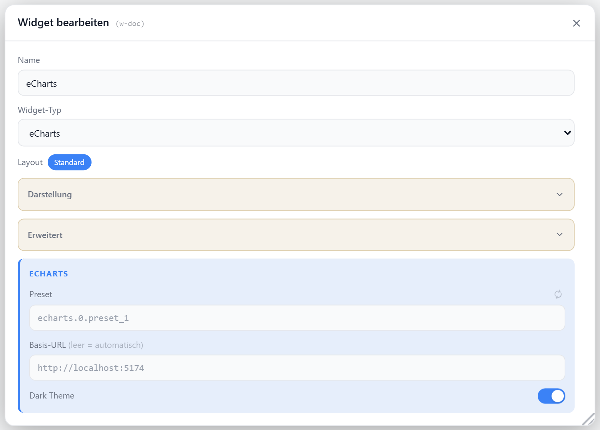

# eCharts

Bettet ein vorkonfiguriertes eCharts-Diagramm per JSON-Preset über ein `<iframe>` ein. Das Preset wird im ioBroker-Adapter `echarts` angelegt; das Widget lädt es per `preset`-ID. Mit Vollbild-Button.

## Datenpunkt

Kein Datenpunkt — das Diagramm wird über die Preset-ID des `echarts`-Adapters geladen.

| Feld | Pflicht | Typ | |
| --- | --- | --- | --- |
| `presetId` | ja | — | ID des eCharts-Presets, z. B. `echarts.0.preset_1` |

## Layouts

Keine Layout-Varianten — das Diagramm füllt die Zelle, optional mit Titel/Icon-Kopfzeile.

## Einstellungen

Alle Optionen werden im Editor unter **Widget bearbeiten** gesetzt.

### Diagramm

| Option | Standard | |
| --- | --- | --- |
| `presetId` | — | Preset-ID; per Auswahlliste aus dem `echarts`-Adapter oder manuell |
| `baseUrl` | automatisch | Basis-URL des ioBroker-Servers; leer = aktuelle Origin |
| `darkMode` | `true` | dunkles eCharts-Theme |

### Anzeige

| Option | Standard | |
| --- | --- | --- |
| `showTitle` | `true` | Titel anzeigen |
| `showIcon` | `true` | Icon anzeigen |
| `icon` | `BarChart2` | [Lucide-Icon](https://lucide.dev) |
| `iconSize` | `20` | px |
| `titleAlign` | `left` | `left` · `center` · `right` |
