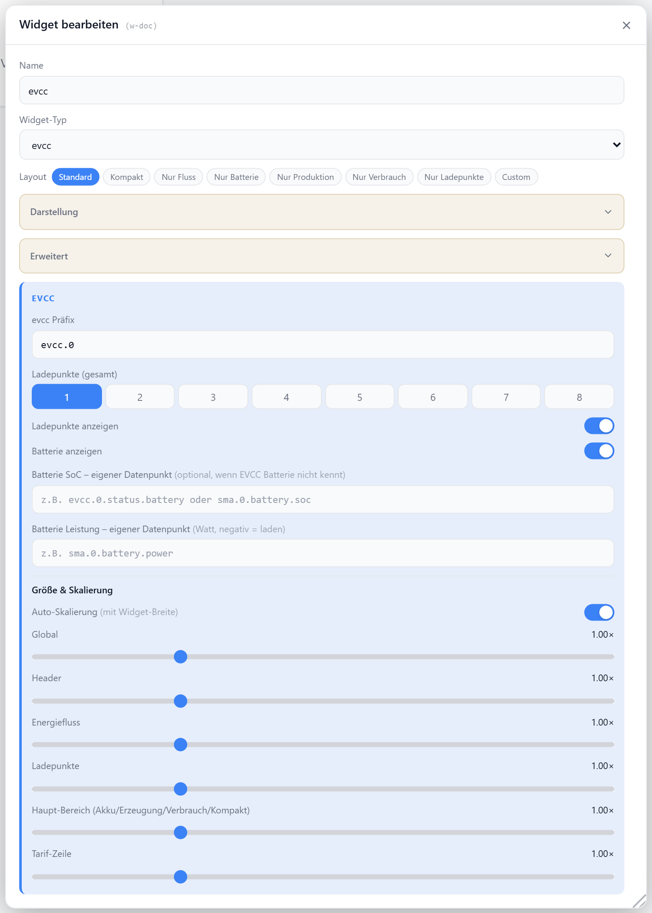

# Energiefluss (evcc)

PV-Erzeugung, Hausverbrauch, Netz und Hausbatterie als Energiefluss-Grafik. Die Werte kommen aus einer [evcc](https://evcc.io)-Instanz oder aus frei gewählten Datenpunkten — damit ist das Widget auch ohne evcc für jede PV-Anlage nutzbar. Mit evcc zusätzlich bis zu acht Ladepunkte, pro Ladepunkt Lademodus (`AUS` · `PV` · `MIN+PV` · `SOFORT`) und Ziel-SoC direkt umschaltbar.

## Datenquelle

Kein Haupt-Datenpunkt. Zwei Wege, kombinierbar:

**evcc-Instanz** — das Auswahlfeld listet die gefundenen evcc-Instanzen; ist keine installiert, wird das Präfix von Hand eingetragen. Gelesen wird unter dem Präfix (`status.*`, `loadpoint.N.status.*`), Steuerbefehle gehen nach `loadpoint.N.control.*`.

**Eigene Datenpunkte** — überschreiben je Wert die Instanz. Sind alle fünf gesetzt, wird keine evcc-Instanz gebraucht: das Präfix bleibt einfach leer.

| Feld | Pflicht | Typ | |
| --- | --- | --- | --- |
| `evccPrefix` | nein | — | evcc-Instanz, Standard `evcc.0`; leer = nur eigene Datenpunkte |
| `pvPowerDatapoint` | nein | `number` | PV-Erzeugung in Watt |
| `homePowerDatapoint` | nein | `number` | Hausverbrauch in Watt |
| `gridPowerDatapoint` | nein | `number` | Netzleistung in Watt (positiv = Bezug, negativ = Einspeisung) |
| `batterySocDatapoint` | nein | — | Batterie-Ladestand (Prozent oder JSON `{soc,power}`) |
| `batteryPowerDatapoint` | nein | `number` | Batterie-Leistung in Watt (negativ = laden) |

Ohne eigenen Datenpunkt wird die Netzleistung automatisch aus der ersten passenden Quelle gelesen: `status.gridPower` · `status.grid` (JSON) · `status.Grid.power` (evcc-Adapter ≤ 0.2.8) · `status.Grid.Power` (evcc-Adapter ≥ 0.2.9).

Die Ladepunkte gibt es nur mit evcc — sie liegen unter `loadpoint.N.*`, Pfade, die kein anderer Adapter hat.

## Layouts

### Default
Energiefluss-Zeile (Sonne · Haus · Netz, darunter Batterie) plus Ladepunkt-Karten und Tarif-Zeile.

### Card
Wie Default — gleicher Aufbau mit Energiefluss-Zeile und Ladepunkten.

### Flow
Animiertes Energiefluss-Diagramm als SVG mit Sonne, Netz, Haus, Batterie und Ladepunkten.

### Loadpoints
Nur die ausführlichen Ladepunkt-Karten, scrollbar.

### Compact
Eine kompakte Werte-Zeile (Sonne · Haus · Netz · Batterie) plus schmale Ladepunkt-Zeilen.

### Battery
Nur die Hausbatterie als großer Ladebalken mit SoC und Lade-/Entladeleistung.

### Production
Nur die PV-Erzeugung groß, mit Einspeisung und Eigenanteil.

### Consumption
Nur der Hausverbrauch groß, mit Netzbezug/-einspeisung und Tarif.

### Custom
Felder `pvPower`, `gridPower`, `homePower`, `batterySoc`, `batteryPower`, `gridImport`, `gridExport` frei in einer Zellenmatrix platzieren — siehe [Custom-Layout](./custom-layout).

## Einstellungen

Alle Optionen werden im Editor unter **Widget bearbeiten** gesetzt.

### Quelle & Umfang

| Option | Standard | |
| --- | --- | --- |
| `evccPrefix` | `evcc.0` | Adapter-Instanz |
| `loadpointCount` | `1` | Anzahl Ladepunkte (`1`–`8`) |
| `showLoadpoints` | `true` | Ladepunkte anzeigen |
| `visibleLoadpoints` | `[]` | angezeigte Ladepunkte (leer = alle) |
| `showBattery` | `true` | Hausbatterie anzeigen |
| `batterySocDatapoint` | — | eigener SoC-Datenpunkt |
| `batteryPowerDatapoint` | — | eigener Leistungs-Datenpunkt |
| `gridPowerDatapoint` | — | eigener Netzleistungs-Datenpunkt |

### Anzeige

| Option | Standard | |
| --- | --- | --- |
| `showTitle` | `true` | Titel anzeigen |
| `showIcon` | `true` | Icon anzeigen |
| `icon` | `Zap` | [Lucide-Icon](https://lucide.dev) |
| `iconSize` | `20` | px |
| `titleAlign` | `left` | `left` · `center` · `right` |

### Größe & Skalierung

Bei `1` entspricht die Darstellung der übrigen Widgets (12 px Titel, 20 px Icon). `autoScale` verkleinert nur — sobald das Widget schmaler als 280 px ist. Größer wird es über die Regler oder ein angehobenes `autoScaleMax`.

| Option | Standard | |
| --- | --- | --- |
| `autoScale` | `true` | bei schmalem Widget verkleinern |
| `autoScaleMin` | `0.6` | untere Skalierungsgrenze |
| `autoScaleMax` | `1` | obere Skalierungsgrenze |
| `sizeScale` | `1` | globale Skalierung |
| `headerScale` | `1` | Kopfzeile |
| `flowScale` | `1` | Energiefluss |
| `loadpointScale` | `1` | Ladepunkte |
| `mainScale` | `1` | Haupt-Bereich (Akku/Erzeugung/Verbrauch/Kompakt) |
| `tariffScale` | `1` | Tarif-Zeile |
