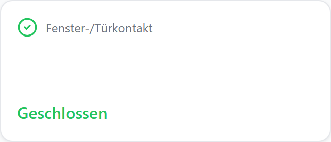
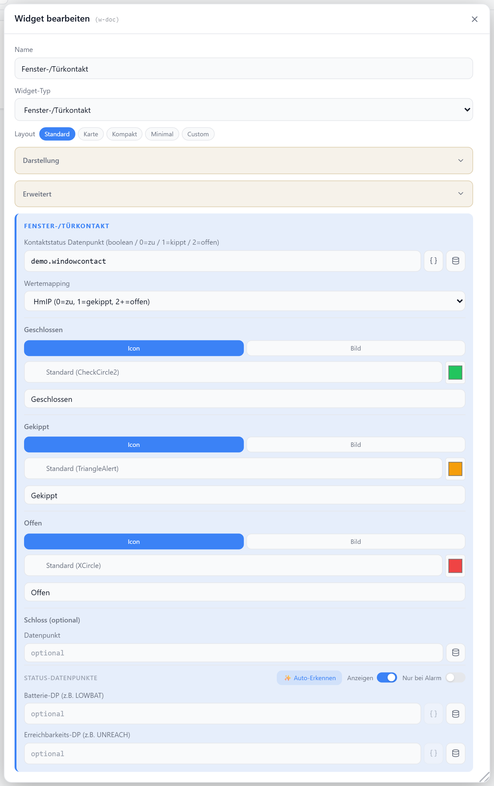

# Fenster-/Türkontakt

Zeigt den Status eines Fenster- oder Türkontakts an (geschlossen / gekippt / offen). Die Zustände werden über Wert-Presets (z. B. HmIP, Boolean) oder eigene Wertlisten ermittelt, jeweils mit eigenem Icon, Farbe und Beschriftung.

## Datenpunkt

| Feld | Pflicht | Typ | |
| --- | --- | --- | --- |
| `datapoint` | ja | `boolean` / `number` / `string` | Kontakt-Status, per Preset gemappt |
| `lockDp` | nein | — | Verriegelungs-DP, als Schloss-Badge eingeblendet |

Optionale Batterie- und Erreichbarkeits-DPs werden als Badges angezeigt (Abschnitt **Status-Datenpunkte**).

## Layouts

### Default
Titel/Icon oben, darunter der Status-Text in Zustandsfarbe — für mittlere Zellen.

### Card
Vollflächige farbige Karte in der Zustandsfarbe mit Icon, Titel und Status.

### Compact
Eine Zeile mit Icon, Titel und Status-Badge — für Listen.

### Minimal
Großes Icon mit Status-Text zentriert — für kleine Zellen.

### Custom
Icon, Status, Schloss- und Batterie-Felder frei platzieren — siehe [Custom-Layout](./custom-layout).

## Einstellungen

Alle Optionen werden im Editor unter **Widget bearbeiten** gesetzt.

### Anzeige

| Option | Standard | |
| --- | --- | --- |
| `showTitle` | `true` | Titel anzeigen |
| `showIcon` | `true` | Icon anzeigen |
| `showLabel` | `true` | Status-Text anzeigen |
| `iconSize` | `20` | px |
| `titleAlign` | `left` | `left` · `center` · `right` |
| `contentPosition` | — | Ausrichtung im Default-Layout |

### Zustands-Erkennung

`statePreset` bestimmt, welche Rohwerte auf `closed` / `tilted` / `open` gemappt werden. Bei `custom` greifen die eigenen Wertlisten (Komma-getrennt).

| Option | Standard | |
| --- | --- | --- |
| `statePreset` | `hmip` | `hmip` · `boolean` · `boolean_inverted` · `0_7` · `string_hmip` · `custom` |
| `stateValuesClosed` | `0` | Werte für „geschlossen" (nur `custom`) |
| `stateValuesTilted` | — | Werte für „gekippt" (nur `custom`) |
| `stateValuesOpen` | `2,3,4,5,6,7` | Werte für „offen" (nur `custom`) |

### Zustands-Darstellung

Je Zustand (`closed` / `tilted` / `open`) konfigurierbar:

| Option | Standard | |
| --- | --- | --- |
| `<state>Type` | `icon` | `icon` oder `base64`-Bild |
| `<state>Icon` | Zustands-Default | [Lucide-Icon](https://lucide.dev) |
| `<state>Color` | grün / orange / rot | Farbe |
| `<state>Base64` | — | eigenes Bild (bei `base64`) |
| `<state>Label` | `Geschlossen` / `Gekippt` / `Offen` | Status-Text |

### Verriegelung

| Option | Standard | |
| --- | --- | --- |
| `lockLockedValues` | `true,1` | Rohwerte, die als „abgeschlossen" gelten |
