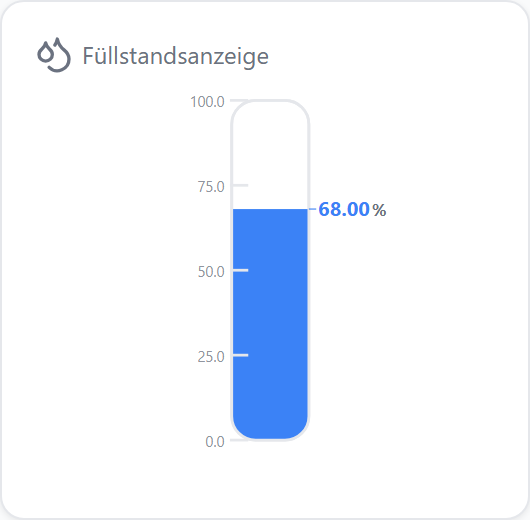
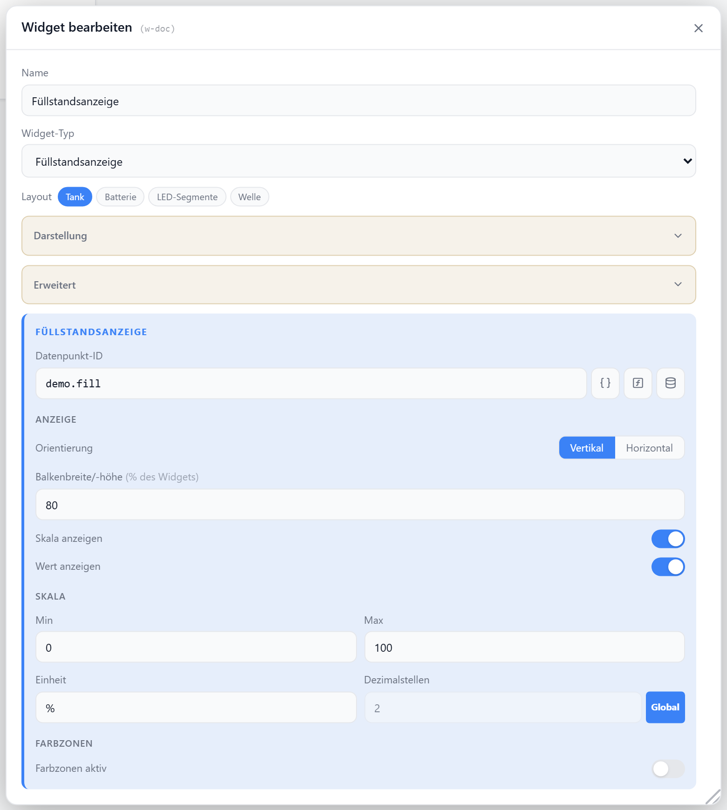

# Füllstandsanzeige

Visualisiert einen `number`-Datenpunkt (z. B. Wassertank, Heizöl) als Füllstand. Wahlweise als Tank, LED-Segmente, animierte Welle oder Batterie — vertikal oder horizontal, mit optionalen Farbzonen.

## Datenpunkt

| Feld | Pflicht | Typ | |
| --- | --- | --- | --- |
| `datapoint` | ja | `number` | Füllwert, auf `min`–`max` begrenzt |

## Layouts

### Default
Tank-Behälter mit abgerundeten Ecken, gefüllt bis zum Wert — mit Skalenstrichen und Wert-Label.

### Battery
Batterie-Silhouette mit Pol-Nub und Füllstands-Markierungen.

### Segments
Zwölf LED-Segmente, die je nach Füllstand aufleuchten.

### Wave
Behälter mit animierter Wellen-Oberfläche.

### Custom
Wert und Einheit frei in einer Zellenmatrix platzieren — siehe [Custom-Layout](./custom-layout).

## Einstellungen

Alle Optionen werden im Editor unter **Widget bearbeiten** gesetzt.

### Anzeige

| Option | Standard | |
| --- | --- | --- |
| `showTitle` | `true` | Titel anzeigen |
| `showIcon` | `true` | Icon anzeigen |
| `icon` | `Droplets` | [Lucide-Icon](https://lucide.dev) |
| `iconSize` | `20` | px |
| `titleAlign` | `left` | `left` · `center` · `right` |
| `showValue` | `true` | Wert-Label anzeigen |
| `showTicks` | `true` | Skalenstriche (nur Tank-Layout) |

### Darstellung

| Option | Standard | |
| --- | --- | --- |
| `orientation` | `vertical` | `vertical` · `horizontal` |
| `barSize` | `80` | Breite/Höhe des Balkens in % der Zelle (10–100) |

### Skala

| Option | Standard | |
| --- | --- | --- |
| `minValue` | `0` | Wert für leeren Stand |
| `maxValue` | `100` | Wert für vollen Stand |
| `unit` | `%` | Einheit hinter dem Wert |
| `decimals` | globale Vorgabe | Nachkommastellen |

### Wert-Transformation

Bildet nur den Live-Wert in den Anzeigeraum ab; `minValue`/`maxValue` und Zonen bleiben in Anzeige-Einheiten.

| Option | Standard | |
| --- | --- | --- |
| `valueFactor` | `1` | Multiplikator |
| `valueOffset` | `0` | Summand |

### Farbzonen

Färbt die Füllung abhängig vom Wert; ohne Zonen wird `--accent` verwendet.

| Option | Standard | |
| --- | --- | --- |
| `colorZones` | `false` | Zonen-Einfärbung aktivieren |
| `zones` | — | Liste aus `{ max, color }`; Fallback: 33 % `#ef4444`, 66 % `#f59e0b`, Rest `#22c55e` |
