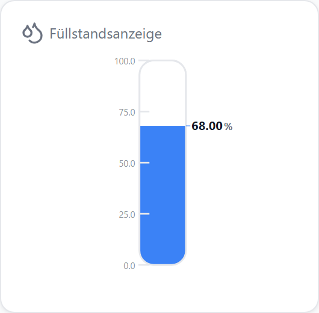
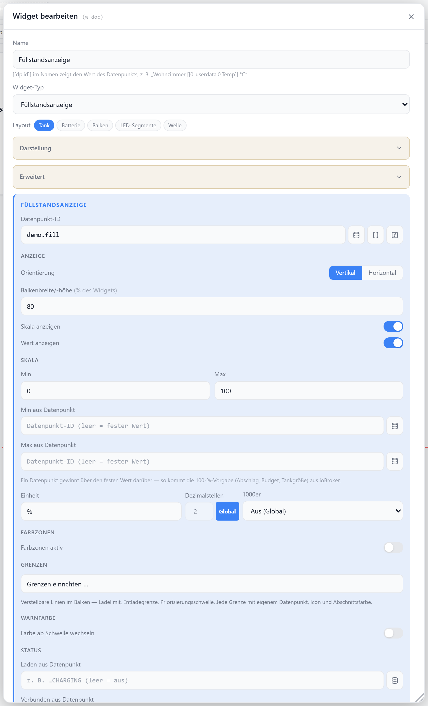
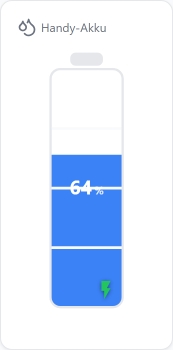
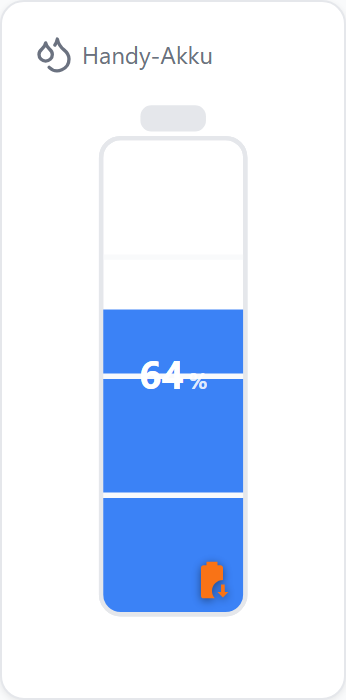
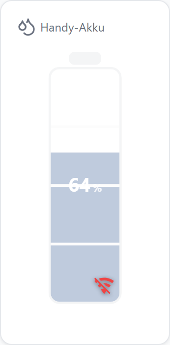

# Füllstandsanzeige

Visualisiert einen `number`-Datenpunkt (z. B. Wassertank, Heizöl) als Füllstand. Wahlweise als Tank, LED-Segmente, animierte Welle oder Batterie — vertikal oder horizontal, mit optionalen Farbzonen.

## Datenpunkt

| Feld | Pflicht | Typ | |
| --- | --- | --- | --- |
| `datapoint` | ja | `number` | Füllwert, auf `min`–`max` begrenzt |
| `minDatapoint` / `maxDatapoint` | nein | `number` | liefern Skala-Min/-Max statt der festen Werte |

## Layouts

### Default
Tank-Behälter mit abgerundeten Ecken, gefüllt bis zum Wert — mit Skalenstrichen und Wert-Label.

### Battery
Batterie-Silhouette mit Pol-Nub und Füllstands-Markierungen.

### Bar
Flacher Balken mit runden Enden. Für Grenzen, die kein Tank sind (Ladelimit, Entladegrenze).
`showTicks` zeigt hier Skalenanfang und -ende an den Balkenenden.

### Segments
Zwölf LED-Segmente, die je nach Füllstand aufleuchten.

### Wave
Behälter mit animierter Wellen-Oberfläche.

### Custom
Wert und Einheit frei in einer Zellenmatrix platzieren — siehe [Custom-Layout](./custom-layout).

## Einstellungen

Alle Optionen werden im Editor unter **Widget bearbeiten** gesetzt.

### Anzeige

| Option | Standard | |
| --- | --- | --- |
| `showTitle` | `true` | Titel anzeigen |
| `showIcon` | `true` | Icon anzeigen |
| `icon` | `Droplets` | [Lucide-Icon](https://lucide.dev) |
| `iconSize` | `20` | px |
| `titleAlign` | `left` | `left` · `center` · `right` |
| `showValue` | `true` | Wert-Label anzeigen |
| `showTicks` | `true` | Skalenstriche (nur Tank-Layout) |

### Darstellung

| Option | Standard | |
| --- | --- | --- |
| `orientation` | `vertical` | `vertical` · `horizontal` |
| `barSize` | `80` | Breite/Höhe des Balkens in % der Zelle (10–100) |

### Skala

| Option | Standard | |
| --- | --- | --- |
| `minValue` | `0` | Wert für leeren Stand |
| `maxValue` | `100` | Wert für vollen Stand |
| `minDatapoint` / `maxDatapoint` | — | Datenpunkt statt fester Zahl; gewinnt über `minValue`/`maxValue` |
| `unit` | `%` | Einheit hinter dem Wert |
| `decimals` | globale Vorgabe | Nachkommastellen |

### Wert-Transformation

Bildet nur den Live-Wert in den Anzeigeraum ab; `minValue`/`maxValue` und Zonen bleiben in Anzeige-Einheiten.

| Option | Standard | |
| --- | --- | --- |
| `valueFactor` | `1` | Multiplikator |
| `valueOffset` | `0` | Summand |

Datenpunkt-Grenzen laufen durch dieselbe Transformation wie der Live-Wert.

::: tip Vorgabe aus ioBroker
`maxDatapoint` macht die 100-%-Marke pflegbar: Abschlag, Monatsbudget oder Tankgröße stehen in einem Datenpunkt, die Anzeige folgt sofort. Leeres Feld = wieder der feste Wert.
:::

### Farbzonen

Färbt die Füllung abhängig vom Wert; ohne Zonen wird `--accent` verwendet.

| Option | Standard | |
| --- | --- | --- |
| `colorZones` | `false` | Zonen-Einfärbung aktivieren |
| `zones` | — | Liste aus `{ max, color }`; Fallback: 33 % `#ef4444`, 66 % `#f59e0b`, Rest `#22c55e` |

### Grenzen

Nur in den Layouts **Tank**, **Batterie** und **Balken** — LED-Segmente, Welle und Custom haben keinen
durchgehenden Balken, an dem eine Grenze hängen könnte, und ignorieren sie. Der Editor blendet den
Abschnitt dort aus; bereits eingerichtete Grenzen bleiben erhalten.

Verstellbare Linien auf der Skala: Ladelimit, Entladegrenze, Priorisierungsschwelle. Jede Grenze bringt
einen eigenen Datenpunkt mit, kann im Dashboard gezogen werden und schreibt den neuen Wert zurück.
N Grenzen teilen die Skala in N+1 Abschnitte, die je eine eigene Farbe und ein eigenes Icon tragen.

Eingerichtet unter **Grenzen → bearbeiten** in einem eigenen Dialog.

| Option | Standard | |
| --- | --- | --- |
| `limits` | `[]` | Liste der Grenzen, siehe unten |
| `baseIcon` | — | Icon im untersten Abschnitt (unter der niedrigsten Grenze) |
| `baseBandColor` | — | Farbe des untersten Abschnitts; leer = normale Füllfarbe |
| `limitsEditable` | `true` | Hauptschalter; `false` = nur Anzeige |
| `limitCommitOnRelease` | `true` | Datenpunkt erst beim Loslassen schreiben |
| `limitClampNeighbours` | `true` | Eine Grenze darf ihre Nachbarn nicht überholen |

Pro Grenze:

| Feld | Standard | |
| --- | --- | --- |
| `datapoint` | — | Datenpunkt mit dem Grenzwert; leer = `value` |
| `value` | — | Fester Grenzwert ohne Datenpunkt |
| `label` | — | Bezeichnung (Tooltip am Handle) |
| `editable` | `true` | Im Dashboard verstellbar; braucht `datapoint` |
| `step` | `1` | Rasterung beim Ziehen, in Anzeige-Einheiten |
| `showValue` | `true` | Wert-Plakette an der Grenze |
| `color` | `--accent` | Farbe der Grenzlinie |
| `icon` | — | Icon im Abschnitt **über** der Grenze |
| `bandColor` | — | Farbe des Abschnitts **über** der Grenze |
| `reachedColor` | — | Füllfarbe, sobald der Wert diese Grenze erreicht |

::: tip Reihenfolge der Farben
`overColor` (Warnfarbe) → `reachedColor` → Abschnittsfarben → Farbzonen → `--accent`. Sobald ein
Abschnitt eine eigene Farbe hat, werden die Farbzonen nicht mehr gezeichnet.
:::

Nur eine Grenze mit Datenpunkt ist verstellbar — ein fester Wert ist Konfiguration. Der gezogene Wert
läuft durch `valueFactor`/`valueOffset` zurück, bevor er geschrieben wird.

### Warnfarbe

Der Füllstand begrenzt auf `maxValue` — voll und übergelaufen sehen gleich aus. Ab der Schwelle färbt sich die Füllung komplett in der Warnfarbe, auch über Farbzonen hinweg.

| Option | Standard | |
| --- | --- | --- |
| `overActive` | `false` | Farbwechsel einschalten |
| `overThreshold` | `100` | % der Skala, ab dem gewechselt wird (100 = `maxValue`) |
| `overColor` | `#ef4444` | Warnfarbe der Füllung |

Verglichen wird der **ungekappte** Wert, sonst wäre ein Überlauf nicht von „genau voll" zu unterscheiden.

### Status: Laden, Entladen und Verbindung

Drei optionale Datenpunkte neben dem Füllstand — alle werden nur gelesen. Leeres Feld = kein Status.
Im Custom-Layout gibt es keine Statusanzeige.

| Laden aktiv | Entladen aktiv | Verbindung getrennt |
| --- | --- | --- |
|  |  |  |

| Option | Standard | |
| --- | --- | --- |
| `chargeDatapoint` | — | Datenpunkt „lädt gerade" (HmIP-Flag, Ladeschale, PV-Ladeleistung) |
| `chargeCondition` | `true` | `true` (wahr/1) · `false` (falsch/0) · `gt0` · `lt0` |
| `chargeEffect` | `none` | `none` · `blink` (Füllung pulsiert) · `scan` (Lauflicht über den gefüllten Teil) |
| `showChargeIcon` | `true` | Icon unten rechts im Balken |
| `chargeIcon` | `mdi:flash` | frei wählbar (Icon-Auswahl im Editor) |
| `chargeColor` | `#22c55e` | Farbe von Blitz-Icon und Lauflicht |
| `dischargeDatapoint` | — | Datenpunkt „entlädt gerade" (eigenes Flag oder derselbe wie oben) |
| `dischargeCondition` | `lt0` | wie oben; `lt0` passt zur negativen Entladeleistung |
| `dischargeEffect` | `none` | `none` · `blink` · `scan` (Lauflicht in der Entladefarbe) |
| `showDischargeIcon` | `true` | Icon unten rechts im Balken |
| `dischargeIcon` | `mdi:battery-arrow-down` | frei wählbar (Icon-Auswahl im Editor) |
| `dischargeColor` | `#f97316` | Farbe von Entlade-Icon und Lauflicht |
| `connectedDatapoint` | — | Datenpunkt der Verbindung |
| `connectedCondition` | `true` | wie oben; für `UNREACH` gilt `false` = verbunden |
| `showOfflineIcon` | `true` | Icon bei fehlender Verbindung |
| `offlineIcon` | `mdi:wifi-off` | frei wählbar (Icon-Auswahl im Editor) |
| `offlineColor` | `#ef4444` | Farbe dieses Icons |
| `offlineDim` | `true` | Anzeige ausgrauen; das Icon bleibt farbig |

::: tip Ein Datenpunkt für beide Richtungen
Eine vorzeichenbehaftete Leistung (`packPower`) deckt Laden und Entladen ab: denselben Datenpunkt oben mit
`gt0` und unten mit `lt0` eintragen. Der Editor bietet dafür „Denselben Datenpunkt wie beim Laden übernehmen"
an. Ein Datenpunkt ohne Wert gilt nie als „lädt", nie als „entlädt" und nie als „getrennt" — nach einem Reload
graut also nichts aus, bevor die Werte da sind.
:::

Lädt und entlädt zugleich (zwei getrennte Flags), gewinnt das Laden den Effekt; beide Icons bleiben stehen.
Alle Effekte pausieren, wenn das Betriebssystem reduzierte Bewegung meldet.
