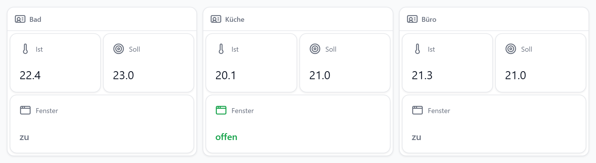
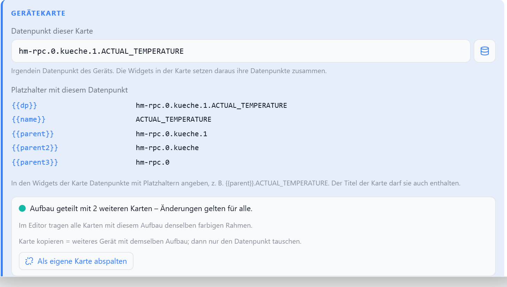
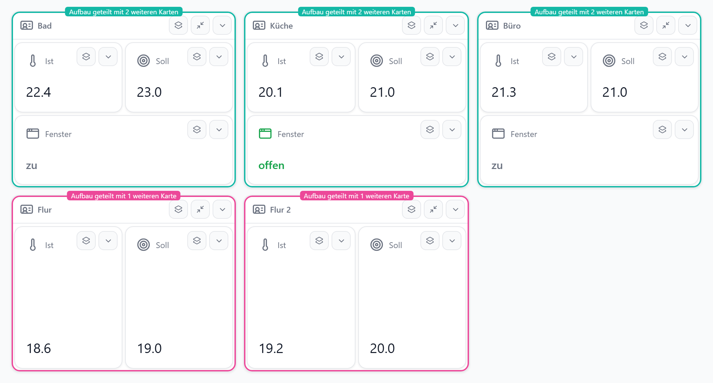

# Gerätekarte

Einmal aufbauen, für viele gleiche Geräte verwenden – nur der Datenpunkt ist je Karte verschieden. Änderungen am Aufbau gelten für alle Karten.

Drei Karten, ein Aufbau: Ist, Soll und Fenster – jeweils mit den Datenpunkten des eigenen Thermostats.

## Prinzip

| | |
| --- | --- |
| Aufbau | wie eine [Gruppe](./gruppe): Widgets per Drag-and-Drop hineinziehen und anordnen |
| Datenpunkt der Karte | irgendein Datenpunkt des Geräts, z. B. `hm-rpc.0.ABC123.1.ACTUAL_TEMPERATURE` |
| Datenpunkte der Kinder | mit Platzhaltern, z. B. `{{parent}}.SET_POINT_TEMPERATURE` |
| Weitere Geräte | Karte **kopieren**, nur den Datenpunkt tauschen |
| Aufbau ändern | in irgendeiner Karte – wirkt auf alle verknüpften Karten |

## Platzhalter

Aufgelöst gegen den Datenpunkt der jeweiligen Karte – die Tabelle steht auch im Einstellungs-Dialog.

| Platzhalter | bei `hm-rpc.0.kueche.1.ACTUAL_TEMPERATURE` |
| --- | --- |
| `{{dp}}` | `hm-rpc.0.kueche.1.ACTUAL_TEMPERATURE` |
| `{{name}}` | `ACTUAL_TEMPERATURE` |
| `{{parent}}` | `hm-rpc.0.kueche.1` |
| `{{parent2}}` | `hm-rpc.0.kueche` |
| `` | jede Text-Option der Karte |

Gilt überall, wo ein Kind einen Datenpunkt hat: Hauptdatenpunkt, weitere Datenpunkt-Felder, Listenzeilen, Bedingungen, Badges, Diagramm-Serien. Auch der Kartentitel darf Platzhalter enthalten.

## Einstellungen

| Option | Standard | |
| --- | --- | --- |
| Datenpunkt dieser Karte (`datapoint`) | — | Grundlage der Platzhalter |
| `defId` | neu | Verweis auf den geteilten Aufbau – gleiche `defId` = gleiche Kinder |
| Als eigene Karte abspalten | — | Karte bekommt eine eigene Kopie des Aufbaus |

Alle Optionen der [Gruppe](./gruppe) (Titel, Icon, Master-Aktion, Einklappen, Smartphone-Raster …) gelten auch hier.

## Verknüpfte Karten erkennen

| Im Editor | |
| --- | --- |
| Farbiger Rahmen | gleiche Farbe = gleicher Aufbau |
| „Aufbau geteilt mit N weiteren Karten“ | Anzahl der anderen Karten mit diesem Aufbau |
| Einzelne Karte | kein Rahmen, kein Hinweis |

Im Live-Dashboard ist beides unsichtbar.

## Kopieren, Export, Löschen

| Aktion | Aufbau |
| --- | --- |
| Kopieren im Editor | geteilt |
| Als eigene Karte abspalten | eigene Kopie |
| Als Widget-Vorlage speichern / Vorlage einfügen | eigene Kopie |
| Export → Import | die importierten Karten teilen sich einen neuen Aufbau |
| Karte löschen | Aufbau bleibt, solange eine andere Karte ihn nutzt |

## Grenzen

| Fall | Verhalten |
| --- | --- |
| Widgets, die selbst Daten speichern (Zeitschaltuhr-Ereignisse) | gelten für alle Karten – für eigene Ereignisse je Gerät die Karte abspalten |
| Platzhalter ohne Datenpunkt der Karte | Feld bleibt leer, es wird nichts geschrieben |
