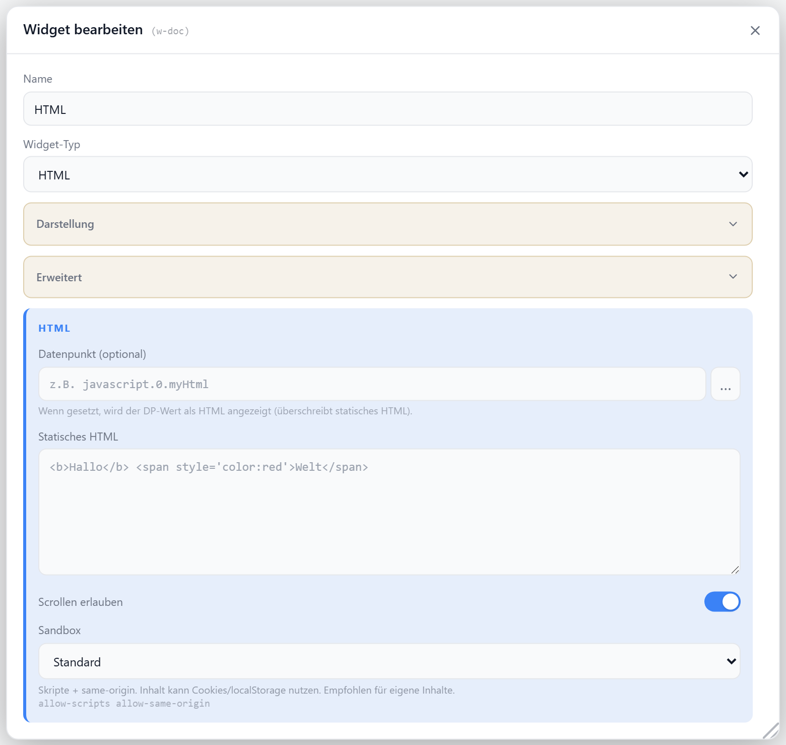

# HTML

Bettet beliebigen HTML/CSS-Code in einer Sandbox-iFrame ein. Der Inhalt kann statisch hinterlegt oder aus einem Datenpunkt gelesen werden — ein gesetzter Datenpunkt überschreibt das statische HTML.

## Datenpunkt

| Feld | Pflicht | Typ | |
| --- | --- | --- | --- |
| `htmlDatapoint` | nein | `string` | DP-Wert wird als HTML gerendert; überschreibt `htmlContent` |

## Einstellungen

Alle Optionen werden im Editor unter **Widget bearbeiten** gesetzt.

### Inhalt

| Option | Standard | |
| --- | --- | --- |
| `htmlContent` | — | statisches HTML |
| `htmlDatapoint` | — | Datenpunkt mit HTML (überschreibt `htmlContent`) |
| `scrollable` | `true` | Scrollen im iFrame erlauben |

### Anzeige

| Option | Standard | |
| --- | --- | --- |
| `showTitle` | `true` | Titel anzeigen |
| `showIcon` | `true` | Icon anzeigen |
| `icon` | `Code2` | [Lucide-Icon](https://lucide.dev) |
| `iconSize` | `20` | px |
| `titleAlign` | `left` | `left` · `center` · `right` |

### Sandbox

Schränkt die Berechtigungen des eingebetteten Inhalts ein.

| Option | Standard | |
| --- | --- | --- |
| `sandboxPreset` | `standard` | `off` · `minimal` · `standard` · `extended` · `full` · `custom` |
| `sandboxCustom` | — | eigene Flags bei `custom`, z. B. `allow-scripts allow-forms` |
