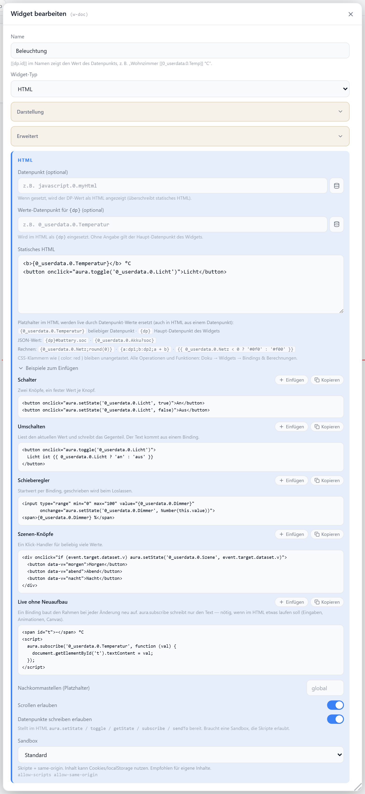

# HTML

Bettet beliebigen HTML/CSS-Code in einer Sandbox-iFrame ein. Der Inhalt kann statisch hinterlegt oder aus einem Datenpunkt gelesen werden — ein gesetzter Datenpunkt überschreibt das statische HTML.

Datenpunkt-Werte lassen sich als [Platzhalter](#platzhalter) mitten in den HTML-Code schreiben — inklusive
[Berechnungen](./bindings). Umgekehrt kann das HTML Datenpunkte auch [setzen](#datenpunkte-schreiben).

Mögliche Bildquellen (URL, Adapter-Pfad, Datei, Base64): siehe [Bildpfade](./bildpfade).

## Datenpunkt

| Feld | Pflicht | Typ | |
| --- | --- | --- | --- |
| `htmlDatapoint` | nein | `string` | DP-Wert wird als HTML gerendert; überschreibt `htmlContent` |

## Einstellungen

Alle Optionen werden im Editor unter **Widget bearbeiten** gesetzt.


### Inhalt

| Option | Standard | |
| --- | --- | --- |
| `htmlContent` | — | statisches HTML |
| `htmlDatapoint` | — | Datenpunkt mit HTML (überschreibt `htmlContent`) |
| `valueDatapoint` | — | Datenpunkt für den Platzhalter `{dp}` |
| `decimals` | global | Nachkommastellen für Zahlen aus Platzhaltern |
| `scrollable` | `true` | Scrollen im iFrame erlauben |

### Platzhalter

Im HTML werden Platzhalter live durch Datenpunkt-Werte ersetzt — im statischen HTML
genauso wie in HTML, das aus `htmlDatapoint` kommt.

| Platzhalter | ersetzt durch |
| --- | --- |
| `{beliebige.dp.id}` | Wert dieses Datenpunkts, z. B. `{alias.0.Raeume.Bad.ACTUAL}` (wird live abonniert) |
| `{dp}` | Wert von `valueDatapoint`, ersatzweise des Haupt-Datenpunkts des Widgets |

JSON-Werte über einen Pfad-Suffix — die drei Schreibweisen sind gleichwertig:

```html
{0_userdata.0.Akku?soc}
{0_userdata.0.Akku#soc}
{0_userdata.0.Akku}#soc
```

Das gilt auch für `{dp}`: `{dp}#battery.soc` · `{dp}#cells[1]`

Beispiel:

```html
<div style="font:600 28px system-ui">
  {alias.0.Raeume.Bad.ACTUAL} °C
  <small>Akku {0_userdata.0.Akku}#soc %</small>
</div>
```

Fehlende Werte erscheinen als „–". CSS-Klammern (`{ color: red }`) und unbekannte
Platzhalter bleiben unangetastet. Ein `#`-Anhang in Großbuchstaben gilt nie als
JSON-Pfad, damit IDs mit `#` (Shelly) und Anker wie `href="{dp}#TOP"` heil bleiben.

### Berechnungen

Platzhalter können rechnen, runden, Farben bilden und Zeitstempel formatieren — in
drei zu ioBroker.vis kompatiblen Schreibweisen:

```html
{0_userdata.0.Netz;round(0)} W
{a:0_userdata.0.Rot;b:0_userdata.0.Gruen;a + b}
<span style="color:{{ 0_userdata.0.Netz < 0 ? '#00ff00' : '#ff2c0a' }}">…</span>
```

Vollständige Referenz — Operationen, Funktionen, Datums-Tokens, Rezepte und
Fehlersuche: **[Bindings & Berechnungen](./bindings)**.

### Datenpunkte schreiben

Platzhalter lesen nur. Zum Schreiben steht im HTML `aura` bereit — jede Funktion liefert ein Promise.

| Aufruf | |
| --- | --- |
| `aura.setState(id, wert, ack?)` | Wert schreiben (`ack` standardmäßig `false`) |
| `aura.toggle(id)` | aktuellen Wert lesen und das Gegenteil schreiben |
| `aura.getState(id)` | `{ val, ack, ts, lc }` |
| `aura.subscribe(id, cb)` | `cb(wert, state)` sofort und bei jeder Änderung; gibt die Abmelde-Funktion zurück |
| `aura.sendTo(ziel, befehl, daten)` | Adapter-Nachricht, z. B. `aura.sendTo('telegram.0', 'send', { text: 'Hi' })` |

```html
<button onclick="aura.setState('0_userdata.0.Licht', true)">An</button>
<button onclick="aura.toggle('0_userdata.0.Licht')">
  Licht ist {{ 0_userdata.0.Licht ? 'an' : 'aus' }}
</button>
```

Schieberegler — Startwert per Platzhalter, geschrieben wird beim Loslassen:

```html
<input type="range" min="0" max="100" value="{0_userdata.0.Dimmer}"
       onchange="aura.setState('0_userdata.0.Dimmer', Number(this.value))">
<span>{0_userdata.0.Dimmer} %</span>
```

Ein Handler für beliebig viele Werte:

```html
<div onclick="if (event.target.dataset.v) aura.setState('0_userdata.0.Szene', event.target.dataset.v)">
  <button data-v="morgen">Morgen</button>
  <button data-v="abend">Abend</button>
  <button data-v="nacht">Nacht</button>
</div>
```

Jede Platzhalter-Änderung baut das Dokument neu auf. Soll im HTML etwas laufen — Eingabefeld, Animation, Canvas —
statt eines Platzhalters `aura.subscribe` nehmen und nur den Text austauschen:

```html
<span id="t">–</span> °C
<script>
  aura.subscribe('0_userdata.0.Temperatur', function (val) {
    document.getElementById('t').textContent = val;
  });
</script>
```

Die Beispiele stehen im Editor unter **Beispiele zum Einfügen** und schreiben sich per Klick in den Inhalt:



| Option | Standard | |
| --- | --- | --- |
| `htmlApi` | `true` | `aura` im HTML bereitstellen |

Zu beachten:

- Braucht eine [Sandbox](#sandbox), die Skripte erlaubt — bei `minimal` und strenger funktioniert es ebenso wie bei `standard`.
- Theme-Token (`var(--accent)`) gelten im iFrame nicht; Farben ausschreiben.
- Ungültige Datenpunkt-IDs schreiben nichts, das Promise wird abgelehnt (`.catch(…)`).
- Dieselben Aufrufe gelten im `htmlTemplate` der [Wert-Anzeige](./wert-anzeige) und in [Custom JS](../einstellungen/css-js), dort als `window.aura`.

### Anzeige

| Option | Standard | |
| --- | --- | --- |
| `showTitle` | `true` | Titel anzeigen |
| `showIcon` | `true` | Icon anzeigen |
| `icon` | `Code2` | [Lucide-Icon](https://lucide.dev) |
| `iconSize` | `20` | px |
| `titleAlign` | `left` | `left` · `center` · `right` |

### Sandbox

Schränkt die Berechtigungen des eingebetteten Inhalts ein.

| Option | Standard | |
| --- | --- | --- |
| `sandboxPreset` | `standard` | `off` · `minimal` · `standard` · `extended` · `full` · `custom` |
| `sandboxCustom` | — | eigene Flags bei `custom`, z. B. `allow-scripts allow-forms` |
