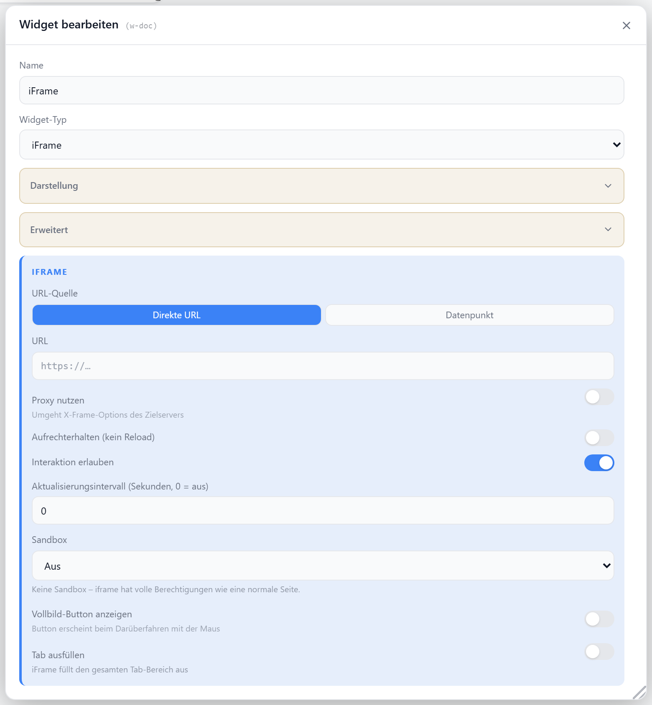

# iFrame

Bettet eine externe Webseite oder lokale URL in ein Widget ein. Die URL kann statisch oder aus einem Datenpunkt kommen, optional über einen Proxy geladen, automatisch aktualisiert und per Sandbox abgesichert werden.

## Einstellungen

Alle Optionen werden im Editor unter **Widget bearbeiten** gesetzt.

### Quelle

Statische URL oder URL aus einem Datenpunkt. Bei `iframeUrlMode: datapoint` muss `iframeUrlDp` eine echte State-ID sein (sonst greift wieder die statische URL).

| Option | Standard | |
| --- | --- | --- |
| `iframeUrlMode` | `static` | `static` · `datapoint` |
| `iframeUrl` | — | statische URL |
| `iframeUrlDp` | — | Datenpunkt mit URL (nur bei `datapoint`) |
| `useProxy` | `false` | URL über `/proxy` laden (umgeht X-Frame-Options / Mixed-Content) |

### Verhalten

| Option | Standard | |
| --- | --- | --- |
| `allowInteraction` | `true` | Klicks im iFrame zulassen (sonst transparente Sperrschicht) |
| `keepAlive` | `false` | iFrame beim Tabwechsel nicht neu laden |
| `refreshInterval` | `0` | automatisches Neuladen in Sekunden (`0` = aus; bei `keepAlive` ignoriert) |
| `fullscreenButton` | `false` | Vollbild-Button beim Hover einblenden |

### Anzeige

| Option | Standard | |
| --- | --- | --- |
| `showTitle` | `true` | Titel anzeigen |
| `showIcon` | `true` | Icon anzeigen |
| `icon` | `MonitorDot` | [Lucide-Icon](https://lucide.dev) |
| `iconSize` | `20` | px |
| `titleAlign` | `left` | `left` · `center` · `right` |

### Sandbox

Schränkt die Berechtigungen des eingebetteten Inhalts ein.

| Option | Standard | |
| --- | --- | --- |
| `sandbox` | `false` | Sandbox aktivieren (Fallback `extended`, sonst `off`) |
| `sandboxPreset` | — | `off` · `minimal` · `standard` · `extended` · `full` · `custom` |
| `sandboxCustom` | — | eigene Flags bei `custom`, z. B. `allow-scripts allow-forms` |
