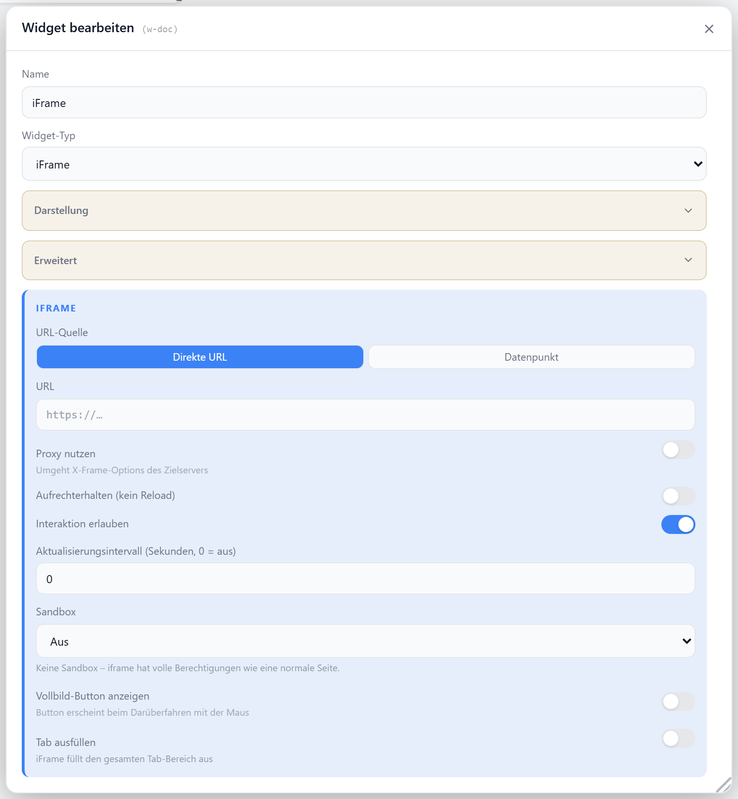

# iFrame

Bettet eine externe Webseite oder lokale URL in ein Widget ein. Die URL kann statisch oder aus einem Datenpunkt kommen, optional über einen Proxy geladen, automatisch aktualisiert und per Sandbox abgesichert werden.

## Einstellungen

Alle Optionen werden im Editor unter **Widget bearbeiten** gesetzt.

### Quelle

Statische URL oder URL aus einem Datenpunkt. Bei `iframeUrlMode: datapoint` muss `iframeUrlDp` eine echte State-ID sein (sonst greift wieder die statische URL).

| Option | Standard | |
| --- | --- | --- |
| `iframeUrlMode` | `static` | `static` · `datapoint` |
| `iframeUrl` | — | statische URL |
| `iframeUrlDp` | — | Datenpunkt mit URL (nur bei `datapoint`) |
| `useProxy` | `false` | URL über `/proxy` laden (umgeht X-Frame-Options / Mixed-Content) |

### Verhalten

| Option | Standard | |
| --- | --- | --- |
| `interactionMode` | `content` | `action` · `content` · `contentOnly` — siehe unten |
| `keepAlive` | `false` | iFrame beim Tabwechsel nicht neu laden |
| `refreshInterval` | `0` | automatisches Neuladen in Sekunden (`0` = aus; bei `keepAlive` ignoriert) |
| `reloadOnWake` | `false` | nach Display-Standby neu laden (hebt `keepAlive` auf) |
| `fullscreenButton` | `false` | Vollbild-Button beim Hover einblenden |

`reloadOnWake` ist für eingebettete Videos/Streams gedacht: Der Browser bricht sie im
Standby ab, und ohne Nutzer-Tipp startet der Player nicht wieder. Für Seiten mit
Eingaben ausgelassen lassen — der Reload verwirft deren Zustand.

Neu laden bei Datenpunkt-Änderung: Bedingung mit Effekt `Widget neu laden` anlegen —
siehe [Editor](../einstellungen/editor.md#widget-neu-laden). Nötig, sobald sich der
Inhalt hinter einer gleichbleibenden URL ändert (z. B. Diagramm eines Skripts, das
auf ein Auswahlfeld reagiert): Die Adresse ändert sich nicht, also lädt der iFrame
von sich aus nicht neu.

#### Interaktion vs. Klick-Aktion

Ein Klick in die eingebettete Seite erreicht Aura nicht — das Fremd-Dokument behält
das Ereignis. Bedienbarer Inhalt und Klick-Aktion auf derselben Fläche sind darum
nicht möglich; `interactionMode` legt fest, was gilt.

| Wert | Inhalt bedienbar | Klick-Aktion | Scrollleiste der Seite |
| --- | --- | --- | --- |
| `action` | nein (transparente Sperrschicht) | Klick aufs Widget | aus |
| `content` | ja | Aktions-Button oben rechts | an |
| `contentOnly` | ja | inaktiv | an |

Die Scrollleiste gehört der eingebetteten Seite, nicht Aura: Passt sie nicht exakt in
das Widget, zeigt der Desktop-Browser sie dauerhaft (Tablets blenden sie als Overlay
aus). Bei `action` ist die Seite ohnehin gesperrt — dort wird sie unterdrückt.

Der Aktions-Button erscheint nur, wenn eine Klick-Aktion konfiguriert ist — auch bei
den anderen Widgets mit eingebettetem Dokument (HTML, eCharts-Preset, Kamera mit
`.html`-Stream).

### Anzeige

| Option | Standard | |
| --- | --- | --- |
| `showTitle` | `true` | Titel anzeigen |
| `showIcon` | `true` | Icon anzeigen |
| `icon` | `MonitorDot` | [Lucide-Icon](https://lucide.dev) |
| `iconSize` | `20` | px |
| `titleAlign` | `left` | `left` · `center` · `right` |

### Sandbox

Schränkt die Berechtigungen des eingebetteten Inhalts ein.

| Option | Standard | |
| --- | --- | --- |
| `sandbox` | `false` | Sandbox aktivieren (Fallback `extended`, sonst `off`) |
| `sandboxPreset` | — | `off` · `minimal` · `standard` · `extended` · `full` · `custom` |
| `sandboxCustom` | — | eigene Flags bei `custom`, z. B. `allow-scripts allow-forms` |
