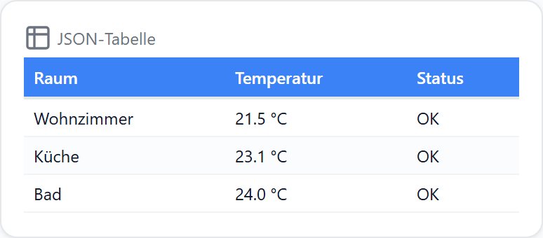
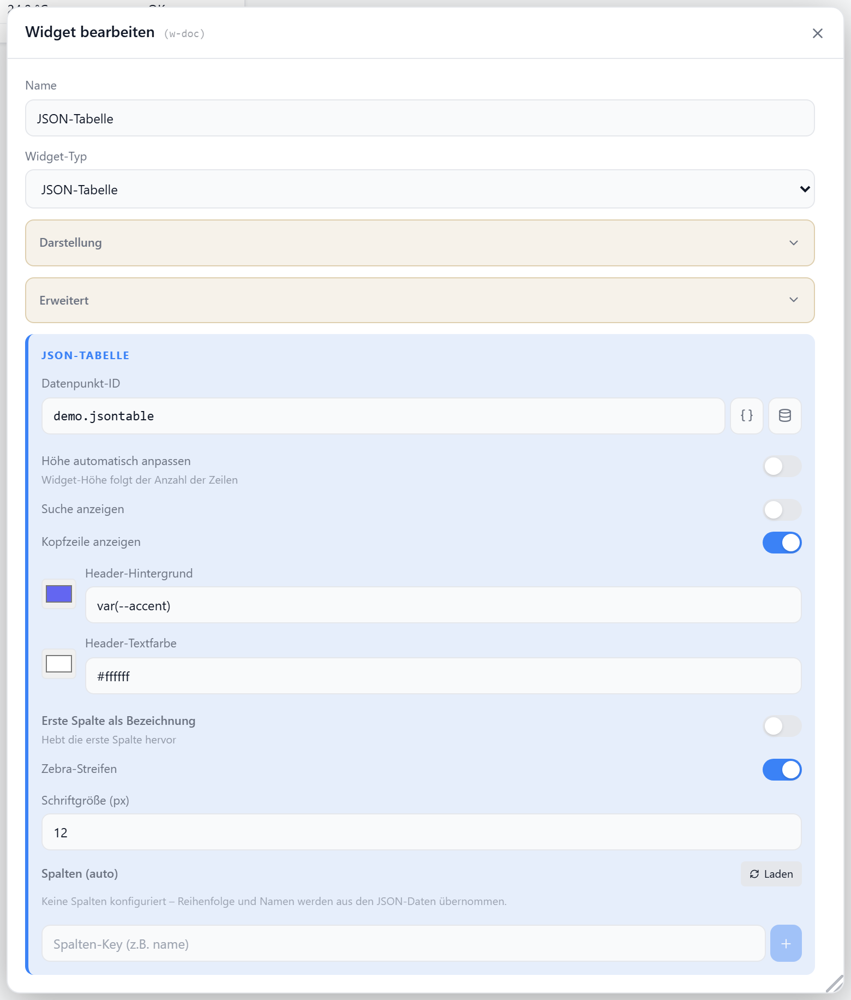

# JSON-Tabelle

Zeigt einen Datenpunkt mit JSON-Daten als formatierte Tabelle. Erkennt automatisch ein Array von Objekten, ein Array von Arrays oder ein `{headers, rows}`-Objekt. Spalten lassen sich umbenennen, ausblenden, sortieren und als Bild, HTML oder Iconify-Icon rendern.

## Datenpunkt

| Feld | Pflicht | Typ | |
| --- | --- | --- | --- |
| `datapoint` | ja | `string` / `array` | JSON-Array, Array-von-Arrays oder `{headers, rows}`; Strings werden geparst |

## Einstellungen

Alle Optionen werden im Editor unter **Widget bearbeiten** gesetzt.

### Tabelle

| Option | Standard | |
| --- | --- | --- |
| `autoHeight` | `false` | Widget-Höhe folgt der Zeilenanzahl |
| `showSearch` | `false` | Suchfeld über der Tabelle |
| `showHeader` | `true` | Kopfzeile anzeigen |
| `striped` | `true` | Zebra-Streifen |
| `fontSize` | `12` | Schriftgröße in px |

### Kopfzeile

Nur wirksam bei `showHeader: true`.

| Option | Standard | |
| --- | --- | --- |
| `headerBg` | `var(--accent)` | Hintergrund der Kopfzeile |
| `headerColor` | `#ffffff` | Textfarbe der Kopfzeile |

### Erste Spalte als Bezeichnung

Hebt die erste Spalte als Label-Spalte hervor.

| Option | Standard | |
| --- | --- | --- |
| `firstColHeader` | `false` | erste Spalte hervorheben |
| `firstColBg` | `var(--app-bg)` | Hintergrund der Bezeichnungsspalte |
| `firstColColor` | `var(--text-secondary)` | Textfarbe der Bezeichnungsspalte |

### Spalten

Liste in `columns` (leer = alle Spalten automatisch aus den JSON-Daten). Pro Spalte:

| Feld | |
| --- | --- |
| `key` | Schlüssel aus dem JSON |
| `label` | abweichender Anzeigename |
| `hidden` | Spalte ausblenden |
| `order` | Reihenfolge (kleiner = weiter links) |
| `image` | Wert als Bild rendern (URL, `data:`-URI oder ioBroker-Pfad) |
| `imageSize` | Bildgröße in px |
| `imagePathPrefix` | Pfad-Präfix, überschreibt die globale Admin-URL |
| `html` | Wert als HTML rendern |
| `iconify` | Iconify-Tokens (z. B. `mdi:home`) inline als Icon |

### Titel & Icon

| Option | Standard | |
| --- | --- | --- |
| `showTitle` | `true` | Titel anzeigen |
| `showIcon` | `true` | Icon anzeigen |
| `icon` | `Table2` | [Lucide-Icon](https://lucide.dev) |
| `iconSize` | `20` | px |
| `titleAlign` | `left` | `left` · `center` · `right` |
