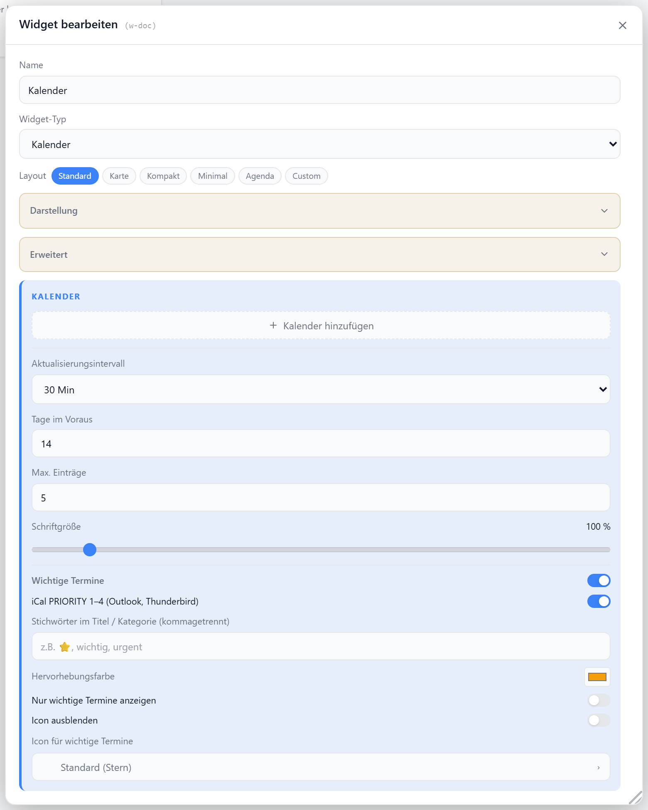

# Kalender

Zeigt anstehende Termine aus dem iCal-Adapter. Mehrere Kalender-Quellen mit eigener Farbe und Name lassen sich nur per Tab-Wizard hinzufügen. Wichtige Termine werden per Stichwort oder iCal-Priorität hervorgehoben.

## Layouts

### Default
Liste der nächsten Termine mit farbigem Punkt, Titel, Datum und Ort — für mittlere Zellen.

### Agenda
Kompakte Terminliste mit farbigem Balken je Quelle — für viele Termine auf wenig Platz.

### Card
Nur der nächste Termin groß als Karte mit Datum, Ort und „+N weitere" — für prominente Anzeige.

### Compact
Eine Zeile mit Icon, nächstem Termin und Datum — für Listen.

### Minimal
Nur die Anzahl der Termine als große Zahl zentriert — für sehr kleine Zellen.

### Custom
Felder `summary`, `date`, `time`, `calname`, `location`, `count` des nächsten Termins frei in einer Zellenmatrix platzieren — siehe [Custom-Layout](./custom-layout).

## Einstellungen

Alle Optionen werden im Editor unter **Widget bearbeiten** gesetzt.

### Quellen

Kalender-Quellen werden über den Tab-Wizard hinzugefügt.

| Option | Standard | |
| --- | --- | --- |
| `calendars` | `[]` | Liste der iCal-Quellen (`url`, `name`, `color`, `showName`) |

### Abruf

| Option | Standard | |
| --- | --- | --- |
| `refreshInterval` | `30` | Minuten zwischen Abrufen (`0` = kein Auto-Refresh) |
| `maxEvents` | `5` | maximale Anzahl angezeigter Termine |
| `daysAhead` | `14` | Vorschau-Zeitraum in Tagen |

### Anzeige

| Option | Standard | |
| --- | --- | --- |
| `showTitle` | `true` | Titel anzeigen |
| `showIcon` | `true` | Icon anzeigen |
| `icon` | `CalendarDays` | [Lucide-Icon](https://lucide.dev) |
| `iconSize` | `20` | px |
| `titleAlign` | `left` | `left` · `center` · `right` |
| `calFontScale` | `1` | Schrift-Skalierung |
| `showCalName` | `true` | Kalendername anzeigen |
| `showDate` | `true` | Datum anzeigen |
| `showLocation` | `true` | Ort anzeigen (Default/Card) |
| `showSummary` | `true` | Termin-Titel anzeigen (Card) |
| `showMore` | `true` | „+N weitere" anzeigen (Card) |

### Hervorhebung

Färbt wichtige Termine und blendet optional ein Symbol ein.

| Option | Standard | |
| --- | --- | --- |
| `highlightEnabled` | `true` | Hervorhebung aktiv |
| `highlightPriority` | `true` | iCal-`PRIORITY` 1–4 gilt als wichtig |
| `highlightKeywords` | — | Stichwörter, kommagetrennt |
| `highlightColor` | `#f59e0b` | Hervorhebungsfarbe |
| `importantOnly` | `false` | nur wichtige Termine zeigen |
| `hideImportantIcon` | `false` | Symbol ausblenden |
| `importantIcon` | `Star` | [Lucide-Icon](https://lucide.dev) für wichtige Termine |
