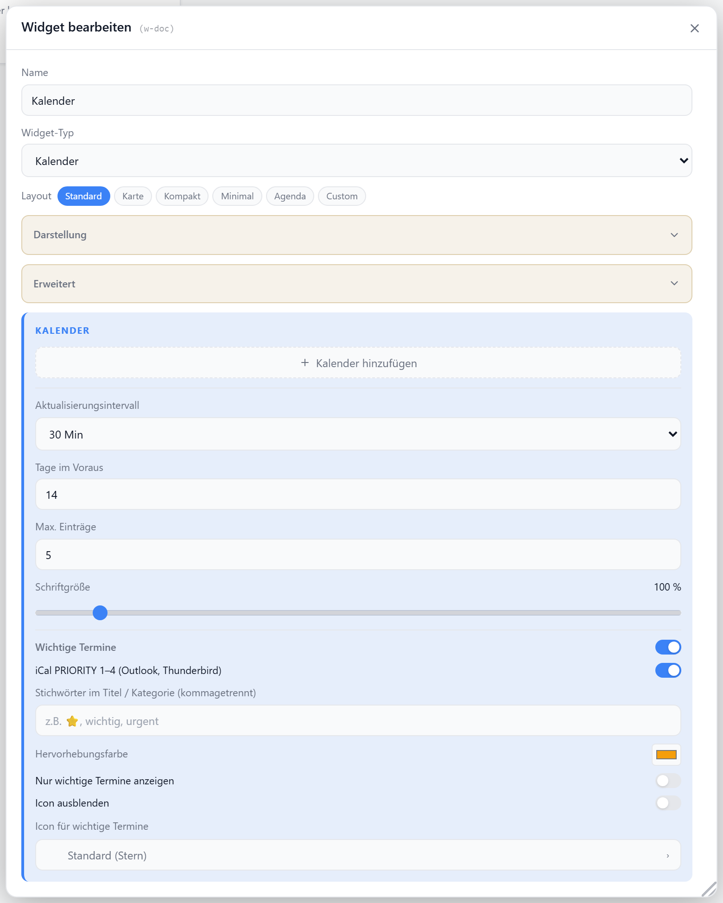

# Kalender

Zeigt anstehende Termine – entweder aus einer Instanz des ioBroker-Adapters **ical** oder direkt von einer iCal-URL. Mehrere Quellen mit eigener Farbe und Name sind möglich. Wichtige Termine werden per Stichwort oder iCal-Priorität hervorgehoben.

## Layouts

### Default
Liste der nächsten Termine mit farbigem Punkt, Titel, Datum und Ort — für mittlere Zellen. Passen nicht alle Termine in die Zelle, scrollt die Liste.

### Agenda
Kompakte Terminliste mit farbigem Balken je Quelle — für viele Termine auf wenig Platz. Scrollt wie Default. Die Kalendernamen bilden eine Spalte, damit alle Termin-Titel auf einer Kante beginnen — Breite per `calNameWidth`.

### Card
Nur der nächste Termin groß als Karte mit Datum, Ort und „+N weitere" — für prominente Anzeige.

### Compact
Eine Zeile mit Icon, nächstem Termin und Datum — für Listen.

### Minimal
Nur die Anzahl der Termine als große Zahl zentriert — für sehr kleine Zellen.

### Custom
Felder `summary`, `date`, `time`, `calname`, `location`, `running`, `count`, `week`, `kw`, `day`, `daycount` des nächsten Termins frei in einer Zellenmatrix platzieren, dazu die Komponenten `icon` (Widget-Icon) und `cal-icon` (Icon des Kalenders) — siehe [Custom-Layout](./custom-layout).

## Einstellungen

Alle Optionen werden im Editor unter **Widget bearbeiten** gesetzt.

### Quellen

**Kalender hinzufügen** öffnet ein Formular mit zwei Quellarten:

| Quellart | |
| --- | --- |
| **ical-Adapter** | Liest die Tabelle einer vorhandenen `ical.N`-Instanz. Kein eigener Abruf, keine URL – Termine kommen live aus dem Adapter. Optional auf einen einzelnen Kalender der Instanz einschränken |
| **iCal-URL** | Das Widget ruft die `.ics`-URL selbst über den Aura-Adapter ab |

| Option | Standard | |
| --- | --- | --- |
| `calendars` | `[]` | Liste der Quellen |
| `calendars[].type` | `url` | `adapter` · `url` |
| `calendars[].datapoint` | — | `adapter`: Tabellen-Datenpunkt, z. B. `ical.0.data.table` |
| `calendars[].calFilter` | — | `adapter`: nur Termine dieses Kalendernamens (leer = alle) |
| `calendars[].url` | — | `url`: iCal-URL |
| `calendars[].name` | — | Anzeigename; bei `adapter` leer = Kalendername aus dem Adapter |
| `calendars[].color` | — | Farbe der Quelle |
| `calendars[].icon` | — | [Lucide-Icon](https://lucide.dev) dieser Quelle; leer = kein Icon |
| `calendars[].showName` | `true` | Name dieser Quelle anzeigen |

### Abruf

| Option | Standard | |
| --- | --- | --- |
| `refreshInterval` | `30` | Minuten zwischen Abrufen (`0` = kein Auto-Refresh) |
| `maxEvents` | `5` | maximale Anzahl angezeigter Termine (1–100) |
| `daysAhead` | `14` | Vorschau-Zeitraum in Tagen |

`refreshInterval` gilt nur für `url`-Quellen; `adapter`-Quellen aktualisieren sich bei jeder Änderung der Tabelle. `daysAhead` kann bei `adapter`-Quellen nur so weit reichen wie der Vorschau-Zeitraum der ical-Instanz selbst.

### Anzeige

| Option | Standard | |
| --- | --- | --- |
| `showTitle` | `true` | Titel anzeigen |
| `showIcon` | `true` | Icon anzeigen |
| `icon` | `CalendarDays` | [Lucide-Icon](https://lucide.dev) |
| `iconSize` | `20` | px |
| `titleAlign` | `left` | `left` · `center` · `right` |
| `calFontScale` | `1` | Schrift-Skalierung |
| `calNameWidth` | `0` | Agenda: Breite der Kalender-Spalte in % der Zeile; `0` = automatisch (breitester sichtbarer Name, max. 45 %) |
| `showCalName` | `true` | Kalendername anzeigen |
| `showCalIcon` | `true` | Icon der Quelle anzeigen (nur Quellen mit `icon`) |
| `showWeek` | `false` | Kalenderwoche anzeigen: Default/Agenda am ersten Termin der Woche, Card/Compact am angezeigten Termin |
| `showDate` | `true` | Datum anzeigen |
| `showLocation` | `true` | Ort anzeigen (Default/Card) |
| `showSummary` | `true` | Termin-Titel anzeigen (Card) |
| `showMore` | `true` | „+N weitere" anzeigen (Card) |
| `autoHeight` | `false` | Höhe folgt dem Inhalt statt der eingestellten Zellenhöhe (nicht bei Custom); die eingestellte Höhe wird dann überschrieben |

### Mehrtägige Termine

| Option | Standard | |
| --- | --- | --- |
| `multiDayDisplay` | `both` | `off` · `span` (Start – Ende) · `badge` („läuft“ / „noch N T“) · `both` |
| `multiDaySplit` | `false` | ein Eintrag je Tag statt einer Zeile für die ganze Laufzeit |

Bei `multiDaySplit` zählt jeder Tag einzeln gegen `maxEvents`, und das Badge nennt den Tag der Laufzeit („Tag 2/5“) statt der Restlaufzeit.

### Hervorhebung

Färbt wichtige Termine und blendet optional ein Symbol ein.

| Option | Standard | |
| --- | --- | --- |
| `highlightEnabled` | `true` | Hervorhebung aktiv |
| `highlightPriority` | `true` | iCal-`PRIORITY` 1–4 gilt als wichtig |
| `highlightKeywords` | — | Stichwörter, kommagetrennt |
| `highlightColor` | `#f59e0b` | Hervorhebungsfarbe |
| `importantOnly` | `false` | nur wichtige Termine zeigen |
| `hideImportantIcon` | `false` | Symbol ausblenden |
| `importantIcon` | `Star` | [Lucide-Icon](https://lucide.dev) für wichtige Termine |
