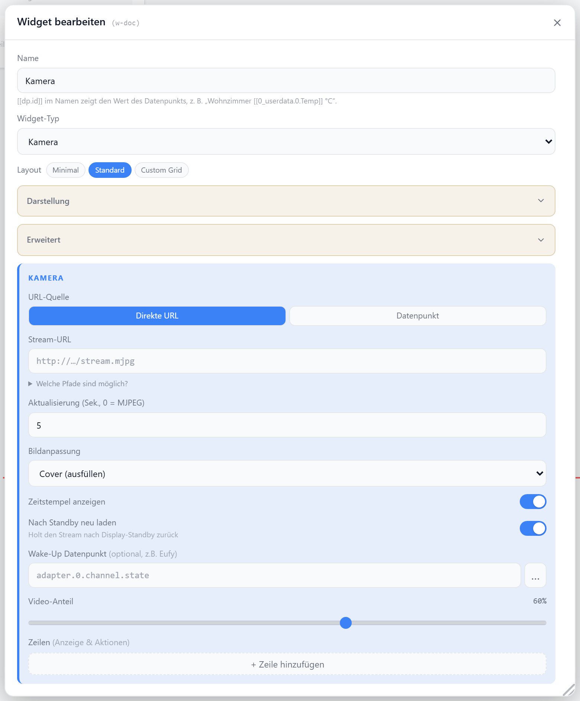

# Kamera

Zeigt ein Kamera-Livebild als MJPEG-/Snapshot-Stream oder eine HTML-Seite im iframe. RTSP wird nicht unterstützt — stattdessen go2rtc als MJPEG-URL einbinden. Neben dem Stream lassen sich Zeilen bzw. Kacheln anordnen: entweder als Anzeige (Akku, Temperatur, Scharf-Status, Bewegung …) oder als Aktion, die einen Datenpunkt schaltet (z.B. Audio, Sirene, Nachtsicht). Optional weckt ein Wake-up-Datenpunkt die Kamera erst bei Bedarf.

Mögliche Bildquellen (URL, Adapter-Pfad, Datei, Base64): siehe [Bildpfade](./bildpfade).

## Datenpunkt

Kein Pflicht-Datenpunkt; die Stream-URL kann statisch oder aus einem Datenpunkt kommen.

| Feld | Pflicht | Typ | |
| --- | --- | --- | --- |
| `streamUrl` | ja* | — | Stream-/Snapshot-URL (bei `streamUrlMode: static`) |
| `streamUrlDp` | ja* | — | Datenpunkt mit der URL (bei `streamUrlMode: datapoint`) |
| `wakeUpDp` | nein | `boolean` | weckt die Kamera (`true`/`false` via Wake-up) |
| Zeilen-/Slot-DPs | nein | — | je `infoItems`/`customSlots`-Eintrag ein eigener Datenpunkt (Aktions-Typen schreiben darauf) |

*je nach `streamUrlMode` einer von beiden.

## Layouts

### Minimal
Nur der Stream füllt die ganze Zelle (mit Vollbild-Button, Zeitstempel und Wake-up-Overlay).

### Default
Stream oben (Höhe per `videoRatio`), darunter Titel und die Zeilen aus `infoItems`.

### Custom
Stream und Kacheln (`customSlots`) in einem Raster nach `cameraTemplate`: `stream-left`, `stream-top`, `stream-topleft`, `stream-right` oder `stream-full` (Vollbild mit Overlay-Chips).

## Einstellungen

Alle Optionen werden im Editor unter **Widget bearbeiten** gesetzt.

### Stream

| Option | Standard | |
| --- | --- | --- |
| `streamUrlMode` | `static` | `static` · `datapoint` |
| `streamUrl` | — | feste Stream-/Snapshot-URL |
| `streamUrlDp` | — | Datenpunkt mit URL (nur `datapoint`) |
| `refreshInterval` | `5` | Sekunden pro Snapshot (`0` = LIVE/MJPEG) |
| `fitMode` | `cover` | `cover` · `contain` |
| `showTimestamp` | `true` | Zeitstempel einblenden |
| `reloadOnWake` | `true` | Stream nach Display-Standby neu laden |
| `transparent` | `false` | transparenter Hintergrund |
| `interactionMode` | `content` | nur bei `.html`-Stream: `action` · `content` · `contentOnly` — siehe [iFrame](./iframe#interaktion-vs-klick-aktion) |

Stream-Typ wird aus der URL erkannt: `.html`/`.htm` → iframe, `rtsp://` → Hinweis, sonst Bild.

Scrollleiste im Widget: Passt die eingebettete Stream-Seite nicht exakt in die Kachel,
zeigt sie ihre eigene Scrollleiste — auf dem Desktop dauerhaft, auf Tablets unsichtbar
(Overlay-Scrollleiste). `interactionMode: action` blendet sie aus.

Geht das Display in den Standby, bricht der Browser den Stream ab; der eingebettete
Player darf ihn ohne Nutzer-Tipp nicht selbst neu starten und zeigt stattdessen einen
Play-Button. `reloadOnWake` lädt den Stream beim Aufwachen neu und umgeht das.

### Wake-up

Aktiviert die Kamera erst bei Bedarf über einen Steuer-Datenpunkt und schaltet sie nach Ablauf wieder ab.

| Option | Standard | |
| --- | --- | --- |
| `wakeUpDp` | — | Wake-up-Datenpunkt (`boolean`) |
| `wakeUpMode` | `onClick` | `onClick` · `onView` (ohne `wakeUpDp` immer `auto`) |
| `wakeUpDelay` | `3` | Sekunden bis der Stream nach dem Wecken bereit ist |
| `streamTimeout` | `60` | Sekunden bis Auto-Abschaltung (`0` = aus) |

### Anzeige

| Option | Standard | |
| --- | --- | --- |
| `showTitle` | `true` | Titel anzeigen |
| `showIcon` | `true` | Icon anzeigen |
| `icon` | `Camera` | [Lucide-Icon](https://lucide.dev) |
| `iconSize` | `20` | px |
| `titleAlign` | `left` | `left` · `center` · `right` |
| `videoRatio` | `60` | Höhe des Streams in % (Default-Layout) |

### Zeilen und Kacheln

| Option | Standard | |
| --- | --- | --- |
| `infoItems` | `[]` | Zeilen im Default-Layout |
| `customSlots` | `[]` | Kacheln im Custom-Raster |
| `cameraTemplate` | `stream-left` | Raster-Vorlage (Custom-Layout) |

Pro Eintrag ein Typ — entweder Anzeige (nur lesen) oder Aktion (schreibt auf den Datenpunkt):

| `type` | Art | |
| --- | --- | --- |
| `text` | Anzeige | Freitext aus `value` |
| `manufacturer` | Anzeige | Freitext aus `value` mit Hersteller-Icon |
| `datapoint` | Anzeige | Rohwert des Datenpunkts |
| `battery` | Anzeige | Prozentwert mit Akku-Icon |
| `temperature` | Anzeige | °C mit Thermometer-Icon |
| `armed` | Anzeige | `trueLabel`/`falseLabel`, rot/grün |
| `motion` | Anzeige | `trueLabel`/`falseLabel`, orange wenn aktiv |
| `toggle` | Aktion | Schalter, schreibt bei Klick den Gegenwert |
| `button` | Aktion | Taster, schreibt bei Klick einen festen Wert |

Felder je Eintrag:

| Feld | gilt für | Standard | |
| --- | --- | --- | --- |
| `label` | alle | — | Beschriftung links |
| `value` | `text`, `manufacturer` | — | angezeigter Freitext |
| `datapoint` | alle außer `text`/`manufacturer` | — | Datenpunkt |
| `trueLabel` / `falseLabel` | `armed`, `motion`, `toggle` | — | Statustexte; beim `toggle` leer = Schiebeschalter, gesetzt = Text-Pille |
| `icon` | `toggle`, `button` | — | [Icon](https://icon-sets.iconify.design) vor der Beschriftung |
| `onValue` / `offValue` | `toggle` | `true` / `false` | geschriebene Werte (z.B. `1`/`0`, `ON`/`OFF`) |
| `pulseLabel` | `button` | `Auslösen` | Button-Text |
| `pulseValue` | `button` | `true` | geschriebener Wert |
| `pulseReset` | `button` | `false` | Reset-Wert nachschreiben |
| `pulseResetValue` | `button` | `false` | Reset-Wert |
| `pulseDelay` | `button` | `500` | ms bis zum Reset |
| `confirm` | `toggle`, `button` | `false` | Rückfrage vor dem Schreiben |
| `confirmText` | `toggle`, `button` | — | eigener Rückfrage-Text |

Der Zustand eines `toggle` gilt als „an“, wenn der Wert `true`/`1`/`"true"` ist — bzw. wenn er `onValue` entspricht, sobald eigene Werte gesetzt sind. Im Editor schreiben die Bedienelemente nicht.
