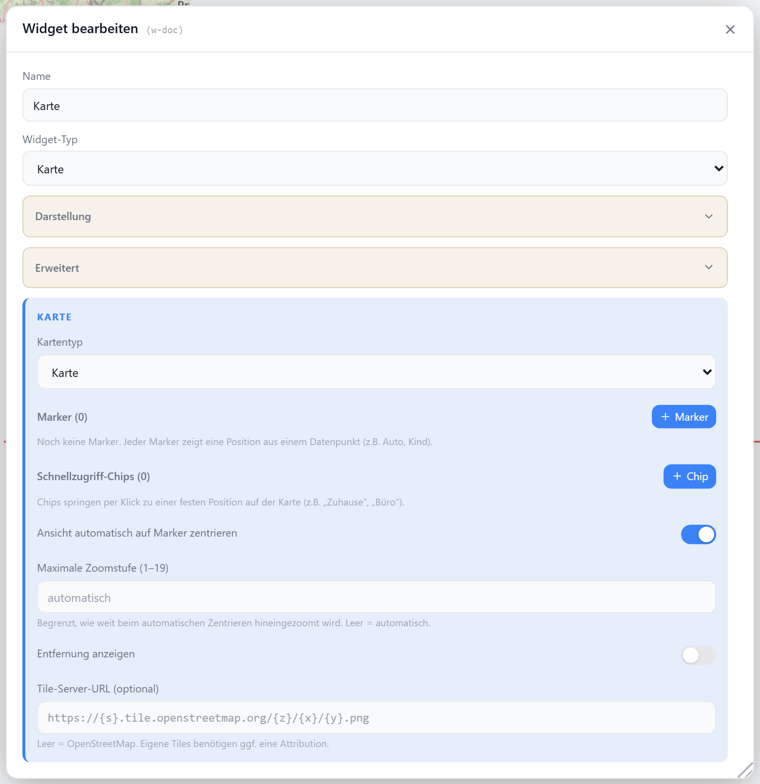

# Karte

Zeigt Positionen (Auto, Kind, Haustier …) aus Datenpunkten auf einer OpenStreetMap-Karte. Marker folgen live den Datenpunkten; optional wird die Entfernung zu einem Heimat-Marker eingeblendet. Schnellzugriff-Chips springen zu vordefinierten Orten.

## Datenpunkt

Die Karte selbst hat keinen Haupt-Datenpunkt — Positionen werden pro **Marker** konfiguriert (`options.markers`). Ein Marker liest seine Koordinaten in einem von vier Modi:

| `mode` | Felder | Quelle |
| --- | --- | --- |
| `json` | `jsonDp`, `latPath`, `lonPath` | JSON-/Objekt-DP mit Pfad zu Lat/Lon |
| `latlon` | `latDp`, `lonDp` | zwei separate numerische DPs |
| `static` | `lat`, `lon` | feste Koordinaten |
| `address` | `address` | Freitext-Adresse, per OpenStreetMap geocodiert |

Pro Marker zusätzlich: `label`, `emoji`, `color`.

## Einstellungen

Alle Optionen werden im Editor unter **Widget bearbeiten** gesetzt.

### Karte

| Option | Standard | |
| --- | --- | --- |
| `mapStyle` | `standard` | `standard` · `satellite` · `terrain` |
| `tileUrl` | — | eigener Kachel-Server (überschreibt `mapStyle`) |
| `tileAttribution` | — | Copyright-Hinweis für `tileUrl` |
| `center` | Deutschland | `[lat, lon]` Startmittelpunkt |
| `zoom` | `6` | Start-Zoom; bei `followMarkers` = max. Zoom des Auto-Fit |
| `followMarkers` | `false` | Ansicht automatisch an alle Marker anpassen |

### Marker & Entfernung

| Option | Standard | |
| --- | --- | --- |
| `markers` | `[]` | Liste der `MapMarker` (siehe Tabelle oben) |
| `showDistance` | `false` | Entfernung zum Heimat-Marker anzeigen |
| `homeMarkerId` | — | `id` des Markers, von dem aus gemessen wird |

### Schnellzugriff-Chips

Chips (`quickViews`) rezentrieren die Karte auf einen gespeicherten Ort. Die Zielposition wird wie ein Marker aufgelöst (`mode` + Felder), zusätzlich mit optionalem `zoom`.

| Option | Standard | |
| --- | --- | --- |
| `quickViews` | `[]` | Liste der `MapQuickView` |
| `chipsPosition` | `overlay` | `overlay` (über der Karte) · `below` (darunter) |
| `chipsCorner` | `top-right` | Ecke bei `overlay`: `top-left` · `top-right` · `bottom-left` · `bottom-right` |
