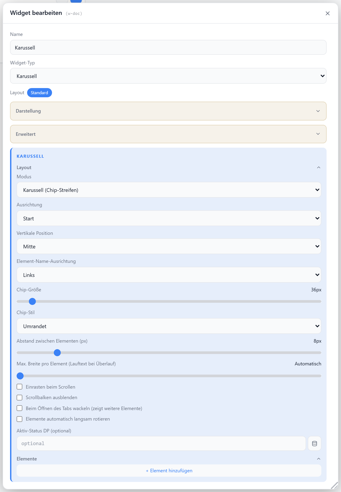

# Karussell

Horizontal scrollbare Chip-Liste. Jedes Item hat einen eigenen Datenpunkt und eine eigene Klick-Aktion (Wert schreiben, Popup öffnen oder Tab wechseln). Wischen per Maus-Drag oder Touch, optional Auto-Rotation und Schüttel-Hinweis bei Überlauf.

## Datenpunkt

Kein Haupt-Datenpunkt — die Datenpunkte liegen pro Item in der Item-Liste. Optional ein gemeinsamer Vergleichs-DP für die Aktiv-Hervorhebung.

| Feld | Pflicht | Typ | |
| --- | --- | --- | --- |
| `items[].dp` | ja | — | Datenpunkt des Items; Klick schreibt `activeValue`/`value` bzw. toggelt gegen `inactiveValue` |
| `checkDp` | nein | — | gemeinsamer DP; Item gilt als aktiv, wenn sein Wert zum Vergleichswert passt |

## Layouts

Über die Option `mode` wählbar.

### Carousel
Mehrere Chips gleichzeitig sichtbar, frei scrollbar. Auto-Rotation läuft als kontinuierlicher Lauf.

### Single
Ein Item füllt die volle Breite, Wischen blättert seitenweise (Snap erzwungen). Auto-Rotation springt schrittweise weiter.

## Einstellungen

Alle Optionen werden im Editor unter **Widget bearbeiten** gesetzt.

### Anzeige

| Option | Standard | |
| --- | --- | --- |
| `showTitle` | `true` | Titel anzeigen |
| `showIcon` | `true` | Icon anzeigen |
| `icon` | `GalleryHorizontal` | [Lucide-Icon](https://lucide.dev) |
| `iconSize` | `20` | px |
| `titleAlign` | `left` | `left` · `center` · `right` |

### Chips

| Option | Standard | |
| --- | --- | --- |
| `mode` | `carousel` | `carousel` · `single` |
| `chipStyle` | `outlined` | `outlined` · `filled` · `ghost` |
| `chipSize` | `36` | px oder `sm` · `lg` |
| `gap` | `8` | px zwischen Chips (nur `carousel`) |
| `align` | `start` | horizontale Ausrichtung: `start` · `center` · `end` |
| `valign` | `middle` | vertikale Ausrichtung: `top` · `middle` · `bottom` |
| `labelAlign` | `left` / `center` | Text-Ausrichtung im Chip (Standard `center` bei `single`) |
| `maxItemWidth` | `0` | max. Chip-Breite in px (`0` = unbegrenzt, Überlauf läuft als Marquee) |

### Scrollen & Bewegung

| Option | Standard | |
| --- | --- | --- |
| `snap` | `false` | an Item-Grenzen einrasten (nur `carousel`; `single` erzwingt es) |
| `hideScrollbar` | `false` | Scrollbalken ausblenden |
| `shakeOnOpen` | `false` | beim Öffnen kurz wackeln, wenn Inhalt überläuft |
| `autoRotate` | `false` | automatisch scrollen/weiterblättern |
| `autoRotateSpeed` | `30` | px/s im `carousel`-Modus (`5`–`400`) |
| `autoRotateInterval` | `4` | s zwischen Schritten im `single`-Modus (`1`–`60`) |

### Items

Pro Item konfigurierbar: `label`, `icon`, `iconSize`, `dp`, `value`, `activeValue`, `inactiveValue`, `clickAction` (`none` · Popup · `link-tab`), Farben (`bgColor`/`textColor` aktiv, `bgColorInactive`/`textColorInactive` inaktiv), `showConfirm` + `confirmText` (Sicherheitsabfrage) sowie `showLastChange` (Zeitstempel der letzten Änderung).
