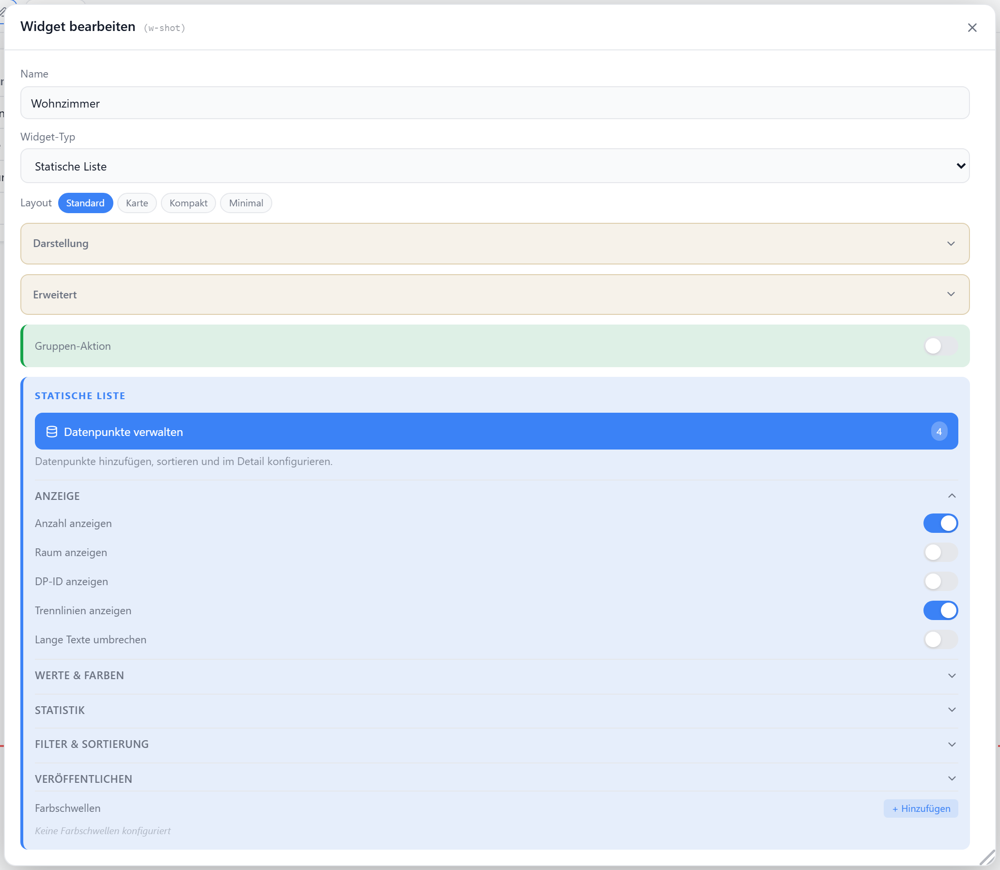
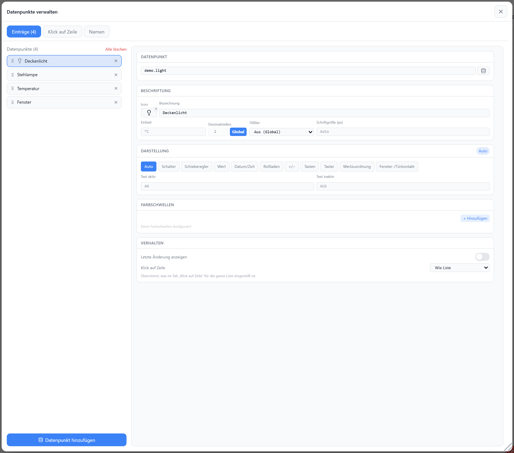

# Statische Liste

Manuell gepflegte Liste mit frei konfigurierbaren Datenpunkt-Links. Jeder Eintrag bindet seinen eigenen Datenpunkt und wird je nach Wert als Schalter, Regler, Wert oder Sensor-Badge dargestellt.

## Datenpunkt

Kein Haupt-Datenpunkt — jeder Listeneintrag (`entries[]`) trägt seine eigene `id`. Booleans werden als Schalter, Zahlen mit Level-/Dimmer-Rolle als Regler, alles andere als Wert dargestellt; `displayType` (`shutter` · `stepper` · `buttons` · `momentary` · `switch` · `slider` · `value` · `time` · `datepicker` · `input` · `auto`) erzwingt die Darstellung pro Eintrag.

### Darstellung Eingabefeld

`displayType: 'input'` macht die Zeile zum Eingabefeld — dieselben Möglichkeiten wie das [Eingabefeld-Widget](./eingabefeld), nur pro Listenzeile. Im Badges-Layout wird stattdessen der reine Wert angezeigt. Gilt auch für die [dynamische Liste](./dynamische-liste).

| Feld | Standard | |
| --- | --- | --- |
| `inputPlaceholder` | — | Platzhalter im leeren Feld |
| `inputWidth` | `110` | Feldbreite in px (Card-Layout der dynamischen Liste: volle Breite) |
| `inputMode` | `text` | `text` · `number` |
| `inputSubmitMode` | `submit` | `submit` (Enter / Feld verlassen / Senden-Button) · `live` (jeder Tastenschlag) |
| `inputShowSubmit` | `true` | Senden-Button anzeigen (nur bei `submit`) |
| `inputClearAfterSubmit` | `false` | Befehlsfeld: nach dem Senden leeren, Datenpunkt-Wert nie anzeigen |
| `confirm` / `confirmText` | `false` | Sicherheitsabfrage vor dem Senden (nur bei `submit`) |
| `inputTextAlign` | `left` | `left` · `center` · `right` |
| `inputReadOnly` | `false` | Schreibschutz — Wert wird angezeigt, aber nicht geschrieben |

Ein schreibgeschützter Datenpunkt ist immer schreibgeschützt, unabhängig von `inputReadOnly`.

### Darstellung Datum/Zeit

`displayType: 'time'` zeigt einen Zeit-Datenpunkt als Uhrzeit und/oder Datum. Zeitstempel (Sekunden/Millisekunden), ISO-Zeitangaben und `HH:mm` werden automatisch erkannt; nicht lesbare Werte zeigen `–`. Gilt auch für die [dynamische Liste](./dynamische-liste).

| Feld | Standard | |
| --- | --- | --- |
| `timeFormat` | `time` | `time` (14:32) · `time-sec` · `date` (01.08.2026) · `date-long` (Samstag, 1. August 2026) · `datetime` · `datetime-sec` · `custom` |
| `timePattern` | — | Token-Muster bei `custom`, z. B. `EEEE, dd.MM. HH:mm` |

Tokens: `HH` `mm` `ss` · `hh` · `dd` `MM` `yyyy` `yy` · `EEEE` (Wochentag) · `EE` · `MMMM` (Monat) · `ww` (KW)

### Darstellung Datumswähler {#darstellung-datumswaehler}

`displayType: 'datepicker'` macht die Zeile zum Datums-/Zeitwähler — dieselben Möglichkeiten wie das
[Datumswähler-Widget](./datumswaehler), nur pro Listenzeile. Der gewählte Wert wird im Ausgabeformat in
den Datenpunkt geschrieben. Im Badges-Layout ist kein Platz für die Felder — dort steht der gesetzte Wert
als Text. Gilt auch für die [dynamische Liste](./dynamische-liste).

| Feld | Standard | |
| --- | --- | --- |
| `dateInputFormat` | `picker` | `picker` (Datums-/Zeitwähler) · `custom` (Feld laut `dateInputPattern`) |
| `dateInputPattern` | wie `dateOutputPattern` | Muster bei `dateInputFormat: custom`, z. B. `MM.yyyy` |
| `dateTimeOnly` | `false` | nur Uhrzeit, ohne Datum |
| `dateShowTime` | `false` | zusätzliches Uhrzeit-Feld zum Datum |
| `dateOutputFormat` | `timestamp_ms` | `timestamp_ms` · `timestamp_s` · `iso` · `date` · `datetime_local` · `de_date` · `de_datetime` · `time_hhmm` · `time_hhmmss` · `custom` |
| `dateOutputPattern` | `dd.MM.yyyy` | Muster bei `dateOutputFormat: custom` |

Muster-Tokens: `dd` `MM` `yyyy` `yy` `HH` `hh` `mm` `ss`. Welches Auswahlfeld das Eingabe-Muster rendert
(Kalender, Monatswähler, Uhrzeit, Textfeld mit eigener Auswahlliste) steht beim
[Datumswähler](./datumswaehler#modus).

Nur Anzeige eines Zeit-Datenpunkts, ohne Schreiben: `displayType: 'time'`.

### Zweite Zeile (zusätzliche Datenpunkte)

Dialog **Datenpunkte verwalten** → Detail-Editor → Abschnitt **Zweite Zeile**. Jeder Eintrag kann
weitere Datenpunkte (`entries[].subDps[]`) in einer zweiten Zeile unter dem Haupt-Datenpunkt zeigen —
Batterie, Signalstärke, Sollwert, Laufzeit. **Nur Anzeige**: kein Schalter, kein Regler, kein Schreiben.

Die Zeile hat drei Plätze — links, mitte, rechts. Mehrere Datenpunkte am selben Platz stehen in
Konfigurationsreihenfolge nebeneinander.

Zwei Wege zum Hinzufügen, die Auswahl ist **nicht** auf das Gerät der Zeile beschränkt:

| Schaltfläche | |
| --- | --- |
| **+ DP des Geräts (n) …** | Datenpunkte desselben Geräts als Kurzauswahl |
| **+ Beliebiger DP …** | Objektbaum — jeder Datenpunkt aus ioBroker, auch von einem anderen Gerät oder Adapter |

Die ID lässt sich außerdem direkt ins Feld tippen.

| Feld | Standard | |
| --- | --- | --- |
| `id` | — | Datenpunkt-ID |
| `align` | `left` | `left` · `center` · `right` |
| `label` | — | Text vor dem Wert; leer = nur Wert |
| `icon` | — | [Lucide-Icon](https://lucide.dev) / Iconify-ID vor dem Text |
| `unit` | aus dem Objekt | Einheit hinter dem Wert (entfällt bei Zeit-Formatierung) |
| `decimals` / `numberFormat` | global | Dezimalstellen und Tausendertrennung |
| `fontSize` | `9` | px |
| `color` | `--text-secondary` | Textfarbe |
| `valueTransform` / `valueFactor` / `valueOffset` / `valueTimeFormat` / `valueTimePattern` | Liste | eigene [Wert-Umrechnung](#wert-umrechnung-zeit) pro Zusatz-Datenpunkt |

Zusätzlich pro Datenpunkt der zweiten Zeile:

| Feld | |
| --- | --- |
| Werte-Zuordnung (`states`) | Tabelle `Wert → Text`, optional mit Icon und Farbe — z. B. `true` → `ONLINE`. Ersetzt den Werttext; die Einheit entfällt dann |
| Bedingungen (`conditions`) | dieselben Regeln wie [je Zeile](#bedingungen-je-zeile), nur für diesen einen Wert |

Die Werte-Zuordnung ist dieselbe Tabelle wie beim Darstellungstyp `Zustände` und wirkt an beiden Stellen
gleich.

Layouts `default` · `card` · `compact` zeigen die zweite Zeile. Das Badges-Layout (`minimal`) nicht —
dort ist eine Zeile eine Pille. Die [dynamische Liste](./dynamische-liste#zweite-zeile-zusatzliche-datenpunkte)
kennt dieselben Felder, zusätzlich als Vorlage für alle Einträge.

### Bedingungen je Zeile

Regeln, die auf einen Wert reagieren und Farbe, Icon oder Text einer Zeile ändern. Zwei Orte, gleiche
Regeln:

| Ort | Gilt für |
| --- | --- |
| Dialog **Datenpunkte verwalten** → Tab **Bedingungen** (`rowConditions`) | alle Zeilen |
| Detail-Editor → Abschnitt **Bedingungen** (`entries[].conditions`) | nur diese Zeile |

Die listenweiten Regeln laufen zuerst, die des Eintrags danach — **pro Eigenschaft gewinnt die letzte**.
Ausblenden ist absorbierend.

| Feld | |
| --- | --- |
| `target` | `row` (Standard) · `name` · `value` · `icon` — worauf die Regel wirkt |
| `clauses` / `logic` | wie bei den [Widget-Bedingungen](../einstellungen/editor#bedingungen-marker-operatoren), inkl. Vergleich gegen einen zweiten Datenpunkt |
| `color` · `bg` · `iconColor` | Textfarbe · Zeilenhintergrund (nur `row`) · Icon-Farbe |
| `icon` | anderes Icon, solange die Regel greift |
| `text` | ersetzt den angezeigten Text; die Einheit entfällt dabei |
| `bold` · `italic` · `hide` | Schriftschnitt bzw. Element ausblenden |

Eine Regel auf `row` gibt Textfarbe, Fett/Kursiv und Icon an Name, Wert und Icon weiter; Hintergrund und
Ausblenden bleiben bei der Zeile. Eine Regel auf einen einzelnen Teil gewinnt gegen sie.

#### Datenpunkt einer Bedingung

| Schreibweise | bedeutet |
| --- | --- |
| `{dp}` (leer) | Wert der Zeile selbst |
| `hm-rpc.0.Gerät.UNREACH` | genau dieser Datenpunkt, in jeder Zeile derselbe |
| `{{parent}}.UNREACH` | Nachbar-Datenpunkt **der jeweiligen Zeile** |
| `{{dp}}` · `{{name}}` | vollständige ID bzw. letztes Segment der Zeile |

Die doppelten Klammern sind dieselben Platzhalter wie in der [zweiten Zeile](#zweite-zeile-zusatzliche-datenpunkte).
Zeilen, deren Datenpunkt einen Platzhalter nicht beantworten kann (kein Elternstrang), überspringen die
Regel — statt gegen den wörtlichen Text zu vergleichen.

::: tip Beispiel
`{{parent}}.UNREACH` ist wahr → `target: icon`, Icon `CloudOff`, Icon-Farbe rot. Eine Regel, jede Zeile
prüft ihr eigenes Gerät.
:::

### Wert-Umrechnung / Zeit

Der Button neben dem Datenpunkt-Feld (Dialog **Datenpunkte verwalten** → Abschnitt **Datenpunkt**) rechnet den
Wert nur für die Anzeige um und/oder formatiert ihn als Uhrzeit/Datum — wie bei der
[Wert-Anzeige](./wert-anzeige). Der Datenpunkt bleibt unverändert. Gilt auch für die
[dynamische Liste](./dynamische-liste).

| Feld | Standard | |
| --- | --- | --- |
| `valueTransform` | — | Preset-Id, `custom` oder `none` (schaltet die globale Umrechnung für diesen Eintrag ab) |
| `valueFactor` / `valueOffset` | `1` / `0` | Anzeige = Wert × Faktor + Offset |
| `valueTimeFormat` | — | `time` · `time-sec` · `date` · `date-long` · `datetime` · `datetime-sec` · `custom` |
| `valueTimePattern` | — | Token-Muster bei `custom`, z. B. `EEEE, dd.MM. HH:mm` |

Presets: Sekunden → Minuten/Stunden · ms → s · Wh → kWh · W → kW · Bytes → KB/MB/GB · 0..1 → % · °C → °F.

Wirkt auf den angezeigten Werttext, die Farbschwellen und die Statistikzeile — nicht auf Schalter,
Regler, +/− und Eingabefeld, die ihren Wert zurückschreiben. Bei aktiver Zeit-Formatierung entfällt die
Einheit. Ohne eigene Einstellung gilt die globale Umrechnung der Liste
(**Widget bearbeiten** → **Werte & Farben**).

## Layouts

### Default
Volle Zeilen mit Label, optionalem Raum/ID und Wert rechts — für Standardlisten.

### Card
Kacheln im Raster (`auto-fill`, min. `90px`) mit Label oben und Wert zentriert.

### Compact
Zweispaltiges, dichtes Gitter — für viele Einträge auf wenig Platz.

### Minimal
Inline-Pills mit Label und Wert, umbrechend — für kompakte Status-Anzeigen.

## Einstellungen

Im Editor unter **Widget bearbeiten**. Die Datenpunkte selbst liegen dahinter im eigenen Dialog **Datenpunkte verwalten**; im Panel bleiben nur die Optionen der Liste als Ganzes, in aufklappbaren Abschnitten.

### Datenpunkte verwalten

Links alle Einträge, rechts die vollständige Konfiguration des ausgewählten. Der Dialog ist verschiebbar, größenveränderbar und merkt sich seine Größe.

| Tab | |
| --- | --- |
| Einträge | Datenpunkte hinzufügen, per Drag & Drop sortieren, löschen; rechts der Detail-Editor (ID, Icon, Bezeichnung, Format, Darstellung, Farben, Schwellen). Ab 8 Einträgen mit Filterfeld |
| Klick auf Zeile | Detail-Popup beim Klick auf eine Zeile (siehe unten) |
| Namen | Namensmuster und Namens-Filter |

Der Detail-Editor rechts ist in Abschnitte gegliedert: **Datenpunkt** · **Beschriftung** · **Darstellung** (mit dem gewählten Typ als Kennzeichen, darin alle typabhängigen Felder) · **Farbschwellen** · **Verhalten** (letzte Änderung, Klick auf Zeile).

### Klick auf Zeile

Dialog **Datenpunkte verwalten** → Tab **Klick auf Zeile**. Ein Klick auf eine Listenzeile öffnet ein Detail-Popup zu genau diesem Datenpunkt. Klicks auf Schalter, Regler oder Buttons in der Zeile schalten weiterhin direkt.

| Option | Standard | |
| --- | --- | --- |
| `rowClickAction` | Aus | `auto` · `{ "kind": "none" }` (aus) · vollständige Klick-Aktion |
| `rowPopupTitle` | Zeilenname | Titel des Popups |
| `rowPopupWidth` / `rowPopupHeight` | auto | px |
| `rowPopupAutoCloseSec` | View/Global | Sekunden, `0` = aus |

Standard ohne eigene Einstellung: **Aus** — Zeilen reagieren nicht auf Klicks. **Eigene Aktion** startet mit *Popup: Alle Datenpunkte des Geräts*, Umfang **Gleicher Strang (Elternobjekt)**, **Nur relevante Datenpunkte** an — entspricht `{ "kind": "popup-dps", "scope": "parent", "relevantOnly": true }`. **Automatisch** (Popup nach Rolle) muss aktiv gewählt werden.

Automatik nach Rolle des Datenpunkts:

| Rolle | Popup |
| --- | --- |
| `level.dimmer` · `level.*` · `*dimmer*` · `*brightness*` | Dimmer |
| `switch` · `switch.*` · `sensor.*` · `indicator.*` · `button` | Schalter |
| `level.blind` · `*shutter*` · `*cover*` · `*awning*` | Rollladen |
| `level.temperature` · `heating*` | Thermostat |
| `media.*` (außer `media.volume`) | Schalter |
| sonst | `Standard: Datenpunkt` (Wert, Steuerung, ID, letzte Änderung) |

Zugewiesene [Widget-Typ-Standards](../einstellungen/popups#widget-typ-standards) gelten auch hier — wer dem Typ `switch` eine eigene View zuweist, bekommt sie auch in der Liste.

Pro Datenpunkt lässt sich das im Detail-Editor überschreiben (`entries[].clickAction`):

| Modus | |
| --- | --- |
| Wie Liste | Übernimmt die Listen-Einstellung — der Normalfall |
| Automatisch | Erzwingt die Ableitung aus der Rolle, auch wenn die Liste auf `Aus` oder eine eigene Aktion steht |
| Aus | Diese Zeile reagiert nicht auf Klicks |
| Eigene Aktion | Vollständige Klick-Aktion nur für diese Zeile — eine Zeile öffnet ein Widget-Popup, die nächste springt in einen anderen Tab. Die Popup-Größe kommt weiterhin aus der Listen-Einstellung |

Popup-Titel und Titelzeile lassen sich zusätzlich pro Datenpunkt setzen — in jedem Modus außer `Aus`:

| Feld | Standard | |
| --- | --- | --- |
| `entries[].popupTitle` | Listen-Titel, sonst Zeilenname | Überschrift des Popups nur für diese Zeile |
| `entries[].popupHideTitle` | wie Liste | `true` = Titelzeile aus · `false` = an, auch wenn die Liste sie ausblendet |

Navigations-Aktionen (`Sprung: Tab` · `Externe URL` · `Widget`) springen direkt, statt ein Popup zu öffnen.

::: tip Badges-Layout
Ein Badge ist die ganze Zeile. Bei `Automatisch` schalten schaltbare Badges weiterhin, das Popup übernimmt nur Badges ohne eigenen Schalter (Sensoren, schreibgeschützte und numerische Werte). Eine ausdrücklich gesetzte Aktion gewinnt dagegen auch bei schaltbaren Badges.
:::

### Trennlinien (Abschnitte)

Dialog **Datenpunkte verwalten** → Button **Trennlinie** unter der Liste. Eine Trennlinie ist ein **eigener Eintrag**: sie wird wie ein Datenpunkt hinzugefügt, per Drag & Drop an die gewünschte Stelle gezogen und mit demselben ✕ gelöscht. Sie rendert eine Linie über die volle Breite, wahlweise mit Überschrift, und eröffnet damit einen Abschnitt. Wirkt in allen Layouts außer `custom`.

Auswählen öffnet rechts den Editor:

| Feld | Standard | |
| --- | --- | --- |
| `divider` | — | `true` kennzeichnet die Zeile als Trennlinie (die `id` ist dann synthetisch, z. B. `divider:1`) |
| `dividerLabel` | — | Überschrift; leer = nur Linie |
| `dividerAlign` | `left` | `left` · `center` · `right` |
| `dividerFontSize` | `10` | px |
| `dividerColor` | `--text-secondary` | Textfarbe |
| `dividerLine` | `true` | `false` = nur Überschrift, ohne Linie |

Verhalten:

| | |
| --- | --- |
| Sortierung | wirkt **innerhalb** eines Abschnitts — die Abschnitte selbst bleiben stehen |
| Wert-Filter / Suche | bleibt von einem Abschnitt keine Zeile übrig, entfällt seine Trennlinie |
| Position | eine Linie ohne Überschrift ganz oben sowie eine Trennlinie ohne Zeilen dahinter werden unterdrückt |
| Zählung, Summe, Gruppen-Aktion | ignorieren Trennlinien vollständig |

Unabhängig davon ist `showDividers` — die dünne Linie zwischen je zwei Zeilen.

Die dynamische Liste hat das bewusst nicht: dort kommen die Zeilen aus einem Filter und werden neu sortiert, eine Trennlinie an fester Stelle wäre nach der nächsten Sortierung falsch. Zum Gruppieren dient dort `groupByRoom`.

### Namen

Dialog **Datenpunkte verwalten** → Tab **Namen**. Ein Muster für alle Zeilen; leer = zusammengesetzter Name des Datenpunkts.

| Platzhalter | ergibt |
| --- | --- |
| `<Raum>` | Raum des Datenpunkts |
| `<Gerät>` | Geräteteil des Namens |
| `<DPName>` | letztes Segment der ID |
| `<Name>` | vollständiger Name |
| `<ID>` | vollständige Datenpunkt-ID |
| `{{parent}}` · `{{dp}}` · `{{name}}` | ID-Bausteine der Zeile, wie in der [zweiten Zeile](./dynamische-liste#zweite-zeile-zusatzliche-datenpunkte) |
| `[[id]]` | **Wert** dieses Datenpunkts, live |

Steht der Anzeigename in einem eigenen Datenpunkt, kombiniert man beides:

| Muster | Ergebnis |
| --- | --- |
| `[[{{parent}}.DeviceName]]` | Wert des Nachbar-Datenpunkts `DeviceName` je Zeile |
| `Steckdose [[{{parent}}.DeviceName]]` | mit festem Text davor |
| `[[shared.0.Ort]] <DPName>` | absolute ID — derselbe Wert in jeder Zeile |

Ein `[[…]]` ohne Wert fällt auf den normalen Namen zurück. `nameFilters` (Button **Namens-Filter**) schneidet die `<…>`-Platzhalter zurecht, mit Vorschau; Regeln auf **Ergebnis** laufen auf dem fertigen Label — also erst nachdem `[[…]]` seinen Wert hat.

| Option | Standard | |
| --- | --- | --- |
| `namePattern` | — | Namensmuster |
| `nameFilters` | — | Regelliste für die Platzhalter-Texte |

### Anzeige

| Option | Standard | |
| --- | --- | --- |
| `showTitle` | `true` | Titel anzeigen |
| `showIcon` | `true` | Icon anzeigen |
| `icon` | `List` | [Lucide-Icon](https://lucide.dev) |
| `iconSize` | `20` | px |
| `titleAlign` | `left` | `left` · `center` · `right` |
| `showCount` | `true` | Anzahl hinter dem Titel |
| `showId` | `false` | Datenpunkt-ID unter dem Label (nur `default`) |
| `showRoom` | `false` | zugeordnete Räume unter dem Label (nur `default`) |
| `showDividers` | `true` | Trennlinien zwischen Einträgen |
| `wrapText` | `false` | lange Labels/Werte umbrechen statt abschneiden |
| `labelMinPercent` | `50` | min. Breite des Labels in % (nur bei `wrapText`) |

### Werte & Farben

| Option | Standard | |
| --- | --- | --- |
| `trueText` / `falseText` | — | globale AN/AUS-Texte (Eintrag überschreibt) |
| `activeColor` | `--accent-green` | Textfarbe bei AN |
| `inactiveColor` | `--text-secondary` | Textfarbe bei AUS |
| `activeBg` / `inactiveBg` | — | Hintergrund des Eintrags je Zustand |
| `valueTransform` / `valueFactor` / `valueOffset` | — | globale [Wert-Umrechnung](#wert-umrechnung-zeit) (Eintrag überschreibt) |
| `valueTimeFormat` / `valueTimePattern` | — | globale Zeit-Formatierung (Eintrag überschreibt) |
| `colorThresholds` | — | globale Farbskala aus `[Schwelle, Farbe]`, z. B. `[[17,"#ef4444"],[100,"#22c55e"]]` — der Wert nimmt die Farbe der ersten Schwelle, unter der er liegt, oberhalb der letzten bleibt deren Farbe. Reihenfolge beliebig. Pro Datenpunkt überschreibbar (**Datenpunkte verwalten** → **Farbschwellen**) |

### Filter

Frontend-Filter als Chip im Header; `backendValueFilter` steuert nur die Editor-Vorschau. Neben den drei eingebauten Modi bietet das Menü die eigenen Filter (siehe [Eigene Filter](#eigene-filter)) und ein Freitextfeld.

| Option | Standard | |
| --- | --- | --- |
| `valueFilter` | `all` | `all` · `active` · `inactive` · ID eines eigenen Filters |
| `filterActiveLabel` | `Nur aktive` | Chip-Text |
| `filterInactiveLabel` | `Nur inaktive` | Chip-Text |
| `hideBuiltinFilters` | `false` | `Nur aktive`/`Nur inaktive` aus dem Menü nehmen |
| `hideFilterSearch` | `false` | Freitextfeld im Menü ausblenden |
| `filterSearchPlaceholder` | `Suchen …` | Platzhalter des Freitextfelds |
| `hideFilterButton` | `false` | Filter-Chip ausblenden |
| `backendValueFilter` | `all` | Vorschau-Filter im Editor |

Freitext trifft Name, Datenpunkt-ID, Wert und alle Werte der [zweiten Zeile](#zweite-zeile-zusatzliche-datenpunkte).

### Eigene Filter

Panel **Filter & Sortierung** → **Eigene Filter**. Jeder Filter erscheint als eigener Eintrag im Filter-Menü; jede Regel prüft den Haupt-Datenpunkt, die weiteren Datenpunkte der zweiten Zeile oder beide. Das Wertefeld ist Freitext mit Auswahlliste der aktuell vorhandenen Werte; der Dialog zeigt live, wie viele Einträge ein Filter trifft.

| `filterPresets[]` | Standard | |
| --- | --- | --- |
| `id` | — | wird in `valueFilter` / `backendValueFilter` referenziert |
| `label` | — | Text im Filter-Menü |
| `icon` | — | Iconify-ID / Lucide-Name im Menü |
| `logic` | `AND` | `AND` (alle Regeln) · `OR` (eine genügt) |
| `rules[]` | — | siehe unten |

| `rules[]` | Standard | |
| --- | --- | --- |
| `source` | `main` | `main` · `sub` (weitere DPs) · `both` |
| `subKey` | — | leer = alle weiteren DPs; sonst Bezeichnung oder DP-Endung (`BATTERY`) |
| `operator` | — | `==` `!=` `>` `>=` `<` `<=` `contains` `true` `false` `active` `inactive` `empty` `notEmpty` |
| `value` | — | Vergleichswert (entfällt bei `active`/`inactive`/`true`/`false`/`empty`/`notEmpty`) |
| `every` | `false` | bei mehreren geprüften Werten müssen alle passen |

### Sortierung

| Option | Standard | |
| --- | --- | --- |
| `sortBy` | `none` | `none` · `label` · `value` |
| `sortOrder` | `asc` | `asc` · `desc` |
| `sortBy2` | `none` | zweites Sortierkriterium |
| `sortOrder2` | `asc` | Richtung des zweiten Kriteriums |

Bei `none` gilt die manuelle Reihenfolge aus dem Dialog **Datenpunkte verwalten**.

Sind [Trennlinien](#trennlinien-abschnitte) gesetzt, wirkt die Sortierung **innerhalb eines Abschnitts** — die Abschnitte selbst bleiben in der konfigurierten Reihenfolge stehen.

### Summe

Summiert die numerischen Werte der sichtbaren Einträge unter dem Titel.

| Option | Standard | |
| --- | --- | --- |
| `showSum` | `false` | Summenzeile anzeigen |
| `sumLabel` | `Σ` | Prefix der Summenzeile |
| `sumAlign` | `left` | `left` · `center` · `right` |
| `sumFontSize` | `10` | px |

### Sammelschalter

Master-Steuerung im Header für alle Einträge.

| Option | Standard | |
| --- | --- | --- |
| `groupSwitch` | `false` | Sammelschalter anzeigen |
| `groupActionType` | `switch` | `switch` · `dimmer` · `shutter` · `momentary` |
| `groupDimmerOnValue` | `100` | Schreibwert bei „alle an" (Dimmer) |
| `groupExcludeIds` | — | von der Gruppenaktion ausgenommene Einträge |

### Zähler veröffentlichen

| Option | Standard | |
| --- | --- | --- |
| `publishCount` | `false` | gefilterte Anzahl nach `aura.0.lists.<id>.count` schreiben |
