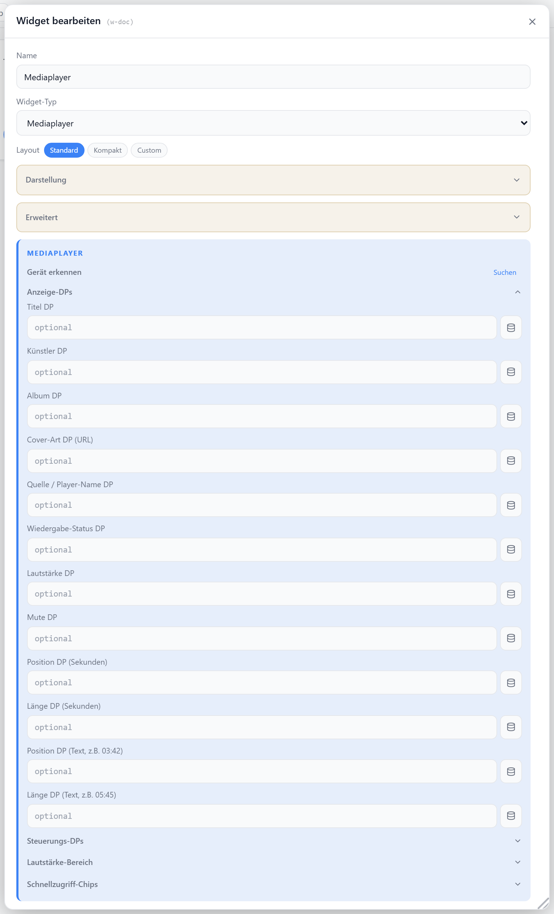

# Mediaplayer

Steuert einen Mediaplayer (Sonos, Squeezeserver, Spotify u. a.) über getrennte Datenpunkte für Wiedergabe, Lautstärke, Titel und Cover. Mit Fortschrittsbalken, Lautstärke-Schnellwahl und frei belegbaren Schnellzugriff-Chips. Auf Mobilgeräten erscheint ein vertikaler Aufbau.

## Datenpunkt

Kein Pflicht-Datenpunkt — jede Funktion wird über einen eigenen DP angebunden. Steuer-DPs (Play/Pause/Prev/Next/Shuffle/Repeat) werden beim Klick mit `true` gepulst.

| Feld | Typ | |
| --- | --- | --- |
| `titleDp` / `artistDp` / `albumDp` | — | Track-Infos (Titel, Interpret, Album) |
| `coverDp` | `string` | Cover-Bild-URL |
| `sourceDp` | — | Quelle/Zone |
| `playStateDp` | — | Wiedergabe-Status (`true` · `1` · `play` · `playing`) |
| `playDp` / `pauseDp` | `boolean` | Wiedergabe / Pause |
| `prevDp` / `nextDp` | `boolean` | vorheriger / nächster Titel |
| `shuffleDp` / `repeatDp` | `boolean` | Zufall / Wiederholung |
| `volumeDp` | `number` | Lautstärke |
| `muteDp` | `boolean` | Stummschaltung |
| `mediaProgressDp` / `mediaLengthDp` | `number` | Fortschritt / Länge (für Balken) |
| `mediaProgressStrDp` / `mediaLengthStrDp` | `string` | formatierte Zeitangaben |

## Layouts

### Default
Cover links über volle Höhe, rechts Track-Info, Fortschritt, Steuerung, Lautstärke und Schnellwahl.

### Compact
Eine Zeile mit Cover-Thumbnail, Titel/Interpret, Steuerung und kompaktem Lautstärkeregler — für Listen.

### Mobil
Auf Mobilgeräten automatisch: vertikaler Aufbau mit zentriertem Cover, Steuerzeile und Lautstärke.

### Custom
Cover, Play/Pause, Prev/Next, Shuffle/Repeat, Mute, Lautstärkeregler, Chips, Felder und Status-Badges frei in einer Zellenmatrix platzieren — siehe [Custom-Layout](./custom-layout).

## Einstellungen

Alle Optionen werden im Editor unter **Widget bearbeiten** gesetzt.

### Anzeige

Sichtbare Elemente; ein Element wird zusätzlich nur gezeigt, wenn der zugehörige DP gesetzt ist.

| Option | Standard | |
| --- | --- | --- |
| `showCover` | `true` | Cover anzeigen |
| `showSubtitle` | `true` | Interpret · Album anzeigen |
| `showSource` | `true` | Quelle anzeigen (nur mit `sourceDp`) |
| `showPrev` / `showNext` | `true` | Skip-Tasten (nur mit DP) |
| `showShuffle` / `showRepeat` | `true` | Zufall / Wiederholung (nur mit DP) |
| `showVolume` | `true` | Lautstärkeregler (nur mit `volumeDp`) |
| `showMute` | `true` | Mute-Taste (nur mit `muteDp` oder `muteViaVolume`) |
| `showChips` | `true` | Schnellzugriff-Chips (nur wenn vorhanden) |
| `showIcon` | `true` | Platzhalter-Icon ohne Cover |
| `icon` | `Music` | [Lucide-Icon](https://lucide.dev) |
| `iconSize` | `20` | px |

### Lautstärke

| Option | Standard | |
| --- | --- | --- |
| `volumeMin` | `0` | DP-Minimum |
| `volumeMax` | `100` | DP-Maximum |
| `volumeStep` | `1` | Schrittweite |
| `muteViaVolume` | `false` | Stummschalten durch Lautstärke `0` (z. B. Alexa ohne echtes Mute) |

### Schnellzugriff

| Option | Standard | |
| --- | --- | --- |
| `chips` | — | Liste aus `{ id, label, icon, dp, value }`; schreibt `value` (Standard `true`) |
